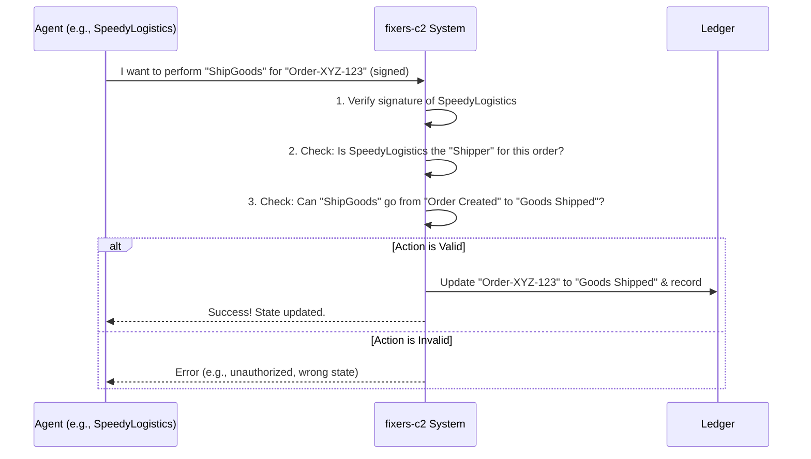

# Chapter 1: Signing State Machine (SSM)

Welcome to the `fixers-c2` project! If you're new to building applications that involve multiple parties working together on shared data, you're in the right place. This tutorial series will guide you through the core concepts of `fixers-c2`. Let's start with the most fundamental idea: the **Signing State Machine (SSM)**.

## What Problem Does an SSM Solve?

Imagine you're involved in a simple supply chain process:
1.  A **Supplier** creates an order.
2.  A **Shipper** ships the goods.
3.  A **Receiver** confirms they've received the goods.

In a traditional setup, this might involve a lot of emails, phone calls, and paperwork. How can everyone be sure about the current status? How can you prove who did what, and when? What if there's a dispute?

This is where a Signing State Machine (SSM) comes in. An SSM helps manage such multi-party processes in a way that is:
*   **Transparent:** Everyone involved can see the current status.
*   **Verifiable:** Actions are cryptographically signed, proving who performed them.
*   **Auditable:** There's a clear, unchangeable history of all actions and state changes.

Think of an SSM as a **digital, multi-party contract** where all steps and approvals are explicitly defined and cryptographically secured.

## Key Concepts of an SSM

Let's break down what makes up an SSM, using our supply chain example:

1.  **State:** A "state" represents the current status of your process.
    *   *Example:* "Order Created," "Goods Shipped," "Goods Received."

2.  **Transition:** A "transition" is a defined rule for how you can move from one state to another.
    *   *Example:* You can transition from "Order Created" to "Goods Shipped," but not directly from "Order Created" to "Goods Received."

3.  **Action:** An "action" is what triggers a transition.
    *   *Example:* The action "Ship Goods" triggers the transition from "Order Created" to "Goods Shipped."

4.  **Agent:** An "agent" is a participant in the process. These are the individuals or organizations involved.
    *   *Example:* "Supplier Inc.," "SpeedyLogistics," "RetailMart."
    *   In `fixers-c2`, an agent is defined by its name and a public key, as shown in `Agent.kt`:
        ```kotlin
        // Simplified structure of an Agent
        data class Agent(
            val name: String, // e.g., "SupplierInc"
            val pub: ByteArray // Their public cryptographic key
        )
        ```
        This public key is crucial for verifying signatures.

5.  **Role:** A "role" defines what an agent is authorized to do in a specific transition.
    *   *Example:* Only an agent with the "Shipper" role can perform the "Ship Goods" action.

6.  **Digital Signature:** This is the cryptographic magic! When an agent performs an action, they "sign" it with their private key. Anyone with their public key can verify that the signature is genuine and that the data hasn't been tampered with. This ensures authenticity and non-repudiation (they can't deny they did it).

## Defining an SSM: The Blueprint

An SSM itself is like a blueprint that describes these states, transitions, roles, and actions. It doesn't hold any actual data about a *specific* order yet; it just defines the rules of the game.

In `fixers-c2`, an SSM is defined by its name and a list of transitions. Here's a peek at the structure from `Ssm.kt` and `SsmTransition.kt`:

```kotlin
// Simplified structure of a Transition
data class SsmTransition(
    val from: Int,     // Current state (e.g., 0 for "Initial")
    val to: Int,       // Next state (e.g., 1 for "Order Created")
    val role: String,  // Role allowed to do this (e.g., "Supplier")
    val action: String // Action name (e.g., "CreateOrder")
)

// Simplified structure of an SSM
data class Ssm(
    val name: String, // e.g., "SupplyChainProcess"
    val transitions: List<SsmTransition>
)
```
For our supply chain, the `transitions` list might look like this (conceptually):
*   `{ from: 0 (Initial), to: 1 (OrderCreated), role: "Supplier", action: "CreateOrder" }`
*   `{ from: 1 (OrderCreated), to: 2 (GoodsShipped), role: "Shipper", action: "ShipGoods" }`
*   `{ from: 2 (GoodsShipped), to: 3 (GoodsReceived), role: "Receiver", action: "ReceiveGoods" }`

Here, `0`, `1`, `2`, `3` are simple numerical representations of our states.

## Bringing an SSM to Life: The SSM Session

Once you have the SSM blueprint, you can create an "SSM Session" for each specific instance of your process (e.g., for each individual order).

An **SSM Session** tracks:
*   Which SSM blueprint it's following (e.g., "SupplyChainProcess").
*   A unique ID for this specific session (e.g., "Order-XYZ-123").
*   Which specific agents are assigned to which roles for *this particular order*.
    *   *Example:* For "Order-XYZ-123", "SupplierInc" is the "Supplier", "SpeedyLogistics" is the "Shipper", etc.
*   The current state of *this* order (e.g., "Goods Shipped").
*   Any public or private data associated with *this* order.

The structure for this is defined in files like `SsmSession.kt` and `SsmSessionState.kt`:

```kotlin
// Simplified structure of an SSM Session State
data class SsmSessionState(
    val ssm: String?,       // Name of the SSM blueprint
    val session: String,    // Unique ID for this session
    val roles: Map<String, String>?, // Maps role "Supplier" to agent "SupplierInc"
    val public: Any?,       // Data everyone can see
    val private: Map<String, String>?, // Data only certain parties can see (details later)
    val current: Int,       // Current state (e.g., 2 for "GoodsShipped")
    val iteration: Int      // How many steps taken so far
)
```

## How Does an Action Happen? (Under the Hood)

Let's say "SpeedyLogistics" (our Shipper) wants to mark "Order-XYZ-123" as shipped.

1.  **Preparation:** SpeedyLogistics indicates they want to perform the "ShipGoods" action for "Order-XYZ-123". They'll also specify what the new state should look like (e.g., current state becomes "GoodsShipped", iteration increases).
2.  **Signing:** SpeedyLogistics uses their private cryptographic key to digitally sign this information.
3.  **Submission:** The signed action is sent to the `fixers-c2` system (which runs on a blockchain).
4.  **Verification:** The system performs several checks:
    *   **Valid Signature?** Is the signature from SpeedyLogistics genuine?
    *   **Authorized Agent?** Does SpeedyLogistics have the "Shipper" role for this session?
    *   **Correct Transition?** Is the "ShipGoods" action allowed from the current state ("Order Created") according to the "SupplyChainProcess" SSM rules?
    *   **Valid Next State?** Does the proposed new state make sense?
5.  **Update:** If all checks pass, the SSM session's state is updated to "Goods Shipped". This change is recorded securely and permanently. If any check fails, the action is rejected.

Here's a simplified diagram of this flow:



The `fixers-c2` system exposes an API to interact with these SSMs. For example, to perform an action, you'd use a command that looks something like this (from `Dev.md`):

```text
Command: "perform"
Parameters:
  action: "ShipGoods"         // The action being performed
  context: State             // Info about current session & proposed new data
  user_name: "SpeedyLogistics" // Who is performing it
  signature: b64_string      // The digital signature
```
The `context` would contain details like the session ID ("Order-XYZ-123"), the current iteration count, and any new public data related to the shipment.

## Why is this So Powerful?

*   **Trust:** You don't need to blindly trust a central party. The rules are coded in the SSM, and actions are cryptographically verified.
*   **Auditability:** Every state change is recorded, creating an immutable history. Great for compliance and dispute resolution.
*   **Automation:** Because the rules are clear, processes can be automated more easily.
*   **Collaboration:** It provides a secure and standardized way for multiple independent parties to collaborate.

## Conclusion

You've just learned about the Signing State Machine (SSM), the heart of `fixers-c2`. It's a way to define and manage multi-party processes with verifiable steps and cryptographic security. You saw how states, transitions, actions, agents, and roles come together to create a robust system.

Key takeaways:
*   SSMs define rules for shared data evolution.
*   Each state change requires a digital signature from an authorized agent.
*   This ensures a verifiable and auditable process flow.

In the next chapter, we'll explore [F2 Functions (Functional Facades)](02_f2_functions__functional_facades__.md), which provide a simpler way to interact with these SSMs and other functionalities within `fixers-c2`.

---

Generated by [AI Codebase Knowledge Builder](https://github.com/The-Pocket/Tutorial-Codebase-Knowledge)