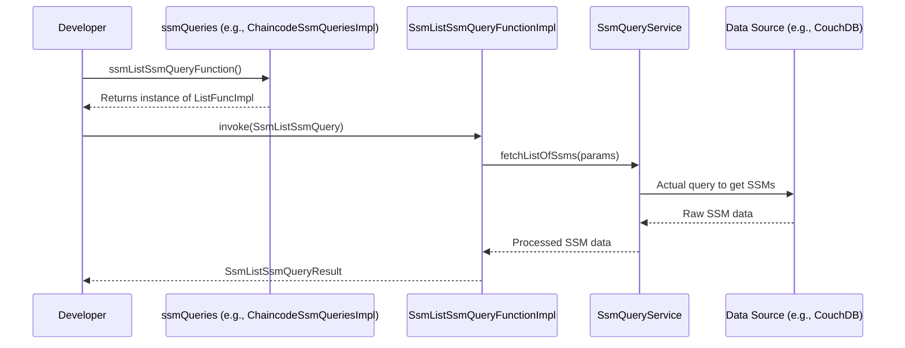

# Chapter 2: F2 Functions (Functional Facades)

Welcome back! In [Chapter 1: Signing State Machine (SSM)](01_signing_state_machine__ssm__.md), we learned about the core concept of SSMs – how they manage multi-party processes with states, transitions, and cryptographic signatures. We saw that interacting with an SSM directly involves constructing specific commands with detailed contexts and signatures.

While powerful, this can sometimes feel a bit complex for everyday operations, especially for common tasks like "get a list of all users" or "find details about a specific SSM session."

This is where **F2 Functions (Functional Facades)** come into play!

## What's the Big Idea? The Restaurant Analogy

Imagine you're at a restaurant. You don't need to know how the chef cooks, what specific ingredients are stocked in the pantry, or the detailed steps of preparing your meal. You just want to order food!

You use a **menu** (the interface) and place an **order** (your request).
*   The menu lists items like "Caesar Salad" or "Spaghetti Carbonara." It tells you what you'll get.
*   You might say, "I'll have the Caesar Salad." (Your input)
*   You then receive the Caesar Salad. (The output)

**F2 Functions are like standardized order forms at this restaurant.**
*   Each "form" (e.g., `GetUserForm`, `ListAllSsmForms`) clearly specifies what information you need to provide (your order details) and what you'll get back (your food, or in our case, data).
*   Different kitchen staff (the underlying implementations) can process these forms, but you, the customer (the developer using `fixers-c2`), always use the same, simple type of form for a given operation.

So, an F2 Function:
1.  Defines a **clear, standardized interface** for a business operation (e.g., get user information, list available SSMs).
2.  **Separates the definition** of what the operation does from **how it's actually done**.

This approach makes the system:
*   **Modular:** Different parts of the system can be developed and updated independently.
*   **Testable:** It's easier to test individual operations.
*   **Simpler to use:** Developers interact with these high-level "order forms" rather than the complex machinery behind them.

## Our Use Case: Listing Available SSM Blueprints

Let's say you're building an application and you want to show your users a list of all the different types of processes (SSM blueprints, like the "SupplyChainProcess" from Chapter 1) that are available in the system.

Without F2 Functions, you might need to know exactly how to query the underlying database or blockchain ledger, format the query correctly, and parse the raw response. That's a lot of work for a common task!

With F2 Functions, this becomes much simpler. You'd use a specific F2 Function designed for "listing SSMs."

## Key Concepts of F2 Functions

1.  **The F2 Function Interface (The "Order Form" / Menu Item)**:
    This is a Kotlin `interface` that defines the "shape" of an operation. It specifies:
    *   What kind of input data class (the "query" or "command") it expects.
    *   What kind of output data class (the "result") it will return.

    In `fixers-c2`, many query-related F2 function interfaces are grouped. For example, `SsmChaincodeQueries.kt` defines several interfaces for querying SSM information.

    ```kotlin
    // Simplified from SsmChaincodeQueries.kt
    // This is like a section on the menu for "SSM Information"
    interface SsmChaincodeQueries {
        // This is one specific "menu item": How to get a list of SSMs
        fun ssmListSsmQueryFunction(): SsmListSsmQueryFunction
        // ... other query functions like ssmGetUserFunction, etc.
    }
    ```
    And `SsmListSsmQueryFunction` itself would be an interface, often a functional interface that takes an input object and returns an output object.

2.  **The Input Data Class (Your "Order Details")**:
    This is a data class that holds all the parameters needed for the F2 Function. For listing all SSMs, the input might be very simple, perhaps even empty if no filters are needed.

    ```kotlin
    // Example: Input for listing SSMs (might be this simple)
    data class SsmListSsmQuery(
        // Potentially filters here, e.g., val nameFilter: String? = null
    )
    ```

3.  **The Output Data Class (What You "Get Back")**:
    This is a data class that holds the result of the operation. For our "list SSMs" example, it would contain a list of SSM details.

    ```kotlin
    // Example: Output after listing SSMs
    data class SsmDetail(
        val name: String,
        val description: String // and other relevant details
    )

    data class SsmListSsmQueryResult(
        val items: List<SsmDetail>
    )
    ```

4.  **The F2 Function Implementation (The "Kitchen Staff")**:
    This is a concrete `class` that implements the F2 Function interface. It contains the actual logic to perform the operation. This is the part that's "hidden" from you when you use the F2 Function.

    For example, `ChaincodeSsmQueriesImpl.kt` provides implementations for the interfaces in `SsmChaincodeQueries`.

    ```kotlin
    // Simplified from ChaincodeSsmQueriesImpl.kt
    // This class says: "I know how to prepare all the SSM Information menu items"
    class ChaincodeSsmQueriesImpl(
        // ...dependencies like ssmQueryService...
    ) : SsmChaincodeQueries {

        // Here's how I provide the "List SSMs" service
        override fun ssmListSsmQueryFunction(): SsmListSsmQueryFunction {
            // It returns an actual object that knows how to do the work
            return SsmListSsmQueryFunctionImpl(/*...dependencies...*/)
        }
        // ... implementations for other query functions ...
    }
    ```
    And `SsmListSsmQueryFunctionImpl` would contain the logic to fetch and return the list of SSMs, possibly by calling an `SsmQueryService`.

## Using an F2 Function: Ordering from the Menu

Let's see how you, as a developer, would use an F2 Function to list all SSM blueprints.

1.  **Get the "Menu" (Access to the F2 Function provider):**
    First, you'd get an instance of a class that provides these F2 functions. In `fixers-c2`, this might be an object like `DataSsmQueryFunctionImpl` (from `ssm-data-f2`) or `ChaincodeSsmQueriesImpl` (from `ssm-chaincode-f2`), depending on the layer you are interacting with. Let's imagine we have a `ssmQueries` object.

    ```kotlin
    // Assume 'ssmQueries' is an instance of a class
    // that implements SsmChaincodeQueries or a similar interface.
    // val ssmQueries: SsmChaincodeQueries = getSsmChaincodeQueries()
    ```

2.  **Select the "Menu Item" (Get the specific F2 Function):**
    From this `ssmQueries` object, you ask for the specific function you want.

    ```kotlin
    val listSsmFunction: SsmListSsmQueryFunction = ssmQueries.ssmListSsmQueryFunction()
    ```
    Now, `listSsmFunction` is your direct line to "order a list of SSMs."

3.  **Prepare Your "Order" (Create the Input Object):**
    For listing all SSMs, the input might be an empty object or one with default values.

    ```kotlin
    val queryInput = SsmListSsmQuery() // Empty for "list all"
    ```

4.  **Place Your "Order" (Execute the Function):**
    You then "invoke" or "execute" this function with your input. F2 functions in `fixers-c2` are often designed to be called like a function directly if they implement a functional interface (e.g., `(SsmListSsmQuery) -> SsmListSsmQueryResult`).

    ```kotlin
    // The actual execution - could be .invoke(), .execute(), or just ()
    val result: SsmListSsmQueryResult = listSsmFunction(queryInput)
    ```
    Or, more commonly, the F2 function interfaces (like those in `SsmChaincodeQueries.kt`) return an object that has an `invoke` method. So the call might look like:
    ```kotlin
    // F2 interfaces like SsmListSsmQueryFunction are often (Query) -> Result
    // So you can call them directly:
    val listAllSsmsQuery = SsmListSsmQuery() // Our input "order form"
    val ssmList: SsmListSsmQueryResult = ssmQueries.ssmListSsmQueryFunction().invoke(listAllSsmsQuery)
    ```

5.  **Receive Your "Food" (Use the Output):**
    The `ssmList` variable now holds an `SsmListSsmQueryResult` object, which contains the list of SSMs.

    ```kotlin
    // What happens: The list of SSMs is now in ssmList.items
    println("Available SSM Blueprints:")
    ssmList.items.forEach { ssm ->
        println("- ${ssm.name}: ${ssm.description}")
    }
    ```
    *Output (example):*
    ```
    Available SSM Blueprints:
    - SupplyChainProcess: Manages a multi-step supply chain.
    - DocumentApproval: A process for approving documents.
    ```

Notice how simple this is for the developer! You picked an "order form" (`ssmListSsmQueryFunction`), filled it out (created `SsmListSsmQuery`), submitted it, and got your result. You didn't need to know the complex steps happening in the "kitchen."

## Under the Hood: What Happens in the "Kitchen"?

When you call `ssmQueries.ssmListSsmQueryFunction().invoke(queryInput)`, a few things happen behind the scenes:

1.  **Delegation:** Your call to `ssmListSsmQueryFunction()` on the `ssmQueries` object (e.g., an instance of `ChaincodeSsmQueriesImpl`) returns an actual implementation object (e.g., `SsmListSsmQueryFunctionImpl`).
2.  **Execution:** When you then `invoke` this implementation object with your `queryInput`, its internal logic runs.
3.  **Service Interaction:** This implementation (e.g., `SsmListSsmQueryFunctionImpl`) will typically use other, more specialized services to do its job. For example, it might use an `SsmQueryService` (part of the [SSM SDK (Software Development Kit)](04_ssm_sdk__software_development_kit__.md)) to talk to the underlying data source.
4.  **Data Fetching:** The `SsmQueryService` might then interact with a database (like in [CouchDB Integration for SSMs](07_couchdb_integration_for_ssms_.md)) or a blockchain ledger (via the [Fabric Interaction Layer (`chaincode-api-fabric`)](05_fabric_interaction_layer___chaincode_api_fabric___.md)).
5.  **Data Transformation:** The raw data fetched from the source might be transformed or mapped into the nice `SsmListSsmQueryResult` format you expect.
6.  **Return Result:** Finally, the `SsmListSsmQueryResult` is returned to you.

Here's a simplified sequence diagram:



Let's look at a couple of relevant code snippets:

**1. Defining the "Menu" (The Interface Provider):**
This is from `SsmChaincodeQueries.kt`. It declares that there *is* an operation called `ssmListSsmQueryFunction`.

```kotlin
// From: c2-ssm/ssm-chaincode/ssm-chaincode-dsl/src/commonMain/kotlin/ssm/chaincode/dsl/SsmChaincodeQueries.kt
package ssm.chaincode.dsl

// ... imports ...
import ssm.chaincode.dsl.query.SsmListSsmQueryFunction // The actual F2 function type

interface SsmChaincodeQueries {
    // ... other function declarations ...
    fun ssmListSsmQueryFunction(): SsmListSsmQueryFunction // Our "order form" type
    // ... other function declarations ...
}
```
This says: "Anyone implementing `SsmChaincodeQueries` must provide a way to get an `SsmListSsmQueryFunction`."

**2. Providing the "Menu Item" (The Implementation Provider):**
This is from `ChaincodeSsmQueriesImpl.kt`. It's one way the "menu" (the `SsmChaincodeQueries` interface) is actually made available with real "kitchen staff" (implementations).

```kotlin
// From: c2-ssm/ssm-chaincode/ssm-chaincode-f2/src/main/kotlin/ssm/chaincode/f2/ChaincodeSsmQueriesImpl.kt
package ssm.chaincode.f2

// ... imports ...
import ssm.chaincode.dsl.query.SsmListSsmQueryFunction
import ssm.chaincode.f2.query.SsmListSsmQueryFunctionImpl // The "kitchen staff"
import ssm.sdk.core.SsmQueryService // A helper service

class ChaincodeSsmQueriesImpl(
    // ... other dependencies ...
    private val ssmQueryService: SsmQueryService
): SsmChaincodeQueries {

    override fun ssmListSsmQueryFunction(): SsmListSsmQueryFunction {
        // Here, it creates and returns the actual object that can list SSMs.
        // This SsmListSsmQueryFunctionImpl will use the ssmQueryService.
        return SsmListSsmQueryFunctionImpl(ssmQueryService)
    }
    // ... other implementations ...
}
```
This `ChaincodeSsmQueriesImpl` class fulfills the contract of `SsmChaincodeQueries` by providing a concrete `SsmListSsmQueryFunctionImpl` when `ssmListSsmQueryFunction()` is called. This `SsmListSsmQueryFunctionImpl` (whose code isn't shown here but is referenced) would be the class containing the `invoke` method that actually calls `ssmQueryService.listSsmNames()` or similar.

You can see this F2 pattern across various modules in `fixers-c2`:
*   `ssm-chaincode-dsl` and `ssm-chaincode-f2` for chaincode-level operations.
*   `ssm-couchdb-dsl` and `ssm-couchdb-f2` for direct CouchDB interactions ([CouchDB Integration for SSMs](07_couchdb_integration_for_ssms_.md)).
*   `ssm-data-dsl` and `ssm-data-f2` often combine or orchestrate F2 functions from other layers to provide higher-level data views.
*   `ssm-tx-dsl` and `ssm-tx-f2` for transaction-related commands ([SSM Transaction Handling (`ssm-tx-*`)](06_ssm_transaction_handling___ssm_tx_____.md)).

## Why Are F2 Functions So Useful?

*   **Simplicity:** You work with clear, high-level operations.
*   **Abstraction:** You don't need to worry about the low-level details of *how* an operation is implemented.
*   **Consistency:** Operations have a standard structure (Input -> Function -> Output).
*   **Maintainability:** The implementation behind an F2 Function can change (e.g., switch to a new database) without affecting the code that *uses* the F2 Function, as long as the "order form" (the interface) remains the same.
*   **Testability:** Each F2 Function and its implementation can be tested in isolation.

## Conclusion

You've now learned about F2 Functions (Functional Facades)! They are a crucial programming paradigm in `fixers-c2` that act like standardized "order forms" for business operations. They provide clear interfaces, separating the *what* from the *how*, which makes your life as a developer much easier.

Key takeaways:
*   F2 Functions define standardized interfaces for operations.
*   They consist of an interface, input/output data classes, and an implementation.
*   They abstract away complexity, promoting modularity and testability.
*   You interact with them by getting the function, preparing an input, and invoking it to get an output.

In the next chapter, we'll look at the [Chaincode API Gateway](03_chaincode_api_gateway_.md), which is how these F2 functions (especially those related to chaincode) are often exposed to the outside world or other services.

---

Generated by [AI Codebase Knowledge Builder](https://github.com/The-Pocket/Tutorial-Codebase-Knowledge)