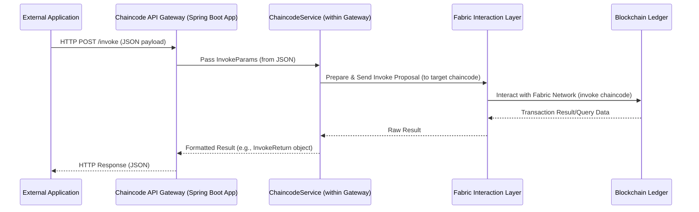

# Chapter 3: Chaincode API Gateway

Welcome back! In [Chapter 2: F2 Functions (Functional Facades)](02_f2_functions__functional_facades__.md), we explored how F2 Functions provide a clean and standardized way to define business operations, like "listing all available SSMs." These functions give us well-defined "order forms" for interacting with the system's logic.

But now, a new question arises: How does an external application – like a website, a mobile app, or another backend service – actually *use* these operations, especially when they involve interacting with a [Signing State Machine (SSM)](01_signing_state_machine__ssm__.md) running on a Hyperledger Fabric blockchain? Direct interaction with a blockchain can be quite complex for typical applications.

This is where the **Chaincode API Gateway** steps in!

## The Problem: Bridging the Gap to the Blockchain

Imagine you've built a fantastic web application for managing supply chains using our SSMs. Your users click buttons on a webpage to create new orders or update their status.
*   How does that button click translate into an action on the blockchain?
*   Your web application probably speaks HTTP (the language of the web), but the blockchain has its own protocols.

We need a bridge, a translator, an entry point.

## The Chaincode API Gateway: Your Blockchain Receptionist

Think of the Hyperledger Fabric blockchain, where your SSMs live, as a large, secure organization. The Chaincode API Gateway is like the **main office reception** for this organization.

*   **You (the External Application):** You're a visitor (e.g., your web app) wanting to get something done or ask a question.
*   **Your Request (HTTP Call):** You approach the reception with your request, written in a common language (an HTTP request). For example, "I want to create a new supply chain order" or "What's the current status of Order-XYZ-123?"
*   **The Receptionist (Chaincode API Gateway):** The receptionist (the API Gateway) takes your request. They understand your common language (HTTP).
*   **Directing to the Right Department (Chaincode Invocation):** The receptionist knows which department (which specific chaincode function on the blockchain) can handle your request. They translate your request into the internal "organizational language" (a chaincode invocation) and send it to the correct department.
*   **Getting the Result:** Once the department processes your request, they give the result back to the receptionist, who then relays it back to you in the common language (an HTTP response).

So, the Chaincode API Gateway is a **Spring Boot application** that:
1.  Exposes **RESTful APIs** (standard web APIs using HTTP).
2.  **Translates** incoming HTTP requests into the appropriate chaincode invocations (to change data on the blockchain) or queries (to read data from the blockchain).
3.  Sends back the blockchain's response as a standard HTTP response.

This makes it much easier for external applications to interact with the blockchain without needing to understand all its underlying complexities.

## Key Concepts

1.  **RESTful APIs:**
    *   This is a standard way web services communicate. You use familiar HTTP methods:
        *   `GET`: To retrieve data (like asking for the status of an order).
        *   `POST`: To send data to create or update something (like creating a new order or performing an action on an existing one).
    *   You send requests to specific URLs (Uniform Resource Locators), like `http://api.mycompany.com/orders`.
    *   Data is often exchanged in JSON format, which is human-readable and easy for machines to parse.

2.  **HTTP to Chaincode Translation:**
    *   Your HTTP request might look simple, e.g., a `POST` to `/invoke` with some JSON data.
    *   The API Gateway takes this, figures out which chaincode, which channel, and which function on the blockchain to call, and what arguments to pass to it.
    *   This "translation" is crucial because directly calling chaincode requires specific libraries and understanding of the blockchain network's structure.

3.  **Spring Boot Application:**
    *   Spring Boot is a very popular framework for building web applications and services in Java (and Kotlin, which `fixers-c2` uses).
    *   This means the API Gateway is a standard, robust web service that can be deployed, managed, and scaled like other web applications.

## Using the Gateway: A Practical Example

Let's say your external application wants to execute the `perform` action on an SSM session, similar to what we saw at the end of [Chapter 1: Signing State Machine (SSM)](01_signing_state_machine__ssm__.md).

Your application would make an HTTP POST request to the Chaincode API Gateway.

**1. The HTTP Request from Your Application:**

*   **URL:** `http://<gateway_address>/invoke` (The `invoke` path is a common endpoint for sending transactions).
*   **Method:** `POST`
*   **Headers:** `Content-Type: application/json`
*   **Body (Payload in JSON format):**
    ```json
    {
      "channelid": "sandbox",
      "chaincodeid": "ssm",
      "cmd": "invoke",
      "fcn": "perform",
      "args": [
        "{\"action\":\"ShipGoods\",\"context\":{...more_data...},\"user_name\":\"SpeedyLogistics\",\"signature\":\"...base64_signature...\"}"
      ]
    }
    ```
    *   `channelid`: The Hyperledger Fabric channel where the chaincode is deployed (e.g., "sandbox").
    *   `chaincodeid`: The name of the chaincode (e.g., "ssm").
    *   `cmd`: Whether this is an "invoke" (to change state) or "query" (to read state).
    *   `fcn`: The chaincode function to call (e.g., "perform").
    *   `args`: An array of strings representing the arguments for the chaincode function. Here, the first argument is a JSON string containing all details for the "perform" command.

**2. What the API Gateway Does:**

*   It receives this HTTP request.
*   It parses the JSON body to get all the parameters (`channelid`, `chaincodeid`, `fcn`, `args`).
*   It uses these parameters to construct a proper chaincode invocation request for the Hyperledger Fabric network.
*   It sends this request to the Fabric network and waits for a response.

**3. The HTTP Response from the API Gateway:**

If successful, the gateway might send back a JSON response like:

```json
{
  "status": "SUCCESS",
  "message": "",
  "transactionId": "a1b2c3d4e5f6..."
}
```
This tells your application that the transaction was submitted successfully and provides a transaction ID for tracking.

If it's a query, the response would contain the data retrieved from the blockchain. For example, a query for an SSM session's state might return:

```json
// Example response for a query
{
  "ssm": "SupplyChainProcess",
  "session": "Order-XYZ-123",
  "currentState": "GoodsShipped",
  // ... other session details
}
```

See how much simpler this is for your external application? It just makes an HTTP call!

## Under the Hood: A Peek Inside the Reception Office

Let's look at how the API Gateway handles these requests, using a simplified view.



**Key Components within the Gateway:**

1.  **`ChaincodeRestEndpoint.kt` (The Front Door):**
    This Kotlin file defines the actual HTTP endpoints. It uses annotations from the Spring framework to map URLs and HTTP methods to specific functions.

    ```kotlin
    // Simplified from ChaincodeRestEndpoint.kt
    @RestController // Marks this class as a REST controller
    @RequestMapping("/") // Base path for requests
    class ChaincodeRestEndpoint(
        private val chaincodeService: ChaincodeService // Injects the service layer
    ) {
        // Handles POST requests to / with JSON body
        @PostMapping(consumes = [MediaType.APPLICATION_JSON_VALUE])
        fun invokeJson(
            @RequestBody args: InvokeParams // Converts JSON body to InvokeParams object
        ): CompletableFuture<String> {
            // Delegate to the chaincodeService
            return chaincodeService.execute(args)
        }
    }
    ```
    *   `@RestController`: Tells Spring this class handles incoming web requests.
    *   `@PostMapping`: Maps HTTP POST requests to the `invokeJson` method.
    *   `@RequestBody InvokeParams args`: Spring automatically converts the JSON data sent by the client into an `InvokeParams` object. `InvokeParams` is a simple data class holding `channelid`, `chaincodeid`, `cmd`, `fcn`, and `args`.

2.  **`InvokeParams.kt` (The Request Form):**
    This is a simple data class that models the expected structure of the incoming JSON request.

    ```kotlin
    // Simplified structure for InvokeParams
    data class InvokeParams(
        val channelid: String?, // e.g., "sandbox"
        val chaincodeid: String?, // e.g., "ssm"
        val cmd: Cmd,             // e.g., Cmd.invoke or Cmd.query
        val fcn: String,          // e.g., "perform"
        val args: Array<String>   // Arguments for the chaincode function
    )

    enum class Cmd { invoke, query }
    ```

3.  **`ChaincodeService.kt` (The Smart Receptionist):**
    This service class contains the core logic for processing the request and interacting with the blockchain.

    ```kotlin
    // Simplified from ChaincodeService.kt
    @Service // Marks this as a Spring service component
    class ChaincodeService(
        // Dependencies for talking to Fabric, configuration etc.
        private val coopConfigProps: HeraclesConfigProps,
        private val fabricClientProvider: FabricClientProvider,
        private val fabricClientBuilder: FabricClientBuilder
        // ... and others like blockchainService ...
    ) {
        fun execute(params: InvokeParams): CompletableFuture<String> {
            // 1. Determine the exact channel and chaincode to use
            val target = coopConfigProps.getChannelChaincodePair(
                params.channelid, params.chaincodeid
            )

            val invokeArgs = InvokeArgs(params.fcn, params.args.iterator())

            // 2. Call the appropriate Fabric client method
            return if (params.cmd == Cmd.invoke) {
                // Use Fabric client to send a transaction proposal
                // This eventually calls something from the 
                // [Fabric Interaction Layer (`chaincode-api-fabric`)](05_fabric_interaction_layer___chaincode_api_fabric___.md)
                doInvoke(target.channelId, target.chainCodeId, invokeArgs)
                    .thenApply { it.toJson() /* Convert result to JSON string */ }
            } else { // Cmd.query
                // Use Fabric client to query the ledger
                doQuery(target.channelId, target.chainCodeId, invokeArgs)
            }
        }
        // ... private helper methods doInvoke and doQuery ...
    }
    ```
    *   `@Service`: Tells Spring this is a service component containing business logic.
    *   It uses `HeraclesConfigProps` to get configuration details (like default channel/chaincode IDs if not provided in the request).
    *   It then uses other services (like those provided by `fabricClientProvider` or `fabricClientBuilder`) to actually interact with the Hyperledger Fabric network. These lower-level interactions are part of the [Fabric Interaction Layer (`chaincode-api-fabric`)](05_fabric_interaction_layer___chaincode_api_fabric___.md), which we'll cover in a later chapter.

4.  **Configuration (`HeraclesConfigProps.kt` and `application.yml`):**
    The gateway needs to know how to connect to the Fabric network, and what are the default or available channels and chaincodes. This is often configured in a file like `application.yml`.

    *Snippet from `application.yml`:*
    ```yaml
    coop:
      defaultCcid: sandbox/ssm # Default channel/chaincode
      ccid: sandbox/ssm,sandbox/ex02 # List of available channel/chaincodes
      # ... other properties like user, organization, connection details ...
    ```
    The `HeraclesConfigProps.kt` class is responsible for loading these properties so they can be used by `ChaincodeService`.

    ```kotlin
    // Simplified concept from HeraclesConfigProps.kt
    @ConfigurationProperties("coop") // Binds to "coop" section in YAML
    class HeraclesConfigProps(
        var defaultCcid: String,
        var ccid: String
        // ... other properties ...
    ) {
        fun getChannelChaincodePair(channelIdIn: String?, chaincodeIdIn: String?): ChannelChaincodePair {
            // Logic to figure out actual channelId and chaincodeId
            // based on inputs and defaults from application.yml
            // For example, if channelIdIn is null, use part of defaultCcid
            // ...
            val determinedChannel = channelIdIn ?: defaultCcid.split("/").first()
            val determinedChaincode = chaincodeIdIn ?: defaultCcid.split("/").last()
            return ChannelChaincodePair(determinedChannel, determinedChaincode)
        }
    }
    data class ChannelChaincodePair(val channelId: String, val chainCodeId: String)
    ```

This internal structure allows the API Gateway to be a flexible and configurable entry point to your blockchain network.

## Why is This Gateway So Useful?

*   **Simplicity for Clients:** External applications don't need to embed complex Hyperledger Fabric SDKs. They just make standard HTTP calls.
*   **Abstraction:** It hides the complexities of blockchain interaction (peer discovery, endorsement policies, transaction proposals, etc.).
*   **Centralized Access Point:** Provides a single place to manage:
    *   Security (authentication, authorization for who can call the API).
    *   Logging of all incoming requests.
    *   Rate limiting or other API management policies.
*   **Decoupling:** The external applications are decoupled from the specifics of the blockchain implementation. If you change how the blockchain is accessed, you might only need to update the gateway, not all client applications.
*   **Technology Agnostic Clients:** Any application that can make an HTTP request (web apps, mobile apps, scripts in Python, Node.js, etc.) can interact with the blockchain via the gateway.

## Conclusion

The Chaincode API Gateway acts as a vital bridge, making your blockchain applications accessible to the wider world of external systems. It translates familiar HTTP REST requests into specific Hyperledger Fabric chaincode operations, simplifying development and integration. You've seen how it works like a "receptionist," taking requests and directing them appropriately, and how components like `ChaincodeRestEndpoint` and `ChaincodeService` handle this process.

Key takeaways:
*   The API Gateway exposes RESTful APIs for external applications.
*   It translates HTTP requests to chaincode invocations/queries.
*   It's typically a Spring Boot application, providing a standard web service interface.
*   It simplifies interaction with the blockchain and decouples client applications from Fabric specifics.

In the next chapter, we'll explore the [SSM SDK (Software Development Kit)](04_ssm_sdk__software_development_kit__.md). While the API Gateway is great for external systems, an SDK can provide developers building applications (either clients of the gateway or even parts of the gateway itself) with more convenient, type-safe ways to prepare chaincode commands or process results.

---

Generated by [AI Codebase Knowledge Builder](https://github.com/The-Pocket/Tutorial-Codebase-Knowledge)