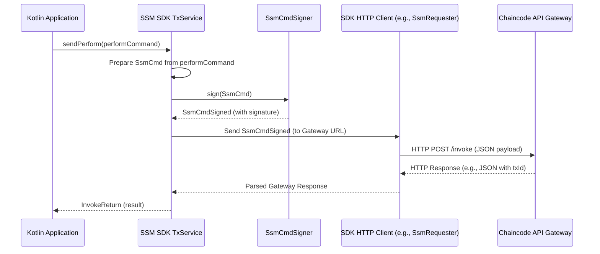

# Chapter 4: SSM SDK (Software Development Kit)

Welcome back! In [Chapter 3: Chaincode API Gateway](03_chaincode_api_gateway_.md), we saw how an API Gateway acts as a "receptionist," allowing external applications to talk to our blockchain SSMs using simple web requests (HTTP). This is great for many types of applications.

But what if you're building a client application directly in Java or Kotlin, and you want a more integrated, type-safe, and convenient way to interact with the SSM framework? Manually crafting JSON requests, handling HTTP calls, and parsing responses can be cumbersome.

This is where the **SSM SDK (Software Development Kit)** comes in!

## The Problem: Needing a Better Toolkit for Developers

Imagine you're a Java or Kotlin developer building a new backend service or a desktop application that needs to:
1.  Create new "SupplyChainProcess" SSM sessions.
2.  Allow users to perform actions (like "ShipGoods") on these sessions.
3.  Query the current status of any supply chain order.

While you *could* make HTTP calls to the [Chaincode API Gateway](03_chaincode_api_gateway_.md) directly, it would involve a lot of boilerplate code:
*   Constructing JSON payloads for commands.
*   Managing HTTP client libraries.
*   Manually signing data if your application logic requires it before sending.
*   Parsing JSON responses back into your Java/Kotlin objects.

This isn't very developer-friendly and can be error-prone. You'd wish for a set of pre-built tools tailored for these tasks.

## The SSM SDK: Your Developer's Toolkit for SSMs

The SSM SDK is like a **carpenter's toolkit** specifically designed for working with the `fixers-c2` SSM framework. Instead of crafting every tool from scratch (like manually handling HTTP and JSON), you, the developer, get a set of pre-built tools:
*   **Hammers (Transaction Builders):** Convenient functions to create and prepare SSM commands (like creating a new session or performing an action).
*   **Screwdrivers (Query Functions):** Easy ways to ask for information (like getting the current state of an SSM session).
*   **Measuring Tapes (Data Models):** Ready-to-use Kotlin data classes representing SSM concepts, commands, and results, ensuring you're working with the right "shapes" of data.
*   **Specialized Tools (Signers):** Helpers to digitally sign your commands correctly.
*   **Messengers (HTTP Clients):** Pre-configured components to send these commands to the blockchain (usually via the [Chaincode API Gateway](03_chaincode_api_gateway_.md)) and get responses.

The SDK is a collection of libraries (modules starting with `ssm-sdk-*` like `ssm-sdk-core`, `ssm-sdk-dsl`, `ssm-sdk-sign`) that provide these tools primarily for Java/Kotlin applications.

## What the SSM SDK Offers

The SDK provides functionalities for:
1.  **Creating Commands:** Constructing well-defined command objects (e.g., `SsmStartCommand` to start a new session, `SsmPerformCommand` to execute an action).
2.  **Signing Commands:** Using signers (like `SsmCmdSigner`) to cryptographically sign these commands with the appropriate agent's private key. This is crucial for proving authenticity, as we learned in [Chapter 1: Signing State Machine (SSM)](01_signing_state_machine__ssm__.md).
3.  **Sending Commands:** Transmitting these signed commands to the blockchain network (typically by making HTTP calls to the [Chaincode API Gateway](03_chaincode_api_gateway_.md) behind the scenes).
4.  **Querying SSM States:** Easily fetching information about SSM blueprints, active sessions, transaction history, etc.

Let's see how you'd use this toolkit!

## Using the SSM SDK: A Step-by-Step Example

Imagine we want our Kotlin application to:
1.  Set up the SDK.
2.  Prepare a way to sign commands.
3.  Start a new "OrderProcessing" SSM session.
4.  Perform an "ApproveOrder" action on that session.
5.  Query the session's final state.

We'll need a `ChaincodeUri` which specifies where our SSM chaincode is running. Let's assume we have one:
```kotlin
// Represents the target blockchain and chaincode
import ssm.chaincode.dsl.model.uri.ChaincodeUri
val chaincodeUri = ChaincodeUri("channel-beta/ssm-v2")
```

And we'll need a `Signer` who is authorized to perform actions. Let's assume we have "Alice" who is an "Approver".
```kotlin
// Information about our user "Alice"
val aliceAgentName = "Alice"
val alicePrivateKey: java.security.PrivateKey = loadAlicePrivateKey() // Assume this loads Alice's key
val alicePublicKey: java.security.PublicKey = loadAlicePublicKey() // Assume this loads Alice's public key
```

### 1. Setting Up: The `SsmServiceFactory`

First, we need to get our "toolkit" ready. The `SsmServiceFactory` helps us create the necessary service objects. It needs some configuration, like the URL of the [Chaincode API Gateway](03_chaincode_api_gateway_.md) and batching properties.

```kotlin
// Simplified setup of SsmServiceFactory
import ssm.sdk.core.SsmServiceFactory
import ssm.sdk.core.SsmSdkConfig // For API gateway URL etc.
import ssm.chaincode.dsl.config.SsmBatchProperties // For batching config

// Configuration for connecting to the API Gateway
val sdkConfig = SsmSdkConfig(baseUrl = "http://localhost:8082") // Gateway URL
val batchProps = SsmBatchProperties( // Default batching properties
    // values for size, timeout, etc.
    size = 10, timeout = 200
)

val factory = SsmServiceFactory.builder(sdkConfig, batchProps).build()
```
This code initializes a factory that knows how to build the SDK services we'll need, configured to talk to our API Gateway.

### 2. Preparing the Signer: `SsmCmdSigner`

Actions on an SSM need to be signed. The SDK provides `SsmCmdSigner` implementations. We'll use `SsmCmdSignerSha256RSASigner` for RSA-based signing.

```kotlin
import ssm.sdk.sign.SsmCmdSignerSha256RSASigner
import ssm.sdk.sign.model.Signer
import java.security.KeyPair

// Create a Signer object for Alice
val aliceSignerInfo = Signer(
    name = aliceAgentName,
    pair = KeyPair(alicePublicKey, alicePrivateKey)
)

// This signer knows how to sign commands as Alice
val cmdSigner = SsmCmdSignerSha256RSASigner(aliceSignerInfo)
```
Now, `cmdSigner` is ready to sign commands on Alice's behalf.

### 3. Creating the Services: `SsmTxService` and `SsmQueryService`

From our factory, we can now get the main service objects:
*   `SsmTxService`: For sending commands that change state (transactions).
*   `SsmQueryService`: For reading data (queries).

```kotlin
// Get the transaction service from the factory
val ssmTxService = factory.buildTxService(cmdSigner)

// Get the query service from the factory
val ssmQueryService = factory.buildQueryService()
```
We pass our `cmdSigner` to `buildTxService` because transactions need to be signed.

### 4. Starting an SSM Session: `SsmTxService.sendStart()`

Let's start a new "OrderProcessing" session. We need to define the session details, including its unique name, the SSM blueprint it follows, and the roles assigned to agents.

```kotlin
import ssm.chaincode.dsl.model.SsmSession // Data model for a session
import ssm.sdk.core.command.SsmStartCommand // Command to start a session
import ssm.sdk.dsl.InvokeReturn // Result of an invocation

// Define the session we want to start
val newOrderSession = SsmSession(
    ssm = "OrderProcessingSsm", // Name of the SSM blueprint
    session = "Order-451",      // Unique ID for this session
    roles = mapOf("Approver" to aliceAgentName), // Alice is the Approver
    public = mapOf("item" to "Laptop", "quantity" to 1), // Public data
    private = emptyMap()
)

// Create the command
val startCommand = SsmStartCommand(
    session = newOrderSession,
    chaincodeUri = chaincodeUri,
    signerName = aliceAgentName // Alice will sign this
)

// Send the command (this is a suspending function, typically run in a coroutine)
// val startResult: InvokeReturn = ssmTxService.sendStart(listOf(startCommand)).first()
// For simplicity, let's assume a single command variant:
// println("Starting session...")
// val startResult: InvokeReturn = ssmTxService.sendStart(chaincodeUri, newOrderSession, aliceAgentName)
// println("Session start result: ${startResult.payload}") // Shows transaction ID
```
*What happens:*
The `ssmTxService` takes the `startCommand`, uses the `cmdSigner` to sign it as "Alice", and then sends it (likely via the [Chaincode API Gateway](03_chaincode_api_gateway_.md)) to the blockchain. If successful, "Order-451" is created. The `startResult` would contain information like the transaction ID. (Note: `sendStart` often takes a list for batching; for simplicity, we're showing the concept.)

### 5. Performing an Action: `SsmTxService.sendPerform()`

Now, let's say Alice wants to perform the "ApproveOrder" action on "Order-451".

```kotlin
import ssm.chaincode.dsl.model.SsmContext // Context for an action
import ssm.sdk.core.command.SsmPerformCommand // Command to perform an action

// Context for the action: current session name, iteration, and any new public data
val actionContext = SsmContext(
    session = "Order-451",
    public = mapOf("approvedBy" to aliceAgentName), // New public data
    private = emptyMap(),
    iteration = 0, // Iteration of the current state (0 for initial if just started)
    previousIteration = null // Not always needed for first action
)

// Create the command
val performCommand = SsmPerformCommand(
    action = "ApproveOrder",
    context = actionContext,
    chaincodeUri = chaincodeUri,
    signerName = aliceAgentName // Alice signs this
)

// Send the command
// println("Performing action...")
// val performResult: InvokeReturn = ssmTxService.sendPerform(listOf(performCommand)).first()
// For simplicity, assume a single command variant:
// val performResult: InvokeReturn = ssmTxService.sendPerform(chaincodeUri, "ApproveOrder", actionContext, aliceAgentName)
// println("Perform action result: ${performResult.payload}")
```
*What happens:*
Similar to starting a session, `ssmTxService` signs the "ApproveOrder" command as Alice and sends it. If Alice has the "Approver" role and "ApproveOrder" is a valid action from the current state, the session "Order-451" transitions to a new state.

### 6. Querying Session State: `SsmQueryService.getSession()`

Finally, let's check the state of "Order-451".

```kotlin
import ssm.chaincode.dsl.model.SsmSessionState // Data model for session state

// Query the session state (this is a suspending function)
// println("Querying session state...")
// val sessionState: SsmSessionState? = ssmQueryService.getSession(
// chaincodeUri, "Order-451"
// )

// if (sessionState != null) {
// println("Session 'Order-451' current state: ${sessionState.current}")
// println("Public data: ${sessionState.public}")
// } else {
// println("Session 'Order-451' not found.")
// }
```
*Example Output (Conceptual):*
```
Querying session state...
Session 'Order-451' current state: 1  // (Assuming '1' represents 'Approved')
Public data: {item=Laptop, quantity=1, approvedBy=Alice}
```
The `ssmQueryService` sends a query request (again, likely through the API Gateway) to fetch the latest state of "Order-451".

See how the SDK provides a much cleaner, Kotlin-native way to do these operations compared to manual HTTP and JSON handling!

## Under the Hood: How Does It Work?

Let's briefly look at what happens when you use, for example, `ssmTxService.sendPerform(...)`.

**Simplified Flow:**

1.  **Command Creation:** Your code creates an `SsmPerformCommand` object.
2.  **Preparation:** The `SsmTxService` (often via an internal `SsmService`) takes this command and converts it into a generic `SsmCmd` format, which is the structure expected for signing and sending.
3.  **Signing:** The `SsmTxService` uses the `SsmCmdSigner` (that we configured earlier with Alice's key) to digitally sign the `SsmCmd`. This produces an `SsmCmdSigned` object containing the original command plus the signature.
4.  **Sending:** The signed command is then passed to an internal component (like an `SsmRequester` which uses a `KtorRepository`) responsible for HTTP communication. This component formats the `SsmCmdSigned` into a JSON payload and sends it as an HTTP POST request to the configured [Chaincode API Gateway](03_chaincode_api_gateway_.md)'s `/invoke` endpoint.
5.  **Gateway & Blockchain:** The API Gateway receives this request, validates it, and invokes the "perform" function on the target SSM chaincode on the blockchain.
6.  **Response:** The API Gateway sends back an HTTP response (e.g., transaction ID or error).
7.  **Result Processing:** The SDK's HTTP client receives this response, parses it, and `SsmTxService` returns it to your application as an `InvokeReturn` object.

Here's a sequence diagram illustrating this:



### Diving into the Code (Conceptual Look)

Let's glance at some key files involved:

1.  **`SsmServiceFactory.kt` (Setting up the toolkit):**
    This factory is responsible for creating instances of `SsmQueryService` and `SsmTxService`. It wires together necessary components like the HTTP client (`KtorRepository`) and JSON converters.

    ```kotlin
    // Simplified from ssm-sdk-core/.../SsmServiceFactory.kt
    class SsmServiceFactory(
        private var coopRepository: KtorRepository, // For HTTP
        // ... other dependencies ...
    ) {
        fun buildQueryService(): SsmQueryService {
            // Creates SsmQueryService with an SsmRequester
            return SsmQueryService(SsmRequester(jsonConverter, coopRepository))
        }

        fun buildTxService(ssmCmdSigner: SsmCmdSigner): SsmTxService {
            // Creates SsmTxService, giving it a signer and an SsmRequester
            val ssmService = SsmService(SsmRequester(jsonConverter, coopRepository), ssmCmdSigner)
            return SsmTxService(ssmService, /* batchConfig */)
        }
        // ... companion object for easy building ...
    }
    ```
    The `KtorRepository` is an internal class that uses the Ktor HTTP client library to talk to the API Gateway.

2.  **`SsmTxService.kt` (Orchestrating commands):**
    This service takes high-level commands (like `SsmPerformCommand`), prepares them for signing, gets them signed, and then sends them.

    ```kotlin
    // Simplified from ssm-sdk-core/.../SsmTxService.kt
    class SsmTxService(
        private val ssmService: SsmService, // Internal service for actual work
        // ... batch properties ...
    ) {
        suspend fun sendPerform(commands: List<SsmPerformCommand>): List<InvokeReturn> {
            // Delegates to ssmService.signsAndSend,
            // which maps SsmPerformCommand to a generic SsmCmd,
            // then signs and sends it.
            return ssmService.signsAndSend {
                commands.map { cmd ->
                    // perform() here creates the generic SsmCmd
                    perform(cmd.action, cmd.context, cmd.chaincodeUri, cmd.signerName)
                }
            }
        }
        // ... other methods like sendStart, sendCreate ...
    }
    ```

3.  **`SsmCmdSignerSha256RSASigner.kt` (The "signing tool"):**
    This class implements the `SsmCmdSigner` interface and knows how to sign data using RSA keys.

    ```kotlin
    // Simplified from ssm-sdk-sign-rsa-key/.../SsmCmdSignerSha256RSASigner.kt
    import ssm.sdk.dsl.SsmCmd
    import ssm.sdk.dsl.SsmCmdSigned

    class SsmCmdSignerSha256RSASigner(vararg signer: Signer): SsmCmdSigner {
        override fun sign(ssmCommand: SsmCmd): SsmCmdSigned {
            val signerInfo = signers[ssmCommand.agentName] // Find key for agent
                ?: throw Exception("Agent not found")
            
            // Perform RSA SHA256 signing
            val signatureBytes = Sha256RSASigner.rsaSign(
                ssmCommand.valueToSign, signerInfo.pair.private
            )
            val signatureBase64 = Base64.getEncoder().encodeToString(signatureBytes)

            return SsmCmdSigned(cmd = ssmCommand, /*...,*/ signature = signatureBase64)
        }
    }
    ```

4.  **`SsmQueryService.kt` (The "query tool"):**
    This service provides methods to fetch data. It uses an `SsmRequester` to make HTTP GET requests to the API Gateway.

    ```kotlin
    // Simplified from ssm-sdk-core/.../SsmQueryService.kt
    import ssm.chaincode.dsl.model.SsmSessionState
    import ssm.sdk.core.ktor.SsmRequester // For making HTTP requests

    class SsmQueryService(private val ssmRequester: SsmRequester) {
        suspend fun getSession(uri: ChaincodeUri, name: SessionName): SsmSessionState? {
            val query = SessionQuery() // Defines the type of query
            // ssmRequester makes the actual HTTP GET call to the API Gateway
            return ssmRequester.query(uri, name, query, SsmSessionState::class.java)
        }
        // ... other query methods like listSsm, getAgent ...
    }
    ```

5.  **SDK Modules (`ssm-sdk-core/build.gradle.kts`):**
    The SDK itself is composed of several modules. The `ssm-sdk-core` module brings many of these together.

    ```gradle
    // Simplified from ssm-sdk-core/build.gradle.kts
    dependencies {
        api(project(":c2-ssm:ssm-chaincode:ssm-chaincode-dsl")) // Core SSM data models
        api(project(":c2-ssm:ssm-sdk:ssm-sdk-dsl"))       // SDK specific data models
        api(project(":c2-ssm:ssm-sdk:ssm-sdk-json"))      // JSON handling
        api(project(":c2-ssm:ssm-sdk:ssm-sdk-sign"))      // Signing logic
        // ... Ktor for HTTP client ...
    }
    ```
    This shows how the SDK builds upon shared data models (`ssm-chaincode-dsl`) and adds its own layers for DSL, JSON, signing, and HTTP communication.

This layered approach makes the SDK powerful yet relatively easy to use for developers building Java/Kotlin applications that need to interact with `fixers-c2` SSMs.

## Conclusion

The SSM SDK is your best friend if you're developing Java or Kotlin applications that need to deeply integrate with the `fixers-c2` SSM framework. It's a comprehensive toolkit that abstracts away the complexities of manual command creation, signing, and communication with the blockchain (via the [Chaincode API Gateway](03_chaincode_api_gateway_.md)).

Key takeaways:
*   The SSM SDK provides pre-built tools (services, command objects, signers) for Java/Kotlin developers.
*   It simplifies creating and signing commands, sending them, and querying SSM states.
*   It uses components like `SsmServiceFactory`, `SsmTxService`, `SsmQueryService`, and `SsmCmdSigner`.
*   Under the hood, it typically communicates with the [Chaincode API Gateway](03_chaincode_api_gateway_.md) using HTTP.
*   It offers a more type-safe and convenient development experience than direct API calls.

In the next chapter, we'll dive deeper into how the [Chaincode API Gateway](03_chaincode_api_gateway_.md) and other backend components actually talk to the Hyperledger Fabric blockchain itself. We'll explore the [Fabric Interaction Layer (`chaincode-api-fabric`)](05_fabric_interaction_layer___chaincode_api_fabric___.md).

---

Generated by [AI Codebase Knowledge Builder](https://github.com/The-Pocket/Tutorial-Codebase-Knowledge)