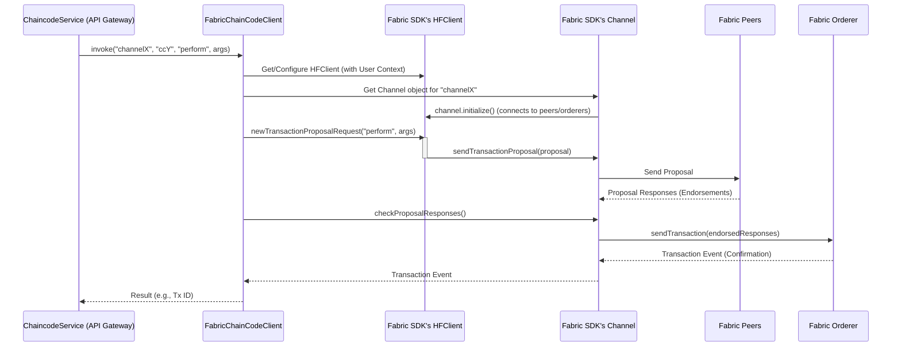

# Chapter 5: Fabric Interaction Layer (`chaincode-api-fabric`)

Welcome back! In [Chapter 4: SSM SDK (Software Development Kit)](04_ssm_sdk__software_development_kit__.md), we saw how the SSM SDK provides a convenient toolkit for Java/Kotlin developers to interact with SSMs, often by communicating with the [Chaincode API Gateway](03_chaincode_api_gateway_.md).

Now, let's peel back another layer. When the [Chaincode API Gateway](03_chaincode_api_gateway_.md) receives a request to, say, perform an SSM action, how does it *actually* talk to the Hyperledger Fabric blockchain network? The gateway understands HTTP, but Fabric has its own complex protocols. This is where the **Fabric Interaction Layer (`chaincode-api-fabric`)** comes into play.

## The Engine and Transmission: What Problem Does This Solve?

Think of our `fixers-c2` system, especially when interacting with the blockchain, as a car.
*   **You (or an external application):** The passenger wanting to go somewhere.
*   **[SSM SDK (Software Development Kit)](04_ssm_sdk__software_development_kit__.md):** A travel agent helping you book the right kind of car service.
*   **[Chaincode API Gateway](03_chaincode_api_gateway_.md):** The driver's controls – the steering wheel, pedals, and dashboard. You tell the driver (API Gateway) "go faster" or "turn left."

But what makes the car *actually* move and interact with the road? That's the **engine and transmission**.

The **Fabric Interaction Layer (`chaincode-api-fabric`)** is precisely this: the engine and transmission for our blockchain interactions. It's a lower-level Java module that directly communicates with the Hyperledger Fabric network. While the [Chaincode API Gateway](03_chaincode_api_gateway_.md) (the driver) uses the controls, this layer is what:
*   Manages the "fuel" (user identities and credentials needed to talk to Fabric).
*   Connects to the "road" (specific channels on the Fabric network).
*   Delivers "power" (constructs and submits transaction proposals to the network peers).

The [Chaincode API Gateway](03_chaincode_api_gateway_.md) relies entirely on this layer to execute any command or query on the blockchain. You, as an application developer using the gateway or SDK, usually won't interact with this layer directly, but understanding it helps you see the full picture of how `fixers-c2` works.

## Key Responsibilities: What's in the "Engine Room"?

The `chaincode-api-fabric` module wraps the official Hyperledger Fabric Java SDK, providing a somewhat simplified and `fixers-c2`-tailored way to perform fundamental Fabric operations. Its main tasks include:

1.  **Managing User Identities:**
    *   To interact with a Fabric network, an application needs an identity (like a user account with specific permissions). This layer helps manage these identities, often involving digital certificates and private keys.
    *   It can use components like `FabricUserClient.java` to enroll users with a Certificate Authority (CA) if needed.

2.  **Handling Network Configuration:**
    *   It needs to know where the Fabric network components (peers, orderers, CAs) are located, their addresses, and security credentials. This is often loaded from configuration files (handled by `FabricConfig.java`).

3.  **Connecting to Channels:**
    *   Hyperledger Fabric uses "channels" to create private communication lines between specific participants. This layer, using helpers like `FabricChannelFactory.java`, establishes connections to these channels.

4.  **Constructing and Submitting Transaction Proposals:**
    *   When you want to change data on the ledger (e.g., perform an SSM action), a "transaction proposal" is created. This layer builds this proposal, sends it to the designated "endorsing peers" for approval, and collects their signed responses. This is a core job of `FabricChainCodeClient.java`.

5.  **Submitting Transactions to the Orderer:**
    *   Once a proposal is endorsed, it becomes a transaction. This layer sends the endorsed transaction to the Fabric "ordering service," which then orders transactions into blocks and delivers them to all peers on the channel to update their ledgers.

6.  **Querying the Ledger:**
    *   For read-only operations (e.g., getting the current state of an SSM session), this layer sends queries directly to peers.

## How the API Gateway Uses This Layer

Let's revisit the example from [Chapter 3: Chaincode API Gateway](03_chaincode_api_gateway_.md). An external application sends an HTTP request to the gateway to invoke the `perform` function on an SSM.

1.  The `ChaincodeRestEndpoint` in the gateway receives the HTTP request.
2.  It passes the parsed parameters (channel ID, chaincode ID, function name "perform", arguments) to the `ChaincodeService`.
3.  The `ChaincodeService` now needs to make this happen on the Fabric network. It doesn't know Fabric's low-level details itself. So, it uses a client from the Fabric Interaction Layer, typically an instance of `FabricChainCodeClient`.
4.  The `ChaincodeService` calls a method like `fabricChainCodeClient.invoke(...)`, providing the channel, chaincode, function, and arguments.
5.  The `FabricChainCodeClient` then takes over, performing all the steps outlined above (getting user context, connecting to the channel, building/sending proposals, etc.) using the Fabric Java SDK.
6.  Once the Fabric network processes the transaction, `FabricChainCodeClient` gets a result (e.g., a transaction ID or an error) and returns it to the `ChaincodeService`.
7.  The `ChaincodeService` then formats this into an HTTP response for the original caller.

So, `chaincode-api-fabric` is the invisible workhorse that makes the API Gateway's blockchain communication possible.

## Under the Hood: A Peek at the Machinery

Let's trace the journey of an "invoke" request from the API Gateway's `ChaincodeService` down through the `chaincode-api-fabric` layer to the Hyperledger Fabric network.

**Simplified Flow:**

1.  **Initiation:** The `ChaincodeService` (part of the API Gateway) decides it needs to execute a chaincode function (e.g., "perform").
2.  **Client Acquisition:** It obtains an instance of `FabricChainCodeClient`. This client is pre-configured with network details.
3.  **User Context:** The `FabricChainCodeClient` needs an identity. It uses `FabricClientFactory` to get an `HFClient` (the main object from Fabric Java SDK) and sets a `User` context on it. This `User` object contains the necessary cryptographic materials (certificates, keys) obtained via `FabricUserClient` or loaded from files.
4.  **Channel Connection:** Using `FabricChannelFactory`, it gets a `Channel` object representing the specific channel (e.g., "sandbox") on the Fabric network. This involves configuring peers and orderers for that channel.
5.  **Proposal Creation:** The `FabricChainCodeClient` creates a `TransactionProposalRequest` using the `HFClient`. This request specifies the chaincode ID, function name ("perform"), and arguments.
6.  **Sending to Peers:** The `Channel` object sends this proposal to the endorsing peers defined for that chaincode.
7.  **Endorsement:** Peers execute the chaincode function, sign the result if they agree (endorse it), and send back a `ProposalResponse`.
8.  **Validation & Submission:** The `FabricChainCodeClient` collects these responses, checks if they are valid and sufficient. If so, it sends the endorsed transaction (the collection of proposal responses) to the Fabric Orderer via the `Channel` object.
9.  **Confirmation:** The Orderer orders the transaction, puts it in a block, and disseminates it. The client receives a confirmation (e.g., a `TransactionEvent`).
10. **Result to Gateway:** The `FabricChainCodeClient` returns the outcome (e.g., transaction ID or error message) to the `ChaincodeService`.

**Sequence Diagram:**



### Diving into the Code (Simplified Examples)

Let's look at some key Java classes from the `chaincode-api-fabric` module. These are simplified to highlight their roles.

**1. `FabricConfig.java` - The Network Map**
This class loads and holds the configuration for the Fabric network – details about organizations, peers, orderers, and CAs.

```java
// Simplified from: c2-chaincode/chaincode-api/chaincode-api-fabric/src/main/java/io/komune/c2/chaincode/api/fabric/config/FabricConfig.java
public class FabricConfig {
    private NetworkConfig network; // Contains all orgs, peers, orderers

    public static FabricConfig loadFromFile(String filename) throws IOException {
        // ... logic to load JSON/YAML config from a file ...
        return new FabricConfig(/* loaded network config */);
    }

    public NetworkConfig getNetwork() {
        return network;
    }
}
```
*Explanation:* Think of this as the GPS data for your car, telling it where all the roads and service stations (network components) are.

**2. `FabricClientFactory.java` - Getting the Fabric SDK Client**
This factory creates instances of `HFClient`, which is the primary client object from the Fabric Java SDK to interact with the network. It also helps create `HFCAClient` for Certificate Authority interactions.

```java
// Simplified from: c2-chaincode/chaincode-api/chaincode-api-fabric/src/main/java/io/komune/c2/chaincode/api/fabric/factory/FabricClientFactory.java
public class FabricClientFactory {
    private FabricConfig fabricConfig;
    // cryptoConfigBase is path to crypto material files

    public FabricClientFactory(FabricConfig fabricConfig, String cryptoConfigBase) {
        this.fabricConfig = fabricConfig;
        // ... store cryptoConfigBase ...
    }

    public HFClient getHfClient(User userContext) throws Exception {
        HFClient client = HFClient.createNewInstance();
        client.setCryptoSuite(CryptoSuite.Factory.getCryptoSuite());
        client.setUserContext(userContext); // Essential: who is making calls
        return client;
    }

    public HFCAClient getHfCaClient(String orgName) throws Exception {
        // ... logic to get CA info from fabricConfig for orgName ...
        // ... create and return HFCAClient instance ...
        return HFCAClient.createNewInstance(/* caUrl, caProperties */);
    }
}
```
*Explanation:* This factory provides the "driver" (`HFClient`) for the car, already knowing who is in the driver's seat (`User userContext`).

**3. `FabricUserClient.java` - Managing "Fuel" (User Identities)**
This client helps in registering new users and enrolling existing users with a Fabric Certificate Authority (CA) to get their cryptographic credentials (the "fuel").

```java
// Simplified from: c2-chaincode/chaincode-api/chaincode-api-fabric/src/main/java/io/komune/c2/chaincode/api/fabric/FabricUserClient.java
public class FabricUserClient {
    private FabricConfig fabricConfig;
    private FabricClientFactory clientFactory;

    public FabricUserClient(FabricConfig config, FabricClientFactory factory) {
        this.fabricConfig = config;
        this.clientFactory = factory;
    }

    public User enroll(String username, String password, String orgName) throws Exception {
        HFCAClient caClient = clientFactory.getHfCaClient(orgName);
        Enrollment enrollment = caClient.enroll(username, password);
        // FabricUser is a helper implementing Fabric SDK's User interface
        return new FabricUser(username, orgName, enrollment, /* mspId */);
    }
}
```
*Explanation:* This is like the fuel station attendant, ensuring the driver has the right credentials (enrollment) to operate on the network.

**4. `FabricChannelFactory.java` - Connecting to the "Road" (Channel)**
This factory is responsible for creating and initializing `Channel` objects from the Fabric Java SDK. A `Channel` object represents a specific blockchain ledger.

```java
// Simplified from: c2-chaincode/chaincode-api/chaincode-api-fabric/src/main/java/io/komune/c2/chaincode/api/fabric/factory/FabricChannelFactory.java
public class FabricChannelFactory {
    private FabricConfig fabricConfig;
    // cryptoConfigBase for TLS certs path

    public FabricChannelFactory(FabricConfig config, String cryptoConfigBase) {
        this.fabricConfig = config;
        // ... store cryptoConfigBase ...
    }

    public Channel getChannel(List<Endorser> endorsers, HFClient client, String channelName) throws Exception {
        if (client.getChannel(channelName) != null) {
            return client.getChannel(channelName); // Already have it
        }
        Channel channel = client.newChannel(channelName);

        // Add Orderer (from fabricConfig)
        OrdererConfig ordererConfig = fabricConfig.getNetwork().getOrderer();
        Orderer orderer = client.newOrderer(ordererConfig.getServerHostname(), /* ... */);
        channel.addOrderer(orderer);

        // Add Peers for endorsement (from fabricConfig & endorsers list)
        for (Endorser endorser : endorsers) {
            // ... get peerConfig from fabricConfig ...
            Peer peer = client.newPeer(peerConfig.getServerHostname(), /* ... */);
            channel.addPeer(peer);
        }
        return channel.initialize(); // Connects to peers/orderers
    }
}
```
*Explanation:* This factory builds the connection to a specific highway (channel), adding the necessary on-ramps (peers) and traffic controllers (orderers).

**5. `FabricChainCodeClient.java` - The "Engine" for Invokes and Queries**
This is the main workhorse. It uses the `HFClient` and `Channel` to send transaction proposals or queries.

```java
// Simplified from: c2-chaincode/chaincode-api/chaincode-api-fabric/src/main/java/io/komune/c2/chaincode/api/fabric/FabricChainCodeClient.java
public class FabricChainCodeClient {
    private final FabricChannelFactory channelFactory;

    public FabricChainCodeClient(FabricChannelFactory factory) {
        this.channelFactory = factory;
    }

    // For transactions that change data
    public CompletableFuture<BlockEvent.TransactionEvent> invoke(
        List<Endorser> endorsers, HFClient client, String channelName,
        String chainId, InvokeArgs invokeArgs // func name & args
    ) throws Exception {
        Channel channel = channelFactory.getChannel(endorsers, client, channelName);
        ChaincodeID chainCodeId = ChaincodeID.newBuilder().setName(chainId).build();

        TransactionProposalRequest tpr = client.newTransactionProposalRequest();
        tpr.setChaincodeID(chainCodeId);
        tpr.setFcn(invokeArgs.getFunction());
        tpr.setArgs(invokeArgs.getValues());

        // Send to peers for endorsement
        Collection<ProposalResponse> responses = channel.sendTransactionProposal(tpr);
        // ... check proposal responses for errors/validity ...

        // Send endorsed transaction to orderer
        return channel.sendTransaction(responses);
    }

    // For read-only queries
    public String query(
        List<Endorser> endorsers, HFClient client, String channelName,
        String chainId, InvokeArgs invokeArgs
    ) throws Exception {
        Channel channel = channelFactory.getChannel(endorsers, client, channelName);
        ChaincodeID chainCodeId = ChaincodeID.newBuilder().setName(chainId).build();

        QueryByChaincodeRequest qpr = client.newQueryProposalRequest();
        qpr.setChaincodeID(chainCodeId);
        qpr.setFcn(invokeArgs.getFunction());
        qpr.setArgs(invokeArgs.getValues());

        // Send query to peers
        Collection<ProposalResponse> responses = channel.queryByChaincode(qpr);
        // ... get payload from the first successful response ...
        return new String(responses.iterator().next().getChaincodeActionResponsePayload());
    }
}
```
*Explanation:* This is the car's engine itself.
*   The `invoke` method is like pressing the accelerator: it prepares a request (`TransactionProposalRequest`), gets it approved by "traffic officers" (endorsing peers), and then sends the final command to the "central traffic control" (orderer) to make the change official.
*   The `query` method is like checking the GPS or asking for directions: it sends a request (`QueryByChaincodeRequest`) to a peer and gets back information without changing anything.

These components work together to provide a robust way for higher-level services like the [Chaincode API Gateway](03_chaincode_api_gateway_.md) to interact with the Hyperledger Fabric network.

## Conclusion

You've now ventured into the "engine room" of `fixers-c2`'s blockchain communication: the **Fabric Interaction Layer (`chaincode-api-fabric`)**. This layer is crucial as it handles the direct, low-level interactions with the Hyperledger Fabric network using the Fabric Java SDK. It manages identities, channel connections, and the complex process of transaction proposals and submissions. While you might not use it directly, understanding its role is key to grasping how `fixers-c2` bridges the gap between standard applications and the blockchain.

Key takeaways:
*   The `chaincode-api-fabric` module is a low-level Java library for direct Hyperledger Fabric communication.
*   It wraps the Fabric Java SDK to simplify tasks like user management, channel connections, and transaction/query processing.
*   Components like `FabricChainCodeClient`, `FabricChannelFactory`, and `FabricConfig` are central to its operation.
*   The [Chaincode API Gateway](03_chaincode_api_gateway_.md) heavily relies on this layer to fulfill requests that involve the blockchain.

In the next chapter, we'll look at how `fixers-c2` manages the lifecycle and details of SSM-specific transactions with modules like [SSM Transaction Handling (`ssm-tx-*`)](06_ssm_transaction_handling___ssm_tx_____.md).

---

Generated by [AI Codebase Knowledge Builder](https://github.com/The-Pocket/Tutorial-Codebase-Knowledge)