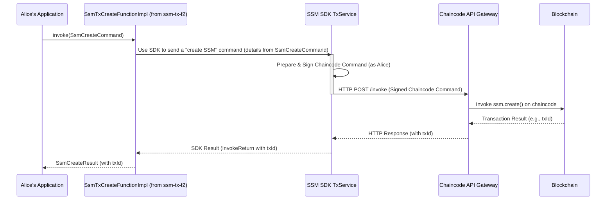

# Chapter 6: SSM Transaction Handling (`ssm-tx-*`)

Welcome back! In [Chapter 5: Fabric Interaction Layer (`chaincode-api-fabric`)](05_fabric_interaction_layer___chaincode_api_fabric___.md), we explored the "engine room" that allows our system to talk directly to the Hyperledger Fabric blockchain. We saw how it handles the nitty-gritty of network communication.

Now, let's zoom back out a bit. While the [SSM SDK (Software Development Kit)](04_ssm_sdk__software_development_kit__.md) offers a great toolkit for developers to build and send commands to the blockchain, some common tasks like setting up a new type of contract (an SSM blueprint) or registering users involve several steps or specific command structures. Wouldn't it be nice to have pre-packaged "action plans" for these common operations?

That's exactly what the **SSM Transaction Handling (`ssm-tx-*`)** modules provide! Think of them as the "Action Department" of our SSM system. If you want to create a new SSM blueprint, register a user, start a session, or perform an action, `ssm-tx-*` offers specialized, high-level functions to get these jobs done easily.

## The Goal: Simplifying Common "Write" Operations

Imagine you're an administrator, Alice, responsible for setting up new digital contract processes in your organization.
1.  First, Alice needs to **define a new contract template** (an SSM blueprint), say for "Expense Approvals."
2.  Next, she needs to **register her colleague, Bob, as a user** who can participate in these "Expense Approvals," perhaps as an "Employee" who submits expenses.

While Alice could use the [SSM SDK (Software Development Kit)](04_ssm_sdk__software_development_kit__.md) to construct the underlying chaincode commands, sign them, and send them, `ssm-tx-*` aims to make these common transactional operations even simpler by wrapping them in dedicated [F2 Functions (Functional Facades)](02_f2_functions__functional_facades__.md).

## What are `ssm-tx-*` Modules?

The `ssm-tx-*` modules are all about the **command side** of SSM interactions – operations that change data or state on the blockchain. Key ideas:

1.  **Specialized F2 Functions for Transactions:**
    Just like we learned about [F2 Functions (Functional Facades)](02_f2_functions__functional_facades__.md) for querying data, `ssm-tx-*` uses the same F2 pattern for *transactional* operations. Each F2 function represents a specific, high-level "business action" you want to perform.

2.  **Focus on "Doing Things":**
    These modules help you:
    *   Create new SSM blueprints (e.g., define the rules for an "Expense Approval" process).
    *   Register users who can participate in SSMs.
    *   Grant roles to users for specific SSMs.
    *   Start new instances (sessions) of an SSM (e.g., Bob starts a new expense approval for his trip).
    *   Perform actions within an ongoing session (e.g., Bob's manager approves his expense).

3.  **Simplified Experience:**
    They provide a cleaner, more direct way to perform these common "write" operations, often by orchestrating one or more calls to the [SSM SDK (Software Development Kit)](04_ssm_sdk__software_development_kit__.md) under the hood.

## Using `ssm-tx-*`: Alice's Tasks Made Easy

Let's see how Alice would use the `ssm-tx-*` functions to define the "ExpenseApproval" SSM and register Bob.

First, Alice's application would need to get access to the F2 functions for these admin tasks. Conceptually, she'd get an object that implements `SsmTxAdminFunctions` (which we'll see more of soon). Let's call this `adminActions`.

```kotlin
// val adminActions: SsmTxAdminFunctions = getAdminActionService()
// For our example, let's assume we have this 'adminActions' object.
```

### 1. Defining the "ExpenseApproval" SSM Blueprint

Alice wants to create a new SSM blueprint. She'll use the `SsmTxCreateFunction` for this.

**The "Order Form" (Input): `SsmCreateCommand`**
She needs to prepare a command object describing the SSM she wants to create.

```kotlin
// Input for creating an SSM blueprint
// (Simplified from ssm.tx.dsl.features.ssm.SsmCreateCommand.kt)
import ssm.chaincode.dsl.model.Ssm // Describes the SSM rules
import ssm.chaincode.dsl.model.SsmTransition

val expenseSsm = Ssm(
    name = "ExpenseApprovalSsm",
    transitions = listOf(
        SsmTransition(from = 0, to = 1, role = "Employee", action = "SubmitExpense"),
        SsmTransition(from = 1, to = 2, role = "Manager", action = "ApproveExpense")
    )
)

val createSsmCommand = SsmCreateCommand(
    chaincodeUri = /* specify target chaincode, e.g., "channel-prod/ssm-v3" */,
    signerName = "Alice", // Alice is performing this admin action
    ssm = expenseSsm
)
```
*   `chaincodeUri`: Tells the system which blockchain and chaincode to target.
*   `signerName`: "Alice" is the administrator creating this.
*   `ssm`: This is the actual blueprint for the "ExpenseApprovalSsm", defining its states (implicitly by `from`/`to` in transitions), roles ("Employee", "Manager"), and actions ("SubmitExpense", "ApproveExpense").

**Placing the Order (Executing the F2 Function):**
Alice's application then calls the F2 function.

```kotlin
// Get the specific F2 function for creating SSMs
// val ssmCreateFunc: SsmTxCreateFunction = adminActions.ssmTxCreateFunction()

// Execute it with the command (this is usually a suspend function)
// val createResult: SsmCreateResult = ssmCreateFunc.invoke(createSsmCommand)
```

**What Happens (Output): `SsmCreateResult`**
If successful, the "ExpenseApprovalSsm" blueprint is created on the blockchain. The `createResult` would typically contain the `transactionId`.

```kotlin
// Output after creating an SSM blueprint
// (Simplified from ssm.tx.dsl.features.ssm.SsmCreateCommand.kt)
// class SsmCreateResult(val transactionId: String)

// println("SSM Blueprint created! Transaction ID: ${createResult.transactionId}")
```
Now, the "ExpenseApprovalSsm" is ready to be used!

### 2. Registering Bob as a User

Next, Alice needs to register Bob. She'd use a function like `SsmTxUserRegisterFunction`.

**The "Order Form" (Input): `SsmTxUserRegisterCommand`** (Conceptual)
This command would specify Bob's details.

```kotlin
// Conceptual command for registering a user
val registerBobCommand = SsmTxUserRegisterCommand(
    chaincodeUri = /* target chaincode */,
    signerName = "Alice",      // Admin Alice is doing this
    username = "Bob",
    publicKey = bob_public_key_bytes // Bob's public key
)
```

**Placing the Order and Getting the Result:**
Similar to creating an SSM, Alice's app would invoke the `SsmTxUserRegisterFunction`.

```kotlin
// val userRegisterFunc = adminActions.ssmTxUserRegisterFunction()
// val registerResult = userRegisterFunc.invoke(registerBobCommand)
// println("User Bob registered! Transaction ID: ${registerResult.transactionId}")
```
Now Bob is a known user in the system and can be assigned roles in SSM sessions.

The `ssm-tx-*` modules also provide functions for other common actions like `SsmTxSessionStartFunction` (to start a new expense approval for Bob) and `SsmTxSessionPerformActionFunction` (for Bob's manager to approve it), each following this F2 pattern of Command -> Function -> Result.

## Under the Hood: How `ssm-tx-*` Works

When Alice's application calls, say, `ssmCreateFunc.invoke(createSsmCommand)`, what's happening behind the scenes?

1.  **F2 Function Execution:** The specific F2 function implementation (e.g., `SsmTxCreateFunctionImpl`) receives the `SsmCreateCommand`.
2.  **SDK Interaction:** This implementation doesn't talk to the blockchain directly. Instead, it uses the services from the [SSM SDK (Software Development Kit)](04_ssm_sdk__software_development_kit__.md), like `SsmTxService`. It translates the `SsmCreateCommand` into the appropriate SDK-level command (e.g., telling the SDK to prepare an "admin:create" chaincode command).
3.  **SDK Does Its Magic:** The [SSM SDK (Software Development Kit)](04_ssm_sdk__software_development_kit__.md) then handles the signing of this chaincode command (using Alice's credentials) and sends it to the [Chaincode API Gateway](03_chaincode_api_gateway_.md).
4.  **Gateway and Blockchain:** The [Chaincode API Gateway](03_chaincode_api_gateway_.md) forwards the request to the blockchain via the [Fabric Interaction Layer (`chaincode-api-fabric`)](05_fabric_interaction_layer___chaincode_api_fabric___.md). The chaincode executes, creating the SSM blueprint.
5.  **Result Propagation:** The blockchain returns a transaction ID. This ID travels back through the Gateway and the SDK to the `SsmTxCreateFunctionImpl`.
6.  **F2 Result:** The F2 function implementation wraps this transaction ID into an `SsmCreateResult` and returns it to Alice's application.

Here's a simplified sequence:



### Diving into the Code Structure

The `ssm-tx-*` functionality is typically split into a few key modules:

1.  **`ssm-tx-dsl` (The "Menu" Definitions):**
    This module defines the interfaces for the F2 transactional functions and their command/result data classes. It tells you *what* actions are available and *what data* they need/return.

    The `build.gradle.kts` for this module shows its foundation:
    ```gradle
    // Simplified from c2-ssm/ssm-tx/ssm-tx-dsl/build.gradle.kts
    dependencies {
        // It uses the basic data models for SSMs
        commonMainApi(project(":c2-ssm:ssm-chaincode:ssm-chaincode-dsl"))
    }
    ```
    This means `ssm-tx-dsl` builds upon the core SSM concepts we learned in [Chapter 1: Signing State Machine (SSM)](01_signing_state_machine__ssm__.md).

    Inside `ssm-tx-dsl`, you'll find files like `SsmTxAdminFunctions.kt`:
    ```kotlin
    // Simplified from ssm.tx.dsl.SsmTxAdminFunctions.kt
    package ssm.tx.dsl
    // ... imports for function types ...
    interface SsmTxAdminFunctions {
        fun ssmTxUserRegisterFunction(): SsmTxUserRegisterFunction // To register users
        fun ssmTxCreateFunction(): SsmTxCreateFunction         // To create SSM blueprints
        // ... other admin functions ...
    }
    ```
    This interface declares that any "Admin Actions" provider must offer these F2 functions.

    And `SsmCreateCommand.kt` defines the specific "order form" and "receipt" for creating an SSM:
    ```kotlin
    // Simplified from ssm.tx.dsl.features.ssm.SsmCreateCommand.kt
    package ssm.tx.dsl.features.ssm
    // ... imports ...
    typealias SsmTxCreateFunction = F2Function<SsmCreateCommand, SsmCreateResult>

    class SsmCreateCommand(
        val chaincodeUri: ChaincodeUriDTO, // Target chaincode
        val signerName: AgentName,
        val ssm: Ssm,                      // The SSM blueprint data
    ) : SsmCommandDTO // Base DTO for SSM commands

    class SsmCreateResult(
        val transactionId: TransactionId
    ) : SsmCommandResultDTO // Base DTO for results
    ```
    This clearly defines the input (`SsmCreateCommand`) and output (`SsmCreateResult`) for the `SsmTxCreateFunction`.

2.  **`ssm-tx-f2` (The "Kitchen Staff" Implementing the Menu):**
    This module provides the actual implementations for the F2 functions defined in `ssm-tx-dsl`. This is where the logic resides that calls the [SSM SDK (Software Development Kit)](04_s_s_m___s_d_k____software__development__kit___.md).

    The `build.gradle.kts` for `ssm-tx-f2` shows its dependencies:
    ```gradle
    // Simplified from c2-ssm/ssm-tx/ssm-tx-f2/build.gradle.kts
    dependencies {
        api(project(":c2-ssm:ssm-tx:ssm-tx-dsl")) // Implements the DSL interfaces

        // It uses the SDK for signing and core transaction sending!
        api(project(":c2-ssm:ssm-sdk:ssm-sdk-sign"))
        api(project(":c2-ssm:ssm-sdk:ssm-sdk-core"))
    }
    ```
    This confirms that `ssm-tx-f2` implementations will use the `ssm-sdk-core` (which contains `SsmTxService`) and `ssm-sdk-sign` for their work.

    Inside `ssm-tx-f2`, you'd find a class (let's call it `SsmTxAdminFunctionsImpl.kt` conceptually) that implements `SsmTxAdminFunctions`:
    ```kotlin
    // Conceptual implementation in ssm-tx-f2
    // class SsmTxAdminFunctionsImpl(
    //     private val ssmTxService: ssm.sdk.core.SsmTxService, // From ssm-sdk-core
    //     private val signerProvider: YourSignerProvider // To get signers
    // ) : SsmTxAdminFunctions {

    //     override fun ssmTxCreateFunction(): SsmTxCreateFunction =
    //         SsmTxCreateFunctionImpl(ssmTxService, signerProvider)

    //     override fun ssmTxUserRegisterFunction(): SsmTxUserRegisterFunction =
    //         SsmTxUserRegisterFunctionImpl(ssmTxService, signerProvider)
    //     // ...
    // }
    ```
    And `SsmTxCreateFunctionImpl.kt` would look something like this:
    ```kotlin
    // Conceptual SsmTxCreateFunctionImpl in ssm-tx-f2
    // class SsmTxCreateFunctionImpl(
    //     private val ssmTxService: ssm.sdk.core.SsmTxService,
    //     private val signerProvider: YourSignerProvider
    // ) : SsmTxCreateFunction {

    //     override suspend fun invoke(cmd: SsmCreateCommand): SsmCreateResult {
    //         val signer = signerProvider.getSigner(cmd.signerName)
    //         // Use the SDK's SsmTxService to send the actual "create ssm" command
    //         val sdkResult: ssm.sdk.dsl.InvokeReturn = ssmTxService.create(
    //             ssm = cmd.ssm,
    //             chaincodeUri = cmd.chaincodeUri.toChaincodeUri(), // Convert DTO
    //             signerName = cmd.signerName
    //             // SDK's create might need more parameters or a specific command object
    //         )
    //         return SsmCreateResult(transactionId = sdkResult.transactionId)
    //     }
    // }
    ```
    This shows the `ssm-tx-*` layer acting as a convenient wrapper around the more general-purpose [SSM SDK (Software Development Kit)](04_s_s_m___s_d_k____software__development__kit___.md).

## Why is `ssm-tx-*` Helpful?

*   **Simplicity:** It offers very high-level functions for common "write" operations, making your application code cleaner and more focused on business logic.
*   **Consistency:** By using [F2 Functions (Functional Facades)](02_f2_functions__functional_facades__.md), it provides a standardized way to perform these transactions.
*   **Reduced Boilerplate:** You write less code for common tasks like creating SSMs or registering users compared to using the SDK directly for everything.
*   **Clarity:** It clearly separates "admin" level transaction functions (like in `SsmTxAdminFunctions`) from regular "user" transaction functions (like `SsmTxUserFunctions`, which includes `SsmTxSessionPerformActionFunction`).

## Conclusion

The SSM Transaction Handling (`ssm-tx-*`) modules are your go-to "Action Department" for common, command-side SSM operations. They provide a set of specialized [F2 Functions (Functional Facades)](02_f2_functions__functional_facades__.md) that simplify tasks like defining SSM blueprints, managing users, and interacting with SSM sessions by building upon the capabilities of the [SSM SDK (Software Development Kit)](04_s_s_m___s_d_k____software__development__kit___.md).

Key Takeaways:
*   `ssm-tx-*` focuses on "write" operations that change state on the blockchain.
*   It uses F2 Functions to provide high-level interfaces for these transactions.
*   It simplifies development by wrapping common sequences of SDK calls.
*   Modules are typically split into `*-dsl` (definitions) and `*-f2` (implementations).

So far, we've seen how to define SSMs, interact with them using F2 functions and SDKs, expose them via an API gateway, connect to Fabric, and simplify common transactions. But what about efficiently querying all this data, especially for complex reports or user interfaces? The blockchain is great for secure transactions, but not always the best for rich queries. In the next chapter, we'll explore [Chapter 7: CouchDB Integration for SSMs](07_couchdb_integration_for_ssms_.md) to see how `fixers-c2` addresses this.

---

Generated by [AI Codebase Knowledge Builder](https://github.com/The-Pocket/Tutorial-Codebase-Knowledge)