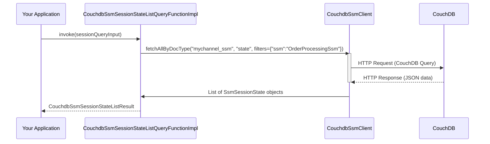

# Chapter 7: CouchDB Integration for SSMs

Welcome back! In [Chapter 6: SSM Transaction Handling (`ssm-tx-*`)](06_ssm_transaction_handling___ssm_tx_____.md), we saw how `fixers-c2` simplifies common "write" operations like creating SSM blueprints or registering users. These operations change data on the blockchain.

But what about reading data? Especially when you need complex reports or want to quickly search through many SSM sessions? Querying the blockchain ledger directly can sometimes be slow or inflexible for these kinds of tasks. This is where CouchDB integration shines!

## The Problem: Needing Faster and Richer Data Access

Imagine your application needs to display a dashboard with:
*   All "SupplyChainProcess" SSM sessions currently in the "GoodsShipped" state.
*   A list of all SSM sessions initiated by a specific user, "SupplierInc."
*   A count of active sessions for each type of SSM blueprint.

While the blockchain is the ultimate source of truth and great for security and auditability, asking it these kinds of complex questions directly can be like searching a massive, chronologically ordered vault for specific details – powerful, but not always quick for every type of search.

We need a more specialized tool for fast and flexible data retrieval.

## CouchDB: Your Super-Organized Filing Cabinet

Hyperledger Fabric, the blockchain technology `fixers-c2` often runs on, has a neat feature: it can use **CouchDB** as its "state database." CouchDB is a type of NoSQL database that stores data as JSON documents.

Think of it this way:
*   **The Blockchain Ledger:** This is your official, tamper-proof, historical record book. Every transaction is permanently recorded here.
*   **CouchDB:** This is like a highly organized, indexed, and instantly searchable **filing cabinet** that sits right next to your record book. It holds the *current status* of all your items (like SSM sessions and their states).

Whenever a transaction updates the state of an SSM session on the blockchain, Hyperledger Fabric automatically updates the corresponding "file" in the CouchDB filing cabinet. This means CouchDB always has an up-to-date snapshot of your data, stored in a way that's very easy to query.

For quick lookups, generating reports, or finding specific data based on various criteria, you can check this super-organized filing cabinet (CouchDB) instead of sifting through the entire historical record book (blockchain ledger) every time.

The `fixers-c2` project provides modules, specifically those starting with `ssm-couchdb-*`, to help your application talk to this CouchDB instance and retrieve SSM-related data efficiently.

## Key Concepts of CouchDB Integration

1.  **State Database:** CouchDB acts as the "world state" database for Hyperledger Fabric. It stores the latest version of all data (like SSM session states).
2.  **Rich Queries:** CouchDB allows you to query your data using a flexible query language (like Mango queries). This means you can search for data based on multiple fields, use ranges, sort results, and more – things that are harder to do directly on the blockchain ledger.
3.  **Performance:** For many read-heavy operations, querying CouchDB is significantly faster than querying the blockchain directly.
4.  **`ssm-couchdb-*` Modules:**
    *   `ssm-couchdb-dsl`: Defines the F2 function interfaces and data structures (the "menu") for querying SSM data from CouchDB.
    *   `ssm-couchdb-f2`: Provides the implementations (the "kitchen staff") for these F2 functions.
    *   `ssm-couchdb-sdk`: Contains the low-level client (`CouchdbSsmClient`) that actually communicates with the CouchDB database.

## Using CouchDB for SSM Queries: An Example

Let's say your application wants to get a list of all available SSM blueprints (like "SupplyChainProcess," "DocumentApproval," etc.) directly from CouchDB. We'll use the F2 function pattern we learned about in [Chapter 2: F2 Functions (Functional Facades)](02_f2_functions__functional_facades__.md).

### 1. Configuration: Pointing to Your CouchDB

First, your application needs to know how to connect to CouchDB. This is done using an `SsmCouchdbConfig` object.

```kotlin
// From: c2-ssm/ssm-couchdb/ssm-couchdb-dsl/src/commonMain/kotlin/ssm/couchdb/dsl/config/SsmCouchdbConfig.kt
import ssm.couchdb.dsl.config.SsmCouchdbConfig

val couchdbConfig = SsmCouchdbConfig(
    url = "http://localhost:5984", // Your CouchDB server address
    username = "admin",
    password = "password",
    serviceName = "my-ssm-couchdb" // A name for this service connection
)
```
This tells the system where your CouchDB is and how to log in.

### 2. Getting the "Menu" (F2 Function Provider)

Next, you'd get an instance of a class that provides the CouchDB query functions. `CouchdbSsmQueriesFunctionImpl` is such a class.

```kotlin
// From: c2-ssm/ssm-couchdb/ssm-couchdb-f2/src/main/kotlin/ssm/couchdb/f2/CouchdbSsmQueriesFunctionImpl.kt
import ssm.couchdb.f2.CouchdbSsmQueriesFunctionImpl
import ssm.couchdb.dsl.SsmCouchDbQueries // The interface it implements

// This object now knows how to create specific F2 functions for CouchDB
val couchdbQueries: SsmCouchDbQueries = CouchdbSsmQueriesFunctionImpl(couchdbConfig)
```

### 3. Selecting the "Menu Item" (Getting the F2 Function)

You want to list SSM blueprints. There's an F2 function for that: `couchdbSsmListQueryFunction`.

```kotlin
import ssm.couchdb.dsl.query.CouchdbSsmListQueryFunction // The F2 function type

// Get the specific function for listing SSM blueprints from CouchDB
val listSsmBlueprintsFunc: CouchdbSsmListQueryFunction =
    couchdbQueries.couchdbSsmListQueryFunction()
```

### 4. Preparing Your "Order" (The Input Object)

For listing all SSM blueprints, the input might be simple. Let's assume `CouchdbSsmListQuery` is the input data class.

```kotlin
import ssm.couchdb.dsl.query.CouchdbSsmListQuery // Input data class

val queryInput = CouchdbSsmListQuery(
    // You might add filters here if needed, e.g., databaseName = "my_channel_ssm"
)
```

### 5. Placing Your "Order" (Executing the Function)

Now, call the function with your input.

```kotlin
import ssm.couchdb.dsl.query.CouchdbSsmListResult // Output data class

// Execute the function (usually a suspend function, run in a coroutine)
// val result: CouchdbSsmListResult = listSsmBlueprintsFunc.invoke(queryInput)
```
*Self-correction: The actual return type for `couchdbSsmListQueryFunction` will contain a list of `SsmDTO` which represents the SSM blueprint.*
The `CouchdbSsmListQuery` would take parameters like `dbName` and the result would be `CouchdbSsmListResult` containing a list of `SsmDTO`.

Let's simplify the example to querying SSM session states, as `couchdbSsmListQueryFunction` (for SSM blueprints) is a bit more abstract for CouchDB (blueprints are usually defined, not "discovered" like states). Let's pivot to listing SSM session states.

**Corrected Example: Listing SSM Session States**

Imagine we want to list all SSM *session states* for a particular SSM blueprint (e.g., all "OrderProcessing" sessions) from a specific Fabric channel's CouchDB database.

1.  **Config & F2 Provider:** (Same as above)
    ```kotlin
    val couchdbConfig = SsmCouchdbConfig(/*...details...*/ url = "http://localhost:5984", username="user", password="pwd", serviceName="s")
    val couchdbQueries: SsmCouchDbQueries = CouchdbSsmQueriesFunctionImpl(couchdbConfig)
    ```

2.  **Select "Menu Item":** `couchdbSsmSessionStateListQueryFunction`
    ```kotlin
    import ssm.couchdb.dsl.query.CouchdbSsmSessionStateListQueryFunction

    val listSessionsFunc: CouchdbSsmSessionStateListQueryFunction =
        couchdbQueries.couchdbSsmSessionStateListQueryFunction()
    ```

3.  **Prepare "Order":** `CouchdbSsmSessionStateListQuery`
    ```kotlin
    import ssm.couchdb.dsl.query.CouchdbSsmSessionStateListQuery

    val sessionQueryInput = CouchdbSsmSessionStateListQuery(
        dbName = "mychannel_ssm", // Fabric channel's CouchDB database name
        ssmName = "OrderProcessingSsm", // Filter by this SSM blueprint
        // page = null, size = null // Optional pagination
    )
    ```
    *   `dbName`: CouchDB databases in Fabric are often named `channelName_chaincodeName`.
    *   `ssmName`: We only want sessions for "OrderProcessingSsm".

4.  **Place "Order":**
    ```kotlin
    import ssm.couchdb.dsl.query.CouchdbSsmSessionStateListResult
    import ssm.chaincode.dsl.model.SsmSessionStateDTO // Data for each session

    // val sessionListResult: CouchdbSsmSessionStateListResult =
    //    listSessionsFunc.invoke(sessionQueryInput)
    ```

5.  **Receive Your "Food" (Using the Output):**
    The `sessionListResult.items` will contain a list of `SsmSessionStateDTO` objects.

    ```kotlin
    // println("Found ${sessionListResult.items.size} 'OrderProcessingSsm' sessions:")
    // sessionListResult.items.forEach { sessionState ->
    //     println("- Session ID: ${sessionState.session}, Current State: ${sessionState.current}")
    // }
    ```
    *Example Output (Conceptual):*
    ```
    Found 2 'OrderProcessingSsm' sessions:
    - Session ID: Order-123, Current State: 1 (e.g., "Created")
    - Session ID: Order-456, Current State: 2 (e.g., "Approved")
    ```
This is much more targeted and potentially faster than trying to extract the same information from the raw blockchain ledger for many sessions.

## Under the Hood: How Does It Work?

When you call `listSessionsFunc.invoke(sessionQueryInput)`:

1.  **F2 Function Call:** The `CouchdbSsmSessionStateListQueryFunctionImpl` (provided by `CouchdbSsmQueriesFunctionImpl`) gets the `sessionQueryInput`.
2.  **Client Invocation:** This F2 implementation uses an internal `CouchdbSsmClient` (from the `ssm-couchdb-sdk` module). It tells the client, "Fetch all documents of type 'state' from database `mychannel_ssm` that also have `ssm: 'OrderProcessingSsm'`."
3.  **CouchDB Query:** The `CouchdbSsmClient` constructs a query understandable by CouchDB (likely a Mango query or a view query) and sends it over HTTP to your CouchDB server.
4.  **CouchDB Responds:** CouchDB processes the query and sends back the matching JSON documents.
5.  **Result Mapping:** The `CouchdbSsmClient` receives the JSON and maps it into the `SsmSessionStateDTO` objects.
6.  **F2 Result:** The F2 function returns the `CouchdbSsmSessionStateListResult` containing these objects to your application.

Here's a simplified sequence diagram:



### Diving into Key Code Components

1.  **Configuration (`SsmCouchdbConfig.kt`):**
    As seen earlier, this data class simply holds the connection details for CouchDB.

    ```kotlin
    // From: c2-ssm/ssm-couchdb/ssm-couchdb-dsl/config/SsmCouchdbConfig.kt
    data class SsmCouchdbConfig(
        val url: String,         // e.g., "http://localhost:5984"
        val username: String,
        val password: String,
        val serviceName: String
    )
    ```
    This configuration is vital for the `CouchdbSsmClient` to connect.

2.  **F2 Implementation Provider (`CouchdbSsmQueriesFunctionImpl.kt`):**
    This class is responsible for creating and providing the actual F2 function implementations. It initializes a `CouchdbSsmClient` using the provided configuration.

    ```kotlin
    // Simplified from: c2-ssm/ssm-couchdb/ssm-couchdb-f2/CouchdbSsmQueriesFunctionImpl.kt
    class CouchdbSsmQueriesFunctionImpl(
        config: SsmCouchdbConfig
    ) : SsmCouchDbQueries { // Interface defining all CouchDB query F2s

        private val couchdbClient = CouchdbSsmClient.builder() // Builds the client
            .withUrl(config.url)
            .withName(config.serviceName)
            .withAuth(SsmCouchDbBasicAuth(config.username, config.password))
            .build()

        override fun couchdbSsmSessionStateListQueryFunction(): CouchdbSsmSessionStateListQueryFunction {
            // Returns an object that knows how to list session states using couchdbClient
            return CouchdbSsmSessionStateListQueryFunctionImpl(couchdbClient)
        }
        // ... other F2 function providers ...
    }
    ```
    When you ask for `couchdbSsmSessionStateListQueryFunction()`, it gives you an instance of `CouchdbSsmSessionStateListQueryFunctionImpl` that is pre-configured with a working `couchdbClient`.

3.  **The CouchDB Client (`CouchdbSsmClient.kt`):**
    This is the workhorse from the `ssm-couchdb-sdk` module. It uses the IBM Cloudant Java SDK (which is compatible with CouchDB) to send queries.

    ```kotlin
    // Simplified from: c2-ssm/ssm-couchdb/ssm-couchdb-sdk/client/CouchdbSsmClient.kt
    class CouchdbSsmClient(
        val cloudant: CloudantFixed, // The IBM Cloudant/CouchDB client library
        private val converter: JSONConverter // For converting JSON to Kotlin objects
    ) {
        // Generic function to fetch documents based on their 'docType' and other filters
        fun <T : Any> fetchAllByDocType(
            dbName: String,
            docType: DocType<T>, // e.g., DocType("state", SsmSessionStateDTO::class)
            filters: Map<String, String> = emptyMap()
        ): List<T> {
            val selector = mapOf("docType" to mapOf("\$eq" to docType.name))
                .plus(filters) // Adds filters like {"ssm": "OrderProcessingSsm"}

            val findOptions = PostFindOptions.Builder() // IBM SDK object
                .db(dbName)
                .selector(selector) // This is the CouchDB Mango query part
                .limit(Long.MAX_VALUE) // Get all matching documents
                .build()

            val result: Response<FindResult> = cloudant.postFind(findOptions).execute()

            // Convert JSON documents from CouchDB into Kotlin objects
            return result.result.docs.mapNotNull { document ->
                converter.toObject(docType.clazz.java, document.toString())
            }
        }
        // ... other methods for more specific queries or managing CouchDB views/indexes ...
    }
    ```
    This client abstracts the complexities of the underlying IBM SDK, providing simpler methods like `fetchAllByDocType`. It constructs CouchDB queries (selectors) and processes the results.

4.  **Dependencies (`ssm-couchdb-dsl/build.gradle.kts`):**
    The DSL module, which defines the "menu" for CouchDB queries, relies on the core SSM definitions.

    ```gradle
    // From: c2-ssm/ssm-couchdb/ssm-couchdb-dsl/build.gradle.kts
    dependencies {
        // It needs to know about SSM structures like SsmSessionStateDTO
        commonMainApi(project(":c2-ssm:ssm-chaincode:ssm-chaincode-dsl"))
    }
    ```
    This ensures that the data structures used in CouchDB queries are consistent with the main SSM definitions.

## Benefits of Using CouchDB

*   **Speed:** Querying CouchDB is often much faster for complex reads than querying the blockchain ledger.
*   **Flexibility:** CouchDB's query language (especially Mango queries) is powerful, allowing for sophisticated searches and data aggregation.
*   **Reduced Load on Peers:** Offloading complex queries to CouchDB can reduce the processing load on your Hyperledger Fabric peers.
*   **Easier Reporting:** Building reports and dashboards becomes simpler when you can query a database optimized for such tasks.

## Conclusion

Integrating CouchDB as a state database in Hyperledger Fabric provides a powerful way to enhance the querying capabilities for your SSM data. The `ssm-couchdb-*` modules in `fixers-c2` give you the tools (F2 functions and an SDK client) to easily tap into this "super-organized filing cabinet," enabling faster and more flexible data retrieval than relying solely on direct blockchain queries for all read operations.

Key Takeaways:
*   CouchDB can serve as Fabric's state database, offering a queryable JSON store of current states.
*   This allows for rich, fast queries on SSM data.
*   `ssm-couchdb-*` modules provide DSL, F2 implementations, and an SDK client for this.
*   You use F2 functions (e.g., `couchdbSsmSessionStateListQueryFunction`) to easily query CouchDB.

While querying the blockchain directly or via CouchDB gives you access to specific pieces of data, sometimes you need a higher-level view that combines information from multiple sources or provides even more complex data aggregations. In the next chapter, we'll explore the [Chapter 8: SSM Data Layer (`ssm-data-*`)](08_ssm_data_layer___ssm_data_____.md), which often builds upon these lower-level query capabilities.

---

Generated by [AI Codebase Knowledge Builder](https://github.com/The-Pocket/Tutorial-Codebase-Knowledge)