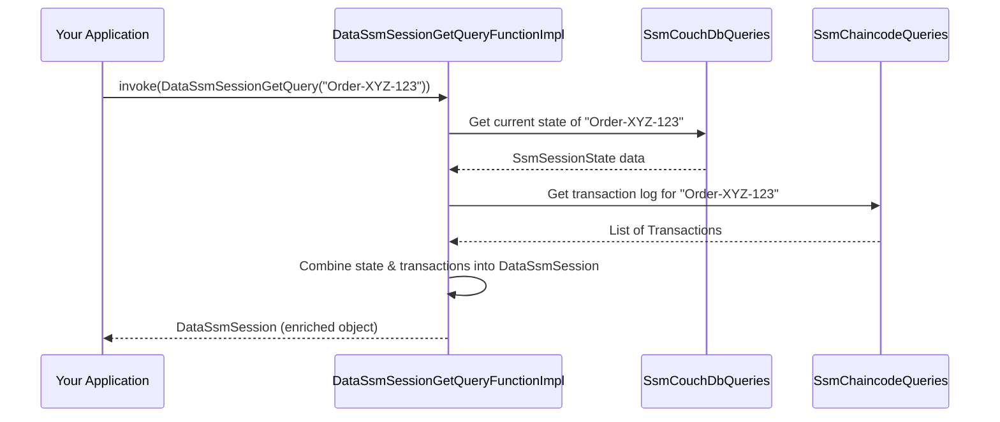

# Chapter 8: SSM Data Layer (`ssm-data-*`)

Welcome to the final chapter of our core concepts tour! In [Chapter 7: CouchDB Integration for SSMs](07_couchdb_integration_for_ssms_.md), we learned how `fixers-c2` uses CouchDB to provide fast and flexible queries for the *current state* of your SSM sessions. This is incredibly useful for many scenarios.

But what if you need a more complete picture? What if you want to see not just the current state, but also details about the SSM blueprint itself, and maybe the history of transactions that led to the current state, all in one neat package? Querying CouchDB gives you one piece of the puzzle, and direct chaincode queries (from the blockchain ledger) give you another. How do we bring them together?

This is where the **SSM Data Layer (`ssm-data-*`)** steps in!

## The Analyst: Turning Raw Data into Rich Insights

Imagine a financial analyst. This analyst gathers:
1.  **Raw company filings:** These are like the detailed, historical records on the blockchain ledger. They tell you every official action a company has taken.
2.  **Current market data:** This is like the up-to-date information in CouchDB, showing the company's current stock price or market capitalization.

Neither of these raw data sources alone gives the full story. The analyst's job is to take information from *both* sources, process it, combine it, and produce **comprehensive reports** that offer much deeper insights than either raw source could provide on its own.

The **SSM Data Layer (`ssm-data-*`)** acts like this financial analyst for your SSM data. It:
*   **Gathers data** from both the blockchain ledger (via chaincode queries) and CouchDB.
*   **Combines and enriches** this information.
*   **Presents it through higher-level data models** and queries that give you a more holistic view.

**Use Case:** Your application needs to display a detailed page for an "Order-XYZ-123" SSM session. This page should show:
*   The name and rules of the "SupplyChainProcess" SSM blueprint it's following.
*   The current status, like "Goods Shipped."
*   Who the "Supplier" and "Shipper" are for this specific order.
*   A list of all actions taken on this order so far (e.g., "Order Created," "Goods Shipped").

The `ssm-data-*` layer helps you get all this information in a convenient way.

## Key Concepts

1.  **Aggregated View:**
    The core idea is to combine information. For a single SSM session, this layer might fetch its current state from CouchDB (for speed) and its transaction history or defining SSM blueprint details from the blockchain ledger (for completeness and auditability).

2.  **Enriched Data Models:**
    This layer introduces new, richer data models. Instead of just getting a raw `SsmSessionState` (from CouchDB or ledger) or a raw `Ssm` blueprint, you get models like:
    *   `DataSsm`: Represents an SSM blueprint (`Ssm`) along with metadata like the channel it's on.
    *   `DataSsmSession`: Represents an SSM session, but it includes not just the current state (`DataSsmSessionStateDTO`), but also details about the SSM blueprint it belongs to (`ssmUri`), the channel, and potentially the list of transactions (`transactions`) that built its history.

3.  **Higher-Level Queries (F2 Functions):**
    Just like other layers, `ssm-data-*` uses [F2 Functions (Functional Facades)](02_f2_functions__functional_facades__.md). However, these F2 functions are more powerful because they orchestrate calls to *multiple* underlying query services – some to CouchDB, some to the chaincode.

## Using the `ssm-data-*` Layer: Getting the Full Story

Let's see how our application can get that comprehensive view of "Order-XYZ-123" using an F2 function from the `ssm-data-*` layer.

### 1. Configuration: Knowing Where to Look

The `ssm-data-*` layer needs to know how to talk to *both* CouchDB and the chaincode. So, its configuration, `DataSsmConfig`, includes configurations for both.

```kotlin
// From: c2-ssm/ssm-data/ssm-data-dsl/src/commonMain/kotlin/ssm/data/dsl/config/DataSsmConfig.kt
import ssm.chaincode.dsl.config.SsmBatchProperties
import ssm.chaincode.dsl.config.SsmChaincodeProperties
import ssm.couchdb.dsl.config.SsmCouchdbConfig

val dataConfig = DataSsmConfig(
    batch = SsmBatchProperties(/*...batching details...*/),
    couchdb = SsmCouchdbConfig(/*...CouchDB URL, user, pass...*/),
    chaincode = SsmChaincodeProperties(/*...API Gateway URL...*/)
)
```
This `dataConfig` tells the data layer everything it needs to access the underlying data sources.

### 2. Getting the "Analyst" (F2 Function Provider)

We need an F2 function provider for the data layer. `DataSsmQueryFunctionImpl` is the class that does this.

```kotlin
// From: c2-ssm/ssm-data/ssm-data-f2/src/main/kotlin/ssm/api/DataSsmQueryFunctionImpl.kt
import ssm.api.DataSsmQueryFunctionImpl // The implementation
import ssm.data.dsl.SsmApiQueryFunctions // The interface

// This 'dataLayerQueries' object can provide various data-layer F2 functions
val dataLayerQueries: SsmApiQueryFunctions =
    DataSsmQueryFunctionImpl(dataConfig)
```

### 3. Asking for a Specific "Report" (Getting the F2 Function)

We want details about a specific SSM session. The F2 function for this is `dataSsmSessionGetQueryFunction`.

```kotlin
import ssm.data.dsl.features.query.DataSsmSessionGetQueryFunction

// Get the function to fetch a detailed SSM session
val getSessionDetailsFunc: DataSsmSessionGetQueryFunction =
    dataLayerQueries.dataSsmSessionGetQueryFunction()
```

### 4. Specifying the "Subject" (The Input Object)

We need to tell the function which session we're interested in. The input is `DataSsmSessionGetQuery`.

```kotlin
import ssm.data.dsl.features.query.DataSsmSessionGetQuery
import ssm.chaincode.dsl.model.uri.ChaincodeUri

val sessionQueryInput = DataSsmSessionGetQuery(
    sessionName = "Order-XYZ-123",
    chaincodeUri = ChaincodeUri("sandbox/ssm") // Where the SSM lives
)
```

### 5. Receiving the "Comprehensive Report" (The Output)

Now, we execute the function and get back our enriched data.

```kotlin
import ssm.data.dsl.model.DataSsmSession // The enriched output model

// Execute the function (usually a suspend function)
// val detailedSession: DataSsmSession? =
//    getSessionDetailsFunc.invoke(sessionQueryInput)

// if (detailedSession != null) {
//    println("SSM Blueprint: ${detailedSession.ssmUri.ssmName}")
//    println("Session ID: ${detailedSession.sessionName}")
//    println("Current State Iteration: ${detailedSession.state.iteration}")
//    println("Public Data: ${detailedSession.state.public}")
//    println("Transaction History Count: ${detailedSession.transactions.size}")
// }
```
*Example Output (Conceptual):*
```
SSM Blueprint: SupplyChainProcess
Session ID: Order-XYZ-123
Current State Iteration: 2
Public Data: {item: "Laptop", status: "Shipped", shippingId: "SH123"}
Transaction History Count: 2
```
Notice how `detailedSession` (a `DataSsmSession` object) can give you much more than just the current state. It knows about the SSM URI (linking to the blueprint) and can even include the full list of transactions if requested and implemented that way.

## Under the Hood: The Analyst at Work

When you call `getSessionDetailsFunc.invoke(sessionQueryInput)`, the "analyst" (the `DataSsmSessionGetQueryFunctionImpl`) gets busy:

1.  **Initial Query (Often CouchDB):** It might first ask the `SsmCouchDbQueries` (from [Chapter 7: CouchDB Integration for SSMs](07_couchdb_integration_for_ssms_.md)) to fetch the current state of "Order-XYZ-123" from CouchDB. This is fast for getting the latest status.
2.  **Follow-up Queries (Chaincode):** Then, it might use `SsmChaincodeQueries` (from [Chapter 2: F2 Functions (Functional Facades)](02_f2_functions__functional_facades__.md)) to:
    *   Fetch the transaction log for "Order-XYZ-123" from the blockchain ledger to get its history.
    *   Potentially fetch details of the "SupplyChainProcess" SSM blueprint if needed.
3.  **Combine and Enrich:** The function implementation takes all this data – the current state, the transaction history, blueprint info – and combines it into a single, rich `DataSsmSession` object.
4.  **Return Result:** This comprehensive `DataSsmSession` object is returned to your application.

**Simplified Sequence Diagram:**



### Diving into the Code Structure

Let's look at the key pieces that make this data aggregation possible.

1.  **Enriched Data Models (`DataSsm.kt`, `DataSsmSession.kt`):**
    These models are defined in `ssm-data-dsl` and are designed to hold more information.

    `DataSsm.kt`: Represents an SSM blueprint with its context.
    ```kotlin
    // Simplified from: c2-ssm/ssm-data/ssm-data-dsl/src/commonMain/kotlin/ssm/data/dsl/model/DataSsm.kt
    import ssm.chaincode.dsl.model.Ssm // The core blueprint
    import ssm.chaincode.dsl.model.uri.SsmUri // URI of the SSM

    class DataSsm(
        val uri: SsmUri,       // Where this SSM blueprint is defined
        val ssm: Ssm,          // The actual SSM rules
        val channel: DataChannel, // Channel info (not shown in detail)
        /* ... other metadata ... */
    )
    ```
    This `DataSsm` is richer than just the raw `Ssm` object because it includes its `uri` and `channel`.

    `DataSsmSession.kt`: Represents a session with its state and context.
    ```kotlin
    // Simplified from: c2-ssm/ssm-data/ssm-data-dsl/src/commonMain/kotlin/ssm/data/dsl/model/DataSsmSession.kt
    import ssm.chaincode.dsl.model.SessionName
    import ssm.chaincode.dsl.model.uri.SsmUri
    import ssm.chaincode.dsl.blockchain.TransactionDTO // Transaction details

    class DataSsmSession(
        val ssmUri: SsmUri,             // Which SSM blueprint it follows
        val sessionName: SessionName,   // The session's unique name
        val state: DataSsmSessionStateDTO, // Current state (can be enriched)
        val transactions: List<TransactionDTO>, // History!
        /* ... other metadata like channel ... */
    )
    ```
    This `DataSsmSession` is much more comprehensive, notably including `transactions`.

2.  **Dependencies (`ssm-data-dsl/build.gradle.kts`):**
    The `ssm-data-dsl` module, which defines these enriched models and F2 interfaces, relies on both CouchDB DSL and Chaincode DSL.
    ```gradle
    // From: c2-ssm/ssm-data/ssm-data-dsl/build.gradle.kts
    dependencies {
        // Needs CouchDB definitions (for session states, etc.)
        commonMainApi(project(":c2-ssm:ssm-couchdb:ssm-couchdb-dsl"))
        // Needs Chaincode definitions (for Ssm, Transaction, etc.)
        commonMainApi(project(":c2-ssm:ssm-chaincode:ssm-chaincode-dsl"))
    }
    ```
    This shows that the data layer is designed to build upon both underlying data sources.

3.  **F2 Implementation Provider (`DataSsmQueryFunctionImpl.kt`):**
    This class from `ssm-data-f2` is crucial. It takes the `DataSsmConfig` and initializes *both* an `SsmChaincodeQueries` instance and an `SsmCouchDbQueries` instance. These are then used by its F2 function implementations.

    ```kotlin
    // Simplified from: c2-ssm/ssm-data/ssm-data-f2/src/main/kotlin/ssm/api/DataSsmQueryFunctionImpl.kt
    import ssm.chaincode.dsl.SsmChaincodeQueries
    import ssm.couchdb.dsl.SsmCouchDbQueries
    import ssm.data.dsl.config.DataSsmConfig

    class DataSsmQueryFunctionImpl(
        private val config: DataSsmConfig,
        // Dependency: Chaincode query provider
        private val ssmChaincodeQueries: SsmChaincodeQueries = /* build from config.chaincode */,
        // Dependency: CouchDB query provider
        private val couchDbSsmQueries: SsmCouchDbQueries = /* build from config.couchdb */
    ) : SsmApiQueryFunctions { // Implements all data-layer query F2s

        override fun dataSsmSessionGetQueryFunction(): DataSsmSessionGetQueryFunction {
            // This impl will use BOTH ssmChaincodeQueries AND couchDbSsmQueries
            return DataSsmSessionGetQueryFunctionImpl(
                ssmChaincodeQueries.ssmGetSessionQueryFunction(), // For some data
                dataSsmSessionConvertFunctionImpl() // Helper to combine
            )
        }
        // ... other F2 function providers using one or both underlying query services ...

        private fun dataSsmSessionConvertFunctionImpl(): DataSsmSessionConvertFunctionImpl {
            // This helper often uses ssmChaincodeQueries to fetch logs/transactions
            return DataSsmSessionConvertFunctionImpl(
                ssmChaincodeQueries.ssmGetSessionLogsQueryFunction(),
                ssmChaincodeQueries.ssmGetTransactionQueryFunction()
            )
        }
    }
    ```
    The key here is that `DataSsmQueryFunctionImpl` has access to *both* ways of querying data (chaincode and CouchDB) and can use them together in its F2 functions like `DataSsmSessionGetQueryFunctionImpl`. The `DataSsmSessionConvertFunctionImpl` is a helper often used to fetch transaction logs from chaincode and combine them with session state (potentially from CouchDB).

## Why is the SSM Data Layer Useful?

*   **Holistic View:** It provides a single place to get a comprehensive understanding of your SSMs and their sessions.
*   **Simplified Client Logic:** Your application doesn't need to make multiple calls to different services (CouchDB, chaincode) and then try to piece the data together. The data layer does this heavy lifting.
*   **Richer Data Models:** The `DataSsm` and `DataSsmSession` models are more convenient and informative for application development.
*   **Optimized Data Fetching (Potentially):** The layer can be smart about where it gets data (e.g., current state from fast CouchDB, historical/definitive data from the ledger).

## Conclusion

The SSM Data Layer (`ssm-data-*`) acts as your intelligent data aggregator for `fixers-c2`. By combining information from both the blockchain ledger (via direct chaincode queries) and the CouchDB state database, it provides enriched data models and higher-level queries. This gives your applications a more complete and convenient way to access and understand the full context of your Signing State Machines and their sessions.

Key Takeaways:
*   The `ssm-data-*` layer aggregates data from both chaincode and CouchDB.
*   It offers enriched data models like `DataSsm` and `DataSsmSession`.
*   Its F2 functions orchestrate calls to underlying chaincode and CouchDB query services.
*   This layer simplifies application development by providing a unified, comprehensive data view.

This concludes our journey through the core architectural concepts of `fixers-c2`! From understanding the fundamental [Signing State Machine (SSM)](01_signing_state_machine__ssm__.md) to seeing how the SSM Data Layer provides rich, aggregated views, you now have a solid foundation for how `fixers-c2` manages complex, multi-party processes with transparency, verifiability, and auditable history. We hope this tour helps you as you start building or working with applications using `fixers-c2`!

---

Generated by [AI Codebase Knowledge Builder](https://github.com/The-Pocket/Tutorial-Codebase-Knowledge)