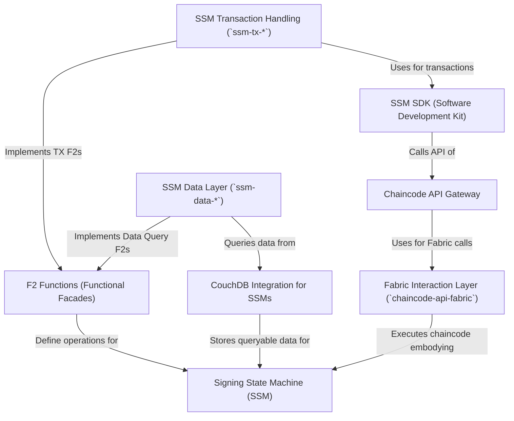

# Tutorial: fixers-c2

This project, `fixers-c2`, implements a framework for **Signing State Machines (SSMs)**.
SSMs are *digital workflows* where multiple parties can securely and verifiably change shared data according to predefined rules.
Each step requires *digital signatures*, and the whole process runs on a **Hyperledger Fabric blockchain**.
The system provides a **REST API Gateway** for external applications to interact with these SSMs, along with **SDKs** and various layers to manage data, transactions, and integration with **CouchDB** for rich queries.

**Source Repository:** [https://github.com/komune-io/fixers-c2](https://github.com/komune-io/fixers-c2)

## Chapters

1. [Signing State Machine (SSM)
](01_signing_state_machine__ssm__.md)
2. [F2 Functions (Functional Facades)
](02_f2_functions__functional_facades__.md)
3. [Chaincode API Gateway
](03_chaincode_api_gateway_.md)
4. [SSM SDK (Software Development Kit)
](04_ssm_sdk__software_development_kit__.md)
5. [Fabric Interaction Layer (`chaincode-api-fabric`)
](05_fabric_interaction_layer___chaincode_api_fabric___.md)
6. [SSM Transaction Handling (`ssm-tx-*`)
](06_ssm_transaction_handling___ssm_tx_____.md)
7. [CouchDB Integration for SSMs
](07_couchdb_integration_for_ssms_.md)
8. [SSM Data Layer (`ssm-data-*`)
](08_ssm_data_layer___ssm_data_____.md)

---

Generated by [AI Codebase Knowledge Builder](https://github.com/The-Pocket/Tutorial-Codebase-Knowledge)