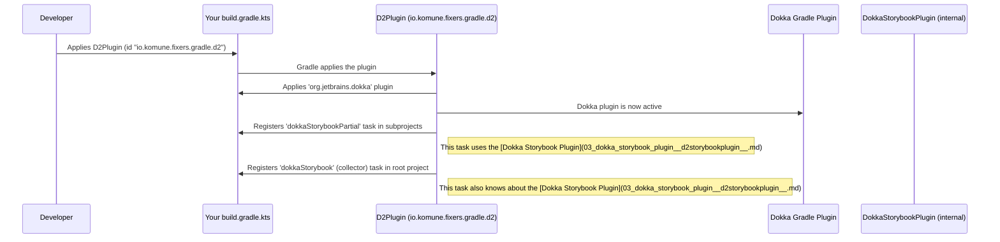

# Chapter 1: Gradle Plugin (D2Plugin for Fixers)

Welcome to the `fixers-d2` tutorial! If you're looking to create beautiful, diagram-based documentation from your Kotlin code with minimal fuss, you're in the right place. This first chapter introduces the cornerstone of this process: the **Gradle Plugin (D2Plugin for Fixers)**.

## What's the Big Deal? Why Do I Need a Plugin?

Imagine you're building an awesome Kotlin application. You want to explain its architecture, how different parts connect, or visualize a specific user flow. You could draw these diagrams manually in an external tool, but what if your code changes? Your diagrams become outdated, fast!

This is where D2 comes in – a language for describing diagrams as text. And `fixers-d2` aims to integrate D2 seamlessly into your Kotlin development workflow.

**The Problem:** Setting up any new tool in a project, especially one that involves code analysis (like reading your comments) and generating documentation, can be a bit fiddly. You might need to:
*   Tell your build system (Gradle, in our case) about new tools.
*   Configure how these tools work together.
*   Define new tasks to run the documentation generation.

**The Solution: `D2Plugin for Fixers`**
Think of this plugin as your **"D2 Easy Setup Button"**. It's a special tool for Gradle (the build system commonly used with Kotlin) that takes care of all the complicated setup for you. When you "apply" this plugin to your Kotlin project, it automatically:

1.  Sets up **Dokka**, the official documentation engine for Kotlin.
2.  Integrates the **[Dokka Storybook Plugin (D2StorybookPlugin)](03_dokka_storybook_plugin__d2storybookplugin__.md)**, which is the magic component that understands D2 and generates interactive storybook-style documentation.
3.  Configures the necessary Gradle build tasks (like a special task called `dokkaStorybook`) so you can generate your D2 documentation with a simple command.

With this plugin, you can spend less time wrestling with build configurations and more time writing your awesome Kotlin code and the D2 descriptions within your KDoc comments!

## How Do I Use This "Easy Setup Button"?

Using the `D2Plugin` is straightforward. You just need to tell Gradle to use it in your project's `build.gradle.kts` file.

Typically, you'll add it to the `plugins` block:

```kotlin
// In your project's build.gradle.kts
plugins {
    // ... other plugins like kotlin("jvm") ...
    id("io.komune.fixers.gradle.d2")
}
```
**What this does:**
This line tells Gradle to find and apply the `D2Plugin`. Once applied, it works behind the scenes to configure everything needed for D2 documentation.

After applying the plugin, you'll have new Gradle tasks available. The most important one is `dokkaStorybook`. You can run it from your terminal:

```bash
./gradlew dokkaStorybook
```

**What happens when you run `dokkaStorybook`?**
Gradle will:
1.  Compile your Kotlin code.
2.  Run Dokka to analyze your code and KDoc comments (we'll talk more about [D2 KDoc Tags (e.g., @d2, @visual, @parent)](02_d2_kdoc_tags__e_g____d2___visual___parent__.md) in the next chapter).
3.  Use the [Dokka Storybook Plugin (D2StorybookPlugin)](03_dokka_storybook_plugin__d2storybookplugin__.md) to process any D2-related information and generate D2 diagram definitions and HTML pages.
4.  Place the generated documentation into a specific output folder, often `storybook/stories/d2` or `build/d2` within your project.

That's it! No manual wiring of Dokka, no complex task definitions from your side.

## What's Happening Under the Hood? (A Peek Inside)

While you don't *need* to know the nitty-gritty details to use the plugin, a little insight can be helpful.

When you apply the `D2Plugin`:

1.  **Dokka is Invited:** The plugin first ensures that the standard `org.jetbrains.dokka` plugin is also applied to your project. Dokka is the foundation for generating documentation from Kotlin code.
2.  **Configuration Helper:** It often applies another plugin, `ConfigPlugin` from the Fixers family, which helps standardize some common project configurations.
3.  **Partial Tasks for Modules:** If you have a multi-module project (a project with sub-projects), the `D2Plugin` is smart about it. For each subproject, it sets up a task usually named `dokkaStorybookPartial`. This task is responsible for generating D2 documentation *just for that specific module*. This partial task is configured to use the [Dokka Storybook Plugin (D2StorybookPlugin)](03_dokka_storybook_plugin__d2storybookplugin__.md).
4.  **The Master Collector Task:** In your main (root) project, the plugin sets up the main `dokkaStorybook` task. This task is a "collector" – it doesn't do the documentation generation itself but tells Gradle to run all the `dokkaStorybookPartial` tasks from the root project and all subprojects.
5.  **Output Destination:** The `dokkaStorybook` task is then configured to gather all the outputs from the partial tasks and place them into a final, consolidated directory (e.g., `storybook/stories/d2`).

Here's a simplified sequence of what happens:



### A Glimpse at the Plugin's Code

Let's look at a tiny, simplified snippet from the `D2Plugin.kt` file itself. This is the code that makes the magic happen.

*(File: `fixers-plugin/src/main/kotlin/io/komune/d2/fixers/gradle/D2Plugin.kt`)*

```kotlin
// Simplified for clarity
class D2Plugin : Plugin<Project> {
    override fun apply(target: Project) {
        // 1. Make sure Dokka is available
        target.plugins.apply("org.jetbrains.dokka")

        // 2. For each subproject, prepare a "partial" D2 documentation task
        target.subprojects {
            tasks.register<org.jetbrains.dokka.gradle.DokkaTask>("dokkaStorybookPartial") {
                // Tell Dokka to use our special D2 storybook plugin
                dependencies {
                    plugins("io.komune.d2:dokka-storybook-plugin:VERSION") // Version is resolved automatically
                }
                // Set where this subproject's D2 files go temporarily
                outputDirectory.set(file("build/d2"))
            }
        }

        // 3. After Gradle understands the project structure...
        target.afterEvaluate {
            // Create the main "collecting" task
            target.tasks.register<org.jetbrains.dokka.gradle.DokkaCollectorTask>("dokkaStorybook") {
                // Include partial tasks from root and subprojects
                addChildTask("dokkaStorybookPartial")
                addSubprojectChildTasks("dokkaStorybookPartial")
                // Set the final output directory for all D2 stories
                // outputDirectory.set( /* configured path, e.g., storybook/stories/d2 */ )
            }
        }
    }
}
```

**Explanation of the snippet:**

1.  `target.plugins.apply("org.jetbrains.dokka")`: This line programmatically applies the official Dokka plugin.
2.  `target.subprojects { ... }`: This block iterates through any subprojects your main project might have.
3.  `tasks.register<...>("dokkaStorybookPartial")`: Inside each subproject (and the root project implicitly for its own sources), it registers a Dokka task named `dokkaStorybookPartial`.
    *   `plugins("io.komune.d2:dokka-storybook-plugin:VERSION")`: This is crucial! It tells this Dokka task to use the [Dokka Storybook Plugin (D2StorybookPlugin)](03_dokka_storybook_plugin__d2storybookplugin__.md), which is responsible for understanding D2 tags and generating the Storybook format.
    *   `outputDirectory.set(file("build/d2"))`: Sets a temporary output location for this partial task.
4.  `target.afterEvaluate { ... }`: This ensures the main `dokkaStorybook` task is set up after Gradle has fully evaluated the project structure.
5.  `tasks.register<...>("dokkaStorybook")`: This registers the main collector task.
    *   `addChildTask(...)` and `addSubprojectChildTasks(...)`: These lines tell the main `dokkaStorybook` task that it depends on all the `dokkaStorybookPartial` tasks. When you run `dokkaStorybook`, all these partial tasks run first.
    *   The final `outputDirectory` (commented out for brevity in the snippet) would point to where all collected D2 stories should be placed, often `storybook/stories/d2`. This path can be configured.

The plugin itself is defined and made available through Gradle's plugin mechanism. In `fixers-plugin/build.gradle.kts`, you'd find:

```kotlin
// In fixers-plugin/build.gradle.kts
gradlePlugin {
    plugins {
        create("io.komune.fixers.gradle.d2") {
            id = "io.komune.fixers.gradle.d2" // This is the ID you use in your project
            implementationClass = "io.komune.d2.fixers.gradle.D2Plugin" // The main class of the plugin
            displayName = "Fixers Gradle d2"
            // ... other metadata ...
        }
    }
}
```
This block declares the plugin, giving it an `id` that users can apply in their `build.gradle.kts` files and specifying the `implementationClass` that Gradle should instantiate.

## Conclusion

You've now met the `D2Plugin for Fixers`! It's your friendly assistant that automates the setup of D2 documentation generation in your Kotlin projects. By simply applying this plugin, you unlock the power to create D2 diagrams directly from your code comments, with Gradle handling all the underlying complexity of invoking Dokka and the specialized [Dokka Storybook Plugin (D2StorybookPlugin)](03_dokka_storybook_plugin__d2storybookplugin__.md).

With the setup out of the way, you're probably wondering how to actually *tell* `fixers-d2` what to diagram. That's where special KDoc tags come into play.

Ready to dive into writing those tags? Let's move on to [Chapter 2: D2 KDoc Tags (e.g., @d2, @visual, @parent)](02_d2_kdoc_tags__e_g____d2___visual___parent__.md).

---

Generated by [AI Codebase Knowledge Builder](https://github.com/The-Pocket/Tutorial-Codebase-Knowledge)