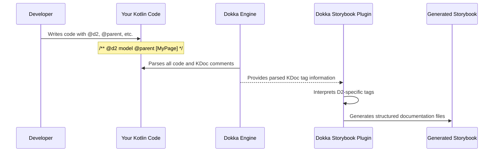

# Chapter 2: D2 KDoc Tags (e.g., @d2, @visual, @parent)

In [Chapter 1: Gradle Plugin (D2Plugin for Fixers)](01_gradle_plugin__d2plugin_for_fixers__.md), we saw how the `D2Plugin` acts as an "Easy Setup Button" to prepare your project for D2 documentation. It gets everything ready, but how do you actually *tell* the system what to document and how it should look? That's where D2 KDoc Tags come in!

## What Are D2 KDoc Tags? Your Instructions to the Documentation Engine

Imagine you're writing a book. You wouldn't just throw all your text onto pages randomly. You'd have chapters, sections, maybe some diagrams or highlighted examples. D2 KDoc tags are like special instructions, or custom sticky notes, that you write directly inside your Kotlin code's KDoc comments (the `/** ... */` blocks).

These tags tell `fixers-d2` things like:
*   "Hey, this piece of code represents a main documentation page!"
*   "This data class should be shown as a 'model' in the docs."
*   "I want to display a JSON example for this model."
*   "This section should appear under that main page."

Without these tags, `fixers-d2` wouldn't know which parts of your code are important for documentation, how to structure them, or how to visualize them. They are the primary way you, the developer, control the final documentation output.

## Meet the Key "Sticky Notes" (D2 KDoc Tags)

Let's get to know some of the most common D2 KDoc tags. Remember, these tags are generally **case-insensitive**, so `@d2` is the same as `@D2`.

*   `@d2 [type]`: This is the star of the show! It marks a Kotlin class, interface, or function as a "Documentable" – something that should be part of your D2 documentation. The `[type]` tells `fixers-d2` *what kind* of documentable it is.
    *   Common types: `page`, `model`, `function`, `section`, `api`. We'll see examples soon!

*   `@title [Your Title Here]`: This tag lets you give a nice, human-friendly title to your documentation element. If you don't provide one, a default title (often based on the Kotlin element's name) will be used.

*   `@parent [AnotherDocumentableName]`: This tag creates structure! It tells `fixers-d2` that the current documentable belongs *inside* another one. For example, a `model` might be a `@parent` of a `page`. The `[AnotherDocumentableName]` usually refers to another Kotlin element that's also tagged with `@d2`. You'll often see this written as `@[AnotherDocumentableClassName]` using KDoc's link syntax.

*   `@visual [type] [optional_details]`: This tag controls how a documentable (especially models or functions) is visually represented.
    *   `@visual json`: "Show an example JSON representation."
    *   `@visual automate path/to/diagram.json`: "Render an S2 automate state machine diagram from this file."
    *   `@visual none`: "Don't show any special visual for this."

*   `@example [value or reference]`: Used mainly on properties within a class (like a `data class`). It provides an example value for that property. This is super helpful when used with `@visual json`, as these examples populate the generated JSON.
    *   `@example "Hello World"`
    *   `@example 123`
    *   `@example [AnotherPropertyToCopyExampleFrom]`

There are other useful tags like `@order` (to control the display order of items), `@child` (an alternative to `@parent`), `@ref` (to reuse descriptions/examples), and `@default` (to specify default values for properties). You can find more details about them in the project's main README. For now, let's focus on the core ones.

## Putting Tags to Work: A Simple Story

Let's say we're building an application that manages "To-Do Items." We want to create documentation for this feature.

**Our Goal:**
1.  Create a main documentation page titled "To-Do Management."
2.  Describe the `TodoItem` data structure as a "model" under this page.
3.  Show a JSON example of what a `TodoItem` looks like.

**Step 1: Defining the Documentation Page**

We often use an empty interface or class as an "anchor" for documentation elements like pages or sections, as they don't always correspond directly to a complex piece of code.

```kotlin
// File: TodoDocs.kt

/**
 * This page covers everything related to managing To-Do items
 * in our application.
 *
 * @d2 page
 * @title To-Do Management
 */
interface TodoPage // This empty interface is our anchor for the page
```
**Explanation:**
*   `/** ... */`: This is a standard KDoc comment block.
*   `@d2 page`: This "sticky note" tells `fixers-d2`: "Treat the `TodoPage` interface as a top-level documentation page."
*   `@title To-Do Management`: This sets the title that will appear for this page in the generated Storybook.

**Step 2: Defining the `TodoItem` Data Model**

Now, let's define our `TodoItem` data class and tell `fixers-d2` about it.

```kotlin
// File: TodoItem.kt

/**
 * Represents a single task or to-do item.
 *
 * @d2 model
 * @title To-Do Item Data
 * @parent [TodoPage] // Link this model to our TodoPage
 * @visual json        // We want to see a JSON example
 */
data class TodoItem(
    /**
     * A unique ID for the to-do item.
     * @example "todo-abc-123"
     */
    val id: String,

    /**
     * The description of the task.
     * @example "Buy groceries"
     */
    val task: String,

    /**
     * Whether the task has been completed.
     * @example false
     */
    val isDone: Boolean
)
```
**Explanation:**
*   `@d2 model`: This marks `TodoItem` as a "model" documentable.
*   `@title To-Do Item Data`: Sets a custom title for this section of the documentation.
*   `@parent [TodoPage]`: This is crucial for structure! It tells `fixers-d2` that the documentation for `TodoItem` should appear *under* the "To-Do Management" page we defined with `TodoPage`. The `[TodoPage]` syntax is a KDoc link pointing to our `TodoPage` interface.
*   `@visual json`: We're asking for a JSON representation of this model.
*   `@example "todo-abc-123"` (and similar tags on `task` and `isDone`): These provide the sample data that will be used to construct the JSON example requested by `@visual json`.

**What will this produce (conceptually)?**

When `fixers-d2` processes this, you'd get a Storybook page titled "To-Do Management." On that page, there would be a section titled "To-Do Item Data," which would describe the `TodoItem` model and show a JSON example like this:

```json
{
  "id": "todo-abc-123",
  "task": "Buy groceries",
  "isDone": false
}
```

See how these simple "sticky notes" guide the entire process?

## How Does `fixers-d2` Understand These Tags? (A Peek Under the Hood)

You write these tags, run a Gradle command, and magic happens! But what's going on behind the scenes?

1.  **You Write Code & Tags:** You add your D2 KDoc tags to your Kotlin code, just like in the `TodoItem` example.
2.  **Gradle Task Execution:** You run the `dokkaStorybook` Gradle task (which we learned about in [Chapter 1: Gradle Plugin (D2Plugin for Fixers)](01_gradle_plugin__d2plugin_for_fixers__.md)).
3.  **Dokka Scans Your Code:** Dokka, Kotlin's official documentation engine, gets to work. It parses all your Kotlin files, including the KDoc comments and the special tags within them.
4.  **The D2 Specialist Steps In:** This is where the [Dokka Storybook Plugin (D2StorybookPlugin)](03_dokka_storybook_plugin__d2storybookplugin__.md) comes into play. This plugin is specifically designed to look for KDoc tags like `@d2`, `@parent`, `@visual`, etc. It acts as an interpreter for your "sticky notes."
5.  **Building the Documentation:** The [Dokka Storybook Plugin (D2StorybookPlugin)](03_dokka_storybook_plugin__d2storybookplugin__.md) uses the information from these tags to understand the desired structure, content, and visualizations for your documentation. It then generates the necessary files for Storybook.

Here's a simplified view of that flow:



## A Tiny Glimpse at the Plugin's Code

You don't need to write this code, but seeing a simplified version can help understand how it works.

**1. Recognizing Your Tags:**
When Dokka encounters a custom KDoc tag (like `@d2`), the [Dokka Storybook Plugin (D2StorybookPlugin)](03_dokka_storybook_plugin__d2storybookplugin__.md) needs to figure out what it is. There's code that looks at the tag's name:

```kotlin
// Simplified concept from dokka-storybook-plugin/src/main/kotlin/d2/dokka/storybook/model/doc/tag/D2DocTagWrapper.kt

// 'tagFromDokka' is what Dokka gives us for a KDoc tag.
// 'name' would be "d2", "parent", "visual", etc.
fun interpretD2Tag(name: String, tagFromDokka: Any): Any? { // Any is used for simplicity
    return when (name.lowercase()) {
        "d2" -> ParsedD2Tag(tagFromDokka)
        "parent" -> ParsedParentTag(tagFromDokka)
        "visual" -> ParsedVisualTag(tagFromDokka)
        "title" -> ParsedTitleTag(tagFromDokka)
        // ... and so on for other D2 tags
        else -> null // It's not a D2 tag we care about
    }
}
```
This code essentially says, "If the tag name is 'd2', treat it as our special D2 instruction. If it's 'parent', treat it as a Parent instruction."

**2. Defining What Each Tag Means:**
The plugin also has definitions for the *types* you can use with tags. For example, for `@d2 type`, the `type` can be `page`, `model`, etc. These are often defined using Kotlin `enum` classes.

Here's a very simplified `D2Type` enum, inspired by `dokka-storybook-plugin/src/main/kotlin/d2/dokka/storybook/model/doc/tag/D2.kt`:

```kotlin
// Simplified concept from D2.kt
enum class D2Type(val id: String, val order: Int) {
    PAGE("page", 0),        // A documentation page, shown first
    MODEL("model", 10),     // A data model, shown after pages
    FUNCTION("function", 20), // A function, shown after models
    // ... other types like SECTION, API, etc.
    ; // Semicolon for enums with companions or methods

    companion object {
        // Helper to get the D2Type from the text in KDoc (e.g., "page")
        fun get(id: String): D2Type? = values().find { it.id == id.lowercase() }
    }
}
```
This `D2Type` enum lists all valid types for the `@d2` tag (like `@d2 page`). The `order` can be used to sort different types of documentation elements.

Similarly, for `@visual type`:

```kotlin
// Simplified concept from Visual.kt
enum class VisualType(val id: String) {
    JSON("json"),           // Show as JSON
    AUTOMATE("automate"),   // Show as an S2 Automate state machine diagram
    NONE("none"),           // Show no specific visual
    // ... other visual types like KOTLIN, YAML
    ;

    companion object {
        // Helper to get the VisualType from the text in KDoc (e.g., "json")
        fun get(id: String): VisualType? = values().find { it.id == id.lowercase() }
    }
}
```
This `VisualType` enum lists valid types for the `@visual` tag (e.g., `@visual json`).

These internal Kotlin representations (like `ParsedD2Tag` or `D2Type`) are crucial. They allow the [Dokka Storybook Plugin (D2StorybookPlugin)](03_dokka_storybook_plugin__d2storybookplugin__.md) to systematically process all your "sticky notes" and build the documentation exactly how you've instructed. We'll learn more about how the plugin uses these representations in [Chapter 5: Documentable Representation & D2DocTagExtra](05_documentable_representation___d2doctagextra__.md).

## Conclusion

You've now learned about the power of D2 KDoc tags! They are your direct line of communication to `fixers-d2`, allowing you to precisely define the structure, content, and appearance of your documentation right within your Kotlin code. Tags like `@d2`, `@parent`, `@title`, and `@visual` transform your code comments into rich, interactive documentation.

With the project setup from Chapter 1 and your newfound knowledge of KDoc tags, you're well on your way. But which component is actually doing all the heavy lifting of reading these tags and generating the Storybook output? That's the job of the plugin we've mentioned a few times.

Let's dive into [Chapter 3: Dokka Storybook Plugin (D2StorybookPlugin)](03_dokka_storybook_plugin__d2storybookplugin__.md) to understand its role.

---

Generated by [AI Codebase Knowledge Builder](https://github.com/The-Pocket/Tutorial-Codebase-Knowledge)