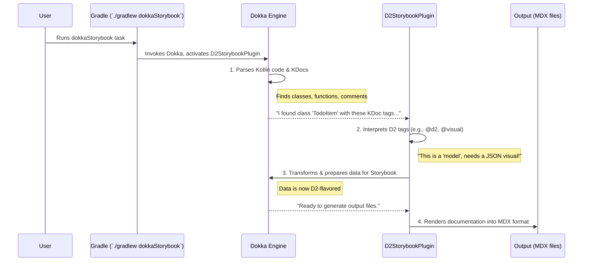

# Chapter 3: Dokka Storybook Plugin (D2StorybookPlugin)

In the previous chapters, we saw how the [Gradle Plugin (D2Plugin for Fixers)](01_gradle_plugin__d2plugin_for_fixers__.md) sets up your project (Chapter 1) and how you use [D2 KDoc Tags (e.g., @d2, @visual, @parent)](02_d2_kdoc_tags__e_g____d2___visual___parent__.md) to mark up your Kotlin code for documentation (Chapter 2). But how does your Kotlin code, with those special `@d2` tags, actually get turned into beautiful Storybook pages? What's the magic ingredient that understands your instructions and performs the transformation?

Meet the **Dokka Storybook Plugin (D2StorybookPlugin)** – the heart of the `fixers-d2` documentation generation process.

## What's the D2StorybookPlugin? The Engine Behind the Scenes

Imagine you have a recipe for a cake (your Kotlin code with D2 KDoc tags) and a pile of ingredients (your raw code and comments). You also have a general-purpose kitchen machine (that's Dokka, Kotlin's official documentation engine).

**The Problem:** Your general-purpose kitchen machine (Dokka) knows how to mix, bake, and chop, but it doesn't know your *specific* cake recipe. It doesn't automatically know how to make *your* D2-flavored Storybook cake.

**The Solution: `D2StorybookPlugin`**
The `D2StorybookPlugin` is like a specialized attachment or a detailed instruction manual for your Dokka machine. It tells Dokka:
1.  "Hey Dokka, when you see these special `@d2` tags in the comments, pay attention!"
2.  "Here's what those tags mean (e.g., `@d2 page` means create a main page, `@visual json` means show a JSON example)."
3.  "Take the code information and these tag instructions, and transform them in this specific way."
4.  "Finally, output everything as MDX files, which Storybook loves to read and display."

So, the **D2StorybookPlugin is the core engine** that customizes Dokka to understand D2-specific annotations and produce Storybook-compatible documentation. Without it, Dokka would just generate standard Kotlin documentation, not the D2-enhanced Storybook experience.

## How Does It Fit In?

Let's revisit our `TodoItem` example from [Chapter 2: D2 KDoc Tags (e.g., @d2, @visual, @parent)](02_d2_kdoc_tags__e_g____d2___visual___parent__.md):

```kotlin
// File: TodoItem.kt
/**
 * Represents a single task or to-do item.
 * @d2 model
 * @parent [TodoPage]
 * @visual json
 */
data class TodoItem(
    /** @example "todo-abc-123" */
    val id: String,
    /* ... other properties ... */
)
```

1.  **You run `./gradlew dokkaStorybook`**: As we learned in [Chapter 1: Gradle Plugin (D2Plugin for Fixers)](01_gradle_plugin__d2plugin_for_fixers__.md), this command kicks off the process. The `D2Plugin` ensures Dokka is run with our `D2StorybookPlugin` activated.
2.  **Dokka Scans Your Code**: Dokka, being the general documentation engine, parses `TodoItem.kt`. It sees the class, its properties, and its KDoc comments.
3.  **D2StorybookPlugin Takes Over**:
    *   It spots the `@d2 model`, `@parent [TodoPage]`, and `@visual json` tags.
    *   It understands these are special instructions for `fixers-d2`.
    *   It guides Dokka to process `TodoItem` not just as a data class, but as a "model" to be documented under a "TodoPage", with a JSON visual.
4.  **Output**: The plugin then directs Dokka to generate an MDX file. This file will contain the description of `TodoItem`, its properties, and the generated JSON example, all structured for Storybook.

The `D2StorybookPlugin` isn't something you typically configure directly in your `build.gradle.kts` for simple use cases. The [Gradle Plugin (D2Plugin for Fixers)](01_gradle_plugin__d2plugin_for_fixers__.md) handles its inclusion automatically. Its presence is what enables the entire D2 documentation workflow.

## What's Happening Under the Hood? A Peek Inside Dokka

Dokka itself is a powerful, pluggable system. When it generates documentation, it goes through several stages. The `D2StorybookPlugin` "plugs into" these stages to customize the output.

Here's a simplified flow:



The `D2StorybookPlugin` isn't one giant piece of code; it's a collection of specialized components that hook into Dokka:

*   **Transformers**: These modify Dokka's understanding of your code based on D2 tags. We'll explore these in [Chapter 4: Documentable Transformers](04_documentable_transformers_.md).
*   **Page Creators**: These decide how to structure the documentation into pages and sections. See [Chapter 6: Page Generation & Structuring (D2StorybookPageCreator)](06_page_generation___structuring__d2storybookpagecreator__.md).
*   **Renderers**: These take the processed information and write it out in the final format (MDX for Storybook). More on this in [Chapter 7: Content Rendering to Storybook (D2StorybookRenderer)](07_content_rendering_to_storybook__d2storybookrenderer__.md).

### A Glimpse at the Plugin's Structure

Let's look at a highly simplified snippet from the `D2StorybookPlugin.kt` file itself. This shows how it tells Dokka to use its custom parts.

*(File: `dokka-storybook-plugin/src/main/kotlin/d2/dokka/storybook/D2StorybookPlugin.kt`)*

```kotlin
// Simplified for clarity
import org.jetbrains.dokka.CoreExtensions
import org.jetbrains.dokka.plugability.DokkaPlugin
// ... other imports ...

class D2StorybookPlugin : DokkaPlugin() {

    // Tell Dokka to use our custom renderer for output
    val renderer by extending {
        CoreExtensions.renderer providing ::D2StorybookRenderer // Our custom renderer
        // ... potentially overriding other renderers ...
    }

    // Tell Dokka to use our custom transformer for D2 tags
    val docTagExtractor by extending {
        CoreExtensions.documentableTransformer with DocTagWrapperExtractorTransformer()
        // ... order it after other transformers if needed ...
    }

    // Tell Dokka to use our custom translator to create pages
    val documentableToPageTranslator by extending {
        CoreExtensions.documentableToPageTranslator providing
                ::D2StorybookDocumentableToPageTranslator
        // ... potentially overriding other translators ...
    }
}
```
**Explanation of the snippet:**

*   `class D2StorybookPlugin : DokkaPlugin()`: This declares our class as a plugin that Dokka can recognize.
*   `extending { ... }`: This is Dokka's way of allowing plugins to add or change functionality.
*   `CoreExtensions.renderer providing ::D2StorybookRenderer`: This line says, "Hey Dokka, when it's time to render documentation, use my `D2StorybookRenderer`." This renderer is responsible for creating MDX files, and we'll learn more about it in [Chapter 7: Content Rendering to Storybook (D2StorybookRenderer)](07_content_rendering_to_storybook__d2storybookrenderer__.md).
*   `CoreExtensions.documentableTransformer with DocTagWrapperExtractorTransformer()`: This adds a custom "transformer" to Dokka's process. Transformers can modify the data Dokka has collected about your code. This specific one, `DocTagWrapperExtractorTransformer`, is crucial for pulling out and processing our `@d2`, `@visual`, etc., tags. We'll dive into transformers in [Chapter 4: Documentable Transformers](04_documentable_transformers_.md).
*   `CoreExtensions.documentableToPageTranslator providing ::D2StorybookDocumentableToPageTranslator`: This tells Dokka to use our custom logic for deciding how documented elements (like classes and functions) should be organized into documentation pages. This is covered in [Chapter 6: Page Generation & Structuring (D2StorybookPageCreator)](06_page_generation___structuring__d2storybookpagecreator__.md).

The `D2StorybookPlugin` acts as a central coordinator, registering these different specialized components with Dokka at the right extension points. This ensures that when Dokka processes your project, our D2-specific logic is applied at each relevant step.

## Why Is This Important for Me as a User?

While you don't interact with the `D2StorybookPlugin`'s code directly, understanding its role is key:

*   **It's the "magic"**: It explains *how* your D2 KDoc tags lead to Storybook documentation.
*   **Troubleshooting**: If something goes wrong, knowing this plugin is the bridge between your KDocs and the output can help pinpoint where to look.
*   **Appreciation**: It highlights the power of Dokka's plugin system, which `fixers-d2` leverages to provide a tailored documentation experience.

Essentially, the `D2StorybookPlugin` is the specialized tool that `fixers-d2` provides to make Dokka speak "D2-flavored Storybook."

## Conclusion

You've now been introduced to the **Dokka Storybook Plugin (D2StorybookPlugin)**, the core engine of `fixers-d2`. It's a specialized plugin for Dokka that interprets your D2 KDoc tags and orchestrates the transformation of your Kotlin code into Storybook-ready MDX files. It achieves this by plugging in custom components for transforming data, creating pages, and rendering content.

Now that we know about this central plugin, how does it actually start processing the information from your code and KDoc tags? One of its first jobs is to transform Dokka's raw understanding of your code.

Let's explore this in the next chapter: [Chapter 4: Documentable Transformers](04_documentable_transformers_.md).

---

Generated by [AI Codebase Knowledge Builder](https://github.com/The-Pocket/Tutorial-Codebase-Knowledge)