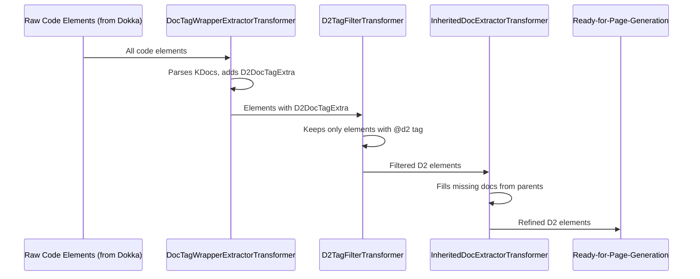

# Chapter 4: Documentable Transformers

In [Chapter 3: Dokka Storybook Plugin (D2StorybookPlugin)](03_dokka_storybook_plugin__d2storybookplugin__.md), we learned that the `D2StorybookPlugin` is the engine that powers our D2 documentation generation. It takes your Kotlin code and KDoc tags and turns them into Storybook pages. But how does it refine the raw information from your code before creating those pages? This is where Documentable Transformers come into play.

## The "Assembly Line" for Your Code's Data

Imagine Dokka (Kotlin's documentation engine) initially scans your entire project. It finds every class, function, and property. This is like having a big pile of all components for a car. Not all components are needed for *every* car model, and some components might need special processing.

**Documentable Transformers** are like specialized stations on an assembly line. As Dokka's understanding of your code (represented as "Documentable" objects) passes through this line, each transformer performs a specific task:
*   One station might **filter out** parts that aren't needed for the current documentation.
*   Another station might **add extra information** to a part, like parsing special instructions (your D2 KDoc tags!).
*   Yet another might **borrow details** from a similar, more complete part if the current one is missing something.

These transformers work sequentially, preparing and refining the data so that the final documentation is exactly what you intended.

## Key Transformers in `fixers-d2`

Let's meet some of the important transformers used by the [Dokka Storybook Plugin (D2StorybookPlugin)](03_dokka_storybook_plugin__d2storybookplugin__.md):

### 1. `DocTagWrapperExtractorTransformer`: The KDoc Tag Detective

*   **Job**: This transformer is like a detective that carefully reads all the KDoc comments on your code elements (classes, functions, etc.). Its main task is to find all the D2-specific KDoc tags (like `@d2`, `@visual`, `@parent`) that you wrote.
*   **How it helps**: It doesn't just find them; it parses them into a structured format and neatly packages this information. This package is attached to the code element's data, usually in a special property called `D2DocTagExtra`. We'll learn more about `D2DocTagExtra` in [Chapter 5: Documentable Representation & D2DocTagExtra](05_documentable_representation___d2doctagextra__.md).
*   **Input (Conceptual)**: A raw code element (a "Documentable") with its KDoc comments.
    ```kotlin
    /**
     * My awesome class.
     * @d2 page
     * @title My Page
     */
    class MyAwesomeClass
    ```
*   **Output (Conceptual)**: The same code element, but now with an internal "bag" (`D2DocTagExtra`) holding structured information about the `@d2 page` and `@title "My Page"` tags.

### 2. `D2TagFilterTransformer`: The `@d2` Gatekeeper

*   **Job**: This transformer acts as a gatekeeper. It only allows code elements that are explicitly marked with a `@d2` tag to pass through to the next stage of documentation generation.
*   **How it helps**: Your project might have many classes and functions, but you probably only want to document a subset of them using `fixers-d2`. This transformer ensures that only the elements you've identified with `@d2` are considered for the D2 Storybook. It looks for the information prepared by the `DocTagWrapperExtractorTransformer`.
*   **Input (Conceptual)**: A list of all code elements, some with parsed `@d2` tags (thanks to the previous transformer), some without.
*   **Output (Conceptual)**: A shorter list containing *only* the code elements that had a `@d2` tag. Elements without it are discarded for D2 documentation purposes.

### 3. `InheritedDocExtractorTransformer`: The Documentation Helper

*   **Job**: Sometimes, you might write documentation for a base class or an interface, and then create several subclasses or implementing classes. You might not want to repeat the same documentation everywhere. This transformer is a helper that can automatically pull in documentation from parent classes or interfaces if a current element's documentation is missing.
*   **How it helps**: It reduces redundancy and helps keep your documentation DRY (Don't Repeat Yourself). If a subclass doesn't have its own KDoc, but its parent class does, this transformer can copy the parent's documentation to the subclass.
*   **Input (Conceptual)**: A code element (that made it past the `D2TagFilterTransformer`) which might have empty KDocs, but its parent class/interface has documentation.
    ```kotlin
    // Parent with docs
    /** Base description. */
    interface BaseDescribable {}

    // Child without docs
    class SpecificItem : BaseDescribable {}
    ```
*   **Output (Conceptual)**: The `SpecificItem` element might now have "Base description." as its documentation, inherited from `BaseDescribable`.

## The Transformer Assembly Line in Action

These transformers don't work in isolation. They form a pipeline where the output of one becomes the input for the next.



This sequence ensures that by the time the data is ready for page generation (which we'll see in [Chapter 6: Page Generation & Structuring (D2StorybookPageCreator)](06_page_generation___structuring__d2storybookpagecreator__.md)), it's clean, relevant, and enriched.

## Under the Hood: How Dokka Uses Transformers

Dokka is designed to be extensible. It has specific "extension points" where plugins like the [Dokka Storybook Plugin (D2StorybookPlugin)](03_dokka_storybook_plugin__d2storybookplugin__.md) can inject custom logic. `DocumentableTransformer` is one such extension point.

The `D2StorybookPlugin` registers these custom transformers. When Dokka processes your project, it invokes these transformers at the appropriate stage.

Let's peek at simplified versions of what these transformers might look like internally.

**1. `DocTagWrapperExtractorTransformer`** (from `DocTagWrapperExtractorTransformer.kt`)

This transformer iterates through documentables and uses a helper to extract D2 tags.

```kotlin
// Simplified from d2/dokka/storybook/transformer/documentable/DocTagWrapperExtractorTransformer.kt
import org.jetbrains.dokka.model.Documentable
// ... other imports ...

class DocTagWrapperExtractorTransformer: DocumentableTransformer {
    override fun invoke(original: DModule, context: DokkaContext): DModule {
        // Recursively go through the module, packages, classes, etc.
        return original.withD2DocTagExtras()
    }

    private fun DModule.withD2DocTagExtras() = copy(
        // Attach extracted D2 tags to this module
        extra = extra + this.toD2DocTagExtra(),
        // And do the same for all packages inside
        packages = packages.map { it.withD2DocTagExtras() }
        // ... similar logic for classes, functions, properties ...
    )

    private fun Documentable.toD2DocTagExtra(): D2DocTagExtra {
        // 1. Get all KDoc tags from the Documentable
        val kdocTags = this.documentation.docTagWrappers()
        // 2. Create and return our special D2DocTagExtra bag
        return D2DocTagExtra(kdocTags.d2DocTagWrappers)
    }
}
```
*   `invoke`: This is the main method Dokka calls. It starts the process of adding `D2DocTagExtra` to everything.
*   `withD2DocTagExtras()`: A helper function (shown for `DModule`) that adds the extracted tags and calls itself for nested elements.
*   `toD2DocTagExtra()`: This crucial part (simplified here) reads the KDoc comments from a `Documentable` and converts them into a `D2DocTagExtra` object. This object holds the parsed D2 tags like `@d2`, `@parent`, etc.

**2. `D2TagFilterTransformer`** (from `D2TagFilterTransformer.kt`)

This transformer checks for the presence of a `@d2` tag (which would have been parsed by the previous transformer).

```kotlin
// Simplified from d2/dokka/storybook/transformer/documentable/D2TagFilterTransformer.kt
import d2.dokka.storybook.model.doc.D2DocTagExtra // Our special bag for D2 tags
import d2.dokka.storybook.model.doc.tag.D2        // Represents the @d2 tag
// ... other imports ...

class D2TagFilterTransformer: DocumentableTransformer {
    override fun invoke(original: DModule, context: DokkaContext): DModule {
        // Go through packages and their contents, keeping only D2-tagged ones
        val taggedPackages = original.packages.mapNotNull { pkg ->
            pkg.onlyD2TaggedElementsInPackage() // Custom logic to filter
        }
        return original.copy(packages = taggedPackages)
    }

    private fun DPackage.onlyD2TaggedElementsInPackage(): DPackage? {
        val taggedClassLikes = this.classlikes.filter { it.isTaggedWithD2() }
        // ... filter other elements like typealiases ...

        // If nothing in this package is D2-tagged, maybe remove the package
        if (taggedClassLikes.isEmpty() /* && other lists are empty */) return null
        return this.copy(classlikes = taggedClassLikes /*, ... */)
    }

    private fun Documentable.isTaggedWithD2(): Boolean {
        // 1. Look for the D2DocTagExtra bag (added by the previous transformer)
        val d2Extra = (this as? WithExtraProperties<Documentable>)?.extra?.get(D2DocTagExtra)
        // 2. Check if this bag contains a parsed @d2 tag
        return d2Extra?.firstTagOfTypeOrNull<D2>() != null
    }
}
```
*   `invoke` and `onlyD2TaggedElementsInPackage`: These methods iterate through code elements.
*   `isTaggedWithD2()`: This is where the magic happens. It checks if a `Documentable` has the `D2DocTagExtra` (put there by `DocTagWrapperExtractorTransformer`) and if that extra data contains an actual `@d2` tag (represented by the `D2` class). If not, the element is filtered out.

**3. `InheritedDocExtractorTransformer`** (from `InheritedDocExtractorTransformer.kt`)

This transformer looks at an element's documentation. If it's empty, it tries to find documentation from its supertypes (parent classes/interfaces).

```kotlin
// Simplified from d2/dokka/storybook/transformer/documentable/InheritedDocExtractorTransformer.kt
import org.jetbrains.dokka.model.DProperty // Represents a property
// ... other imports ...

class InheritedDocExtractorTransformer: DocumentableTransformer {
    override fun invoke(original: DModule, context: DokkaContext): DModule {
        // Build a map of all documentables for quick lookup
        val docMap = original.generateDocumentableMap()
        return original.appendInheritedDocsRecursively(docMap)
    }

    // Simplified recursive helper (actual implementation is more complex)
    private fun DProperty.appendInheritedDocsRecursively(
        docMap: Map<DRI, Documentable>
    ): DProperty {
        // If current property has no documentation...
        if (this.documentation.isEmptyDoc()) {
            // ...try to find documentation from its parent/supertype.
            val parentDoc = findParentDocumentation(this, docMap)
            if (parentDoc != null) {
                return this.copy(documentation = parentDoc) // Use parent's documentation
            }
        }
        return this
    }
    // Placeholder for complex logic to find documentation from supertypes
    private fun findParentDocumentation(
        prop: DProperty,
        docMap: Map<DRI, Documentable>
    ): SourceSetDependent<DocumentationNode>? {
        // Actual logic involves looking up supertypes in docMap
        // and checking their corresponding properties for documentation.
        // For simplicity, we'll say it returns null here.
        return null
    }
}
```
*   `invoke`: Sets up a map of all documentables for easy access and then starts the recursive process.
*   `appendInheritedDocsRecursively` (highly simplified for a `DProperty`): Checks if the current element (e.g., a property) has documentation.
*   If documentation is missing (`isEmptyDoc()`), `findParentDocumentation` (a conceptual stand-in for more complex logic) would attempt to locate documentation from its supertypes using the `docMap`. If found, the element is updated with the inherited documentation.

These examples are simplified, but they illustrate the core idea: each transformer takes the `Documentable` objects, inspects or modifies them, and passes them along. This step-by-step refinement is crucial for `fixers-d2` to generate accurate and well-structured documentation.

## Conclusion

Documentable Transformers are the unsung heroes working behind the scenes in the [Dokka Storybook Plugin (D2StorybookPlugin)](03_dokka_storybook_plugin__d2storybookplugin__.md). They act like an assembly line, processing your code's information step-by-step:
1.  Extracting and parsing your D2 KDoc tags.
2.  Filtering out elements not relevant for D2 documentation.
3.  Enriching elements by inheriting documentation from parents.

This ensures that the data fed into the later stages of page creation and rendering is precisely what's needed.

But what exactly does this "data" look like after these transformations? What is a "Documentable," and how does it hold all this information, including our parsed D2 tags in `D2DocTagExtra`?

Let's explore this in [Chapter 5: Documentable Representation & D2DocTagExtra](05_documentable_representation___d2doctagextra__.md).

---

Generated by [AI Codebase Knowledge Builder](https://github.com/The-Pocket/Tutorial-Codebase-Knowledge)