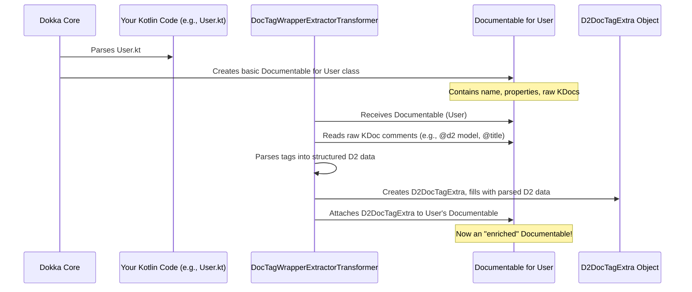

# Chapter 5: Documentable Representation & D2DocTagExtra

In [Chapter 4: Documentable Transformers](04_documentable_transformers_.md), we saw how special "transformers" process your code information, extracting D2 KDoc tags and filtering elements. But once these tags are extracted, where does this information go? How does Dokka (and our `fixers-d2` plugin) keep track of everything it knows about a class or function, including all the D2-specific instructions you've provided?

This chapter dives into the heart of how Dokka stores this information, introducing two key concepts: **Documentable** and **`D2DocTagExtra`**.

## The Problem: Storing Structured Code Information

Imagine you're a librarian trying to catalog books. For each book, you need to record its title, author, ISBN, publication date, and maybe a summary. You'd create a catalog card or a database entry for each book.

Dokka faces a similar challenge. When it processes your Kotlin code, it needs a way to store all the details about each element (like a class, function, or property) in a structured way.
*   What's its name?
*   What are its KDoc comments?
*   Is it public or private?
*   And crucially for `fixers-d2`, what `@d2` tags did the user write for it?

This structured "data sheet" is essential for any further processing, like deciding how to display it in the final documentation.

## What is a "Documentable"? Dokka's Data Sheet

When Dokka processes your code, for every element like a class, function, or property, it creates an internal data structure. This structure is generically called a **"Documentable"**.

Think of a Documentable as Dokka's **detailed profile or data sheet** for a specific piece of your code.
For a Kotlin class like `data class User(val name: String)`, its Documentable would hold information like:
*   **Name**: `User`
*   **Type**: Class (specifically, a data class)
*   **Properties**: A list containing a Documentable for `name`
*   **KDoc Comments**: The raw text of any `/** ... */` comments.
*   ...and much more!

This Documentable is Dokka's fundamental way of understanding and representing your code internally.

## `D2DocTagExtra`: The Special D2 Annotation Section

Now, Dokka's standard Documentable is great for general Kotlin information. But what about all those special `@d2`, `@visual`, `@parent` tags we learned about in [Chapter 2: D2 KDoc Tags (e.g., @d2, @visual, @parent)](02_d2_kdoc_tags__e_g____d2___visual___parent__.md)? Dokka doesn't natively understand these `fixers-d2` specific tags.

This is where **`D2DocTagExtra`** comes in.
`D2DocTagExtra` is a crucial addition that the [Dokka Storybook Plugin (D2StorybookPlugin)](03_dokka_storybook_plugin__d2storybookplugin__.md) makes to Dokka's data sheet.

Imagine our Documentable "data sheet" has a standard section for general info. `D2DocTagExtra` is like **a special, attached sticky note or a dedicated compartment** specifically for all the D2 KDoc tag information that the [Documentable Transformers](04_documentable_transformers_.md) (like `DocTagWrapperExtractorTransformer`) have found and parsed.

So, if you have:
```kotlin
/**
 * Represents a user in the system.
 * @d2 model
 * @title User Profile
 * @parent [UserApiPage]
 */
data class User(val id: String)
```

1.  Dokka creates a basic **Documentable** for the `User` class.
2.  The `DocTagWrapperExtractorTransformer` (from [Chapter 4: Documentable Transformers](04_documentable_transformers_.md)) processes the KDoc.
3.  It finds `@d2 model`, `@title "User Profile"`, and `@parent [UserApiPage]`.
4.  It parses these into structured pieces of information.
5.  It bundles all these D2-specific pieces into a `D2DocTagExtra` object.
6.  This `D2DocTagExtra` object is then **attached** to the `User` class's Documentable.

Now, the Documentable for `User` isn't just a generic data sheet; it's an **enriched data sheet** that contains both standard Kotlin information *and* all the specific D2 instructions. This enriched Documentable becomes the complete blueprint for generating the final documentation page for the `User` model.

## Why is this "Enriched Documentable" Important?

You, as a user of `fixers-d2`, don't usually interact directly with Documentable objects or `D2DocTagExtra`. You write your KDoc tags, and the system handles the rest. However, understanding this concept is key:

*   **It's the Foundation**: The enriched Documentable is the central piece of data that all subsequent steps in `fixers-d2` (like page generation and rendering) rely on.
*   **Clarity**: It explains how your simple KDoc tags translate into structured information that the plugin can understand and act upon.
*   **Debugging**: If your documentation isn't appearing as expected, knowing that the information might be missing or misinterpreted in the `D2DocTagExtra` can be a clue.

## Under the Hood: How It Works

Let's trace how a `Documentable` gets its `D2DocTagExtra`.

1.  **Dokka Parses**: Dokka scans your Kotlin code (e.g., `User.kt`) and creates a basic `Documentable` object for the `User` class. This initial Documentable knows about the class name, its properties, etc., and has the raw KDoc text.
2.  **Transformer Steps In**: The `DocTagWrapperExtractorTransformer` (one of the [Documentable Transformers](04_documentable_transformers_.md)) gets this `Documentable`.
3.  **Tag Extraction & Parsing**: The transformer looks at the raw KDoc text within the `Documentable`. It identifies D2-specific tags (like `@d2`, `@title`). It then parses these tags into more structured internal objects (we called them "sticky notes" or `D2DocTagWrapper` internally).
4.  **Bundling into `D2DocTagExtra`**: All these parsed D2 tag objects are collected and put into a new `D2DocTagExtra` object.
5.  **Attachment**: This `D2DocTagExtra` object is then attached to the original `Documentable` for the `User` class, typically as an "extra property."

Here's a simplified diagram of this flow:



### Peeking at the Code

Let's look at simplified versions of the relevant data structures.

**1. `D2DocTagExtra.kt` - The D2 Information Bag**

This is the definition of our special bag that holds all parsed D2 KDoc tag information.

*(File: `dokka-storybook-plugin/src/main/kotlin/d2/dokka/storybook/model/doc/D2DocTagExtra.kt`)*
```kotlin
// Simplified for clarity
import org.jetbrains.dokka.model.Documentable
import org.jetbrains.dokka.model.properties.ExtraProperty
// D2DocTagWrapper represents a single parsed D2 tag like @d2 or @title
import d2.dokka.storybook.model.doc.tag.D2DocTagWrapper

data class D2DocTagExtra(
    val docTagWrappers: List<D2DocTagWrapper> // A list of all parsed D2 tags
) : ExtraProperty<Documentable> { // It's an "extra" for a Documentable

    // This companion object stuff is how Dokka finds this "extra" property.
    companion object : ExtraProperty.Key<Documentable, D2DocTagExtra>
    override val key = D2DocTagExtra

    // Helper to easily find the first tag of a specific type, e.g., the @d2 tag
    inline fun <reified T : D2DocTagWrapper> firstTagOfTypeOrNull(): T? {
        return docTagWrappers.filterIsInstance<T>().firstOrNull()
    }
}
```
*   `data class D2DocTagExtra(...)`: Defines `D2DocTagExtra` as a simple data holder.
*   `docTagWrappers: List<D2DocTagWrapper>`: This is the important part! It holds a list of objects, where each `D2DocTagWrapper` represents one parsed D2 KDoc tag (e.g., one for `@d2 model`, another for `@title "User Profile"`).
*   `ExtraProperty<Documentable>`: This tells Dokka that `D2DocTagExtra` is a piece of "extra" information that can be attached to any `Documentable`.
*   `firstTagOfTypeOrNull()`: A handy function to quickly retrieve a specific D2 tag from the list, for example, to get the details of the `@d2` tag.

**2. Accessing `D2DocTagExtra` - A Helper Function**

To make it easy to get this `D2DocTagExtra` bag from any `Documentable`, `fixers-d2` provides helper extension functions.

*(File: `dokka-storybook-plugin/src/main/kotlin/d2/dokka/storybook/model/doc/utils/DocumentableExtension.kt`)*
```kotlin
// Simplified for clarity
import d2.dokka.storybook.model.doc.D2DocTagExtra
import org.jetbrains.dokka.model.Documentable
import org.jetbrains.dokka.model.properties.WithExtraProperties // Documentables can have "extra" properties

// This function lets you call ".d2DocTagExtra()" on any Documentable
fun Documentable.d2DocTagExtra(): D2DocTagExtra {
    // 1. Cast to WithExtraProperties to access the 'extra' bag.
    // 2. Try to get our D2DocTagExtra using its key.
    // 3. If not found, return an empty D2DocTagExtra.
    return (this as? WithExtraProperties<Documentable>)
        ?.extra?.get(D2DocTagExtra) // The 'key' we defined earlier
        ?: D2DocTagExtra(emptyList()) // Default to empty if no D2 tags
}
```
*   `fun Documentable.d2DocTagExtra()`: This adds a new function `d2DocTagExtra()` to all `Documentable` objects.
*   `this as? WithExtraProperties<Documentable>`: Checks if the `Documentable` can hold extra properties.
*   `?.extra?.get(D2DocTagExtra)`: If it can, it tries to retrieve the `D2DocTagExtra` using the `key` we saw in `D2DocTagExtra.kt`.
*   This makes it very convenient for other parts of the plugin (like the `D2TagFilterTransformer` from Chapter 4, or page generation logic) to access the parsed D2 information:

```kotlin
// Conceptual: How another part of the plugin might use it
import d2.dokka.storybook.model.doc.tag.D2 // Represents the @d2 tag
import d2.dokka.storybook.model.doc.tag.D2Type // Represents types like PAGE, MODEL

fun processMyElement(element: Documentable) {
    val d2Tags = element.d2DocTagExtra() // Get the D2 info bag!
    val d2MainTag = d2Tags.firstTagOfTypeOrNull<D2>() // Get the @d2 tag

    if (d2MainTag?.type == D2Type.MODEL) {
        println("This is a D2 Model: ${element.name}")
        // Now we can use other D2 tags for title, visual, etc.
    }
}
```

**3. `DocumentableIndexes.kt` - Organizing All Documentables**

Once all `Documentable`s are processed and potentially enriched with `D2DocTagExtra`, the plugin often collects them into an index for easier lookup and relationship management (like figuring out parent-child relationships defined by `@parent` tags).

*(File: `dokka-storybook-plugin/src/main/kotlin/d2/dokka/storybook/model/doc/DocumentableIndexes.kt`)*
```kotlin
// Simplified for clarity
import org.jetbrains.dokka.links.DRI // Dokka Resource Identifier - a unique ID
import org.jetbrains.dokka.model.Documentable

data class DocumentableIndexes(
    // A map from a unique ID (DRI) to the Documentable itself
    val documentables: Map<DRI, Documentable>,
    // A map to quickly find the parent of any child Documentable
    val childToParentMap: Map<DRI, DRI>,
    // A map to quickly find all children of a parent Documentable
    val parentToChildMap: Map<DRI, List<DRI>>
    // ... other helper maps might exist ...
) {
    companion object {
        // A function to build these indexes from a list of all documentables
        fun from(allDocs: List<Documentable>): DocumentableIndexes {
            // ... complex logic to build the maps ...
            // This logic uses d2DocTagExtra() to find @parent and @child tags
            return DocumentableIndexes( /* ... initialized maps ... */ )
        }
    }
}
```
*   `DRI`: This stands for Dokka Resource Identifier. Think of it as a unique ID (like a URL) for every documented element (class, function, property, etc.).
*   `documentables: Map<DRI, Documentable>`: A central lookup table. Given a `DRI`, you can quickly get its full `Documentable` object (including its `D2DocTagExtra`).
*   `childToParentMap` / `parentToChildMap`: These maps are built by looking at `@parent` and `@child` tags stored in `D2DocTagExtra`. They are crucial for building the hierarchical structure of the documentation.

The `DocumentableIndexes` essentially provides a well-organized library of all your D2-relevant code elements, complete with their D2 instructions and relationships, ready for the next stage.

## Conclusion

You've now learned about Dokka's **Documentable** – its internal data sheet for your code – and the critical **`D2DocTagExtra`** which `fixers-d2` attaches to it. This `D2DocTagExtra` acts as a dedicated container for all the parsed D2 KDoc tag information, transforming a standard Documentable into an enriched blueprint.

This enriched Documentable, often organized within `DocumentableIndexes`, is the cornerstone for all subsequent documentation generation steps. It holds all the instructions needed to decide what goes on a page, how it's structured, and what it looks like.

So, with these rich blueprints in hand, how does `fixers-d2` actually start creating the structure of your documentation pages? That's what we'll explore next.

Get ready for [Chapter 6: Page Generation & Structuring (D2StorybookPageCreator)](06_page_generation___structuring__d2storybookpagecreator__.md).

---

Generated by [AI Codebase Knowledge Builder](https://github.com/The-Pocket/Tutorial-Codebase-Knowledge)