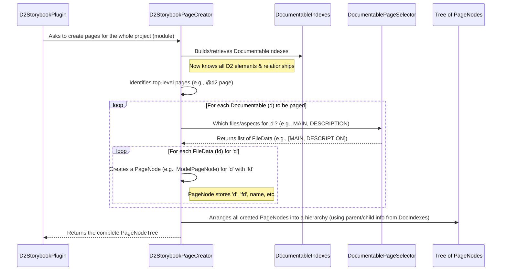

# Chapter 6: Page Generation & Structuring (D2StorybookPageCreator)

Welcome to Chapter 6! In [Chapter 5: Documentable Representation & D2DocTagExtra](05_documentable_representation___d2doctagextra__.md), we saw how Dokka, with the help of `fixers-d2`, creates a detailed "data sheet" (a `Documentable`) for each piece of your code, enriching it with your D2 KDoc tag instructions in a special `D2DocTagExtra` bag. We also saw how these enriched documentables are organized into `DocumentableIndexes`.

Now, we have all this rich information. How does it actually turn into a structured set of documentation pages that Storybook can display? This is where the **D2StorybookPageCreator** steps in – it's the architect that designs the layout of your Storybook documentation.

## What's the Big Deal? From Code Data to a Page Plan

Imagine you have a box full of detailed notes about different parts of your software project (these are your enriched `Documentable`s). You also know how they relate to each other (e.g., "this model belongs to that feature page" – thanks to `@parent` tags).

**The Problem:** Just having these notes isn't enough. You need a plan – a sitemap – that decides:
*   Which notes become main pages in your documentation?
*   Which notes become sections or sub-pages within those main pages?
*   How will users navigate between these pages?
*   What's the actual file structure for Storybook (e.g., `index.stories.mdx`, `featureX.stories.mdx`)?

**The Solution: `D2StorybookPageCreator`**
Think of `D2StorybookPageCreator` as the **chief architect or sitemap planner** for your documentation. It takes all the blueprints (`Documentable`s with their `D2DocTagExtra`) and the relationship map (`DocumentableIndexes`) and does the following:

1.  **Identifies Main Pages:** It looks for elements you've marked with `@d2 page` (or elements that are top-level by not having a `@parent`). These become the main entry points in your Storybook.
2.  **Builds Hierarchy:** It uses the `@parent` and `@child` relationships (stored in `D2DocTagExtra` and organized in `DocumentableIndexes`) to arrange other documentables (like `@d2 model` or `@d2 section`) under their respective main pages. This creates the navigation structure.
3.  **Decides File Structure:** It determines how these logical pages and sections map to actual files that Storybook will consume (often `.stories.mdx` files).
4.  **Creates Page Blueprints (`PageNode`s):** For each logical page or section, it creates a blueprint called a `PageNode`. This `PageNode` holds information like the page's title, what content it will eventually contain (though not the content itself yet), and any child pages.

Essentially, `D2StorybookPageCreator` translates your D2 KDoc intentions into a concrete plan for your Storybook's structure.

## A Simple Example: Planning Your Storybook

Let's say you have:
1.  An interface `MyFeaturePage` tagged with `@d2 page @title "My Awesome Feature"`.
2.  A data class `MyDataModel` tagged with `@d2 model @parent [MyFeaturePage] @title "Data Structure"`.

**What `D2StorybookPageCreator` does (conceptually):**

1.  It sees `MyFeaturePage` is a `@d2 page`, so it plans a main Storybook entry for "My Awesome Feature." This might correspond to a file like `my-awesome-feature.stories.mdx`. It creates a `PageNode` for this.
2.  It sees `MyDataModel` is a `@d2 model` and its `@parent` is `MyFeaturePage`.
3.  It plans for "Data Structure" to appear as a section *within* the "My Awesome Feature" page (or as a linked sub-page, depending on configuration). It creates another `PageNode` for this model and links it as a child of `MyFeaturePage`'s `PageNode`.

The output of `D2StorybookPageCreator` is not the final MDX files, but a **tree of `PageNode` objects** that represents the complete sitemap and structure of your documentation. This tree is then passed to the next stage for rendering the actual content.

## Key Ingredients for Page Creation

The `D2StorybookPageCreator` doesn't work in a vacuum. It uses a few key helpers and concepts:

1.  **`DocumentableIndexes`**: As we learned in [Chapter 5: Documentable Representation & D2DocTagExtra](05_documentable_representation___d2doctagextra__.md), this is the pre-processed collection of all your D2-relevant code elements, their parsed D2 tags, and their parent/child relationships. This is the primary input.
2.  **`DocumentablePageSelector`**: This is a helper service. For any given `Documentable` (like your `MyDataModel`), it decides *what kind* of files or page aspects are needed. For example, a model might need:
    *   A main entry point (`FileData.MAIN`).
    *   A detailed description section (`FileData.DESCRIPTION`).
    *   A visual representation, like a JSON example (`FileData.VISUAL_JSON`).
    Each of these aspects might become part of a single page or separate linked pages.
3.  **`D2StorybookPageNode` (and its implementations like `ModelPageNode`)**: This is the "blueprint" for a page or a section. It's a data structure that holds:
    *   `name`: The title of the page/section.
    *   `dri`: A unique identifier for the page.
    *   `documentables`: The original `Documentable`(s) this page is about.
    *   `children`: A list of child `PageNode`s (for hierarchy).
    *   `fileData`: Information about what kind of file/page aspect this node represents (e.g., `FileData.MAIN`, `FileData.DESCRIPTION`).
    *   `content`: A placeholder or a high-level structure for the content that will eventually be rendered by the [Content Rendering to Storybook (D2StorybookRenderer)](07_content_rendering_to_storybook__d2storybookrenderer__.md).

## The Page Creation Process: Step-by-Step

Let's walk through what happens when `D2StorybookPageCreator` gets to work.



1.  **Start**: The [Dokka Storybook Plugin (D2StorybookPlugin)](03_dokka_storybook_plugin__d2storybookplugin__.md) tells `D2StorybookPageCreator` to generate pages for your entire project (module).
2.  **Index Lookup**: `D2StorybookPageCreator` first ensures it has the `DocumentableIndexes`. This gives it access to all Kotlin elements marked for D2 documentation, along with their parsed `@d2`, `@parent`, `@child`, `@title` tags, etc.
3.  **Identify Roots**: It looks for "root" documentables in the `DocumentableIndexes` – typically those marked with `@d2 page` or those that don't have a `@parent` tag pointing to another D2 element. These will form the top level of your documentation sitemap.
4.  **Select Files per Documentable**: For each documentable that needs a page (starting with roots, then their children, and so on), the `D2StorybookPageCreator` asks the `DocumentablePageSelector`: "What different page files or aspects does this specific element need?"
    *   For example, for a data class `MyDataModel` marked with `@d2 model` and `@visual json`, the `DocumentablePageSelector` might say it needs:
        *   `FileData.MAIN`: For its main entry and properties.
        *   `FileData.DESCRIPTION`: For its KDoc description.
        *   `FileData.VISUAL_JSON`: For the JSON example.
5.  **Create `PageNode`s**: For each `FileData` returned by the selector, the `D2StorybookPageCreator` creates a specific `PageNode` (like a `ModelPageNode`). This node is a blueprint for that part of the documentation. It links this `PageNode` to the original `Documentable` and the `FileData`.
6.  **Build Hierarchy**: As `PageNode`s are created, `D2StorybookPageCreator` uses the parent/child relationships from `DocumentableIndexes` (derived from your `@parent` and `@child` tags) to link these `PageNode`s together into a tree structure. A `PageNode` for a `@d2 page` might have child `PageNode`s for models or sections declared as its children.
7.  **Result**: The final output is a single root `ModulePageNode` which contains a tree of all other `PageNode`s, perfectly representing the desired sitemap and file structure for your Storybook documentation.

## A Peek at the Code

Let's look at some simplified code snippets to understand this better.

**1. `D2StorybookPageCreator.kt` - The Orchestrator**

This class is responsible for the overall page creation logic.

*(File: `dokka-storybook-plugin/src/main/kotlin/d2/dokka/storybook/translator/D2StorybookPageCreator.kt`)*
```kotlin
// Simplified for clarity
class D2StorybookPageCreator(/* ... dependencies ... */) {
    private lateinit var documentableIndexes: DocumentableIndexes

    fun pageForModule(m: DModule): ModulePageNode {
        // 1. Get all D2-relevant documentables from the module
        val d2Documentables = m.packages.flatMap { it.classlikes /* + others */ }
            .map { it.asD2TypeDocumentable() } // Convert to D2-specific view

        // 2. Build the indexes (knows all elements and parent/child links)
        documentableIndexes = DocumentableIndexes.from(d2Documentables)

        // 3. Find top-level items (e.g., @d2 page, or no parent) from indexes
        val rootDocumentables = documentableIndexes.parentToChildMap[DRI.topLevel].orEmpty()
            .mapNotNull(documentableIndexes.documentables::get)
        // ... and also include other items to ensure they are processed ...

        // 4. For each documentable, create its necessary page nodes
        val allPages = (rootDocumentables + d2Documentables).flatMap(::pagesFor)

        return ModulePageNode( // The root of our documentation site
            name = m.name.ifEmpty { "<root>" },
            content = contentBuilder.contentFor(m), // Basic module content
            documentables = listOf(m),
            children = allPages // Attach all generated pages
        )
    }

    // For a single documentable 'd', get all its required page nodes
    private fun pagesFor(d: Documentable): List<ModelPageNode> {
        // Ask DocumentablePageSelector which FileData aspects are needed for 'd'
        return DocumentablePageSelector.filesFor(d)
            .mapNotNull { fileData -> d.toModelPageNode(fileData) }
    }

    // Create a ModelPageNode for documentable 'd' representing 'fileData' aspect
    private fun Documentable.toModelPageNode(fileData: FileData): ModelPageNode? {
        // Get a content builder strategy based on fileData and D2Type
        val specificContentBuilder = fileData.contentBuilder(this.d2Type())
        // Generate placeholder content structure (actual rendering is later)
        val contentNode = specificContentBuilder.contentFor(this)

        return contentNode?.let { content ->
            ModelPageNode(
                name = this.name.orEmpty(), // Page title from documentable
                content = content,          // The placeholder content structure
                dri = setOf(this.dri.copy(extra = fileData.id)), // Unique ID for this page aspect
                documentables = listOf(this),
                children = emptyList(), // Children will be added when building the tree
                fileData = fileData     // What kind of page is this (MAIN, DESC, VISUAL)
            )
        }
    }

    // Helper to pick the right content building strategy
    private fun FileData.contentBuilder(d2Type: D2Type?) = when (this) {
        FileData.ROOT -> InnerRootPageContentBuilder() // For @d2 page index
        FileData.MAIN -> InnerMainPageContentBuilder() // For main content of an item
        FileData.DESCRIPTION -> d2Type.descriptionContentBuilder() // For KDoc part
        // ... other FileData types like VISUAL_JSON ...
        else -> InnerMainPageContentBuilder() // Default
    }
    // ... Inner builder classes are defined here ...
}
```
*   `pageForModule()`: This is the main entry point. It initializes `documentableIndexes` and then calls `pagesFor()` for relevant documentables to get a flat list of `ModelPageNode`s. These are then structured into the `ModulePageNode`. (Note: The actual tree structuring logic based on `parentToChildMap` is complex and happens implicitly as Dokka processes these nodes or via how `children` are populated, simplified here).
*   `pagesFor(d)`: For a given `Documentable` `d`, it calls `DocumentablePageSelector.filesFor(d)` to get a list of `FileData` objects (e.g., "this model needs a main page, a description part, and a JSON visual part"). For each `FileData`, it calls `toModelPageNode()`.
*   `toModelPageNode(fileData)`: This creates an actual `ModelPageNode` instance. It sets the name (often from the `Documentable`'s title or name), associates the `Documentable` and the `FileData`, and importantly, it uses `fileData.contentBuilder()` to associate a *strategy* for how the content of this page will be built later.
*   `FileData.contentBuilder()`: This is a crucial helper. Based on the `FileData` (e.g., is this the `ROOT` page for an item, or its `DESCRIPTION` part?) and sometimes the `D2Type` (e.g., is it an `API` or a `MODEL`?), it selects an appropriate "content builder" class. These content builders are responsible for generating the actual page content in the next phase (see [Chapter 7: Content Rendering to Storybook (D2StorybookRenderer)](07_content_rendering_to_storybook__d2storybookrenderer__.md)).

**2. `DocumentablePageSelector.kt` - Deciding What's Needed**

This object helps decide which "files" or "page aspects" are needed for a given `Documentable`.

*(File: `dokka-storybook-plugin/src/main/kotlin/d2/dokka/storybook/service/DocumentablePageSelector.kt`)*
```kotlin
// Simplified for clarity
object DocumentablePageSelector {
    // For a given documentable 'd', return a list of FileData
    // representing the different page aspects it needs.
    fun filesFor(d: Documentable): List<FileData> {
        // Skip 'hidden' or 'inherit' types
        if (d.isOfType(D2Type.INHERIT, D2Type.HIDDEN)) {
            return emptyList()
        }

        // Different rules based on the type of Documentable
        return when (d) {
            is PageDocumentable -> listOfNotNull( // For @d2 page
                FileData.ROOT, // The main index.stories.mdx for this page
                FileData.MAIN, // General content if any
                FileData.DESCRIPTION.takeIf { d.hasDescription }, // Its KDoc
                d.visualType().fileData // Any associated visual
            )
            is DClasslike -> listOfNotNull( // For classes (like @d2 model)
                FileData.MAIN,
                FileData.DESCRIPTION,
                d.visualType().fileData // e.g., FileData.VISUAL_JSON
            )
            // ... other cases for DTypeAlias, SectionDocumentable ...
            else -> emptyList()
        }
    }
}
```
*   `filesFor(d)`: This function looks at the `Documentable` `d` (specifically, its `D2Type` like `PAGE`, `MODEL`, and its `visualType` like `JSON` from `D2DocTagExtra`).
*   Based on these, it returns a list of `FileData` enum entries. `FileData` (not shown in full) is an enum with values like `ROOT`, `MAIN`, `DESCRIPTION`, `VISUAL_JSON`, `VISUAL_AUTOMATE`, etc. Each represents a distinct part or file for the documentation.
    *   For example, if `d` is a `PageDocumentable` (something tagged `@d2 page`), it might need a `FileData.ROOT` (for its main `index.stories.mdx`) and a `FileData.DESCRIPTION`.
    *   If `d` is a `DClasslike` (like a data class for a model) with `@visual json`, it might need `FileData.MAIN`, `FileData.DESCRIPTION`, and `FileData.VISUAL_JSON`.

**3. `ModelPageNode.kt` - The Page Blueprint**

This is what a `PageNode` (specifically for models/most D2 elements) looks like. It's a data container.

*(File: `dokka-storybook-plugin/src/main/kotlin/d2/dokka/storybook/model/page/ModelPageNode.kt`)*
```kotlin
// Simplified for clarity
class ModelPageNode(
    override val name: String,              // Title of this page/section
    override val content: ContentNode,      // Structure for content (filled later)
    override val dri: Set<DRI>,             // Unique ID for this page node
    override val documentables: List<Documentable>, // Original code element(s)
    override var children: List<PageNode>,  // Child pages in the hierarchy
    override val fileData: FileData         // What kind of page is this? (ROOT, MAIN, etc.)
    // ... other properties like embeddedResources ...
): D2StorybookContentPage { // Implements interfaces for Dokka's page system
    // ... methods for modifying the node (usually used by Dokka internally) ...
}
```
*   This class primarily holds data. The `D2StorybookPageCreator` fills these fields.
*   `name`: Becomes the title in Storybook.
*   `content`: At this stage, this is more of a plan for content, often created by one of the `Inner...ContentBuilder` classes from `D2StorybookPageCreator`. The actual rendering happens later.
*   `dri`: Dokka Resource Identifier, a unique ID.
*   `documentables`: The link back to the original code element(s) this page describes.
*   `children`: How hierarchy is represented.
*   `fileData`: Crucial for telling the renderer what *kind* of page this is and thus how to treat its `content`. For instance, a `PageNode` with `FileData.VISUAL_JSON` will be rendered differently than one with `FileData.DESCRIPTION`.

## Conclusion

The `D2StorybookPageCreator` is the master architect of your D2 documentation's structure. It takes the rich information from your [Documentable Representation & D2DocTagExtra](05_documentable_representation___d2doctagextra__.md) (especially your `@d2`, `@parent`, `@child`, and `@title` tags) and, with the help of `DocumentablePageSelector`, translates it into a hierarchical tree of `PageNode`s.

Each `PageNode` is a blueprint for a specific Storybook page or a section within a page, knowing its title, what kind of content it represents (e.g., main description, JSON example), and its place in the overall sitemap.

Now that we have this meticulously planned tree of page blueprints, how does the actual content (the Markdown, D2 diagram definitions, JSON examples) get written into these pages? That's the job of our final component.

Let's move on to [Chapter 7: Content Rendering to Storybook (D2StorybookRenderer)](07_content_rendering_to_storybook__d2storybookrenderer__.md) to see how these blueprints are brought to life!

---

Generated by [AI Codebase Knowledge Builder](https://github.com/The-Pocket/Tutorial-Codebase-Knowledge)