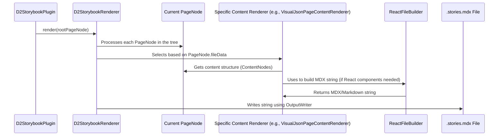

# Chapter 7: Content Rendering to Storybook (D2StorybookRenderer)

Welcome to Chapter 7! In [Chapter 6: Page Generation & Structuring (D2StorybookPageCreator)](06_page_generation___structuring__d2storybookpagecreator__.md), we saw how `D2StorybookPageCreator` acts like an architect, taking all your D2-annotated code and creating a detailed blueprint for your documentation. This blueprint is a tree of `PageNode` objects, each representing a page or a section, complete with a plan for its content.

But a blueprint isn't a house! We have a plan, but we don't have the actual, viewable documentation files yet. How do these `PageNode` blueprints get turned into the final MDX (Markdown with JSX) files that Storybook can understand and display?

Meet the **D2StorybookRenderer** – the "printer" that brings your documentation blueprints to life!

## The Problem: From Blueprint to Actual Pages

Imagine you have a detailed plan for a multi-page brochure (our `PageNode` tree). The plan specifies:
*   Page 1: "Introduction" (title), with "Welcome text..." (content placeholder).
*   Page 2: "Product Features" (title), with "Feature A description..." and "A JSON example for Feature A..." (content placeholders).

You need someone to take this plan, write out the actual text, format it nicely, insert any images or code examples, and produce the final, printable brochure pages.

This is exactly what `D2StorybookRenderer` does for your D2 documentation. It takes the structured `PageNode` tree (the output of `D2StorybookPageCreator`) and "renders" it into the final `.stories.mdx` files that Storybook uses.

## What is `D2StorybookRenderer`? Your Documentation Printer

The `D2StorybookRenderer` is the component responsible for the final step of converting your documentation plan into tangible files. It:

1.  **Receives the Page Plan:** It gets the entire tree of `PageNode` objects from the [Dokka Storybook Plugin (D2StorybookPlugin)](03_dokka_storybook_plugin__d2storybookplugin__.md) (which internally used the `D2StorybookPageCreator`).
2.  **Walks Through Each Page Blueprint:** It iterates through every `PageNode` in the tree.
3.  **Chooses the Right "Pen":** For each `PageNode`, it looks at what *kind* of page it is (e.g., is it a main description page, a JSON example page, an API endpoint page?). This "kind" is often stored in the `PageNode`'s `fileData` property (e.g., `FileData.DESCRIPTION`, `FileData.VISUAL_JSON`). Based on this, it selects a specialized "content renderer."
4.  **Generates Content as Text:** The specialized content renderer takes the content blueprint from the `PageNode` (which is a structure of `ContentNode` objects from Dokka) and converts it into a string of MDX.
5.  **Uses `ReactFileBuilder` for MDX:** Since Storybook uses MDX (Markdown with JSX), if any React components need to be embedded (like for code highlighting, diagrams, or custom layouts), the renderer often uses a helper called `ReactFileBuilder`. This builder helps construct the MDX string correctly, including any necessary `import` statements for React components at the top of the file.
6.  **Writes to File:** Finally, the `D2StorybookRenderer` takes the generated MDX string and writes it to the correct output file (e.g., `my-feature.stories.mdx`) in your Storybook directory.

Think of `D2StorybookRenderer` as the main printing press, and the specialized content renderers as different printing plates or settings for different types of content. `ReactFileBuilder` is like a tool that helps typeset special elements (React components) correctly.

## A Simple Example: Printing a Model's Documentation

Let's go back to our `TodoItem` model from previous chapters. Suppose the `D2StorybookPageCreator` created `PageNode`s for it, including:
*   A `PageNode` for its KDoc description (let's say `fileData` is `FileData.DESCRIPTION`).
*   A `PageNode` for its JSON example (let's say `fileData` is `FileData.VISUAL_JSON`).

Here's how `D2StorybookRenderer` would handle this:

1.  It receives these `PageNode`s.
2.  For the "description" `PageNode`:
    *   It selects a renderer suitable for `FileData.DESCRIPTION` (e.g., `DescriptionPageContentRenderer`).
    *   This renderer takes the KDoc content (as `ContentNode`s) from the `PageNode`.
    *   It converts the KDoc into Markdown text (e.g., `# TodoItem`, `Represents a single task...`).
3.  For the "JSON example" `PageNode`:
    *   It selects a renderer for `FileData.VISUAL_JSON` (e.g., `VisualJsonPageContentRenderer`).
    *   This renderer gets the example JSON data (which was originally from `@example` tags and processed into `ContentNode`s).
    *   It uses `ReactFileBuilder` to generate MDX like:
        ```mdx
        import { CodeHighlighter } from '@g2/documentation'; // Added by ReactFileBuilder

        <CodeHighlighter language="json" title="Example">
          {`{
            "id": "todo-abc-123",
            "task": "Buy groceries",
            "isDone": false
          }`}
        </CodeHighlighter>
        ```
4.  The `D2StorybookRenderer` then writes these generated MDX snippets into the appropriate `.stories.mdx` file(s).

## Key Components in the Rendering Process

*   **`D2StorybookRenderer` itself**: The main orchestrator.
*   **Specialized Content Renderers** (e.g., `DescriptionPageContentRenderer`, `VisualJsonPageContentRenderer`, `MainPageContentRenderer`): Each knows how to turn a specific type of `ContentNode` structure (for descriptions, JSON, main page layouts, etc.) into an MDX string. Many of these extend a base `MarkdownRenderer`.
*   **`MarkdownRenderer`**: A base class providing common utilities for generating Markdown and integrating with `ReactFileBuilder`.
*   **`ReactFileBuilder`**: A smart string builder. It helps create MDX by:
    *   Allowing you to describe React components and their props programmatically.
    *   Automatically collecting all `import` statements needed by those components.
    *   Placing these `import` statements at the beginning of the generated MDX file.
*   **`OutputWriter`**: A Dokka utility that `D2StorybookRenderer` uses to actually write the generated string to a file on disk.
*   **`D2StorybookLocationProvider`**: Helps determine the correct file path and name for each `PageNode`.

## How Rendering Happens: A Step-by-Step Look



1.  **Initiation**: The [Dokka Storybook Plugin (D2StorybookPlugin)](03_dokka_storybook_plugin__d2storybookplugin__.md) calls the `render()` method of `D2StorybookRenderer`, passing it the root `PageNode` of the documentation tree.
2.  **Traversal**: `D2StorybookRenderer` recursively traverses this tree, processing each `PageNode`.
3.  **Path Resolution**: For each `PageNode`, it uses `D2StorybookLocationProvider` to figure out the correct output file path (e.g., `storybook/stories/models/todo-item.stories.mdx`).
4.  **Renderer Selection**: It checks the `fileData` property of the `PageNode` (e.g., `FileData.DESCRIPTION`, `FileData.VISUAL_JSON`). Based on this, it picks the appropriate specialized content renderer from an internal map.
5.  **Content Generation**:
    *   The selected specialized renderer (e.g., `VisualJsonPageContentRenderer`) is called.
    *   This renderer takes the `ContentNode` tree stored within the `PageNode` (which represents the actual content to be displayed).
    *   It then walks through this `ContentNode` tree, converting elements like text, code blocks, lists, etc., into their MDX string equivalents.
    *   If it needs to embed a React component (like a code highlighter or a D2 diagram viewer), it uses `ReactFileBuilder`. The `ReactFileBuilder` helps generate the `<MyComponent prop="value" />` syntax and also keeps track of `import MyComponent from 'my-package';` to add it to the top of the file.
6.  **Output**: The `D2StorybookRenderer` gets the final MDX string from the specialized renderer and uses `OutputWriter` to save it to the file determined in step 3.

## Peeking at the Code

Let's look at simplified snippets to see these components in action.

**1. `D2StorybookRenderer.kt` - The Orchestrator**

This class manages the overall rendering flow.

*(File: `dokka-storybook-plugin/src/main/kotlin/d2/dokka/storybook/renderer/D2StorybookRenderer.kt`)*
```kotlin
// Simplified for clarity
open class D2StorybookRenderer(
    private val context: DokkaContext
): Renderer { // Implements Dokka's Renderer interface
    // Get the OutputWriter from the plugin context
    protected open val outputWriter = context.plugin<D2StorybookPlugin>().querySingle { outputWriter }
    protected open lateinit var locationProvider: D2StorybookLocationProvider

    // A map of FileData types to their specific renderers
    private val renderers = mutableMapOf(
        FileData.ROOT to MainPageContentRenderer(context, true),
        FileData.MAIN to MainPageContentRenderer(context, false),
        FileData.DESCRIPTION to DescriptionPageContentRenderer(context),
        FileData.VISUAL_JSON to VisualJsonPageContentRenderer(),
        // ... other FileData types and their renderers ...
    )
    private val defaultRenderer = DescriptionPageContentRenderer(context) // Fallback

    // Helper to get the right renderer for a page
    private fun PageNode.renderer(): D2ContentRenderer {
        return if (this is ModelPageNode) { // ModelPageNode holds FileData
            renderers[fileData] ?: defaultRenderer // Get from map or use default
        } else {
            defaultRenderer
        }
    }

    override fun render(root: RootPageNode) {
        // Initialize locationProvider (helps find where to save files)
        locationProvider = context.plugin<D2StorybookPlugin>()
            .querySingle { locationProviderFactory }
            .getLocationProvider(root) as D2StorybookLocationProvider

        // Start rendering all pages (often done concurrently)
        runBlocking(Dispatchers.Default) { renderPages(root) }
    }

    protected open suspend fun renderPages(root: PageNode) {
        coroutineScope {
            renderPage(root) // Render current page
            root.children.forEach { launch { renderPages(it) } } // Render children
        }
    }

    protected open suspend fun renderPage(page: PageNode) {
        // Determine the output file path (without extension initially)
        val path by lazy { locationProvider.resolve(page, skipExtension = true) }

        when (page) {
            // For our custom D2 content pages...
            is D2StorybookContentPage -> outputWriter.write(page, path, page.renderer())
            // ... other Dokka page types ...
            else -> { /* ... handle other page types or do nothing ... */ }
        }
    }

    // Helper to use OutputWriter with our custom D2ContentRenderer
    private suspend fun OutputWriter.write(page: ContentPage, path: String, renderer: D2ContentRenderer) {
        // renderer.buildPage() generates the actual MDX string
        write(path, renderer.buildPage(page, locationProvider, renderer::buildPageContent), "")
    }
}
```
*   `renderers` map: This is key. It links a `FileData` type (which describes *what kind* of content a `PageNode` holds) to a specific `D2ContentRenderer` implementation responsible for generating the MDX for that kind of content.
*   `render(root: RootPageNode)`: The main entry point from Dokka. It sets up the `locationProvider` and starts the recursive `renderPages` process.
*   `renderPage(page: PageNode)`: This is where a single page gets processed. It figures out the output `path`, selects the correct `renderer()` for the page, and then calls `outputWriter.write(...)`.
*   `outputWriter.write(...)`: This method takes the `page`, the `path`, and the chosen `renderer`. The `renderer.buildPage(...)` method is called, which is where the actual MDX string generation happens. This string is then written to the file system by the `OutputWriter`.

**2. `MarkdownRenderer.kt` - Base for Many Content Renderers**

Many specific renderers (like for descriptions or main page content) extend `MarkdownRenderer`. It provides common logic for converting Dokka's `ContentNode`s into Markdown/MDX using `ReactFileBuilder`.

*(File: `dokka-storybook-plugin/src/main/kotlin/d2/dokka/storybook/renderer/MarkdownRenderer.kt`)*
```kotlin
// Simplified for clarity
abstract class MarkdownRenderer(
    context: DokkaContext,
): DefaultRenderer<ReactFileBuilder>(context), D2ContentRenderer { // Implements our D2ContentRenderer

    override lateinit var d2LocationProvider: D2StorybookLocationProvider

    // This is how the renderer generates the full MDX for a page
    override fun buildPage(page: ContentPage, content: (ReactFileBuilder, ContentPage) -> Unit): String =
        buildString {
            // Uses ReactFileBuilder to construct the page's content
            content(ReactFileBuilder(this), page)
        }.trim() // Clean up whitespace

    // This builds the main content part of a page
    override fun buildPageContent(context: ReactFileBuilder, page: ContentPage) {
        context.buildContentNode(page.content, page) // Process the page's ContentNode tree
        context.build() // Finalize ReactFileBuilder (e.g., add imports)
    }

    // Example: How it handles simple text
    override fun ReactFileBuilder.buildText(textNode: ContentText) {
        if (textNode.text.isNotBlank()) {
            // ... logic to apply styles like bold, italic ...
            append(textNode.text.trim()) // Add the text content
        }
    }

    // Example: How it handles code blocks
    override fun ReactFileBuilder.buildCodeBlock(code: ContentCodeBlock, pageContext: ContentPage) {
        append("```${code.language.ifEmpty { "kotlin" }}\n") // Start Markdown code block
        code.children.forEach { child ->
            if (child is ContentText) append(child.text) // Add code lines
            else if (child is ContentBreakLine) append("\n") // Add newlines
        }
        append("\n```\n") // End Markdown code block
    }
    // ... many other buildSomething() methods for lists, links, headers, etc.
}
```
*   `buildPage()`: This method is called by `D2StorybookRenderer`. It sets up a `ReactFileBuilder` and calls the `content` lambda (which is usually `buildPageContent`) to fill it.
*   `buildPageContent()`: This takes the `ReactFileBuilder` and the `page`'s main `ContentNode`. It then recursively calls methods on the `ReactFileBuilder` (like `buildText`, `buildCodeBlock`, `buildHeader`) to translate each `ContentNode` into MDX.
*   `ReactFileBuilder.buildText()`, `ReactFileBuilder.buildCodeBlock()`: These are examples of how different `ContentNode` types (text, code) are translated into their Markdown/MDX string representation.

**3. `ReactFileBuilder.kt` - The MDX Construction Helper**

This builder is essential for creating valid MDX, especially managing imports for React components.

*(File: `dokka-storybook-plugin/src/main/kotlin/d2/dokka/storybook/renderer/builder/ReactFileBuilder.kt`)*
```kotlin
// Simplified for clarity
class ReactFileBuilder(
    override val builder: StringBuilder = StringBuilder() // Uses a standard StringBuilder
): CodeFileBuilder<StringBuilder>() { // Base class for code builders

    private val imports = mutableListOf<CodeImport>() // Stores needed imports

    // Call this to add a React component or other code element
    fun append(element: CodeElement, indentLevel: Int = 0, indentFirstLine: Boolean = true) {
        if (element is WithImport) {
            imports.add(element.importData) // Collect import if the element needs one
        }

        when (element) {
            is HtmlElement -> appendHtml(element, indentLevel, indentFirstLine) // Special handling for HTML/React
            // ... other CodeElement types ...
            else -> append(element.identifier, indentLevel) // Append simple identifier
        }
    }

    private fun appendHtml(component: HtmlElement, indentLevel: Int, indentFirstLine: Boolean) {
        // Appends <ComponentName prop1={value1} ... >
        append("<${component.identifier}", indentLevel)
        // ... logic to append properties ...
        if (component.children.isNotEmpty()) {
            append(">")
            // ... logic to append children ...
            append("</${component.identifier}>")
        } else {
            append(" />") // Self-closing tag
        }
    }

    // Called at the end to get the full MDX string
    override fun build(): String {
        builder.insert(0, buildImportsString()) // Prepend all collected imports
        return builder.toString()
    }

    private fun buildImportsString(): String {
        // Groups and formats all collected `imports` into import statements
        // e.g., import { MyComponent } from 'my-package';
        // import AnotherComponent from 'another-package';
        val importBuilder = StringBuilder()
        // ... logic to iterate `imports`, group by path, and format ...
        return importBuilder.toString()
    }
}
```
*   `imports: mutableListOf<CodeImport>`: Whenever `append()` is called with a `CodeElement` that requires an import (like a custom React component), its import information is added to this list.
*   `append(element: CodeElement)`: The main method to add content. It checks if `element` needs an import and then delegates to specific `append` methods based on the `element`'s type (e.g., `appendHtml` for React components).
*   `appendHtml()`: Constructs the JSX string for a React component, like `<MyComponent prop="value">children</MyComponent>`.
*   `build()`: This is called by `MarkdownRenderer` when it's done appending all content. `ReactFileBuilder` then takes all the `imports` it has collected, formats them into proper `import ... from ...;` statements using `buildImportsString()`, and prepends this import block to the main content string. This ensures all necessary React components are imported at the top of the MDX file.

## Conclusion

The **D2StorybookRenderer** is the final piece in the `fixers-d2` puzzle for generating documentation. It takes the structured page blueprints (`PageNode`s) from the [Page Generation & Structuring (D2StorybookPageCreator)](06_page_generation___structuring__d2storybookpagecreator__.md), and, with the help of specialized content renderers and the `ReactFileBuilder`, "prints" them into the final MDX files that Storybook displays.

It effectively translates Dokka's internal representation of your code and KDoc comments into a format that is both human-readable (Markdown) and interactively rich (JSX via React components). This meticulous rendering process is what allows you to see your D2 diagrams, code examples, and textual descriptions beautifully laid out in your Storybook.

You've now journeyed through the entire `fixers-d2` pipeline, from setting up the Gradle plugin to rendering the final Storybook pages. Congratulations! You have a solid understanding of how your Kotlin code and D2 annotations transform into powerful, interactive documentation.

---

Generated by [AI Codebase Knowledge Builder](https://github.com/The-Pocket/Tutorial-Codebase-Knowledge)