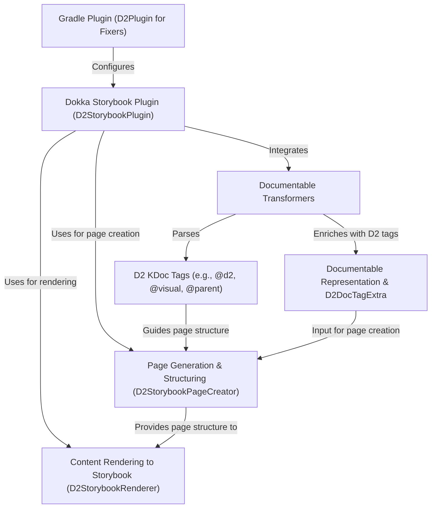

# Tutorial: fixers-d2

The `fixers-d2` project automatically generates **interactive documentation** for Kotlin projects, specifically formatted for *Storybook*. It extends *Dokka*, Kotlin's documentation engine, with a specialized **D2StorybookPlugin**. Developers use custom **KDoc tags** (like `@d2 page` or `@visual`) within their code comments to define the documentation's structure and visual presentation. The plugin then processes these tags and the code to produce *MDX files* that Storybook can display.

**Source Repository:** [https://github.com/komune-io/fixers-d2](https://github.com/komune-io/fixers-d2)

## Chapters

1. [Gradle Plugin (D2Plugin for Fixers)
](01_gradle_plugin__d2plugin_for_fixers__.md)
2. [D2 KDoc Tags (e.g., @d2, @visual, @parent)
](02_d2_kdoc_tags__e_g____d2___visual___parent__.md)
3. [Dokka Storybook Plugin (D2StorybookPlugin)
](03_dokka_storybook_plugin__d2storybookplugin__.md)
4. [Documentable Transformers
](04_documentable_transformers_.md)
5. [Documentable Representation & D2DocTagExtra
](05_documentable_representation___d2doctagextra_.md)
6. [Page Generation & Structuring (D2StorybookPageCreator)
](06_page_generation___structuring__d2storybookpagecreator__.md)
7. [Content Rendering to Storybook (D2StorybookRenderer)
](07_content_rendering_to_storybook__d2storybookrenderer__.md)

---

Generated by [AI Codebase Knowledge Builder](https://github.com/The-Pocket/Tutorial-Codebase-Knowledge)