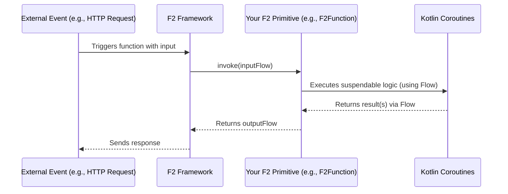

# Chapter 1: F2 Functional Primitives (F2Supplier, F2Function, F2Consumer)

Welcome to your F2 journey! In this first chapter, we'll explore the fundamental building blocks you'll use to create powerful applications with F2: the **F2 Functional Primitives**.

## What's the Big Idea?

Imagine you're building an application. This application needs to perform various tasks: maybe get some data from somewhere, change that data, and then do something with the result, like display it or save it.

F2 provides three core tools, or "primitives," to help you define these tasks in a clean, organized, and efficient way:
*   `F2Supplier`
*   `F2Function`
*   `F2Consumer`

Think of these like specialized workers on an assembly line:

*   **`F2Supplier`**: This worker is at the very beginning of the line. Their job is to *produce* something (like raw materials) without needing any input from anyone else.
*   **`F2Function`**: This worker takes what the `F2Supplier` (or another `F2Function`) made, *transforms* it into something new (like shaping the raw material into a part), and then passes it on.
*   **`F2Consumer`**: This worker is at the end of the line. They take the finished product and *do something with it* (like packaging it or performing a final quality check). They don't produce a new item for the assembly line itself.

Using these primitives helps you write code that is:
*   **Modular**: Each piece of logic is self-contained.
*   **Reusable**: You can use the same "worker" for different assembly lines if needed.
*   **Asynchronous-friendly**: They work beautifully with Kotlin's coroutines, allowing your application to handle many tasks efficiently without getting bogged down. This is super important for modern, responsive applications.

Let's meet these workers one by one!

## Meet the Primitives

### 1. `F2Supplier<R>`: The Producer

An `F2Supplier` is the simplest of the three. It doesn't take any input; its sole job is to supply or produce a result (or a stream of results).

*   **Analogy**: A worker who pulls a lever to generate a new widget, or a spring that naturally provides water.
*   **Purpose**: To generate data.
*   **Signature (Simplified for Kotlin/JVM)**: `suspend () -> Flow<R>`
    *   `suspend`: This means the supplier can perform long-running operations (like fetching data from a network) without freezing your application. It can "pause" and "resume" efficiently.
    *   `()`: It takes no input parameters.
    *   `Flow<R>`: It returns a `Flow` of type `R`. A `Flow` is like a stream or a pipe that can deliver multiple values of type `R` over time. `R` is the type of the result it produces (e.g., `String`, `Int`, or a custom data class).

Here's what the basic interface looks like in Kotlin (JVM):
```kotlin
// From f2-dsl-function
actual fun interface F2Supplier<R> : suspend () -> Flow<R> {
	override suspend operator fun invoke(): Flow<R>
}
```
This means an `F2Supplier` is essentially a function that can be called (using `invoke()` or just `()`) and will return a `Flow` of results.

**Example: Supplying a Random Greeting**

Let's say we want an `F2Supplier` that provides a random greeting message.

```kotlin
import kotlinx.coroutines.flow.flowOf
import io.komune.f2.dsl.fnc.F2Supplier
import io.komune.f2.dsl.fnc.f2SupplierSingle // Helper function

// A supplier that gives us one greeting
val greetingSupplier: F2Supplier<String> = f2SupplierSingle {
    "Hello from F2 Supplier!"
}
```
*   We use `f2SupplierSingle`, a handy helper from F2 that creates an `F2Supplier` which produces just a single item.
*   The code inside the `{}` block is what our supplier does: it returns the string "Hello from F2 Supplier!".
*   This supplier, when called, will provide a `Flow` containing this one string.

### 2. `F2Function<T, R>`: The Transformer

An `F2Function` takes an input of one type (`T`) and transforms it into an output of another type (`R`) (or the same type).

*   **Analogy**: A worker who takes a lump of clay (`T`) and molds it into a vase (`R`).
*   **Purpose**: To process input data and produce output data.
*   **Signature (Simplified for Kotlin/JVM)**: `suspend (Flow<T>) -> Flow<R>`
    *   `suspend`: It can perform asynchronous operations.
    *   `(Flow<T>)`: It takes a `Flow` of input items of type `T`.
    *   `Flow<R>`: It returns a `Flow` of output items of type `R`.

The interface definition (JVM):
```kotlin
// From f2-dsl-function
actual fun interface F2Function<T, R>: suspend (Flow<T>) -> Flow<R> {
  override suspend operator fun invoke(msgs: Flow<T>): Flow<R>
}
```
An `F2Function` is a function that accepts a `Flow` of inputs and produces a `Flow` of outputs.

**Example: Uppercasing Text**

Let's create an `F2Function` that takes a `String` and returns its uppercase version.

```kotlin
import kotlinx.coroutines.flow.Flow
import kotlinx.coroutines.flow.map
import io.komune.f2.dsl.fnc.F2Function
import io.komune.f2.dsl.fnc.f2Function // Helper function

// A function that takes a String and returns it in uppercase
val uppercaseFunction: F2Function<String, String> = f2Function { inputFlow ->
    inputFlow.map { text -> text.uppercase() }
}
```
*   We use the `f2Function` helper.
*   It receives an `inputFlow` (which is a `Flow<String>`).
*   We use the `.map` operator on the flow. For each `text` string that comes through the `inputFlow`, it applies the transformation `text.uppercase()`.
*   The result is a new `Flow<String>` containing the uppercased strings.

### 3. `F2Consumer<T>`: The Finisher

An `F2Consumer` takes an input of type `T` and performs some action with it. Crucially, it *does not* return a value to be used further down the line. Its job is to terminate a flow of processing.

*   **Analogy**: A worker who takes a finished product and puts it on a shelf, or an inspector who logs the product details.
*   **Purpose**: To perform a final action on data.
*   **Signature (Simplified for Kotlin/JVM)**: `suspend (Flow<T>) -> Unit`
    *   `suspend`: It can perform asynchronous operations.
    *   `(Flow<T>)`: It takes a `Flow` of input items of type `T`.
    *   `Unit`: This signifies that it doesn't return any meaningful result. Think of it like `void` in other languages.

The interface definition (JVM):
```kotlin
// From f2-dsl-function
actual fun interface F2Consumer<T>: suspend (Flow<T>) -> Unit {
  override suspend operator fun invoke(msg: Flow<T>)
}
```
An `F2Consumer` is a function that accepts a `Flow` of inputs and performs an action, returning `Unit`.

**Example: Printing a Message**

Let's define an `F2Consumer` that simply prints any incoming `String` to the console.

```kotlin
import kotlinx.coroutines.flow.Flow
import kotlinx.coroutines.flow.collect // To consume the flow items
import io.komune.f2.dsl.fnc.F2Consumer
import io.komune.f2.dsl.fnc.f2Consumer // Helper function

// A consumer that prints any string it receives
val printConsumer: F2Consumer<String> = f2Consumer { inputFlow ->
    inputFlow.collect { message ->
        println("Consumed: $message")
    }
}
```
*   We use the `f2Consumer` helper.
*   It receives an `inputFlow` (a `Flow<String>`).
*   We use `.collect` on the flow. For each `message` that comes through the `inputFlow`, it executes `println("Consumed: $message")`.

## Using Them Together: A Mini Assembly Line

Now, let's see how these primitives can work together. Imagine this simple process:
1.  **Supplier**: Get a name (e.g., "F2").
2.  **Function**: Create a greeting message using this name (e.g., "Welcome, F2!").
3.  **Consumer**: Print the final greeting.

Here's how you might define these (we'll skip actually running them for now, just defining the "workers"):

```kotlin
import kotlinx.coroutines.flow.Flow
import kotlinx.coroutines.flow.flowOf
import kotlinx.coroutines.flow.map
import kotlinx.coroutines.flow.collect
import io.komune.f2.dsl.fnc.F2Supplier
import io.komune.f2.dsl.fnc.F2Function
import io.komune.f2.dsl.fnc.F2Consumer
import io.komune.f2.dsl.fnc.f2SupplierSingle
import io.komune.f2.dsl.fnc.f2Function
import io.komune.f2.dsl.fnc.f2Consumer

// 1. Supplier: Provides a name
val nameSupplier: F2Supplier<String> = f2SupplierSingle {
    "F2"
}

// 2. Function: Creates a greeting
val greetingFunction: F2Function<String, String> = f2Function { nameFlow ->
    nameFlow.map { name -> "Welcome, $name!" }
}

// 3. Consumer: Prints the greeting
val messagePrinter: F2Consumer<String> = f2Consumer { greetingFlow ->
    greetingFlow.collect { greeting ->
        println(greeting)
    }
}
```
Each part is clearly defined:
*   `nameSupplier` will produce the string "F2".
*   `greetingFunction` is ready to take a string (like "F2") and transform it into "Welcome, F2!".
*   `messagePrinter` is ready to take a string (like "Welcome, F2!") and print it.

In later chapters, especially when we discuss [Spring Cloud Function Integration & Function Catalog](02_spring_cloud_function_integration___function_catalog_.md), you'll see how F2 can discover these "workers" and wire them up to handle requests, for example, from the internet via [Protocol Adapters (HTTP & RSocket)](04_protocol_adapters__http___rsocket__.md).

## Under the Hood: A Quick Peek

You might be wondering what's happening internally when you define or use these F2 primitives.

1.  **Kotlin Lambdas**: When you use helpers like `f2Function { ... }`, you're providing a Kotlin lambda (an anonymous function). These helpers wrap your lambda into an object that implements the corresponding F2 interface (`F2Function`, `F2Supplier`, or `F2Consumer`).
2.  **`suspend` Keyword**: This is a powerful feature from Kotlin Coroutines. It allows a function to "pause" its execution if it's waiting for something (like a network response or a timer) and free up the underlying thread to do other work. Once the waiting is over, the function "resumes" where it left off. This makes your application very efficient at handling many concurrent tasks.
3.  **`Flow`**: Also from Kotlin Coroutines, a `Flow` is a stream of values that are produced asynchronously. This is perfect for F2 because data might arrive piece by piece (e.g., streaming data from a sensor) or a function might produce multiple results from a single input.
    *   An `F2Supplier` produces a `Flow` of results.
    *   An `F2Function` takes a `Flow` of inputs and produces a `Flow` of outputs.
    *   An `F2Consumer` takes a `Flow` of inputs to process.

When an F2 function is called (perhaps triggered by an external event like an HTTP request), the F2 framework manages the invocation:



*   An **External Event** (like an HTTP request) arrives.
*   The **F2 Framework** (often in conjunction with Spring Cloud Function) receives this and identifies which of your F2 primitives should handle it.
*   It invokes your **F2 Primitive**, passing the input data (typically wrapped in a `Flow`).
*   Your primitive's logic, often involving `suspend` functions and `Flow` transformations, is executed with the help of **Kotlin Coroutines**.
*   The result (as a `Flow` for `F2Supplier` and `F2Function`, or `Unit` for `F2Consumer`) is returned to the framework.
*   The **F2 Framework** then sends the response back to the originator of the event.

The key takeaway is that F2 primitives provide a standard way to define pieces of your application's logic, leveraging Kotlin's powerful asynchronous features to make them efficient and scalable. The `f2-dsl-function` module provides these core interfaces and handy builder functions.

## Conclusion

You've just met the three musketeers of F2: `F2Supplier`, `F2Function`, and `F2Consumer`. These functional primitives are your primary tools for defining the behavior of your application in small, manageable, and powerful units.

*   `F2Supplier`: Produces data (e.g., `f2SupplierSingle { "data" }`).
*   `F2Function`: Transforms input data to output data (e.g., `f2Function { inputFlow -> inputFlow.map { it.doSomething() } }`).
*   `F2Consumer`: Acts on input data without producing a new output for the chain (e.g., `f2Consumer { inputFlow -> inputFlow.collect { println(it) } }`).

They embrace a functional style and are built for the asynchronous world with Kotlin Coroutines and Flow.

In the next chapter, we'll explore how these individual functions can be "published" and made available within your application using [Spring Cloud Function Integration & Function Catalog](02_spring_cloud_function_integration___function_catalog_.md). This will show you how F2 takes these building blocks and makes them callable parts of a running service.

---

Generated by [AI Codebase Knowledge Builder](https://github.com/The-Pocket/Tutorial-Codebase-Knowledge)