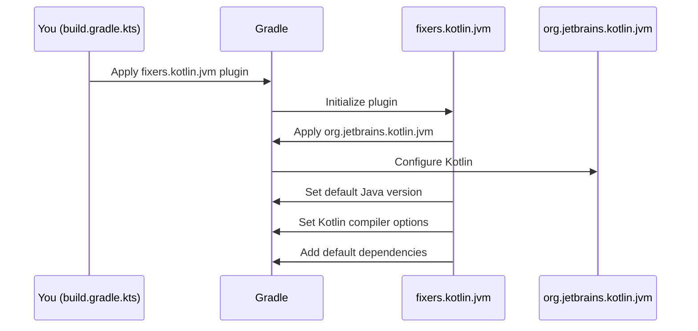

# Chapter 1: Fixers Gradle Plugins Suite

Welcome to the world of `fixers-gradle`! If you're working with Kotlin and Gradle, you're in the right place. This first chapter introduces the core concept: the **Fixers Gradle Plugins Suite**.

## What's the Big Deal with Project Setup?

Imagine you're excited to start a new Kotlin project. Maybe it's a simple command-line tool, a backend server, or even a multiplatform library. Before you can write your first line of Kotlin code, you often need to wrestle with Gradle configuration. This can involve:

*   Setting up the Kotlin plugin itself.
*   Choosing and configuring the correct Java Development Kit (JDK) version.
*   Adding common dependencies (like the Kotlin standard library or testing frameworks).
*   Figuring out how to publish your project if it's a library.
*   Integrating code quality tools to keep your code clean.

Each of these steps can mean sifting through documentation, writing repetitive configuration code (often called "boilerplate"), and hoping you've followed best practices. This can be time-consuming and a bit daunting, especially for beginners.

**This is where the Fixers Gradle Plugins Suite comes in to help!**

## Introducing the Fixers Gradle Plugins Suite

At its heart, the **Fixers Gradle Plugins Suite** is a collection of specialized Gradle plugins. Think of these plugins as expert assistants for your Gradle build. Each assistant knows exactly how to set up a specific part of your Kotlin project.

*   **Need to set up a Kotlin JVM project?** There's a Fixers plugin for that.
*   **Want to publish your library to Maven Central?** There's a Fixers plugin for that.
*   **Looking to integrate code quality checks?** You guessed it, there's a Fixers plugin for that too!

You simply "hire" (apply) the assistant (plugin) you need for a particular task. That assistant then automatically configures your project with sensible defaults and industry best practices. This drastically reduces the amount of manual configuration you need to write, cutting down on boilerplate and complexity.

The suite is designed to make setting up and managing Kotlin projects (whether they are for the JVM, Multiplatform, or even JS/NPM) much simpler and more streamlined.

## How Do These "Expert Assistants" Work? A Simple Example

Let's say you want to create a basic Kotlin project that runs on the Java Virtual Machine (JVM).

**1. Telling Gradle Where to Find the Fixers Plugins:**

First, you need to tell Gradle where it can download these Fixers "expert assistants". You do this in your `settings.gradle.kts` file:

```kotlin
// settings.gradle.kts
pluginManagement {
    repositories {
        gradlePluginPortal() // Official Gradle plugin repository
        mavenCentral()       // A common repository for libraries
    }
}
```
This snippet tells Gradle to look for plugins in the `gradlePluginPortal()` (where Fixers plugins are published) and `mavenCentral()`.

**2. "Hiring" the Kotlin JVM Assistant:**

Next, in your project's `build.gradle.kts` file, you apply the specific Fixers plugin for Kotlin JVM projects:

```kotlin
// build.gradle.kts
plugins {
    // Replace "x.y.z" with the latest version of fixers-gradle!
    id("io.komune.fixers.gradle.kotlin.jvm") version "x.y.z"
}
```
This single line is like saying, "Hey, Fixers Kotlin JVM assistant, please set up this project for me!"

**What happens when you add this plugin?**

Behind the scenes, this Fixers plugin performs several setup tasks automatically:
*   It applies the official `org.jetbrains.kotlin.jvm` plugin, which is essential for any Kotlin JVM project.
*   It configures a sensible default JDK version (like Java 17).
*   It sets up standard Kotlin compiler options.
*   It might even add some common, useful dependencies for you, like the Kotlin standard library.

All this happens with just one line of configuration from your side! You've avoided several lines of manual setup and can be confident that it's done according to good practices.

## A Peek Under the Hood

You might be wondering, "What's actually going on when I apply a Fixers plugin?" Let's use our `io.komune.fixers.gradle.kotlin.jvm` plugin example.

Think of it like giving instructions to your assistant:

1.  **You:** (In `build.gradle.kts`) "Apply the `io.komune.fixers.gradle.kotlin.jvm` plugin."
2.  **Gradle:** "Understood. I'll load this plugin."
3.  **Fixers Kotlin JVM Plugin (the assistant):** "Okay, I've been activated! My checklist for a Kotlin JVM project is:
    *   Apply the standard `org.jetbrains.kotlin.jvm` plugin.
    *   Set the Java version to our recommended default (e.g., JDK 17).
    *   Configure some common Kotlin compiler settings.
    *   Add essential dependencies like `kotlin-stdlib`."
    The plugin then carries out these steps within your Gradle project.

Here's a simplified diagram of that interaction:



Conceptually, the code inside the `io.komune.fixers.gradle.kotlin.jvm` plugin might look something like this (this is a highly simplified representation):

```kotlin
// Simplified, conceptual look inside a Fixers plugin
// (Not actual code, but illustrates the idea)
import org.gradle.api.Plugin
import org.gradle.api.Project
import org.gradle.api.plugins.JavaPluginExtension // For Java settings
import org.jetbrains.kotlin.gradle.dsl.KotlinJvmProjectExtension // For Kotlin settings

class FixersKotlinJvmPluginConcept : Plugin<Project> {
    override fun apply(project: Project) {
        // 1. Apply the official Kotlin JVM plugin
        project.plugins.apply("org.jetbrains.kotlin.jvm")

        // 2. Configure Java version (e.g., to Java 17)
        project.extensions.getByType(JavaPluginExtension::class.java).apply {
            sourceCompatibility = org.gradle.api.JavaVersion.VERSION_17
            targetCompatibility = org.gradle.api.JavaVersion.VERSION_17
        }

        // 3. Configure Kotlin (e.g., JVM target)
        project.extensions.getByType(KotlinJvmProjectExtension::class.java).apply {
            jvmToolchain(17)
        }

        // 4. Add default dependencies
        project.dependencies.add("implementation", "org.jetbrains.kotlin:kotlin-stdlib-jdk8")
    }
}
```
This (again, simplified) code shows how the plugin programmatically applies configurations to your project. You don't have to write this; the plugin does it for you!

## A Suite of Powerful Tools

The `io.komune.fixers.gradle.kotlin.jvm` plugin is just one member of the **Fixers Gradle Plugins Suite**. There are other specialized plugins for various needs:

*   `io.komune.fixers.gradle.kotlin.mpp`: Simplifies setting up Kotlin Multiplatform projects.
*   `io.komune.fixers.gradle.publish`: Helps you publish your libraries. This is part of our [Artifact Publication System](04_artifact_publication_system_.md).
*   `io.komune.fixers.gradle.check`: Sets up code quality tools like Detekt and SonarQube, contributing to the [Code Quality and Analysis Framework](03_code_quality_and_analysis_framework_.md).
*   `io.komune.fixers.gradle.config`: This special plugin provides a central place to customize the behavior of all other Fixers plugins.

You can mix and match these plugins based on your project's requirements. Many of them are designed to work together seamlessly.

## Conclusion

The **Fixers Gradle Plugins Suite** is your toolkit for taming Gradle complexity in Kotlin projects. By providing specialized plugins that apply sensible defaults and best practices, it helps you:

*   Reduce boilerplate configuration.
*   Speed up project setup.
*   Ensure consistency across your projects.
*   Focus more on writing your Kotlin code and less on build scripts.

You've now seen what the suite is and how a single plugin can simplify a common task like setting up a Kotlin JVM project. But what if you want to customize these defaults? For example, what if you need to use a different JDK version or specify particular details for your project?

That's where the central configuration capabilities of Fixers come into play. In the next chapter, we'll explore the [`fixers` Central Configuration DSL](02__fixers__central_configuration_dsl_.md), which allows you to fine-tune how these plugins behave.

---

Generated by [AI Codebase Knowledge Builder](https://github.com/The-Pocket/Tutorial-Codebase-Knowledge)