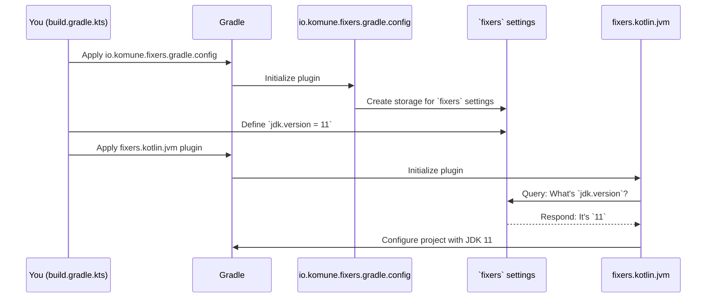

# Chapter 2: `fixers` Central Configuration DSL

In [Chapter 1: Fixers Gradle Plugins Suite](01_fixers_gradle_plugins_suite_.md), we learned that Fixers plugins are like expert assistants that automatically set up parts of our Kotlin project with sensible defaults. This is fantastic for getting started quickly! But what if those defaults aren't *exactly* what your project needs? For instance, what if your project requires a specific Java Development Kit (JDK) version, or you need to define your project's official name and version for publishing?

This is where the **`fixers` Central Configuration DSL** comes into play. Think of it as the main settings panel for all the Fixers "expert assistants" you've hired for your project.

## The Central Preferences Window: `fixers { ... }`

Imagine you've just installed a new suite of software on your computer. Usually, there's a central "Preferences" or "Settings" window where you can customize how all the tools in that suite behave. The `fixers { ... }` block in your `build.gradle.kts` file is exactly that for the Fixers Gradle plugins.

It's a dedicated place where you tell the Fixers plugins specific details about *your* project. For example:
*   What is your project's name, description, and current version?
*   Which version of the JDK should be used to compile your code?
*   If you're using SonarQube for code analysis, what are your SonarQube server details?
*   If you're publishing a JavaScript library, what's your NPM organization?

By providing this information in one central `fixers { ... }` block, all the relevant Fixers plugins can read from it and adjust their behavior accordingly. This keeps your configuration organized and makes it easy to update project-wide settings.

## How to Use the `fixers` Configuration Block

Let's see how to use this central settings panel. The `fixers` block is made available by a special plugin called `io.komune.fixers.gradle.config`.

**Step 1: Apply the `config` Plugin**

First, you need to apply the `io.komune.fixers.gradle.config` plugin in your `build.gradle.kts` file. This plugin is the one that creates the `fixers { ... }` settings panel.

```kotlin
// build.gradle.kts
plugins {
    // Replace "x.y.z" with the latest version!
    id("io.komune.fixers.gradle.config") version "x.y.z"
    // You might also have other Fixers plugins here, like for Kotlin JVM
    id("io.komune.fixers.gradle.kotlin.jvm") version "x.y.z"
}
```
This tells Gradle to load the configuration plugin, which then makes the `fixers` block available.

**Step 2: Add and Use the `fixers` Block**

Now you can add the `fixers { ... }` block to your `build.gradle.kts` and start filling in your project's details.

Let's say we want to:
1.  Set our project's name to "MyAwesomeApp".
2.  Set its version to "0.1.0-SNAPSHOT".
3.  Specify that it should be built using JDK 11 (instead of the default, which might be JDK 17).

Here's how you'd do it:

```kotlin
// build.gradle.kts (continued from above)

fixers {
    bundle {
        name = "MyAwesomeApp"
        version = "0.1.0-SNAPSHOT"
        // description = "A brief description of my app" // Optional
        // url = "https://github.com/your-org/my-awesome-app" // Optional
    }

    jdk {
        version = 11 // Tell Fixers to use JDK 11
    }
}
```
That's it! Now, any Fixers plugin that needs this information will automatically pick it up. For example:
*   The `io.komune.fixers.gradle.kotlin.jvm` plugin (if applied) will now configure your project to compile with JDK 11.
*   If you use a Fixers plugin for publishing (part of the [Artifact Publication System](04_artifact_publication_system_.md)), it will use "MyAwesomeApp" as the artifact name and "0.1.0-SNAPSHOT" as its version.

## Key Settings Inside `fixers { ... }`

The `fixers` block has several sections for different types of configuration. Here are some of the most common ones:

### `bundle { ... }` - Your Project's Identity Card

This section is for information that identifies your project, like its name, version, a short description, and a URL (like its GitHub page).

```kotlin
// In fixers { ... }
bundle {
    name = "my-library"
    version = "1.2.3"
    description = "A helpful utility library."
    url = "https://example.com/my-library"
}
```
This information is crucial if you plan to publish your project, as covered in the [Artifact Publication System](04_artifact_publication_system_.md).

### `jdk { ... }` - Choosing Your Java Version

This tells Fixers which Java Development Kit (JDK) version your project uses.

```kotlin
// In fixers { ... }
jdk {
    version = 17 // Or 11, 21, etc.
}
```
Fixers plugins that compile Kotlin or Java code (like `io.komune.fixers.gradle.kotlin.jvm`) will use this version.

### `sonar { ... }` - Connecting to SonarQube

If you use SonarQube for checking your code's health, you'll configure its details here.

```kotlin
// In fixers { ... }
sonar {
    organization = "my-org-on-sonarcloud"
    projectKey = "my-project-key"
    url = "https://sonarcloud.io" // Or your self-hosted SonarQube URL
}
```
The Fixers plugins related to the [Code Quality and Analysis Framework](03_code_quality_and_analysis_framework_.md) will use these settings to send reports to SonarQube.

### `npm { ... }` - For JavaScript/NPM Projects

If your Kotlin project targets JavaScript and you intend to publish it as an NPM package, this section is for you.

```kotlin
// In fixers { ... }
npm {
    organization = "my-npm-org" // e.g., your username or company on NPM
    publish = true             // Whether to set up for publishing
}
```
This helps configure how your Kotlin/JS code is packaged and published to the NPM registry.

There are other settings too, but these are the most common ones you'll encounter as a beginner. The `README.md` of the `fixers-gradle` project lists all available options.

## How Does It Work Under the Hood?

You might be wondering how these settings in the `fixers` block magically affect other plugins. It's a neat coordination trick managed by Gradle and the Fixers plugins.

**A Non-Code Walkthrough:**

1.  **You Define:** You write your project's specific settings inside the `fixers { ... }` block in your `build.gradle.kts`.
2.  **`config` Plugin Stores:** When Gradle processes your build file, the `io.komune.fixers.gradle.config` plugin sees the `fixers { ... }` block. It creates a special storage space (called an "extension" in Gradle terms) and puts all your settings there.
3.  **Other Plugins Ask:** Later, when another Fixers plugin (like `io.komune.fixers.gradle.kotlin.jvm` or `io.komune.fixers.gradle.publish`) is applied and starts its setup work, it knows to ask this central `fixers` storage for any relevant settings. For example, the JVM plugin will ask, "Is there a specific JDK version defined in the `fixers` block?"
4.  **Settings Applied:** If a setting is found (e.g., you set `jdk.version = 11`), the plugin uses your value. If no specific setting is found for what it needs, the plugin falls back to its own sensible default (e.g., JDK 17).

Here's a simplified diagram of this interaction:



**A Glimpse into the Code (Conceptual):**

Internally, the `io.komune.fixers.gradle.config` plugin defines data structures (often Kotlin data classes) to hold your configuration. For example:

```kotlin
// Conceptual: How Fixers might define data for JDK settings
// (Not actual code you write, but illustrates the idea)
data class JdkConfig(var version: Int = 17) // Default to 17

data class FixersExtensionConfig( // Represents the whole fixers { ... } block
    val jdk: JdkConfig = JdkConfig(),
    // ... other configs like bundle, sonar, etc.
)
```
When you write `fixers { jdk { version = 11 } }`, Gradle and the plugin work together to populate these data structures.

The `io.komune.fixers.gradle.config` plugin then registers an "extension" named `fixers` with Gradle. Think of an extension as a way for plugins to offer configurable properties.

```kotlin
// Conceptual: How the config plugin makes 'fixers' available
// (Simplified, inside io.komune.fixers.gradle.config)
// project.extensions.create("fixers", FixersExtensionConfig::class.java)
```
This line essentially says: "Hey Gradle, make a configuration section called `fixers` available, and it will hold data structured like `FixersExtensionConfig`."

Then, another plugin, like `io.komune.fixers.gradle.kotlin.jvm`, can access these settings:

```kotlin
// Conceptual: How another Fixers plugin might read the JDK version
// (Simplified, inside io.komune.fixers.gradle.kotlin.jvm)
// val fixersConfig = project.extensions.getByType(FixersExtensionConfig::class.java)
// val jdkVersionToUse = fixersConfig.jdk.version // This would be 11 in our example

// Then, use jdkVersionToUse to set up the project...
// project.configure<JavaPluginExtension> { toolchain { languageVersion.set(JavaLanguageVersion.of(jdkVersionToUse)) } }
```
This way, all Fixers plugins can share information through this central `fixers` configuration hub, ensuring consistency and allowing you to customize their behavior easily.

## Conclusion

The **`fixers` Central Configuration DSL** is your primary tool for tailoring the Fixers Gradle plugins to your project's specific needs. By using the `fixers { ... }` block in your `build.gradle.kts` (after applying the `io.komune.fixers.gradle.config` plugin), you can:

*   Provide project-specific metadata like name, version, and URL in the `bundle` section.
*   Specify the desired JDK version via the `jdk` section.
*   Configure integration with tools like SonarQube (`sonar`) or NPM (`npm`).

This central "settings panel" ensures that all Fixers plugins work in harmony with your project's requirements, reducing the need to configure each plugin individually and making your build scripts cleaner and easier to manage.

Now that we understand how to provide basic project information and how Fixers plugins offer defaults that we can customize, we're ready to explore how these plugins help with more specific development tasks. In the next chapter, we'll dive into how Fixers assists in maintaining high code quality with its [Code Quality and Analysis Framework](03_code_quality_and_analysis_framework_.md).

---

Generated by [AI Codebase Knowledge Builder](https://github.com/The-Pocket/Tutorial-Codebase-Knowledge)