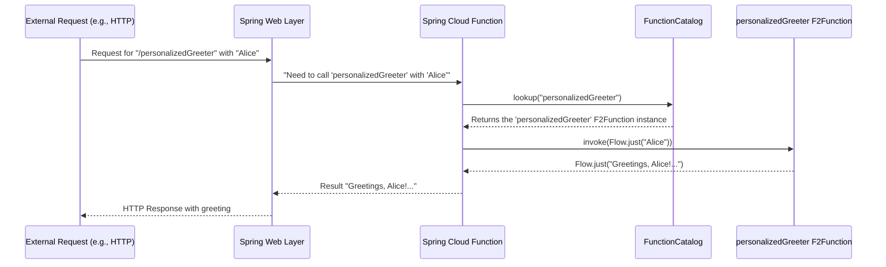

# Chapter 2: Spring Cloud Function Integration & Function Catalog

Welcome to Chapter 2! In [Chapter 1: F2 Functional Primitives (F2Supplier, F2Function, F2Consumer)](01_f2_functional_primitives__f2supplier__f2function__f2consumer__.md), we learned about the basic building blocks of F2: `F2Supplier`, `F2Function`, and `F2Consumer`. We saw how to define these "workers" to perform specific tasks.

Now, you might be wondering: "Great, I've defined these cool functions. How do I actually *use* them in a real application? How can an external system, like a web browser or another service, call them?"

That's exactly what this chapter is about! We'll explore how F2 uses a powerful tool called **Spring Cloud Function** and a concept named the **Function Catalog** to make your F2 primitives accessible and executable.

## The Big Picture: Making Your Functions Reachable

Imagine you've created a fantastic `F2Function` that takes a person's name and returns a personalized greeting.

```kotlin
// Our F2Function from Chapter 1
val personalizedGreeter: F2Function<String, String> = f2Function { nameFlow ->
    nameFlow.map { name -> "Greetings, $name! Welcome to F2." }
}
```

This is neat, but it's just a piece of Kotlin code. How does your main application, particularly if it's a Spring Boot application (a popular way to build web services), know about `personalizedGreeter`? And how could you trigger it, say, when someone visits a URL like `/greet?name=Alice`?

This is where **Spring Cloud Function Integration** comes in. F2 is built on top of Spring Cloud Function.

### What is Spring Cloud Function?

Think of Spring Cloud Function as a clever adapter. It allows you to write your logic as simple functions (like our F2 primitives) and then easily expose them in various ways – common in cloud environments or microservices. For example, it can make your function:
*   Respond to HTTP requests (like a mini web service).
*   Process messages from a queue.
*   React to events.

F2 leverages this capability to make your `F2Supplier`s, `F2Function`s, and `F2Consumer`s available within a Spring Boot application.

### The Function Catalog: Your Functions' "Yellow Pages"

Now, if Spring Cloud Function is going to call your F2 functions, it needs a way to find them. This is where the `FunctionCatalog` comes into play.

The **`FunctionCatalog`** acts like a central directory or a "Yellow Pages" for all your F2 functions that you want to expose. When a request comes in (e.g., over HTTP), Spring, with F2's help, looks up the appropriate function in this catalog using a name and then invokes it.

**Analogy:** Imagine a large office building (your Spring Boot application).
*   Each F2 primitive (`F2Supplier`, `F2Function`, `F2Consumer`) is like an employee with a specific skill.
*   The `FunctionCatalog` is like the reception desk or the employee directory.
*   When a visitor (an incoming request) arrives and asks for "Mr. Greeter," the reception desk (FunctionCatalog) looks up Mr. Greeter and directs the visitor to him.

This mechanism allows your F2 functions to be treated as standard **Spring beans**. A Spring bean is just an object that Spring manages. By making your F2 functions beans, they become first-class citizens in your Spring application.

## How F2 Functions Become Discoverable Spring Beans

So, how do you tell Spring and F2, "Hey, here's an F2 function, please add it to the catalog"? You do this using standard Spring annotations.

Let's take our `personalizedGreeter` and make it a discoverable Spring bean.

1.  **Create a Configuration Class**: In Spring, you often group bean definitions in classes annotated with `@Configuration` or make them components with `@Component`.

2.  **Use the `@Bean` Annotation**: This annotation on a method tells Spring that this method produces an object (a bean) that Spring should manage.

Here's how you'd do it:

```kotlin
import io.komune.f2.dsl.fnc.F2Function
import io.komune.f2.dsl.fnc.f2Function
import kotlinx.coroutines.flow.map
import org.springframework.context.annotation.Bean
import org.springframework.context.annotation.Configuration

@Configuration // Tells Spring this class provides bean definitions
class MyF2FunctionDefinitions {

    @Bean // This makes the returned F2Function a Spring bean
    fun personalizedGreeter(): F2Function<String, String> {
        return f2Function { nameFlow ->
            nameFlow.map { name -> "Greetings, $name! Welcome to F2." }
        }
    }

    // You can define more F2 beans here!
    @Bean
    fun anotherFunction(): F2Supplier<Int> { /* ... */ return f2SupplierSingle { 42 } }
}
```

**What happens here?**

*   `@Configuration`: Marks `MyF2FunctionDefinitions` as a source of bean definitions.
*   `@Bean fun personalizedGreeter(): ...`:
    *   This tells Spring to call the `personalizedGreeter()` method.
    *   The `F2Function<String, String>` object returned by this method becomes a Spring bean.
    *   F2's auto-configuration for Spring Cloud Function will detect this bean.
    *   It will then automatically register this bean into the `FunctionCatalog`. The name used for registration is typically the method name, so in this case, "personalizedGreeter".

Now, your `personalizedGreeter` function is no longer just a standalone piece of code. It's a managed component within your Spring application, listed in the `FunctionCatalog` under the name "personalizedGreeter".

**Input & Output (Conceptual):**

Let's imagine a request comes in that's meant for "personalizedGreeter". (We'll see how requests arrive in [Chapter 4: Protocol Adapters (HTTP & RSocket)](04_protocol_adapters__http___rsocket__.md)).

*   **Input (conceptual)**: A request carrying the name "Alice" and targeting the function "personalizedGreeter".
*   **Process**:
    1.  Spring (via Spring Cloud Function and F2) receives the request.
    2.  It looks up "personalizedGreeter" in the `FunctionCatalog`.
    3.  It finds our F2 function.
    4.  It invokes the function, passing "Alice" as input.
*   **Output (conceptual)**: The function returns "Greetings, Alice! Welcome to F2.", which Spring then sends back as the response.

## Under the Hood: How Registration and Lookup Works

Let's peek behind the curtain to see the main steps involved when your application starts and when a request comes in.

**1. Application Startup & Function Registration:**

```mermaid
graph TD
    A[Spring Boot App Starts] --> B{Scans for @Configuration/@Component classes};
    B --> C{Finds MyF2FunctionDefinitions class};
    C --> D{Finds @Bean method 'personalizedGreeter'};
    D --> E[Spring creates 'personalizedGreeter' F2Function bean];
    E --> F[F2/Spring Cloud Function Auto-Configuration];
    F --> G[FunctionCatalog (BeanFactoryAwareFunctionRegistry)];
    G --> H[Registers 'personalizedGreeter' bean into Catalog];
```

*   When your Spring Boot application starts, it scans for classes annotated with `@Configuration`, `@Component`, etc.
*   It finds `MyF2FunctionDefinitions` and then the `@Bean`-annotated `personalizedGreeter()` method.
*   Spring invokes `personalizedGreeter()` and manages the returned `F2Function` instance as a bean.
*   F2's integration with Spring Cloud Function (specifically, classes like `ContextFunctionCatalogAutoConfiguration` from the `f2-spring-boot-starter-function` module) kicks in.
*   This auto-configuration sets up the `FunctionCatalog`. A key implementation is `BeanFactoryAwareFunctionRegistry`. This registry is "aware" of the Spring `BeanFactory` (where all beans live) and can find your F2 function beans.
*   Your `personalizedGreeter` bean is added to this `FunctionCatalog`, typically using its bean name ("personalizedGreeter").

**2. Handling an Incoming Request (Simplified):**



*   An external request arrives (e.g., an HTTP GET request to `/personalizedGreeter?name=Alice`).
*   The Spring web layer (if it's an HTTP request) or RSocket layer processes this. F2 provides starters like `f2-spring-boot-starter-function-http` and `f2-spring-boot-starter-function-rsocket` which contain components (like `FunctionWebRequestProcessingHelper.java` or `FunctionRSocketMessageHandler.java`) that bridge these protocols to Spring Cloud Function.
*   These components extract the function name (e.g., "personalizedGreeter" from the path) and the input data.
*   Spring Cloud Function is asked to execute this function. It uses the `FunctionCatalog` to find the function: `functionCatalog.lookup("personalizedGreeter")`.
*   The `FunctionCatalog` returns the actual `F2Function` bean instance we defined earlier.
*   Spring Cloud Function then invokes this `F2Function` with the input ("Alice", typically wrapped in a `Flow`).
*   Our `F2Function` executes, producing the greeting.
*   The result is passed back through Spring Cloud Function and then formatted as an appropriate response (e.g., an HTTP response).

**Key Code Components (for the curious):**

*   **`ContextFunctionCatalogAutoConfiguration.java`**: This is a core F2 Spring configuration class.
    *   It sets up the `FunctionRegistry` (which is the `FunctionCatalog`) as a bean.
    ```java
    // Simplified from ContextFunctionCatalogAutoConfiguration.java
    @Bean
    public FunctionRegistry functionCatalog(/*...dependencies...*/) {
        // ... sets up conversion services, message converters ...
        return new BeanFactoryAwareFunctionRegistry(/*...args...*/);
    }
    ```
    This code essentially creates the "Yellow Pages" itself.

*   **`BeanFactoryAwareFunctionRegistry.java`**: This is the default implementation of `FunctionRegistry`.
    *   Its job is to look into Spring's `BeanFactory` (the container holding all beans) and find all beans that are `Supplier`, `Function`, or `Consumer` (including our F2 primitives, as they implement these underlying Java functional interfaces indirectly or are adapted to them). It then registers them.

*   **`FunctionCatalog.lookup(String name, String... acceptedOutputTypes)`**: This is the method (part of Spring Cloud Function's API) used to retrieve a function from the catalog.
    ```java
    // Conceptual - from Spring Cloud Function's FunctionCatalog
    // FunctionInvocationWrapper is a wrapper around your actual function
    FunctionInvocationWrapper lookup(String name, String... acceptedOutputTypes);
    ```
    When a request for "personalizedGreeter" comes in, something similar to `catalog.lookup("personalizedGreeter")` happens internally.

The `f2-spring-boot-starter-function` dependency (mentioned in the README) is crucial because it brings in all this auto-configuration magic that wires up your F2 beans with Spring Cloud Function and the `FunctionCatalog`.

## Conclusion

In this chapter, we've seen how F2 leverages **Spring Cloud Function** to make your [F2 Functional Primitives](01_f2_functional_primitives__f2supplier__f2function__f2consumer__.md) discoverable and executable within a Spring Boot application.

The key takeaways are:
*   You define your F2 primitives (`F2Supplier`, `F2Function`, `F2Consumer`) as standard Kotlin code.
*   By annotating methods that return these primitives with `@Bean` inside a `@Configuration` class, they become Spring-managed beans.
*   F2's integration with Spring Cloud Function automatically detects these beans and registers them into a **`FunctionCatalog`**.
*   The `FunctionCatalog` acts as a central directory, allowing other parts of your application (like HTTP or RSocket handlers) to look up and invoke your F2 functions by name.

This powerful combination makes it simple to expose your functional logic without worrying too much about the complex plumbing of request handling and routing, at least initially. F2 and Spring take care of much of that for you.

Now that we understand how functions are defined and made discoverable, in the [next chapter](03_cqrs__command_query_responsibility_segregation__.md), we'll explore a common architectural pattern that F2 supports very well: [CQRS (Command Query Responsibility Segregation)](03_cqrs__command_query_responsibility_segregation__.md). This will help us organize our functions based on whether they change data (Commands) or just read data (Queries).

---

Generated by [AI Codebase Knowledge Builder](https://github.com/The-Pocket/Tutorial-Codebase-Knowledge)