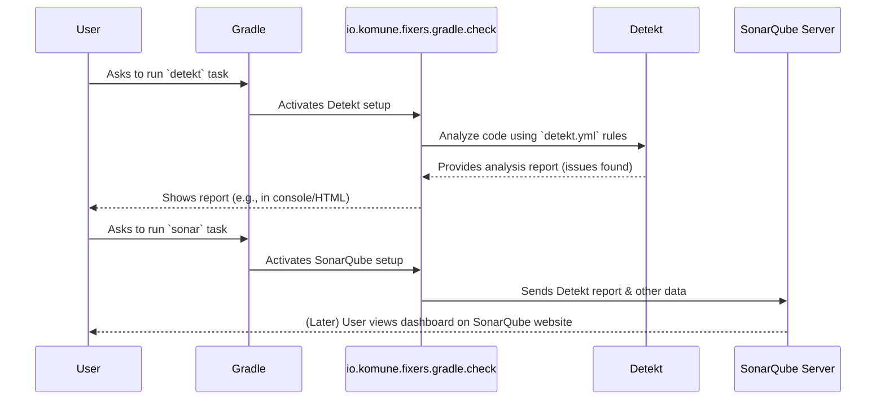

# Chapter 3: Code Quality and Analysis Framework

In [Chapter 2: `fixers` Central Configuration DSL](02__fixers__central_configuration_dsl_.md), we saw how to tell `fixers-gradle` the specific details about our project, like its name and the Java version it uses. Now, let's talk about keeping our actual Kotlin code clean, consistent, and easy to understand. This is where the **Code Quality and Analysis Framework** comes in.

## Why Worry About Code Quality?

Imagine you're building a LEGO castle with a friend. If you both use different colored bricks randomly and connect pieces in messy ways, the final castle might look confusing and could easily fall apart.

Writing code is similar. When you work on a project, especially with others:
*   Everyone might have a slightly different coding style (like using spaces vs. tabs, or how they name things).
*   It's easy to accidentally write code that's overly complicated or has potential hidden bugs.
*   Over time, as the project grows, it can become harder to understand and maintain if there's no consistency.

The **Code Quality and Analysis Framework** in `fixers-gradle` helps solve these problems by providing tools that automatically check your code and give you feedback.

## Your Automated Code Helper and Health Dashboard

Think of this framework as two things working together:

1.  **An Automated Code Reviewer:** This part checks your code for common mistakes, style issues, and overly complex parts *before* you even share it with others. It's like having a very patient assistant who reads your code and points out areas for improvement.
2.  **A Project Health Dashboard:** This part collects information about your code quality over time, showing you trends and highlighting areas that need attention. It's like a dashboard in a car that tells you if everything is running smoothly.

This entire system is primarily set up by the `io.komune.fixers.gradle.check` plugin. It mainly uses two powerful tools:

*   **Detekt:** This is your "automated code reviewer" for Kotlin. It scans your code and checks it against a set of rules.
*   **SonarQube:** This is your "project health dashboard." Detekt can send its findings to SonarQube, which then provides a comprehensive overview of your project's code quality.

And how does Detekt know what rules to check? It uses a special file called `detekt.yml`. This file is like your project's **style guide** or **rule book**, defining what "good code" looks like for your project.

## Setting Up Your Code Quality System

Let's see how `fixers-gradle` helps you put this system in place.

**Step 1: "Hiring" the Code Quality Assistant**

First, you need to apply the `io.komune.fixers.gradle.check` plugin in your `build.gradle.kts` file. This plugin is the expert assistant for code quality. You'll also typically need the `io.komune.fixers.gradle.config` plugin if you plan to use SonarQube, as it allows you to configure SonarQube details centrally.

```kotlin
// build.gradle.kts
plugins {
    // Make sure to use the latest version of fixers-gradle!
    id("io.komune.fixers.gradle.config") version "x.y.z"
    id("io.komune.fixers.gradle.check") version "x.y.z"
    // You might also have other Fixers plugins, e.g., for Kotlin JVM
    // id("io.komune.fixers.gradle.kotlin.jvm") version "x.y.z"
}
```
Adding `io.komune.fixers.gradle.check` tells Fixers to set up Detekt for you. It will also prepare your project to send reports to SonarQube if you configure it.

**Step 2: Defining Your Code's Style Guide (`detekt.yml`)**

Detekt needs a set of rules to check your code against. These rules are defined in a file named `detekt.yml`, which should be in the main directory of your project (the "root" directory).

`fixers-gradle` often provides a default `detekt.yml` file to get you started, which includes many common best-practice rules for Kotlin.

Here’s a tiny peek at what a `detekt.yml` file might contain:

```yaml
# detekt.yml (a very small, illustrative snippet)
style:
  MaxLineLength:
    active: true
    maxLineLength: 120 # Rule: Lines of code shouldn't be longer than 120 characters.
  NoTabs:
    active: true # Rule: We must use spaces for indentation, not tab characters.

complexity:
  LongMethod:
    active: true # Rule: Warn us if a function becomes too long.
```
This file tells Detekt:
*   "Check if any line of code is longer than 120 characters." (`MaxLineLength`)
*   "Make sure there are no tab characters used for spacing." (`NoTabs`)
*   "Let us know if a function (method) seems too long and complex." (`LongMethod`)

You can customize this `detekt.yml` file to fit your team's preferences. It's your project's single source of truth for coding standards.

**Step 3: Connecting to Your Project Health Dashboard (SonarQube - Optional)**

If you want to use SonarQube to track your code quality over time, you need to tell the `check` plugin where your SonarQube server is. You do this in the `fixers { ... }` block (which you learned about in [Chapter 2: `fixers` Central Configuration DSL](02__fixers__central_configuration_dsl_.md)).

```kotlin
// build.gradle.kts (continued)

fixers {
    // ... other configurations like bundle or jdk ...

    sonar {
        organization = "my-company-on-sonarcloud" // Your organization on SonarCloud
        projectKey = "my-awesome-app-key"       // A unique key for this project on SonarQube
        url = "https://sonarcloud.io"         // The address of your SonarQube server
        // For self-hosted SonarQube, this might be "http://localhost:9000"
    }
}
```
These settings tell the plugin how to communicate with your SonarQube instance.

**Step 4: Running the Checks**

Once set up, you can ask Gradle to run the code checks:

*   **To run Detekt locally:**
    Open your terminal or command prompt in your project's root directory and type:
    ```bash
    ./gradlew detekt
    ```
    (On Windows, you might type `gradlew detekt`)

    If Detekt finds any issues based on the rules in `detekt.yml`, it will print them in your console. It might also generate an HTML report (usually in `build/reports/detekt/detekt.html`) that you can open in a web browser to see the issues more clearly.

*   **To send analysis to SonarQube:**
    If you've configured SonarQube (Step 3), you can run:
    ```bash
    ./gradlew sonar
    ```
    This command will run Detekt, gather its results, and then send them (along with other information like test coverage if configured) to your SonarQube server. You can then visit your SonarQube dashboard to see the project's health.

## What Happens Under the Hood?

When you apply the `io.komune.fixers.gradle.check` plugin and run these tasks, Fixers is doing several things for you:

**A Non-Code Walkthrough:**

1.  **Plugin Activation:** You apply the `io.komune.fixers.gradle.check` plugin.
2.  **Detekt Setup:** The plugin automatically:
    *   Applies the official Detekt Gradle plugin.
    *   Tells Detekt to use the `detekt.yml` file from your project root. If it's not there, Fixers might provide a default one.
    *   Creates Gradle tasks like `detekt`.
3.  **SonarQube Setup (if configured):**
    *   Applies the official SonarQube Gradle plugin.
    *   Reads the SonarQube server details (`organization`, `projectKey`, `url`) from your `fixers { sonar { ... } }` block.
    *   Configures the SonarQube plugin to use these details.
    *   Tells SonarQube where to find Detekt's report (e.g., `build/reports/detekt/detekt.xml`).
    *   Creates Gradle tasks like `sonar`.
4.  **Execution:**
    *   When you run `./gradlew detekt`, the Detekt plugin scans your Kotlin files using the rules from `detekt.yml` and generates a report.
    *   When you run `./gradlew sonar`, the SonarQube plugin collects the Detekt report (and other data) and sends it to the configured SonarQube server.

**Visualizing the Process:**

Here's a simplified diagram of what happens when you run the checks:



**A Glimpse into the Code (Conceptual):**

The `io.komune.fixers.gradle.check` plugin essentially writes Gradle configuration code for you.

*   **Setting up Detekt (Simplified Concept):**
    ```kotlin
    // Conceptual: Inside FixersCheckPlugin, how Detekt might be configured
    // (This is not code you write, but what the plugin does for you)

    // project.plugins.apply("io.gitlab.arturbosch.detekt") // Apply Detekt's own plugin
    // project.configure<DetektExtension> { // Configure Detekt
    //   config.setFrom(project.file("detekt.yml")) // Tell Detekt where to find its rules
    //   reports {
    //     xml.required.set(true) // Needed for SonarQube
    //     html.required.set(true) // Nice for local viewing
    //   }
    // }
    ```
    This snippet shows the Fixers plugin applying the Detekt plugin and telling it where to find the `detekt.yml` rule file and what kind of reports to create.

*   **Setting up SonarQube (Simplified Concept):**
    ```kotlin
    // Conceptual: Inside FixersCheckPlugin, how SonarQube might be configured
    // (This is not code you write, but what the plugin does for you)

    // val sonarSettings = project.extensions.getByType(FixersExtensionConfig::class.java).sonar
    // project.plugins.apply("org.sonarqube") // Apply SonarQube's own plugin
    // project.configure<SonarExtension> { // Configure SonarQube
    //   properties {
    //     property("sonar.projectKey", sonarSettings.projectKey)
    //     property("sonar.organization", sonarSettings.organization)
    //     property("sonar.host.url", sonarSettings.url)
    //     // Tell SonarQube where to find Detekt's XML report
    //     property("sonar.kotlin.detekt.reportPaths", "build/reports/detekt/detekt.xml")
    //   }
    // }
    ```
    This shows the Fixers plugin reading your SonarQube settings from the `fixers { sonar { ... } }` block and passing them to the SonarQube plugin. It also tells SonarQube how to find the results from Detekt.

By doing this automation, the `fixers-gradle` plugin saves you from writing a lot of boilerplate configuration for these quality tools.

## Conclusion

The **Code Quality and Analysis Framework**, powered by the `io.komune.fixers.gradle.check` plugin, is your ally in writing better Kotlin code. It brings in tools like:

*   **Detekt** to act as an automated code reviewer, checking your code against rules in `detekt.yml`.
*   **SonarQube** (optional) to serve as a project health dashboard, giving you a long-term view of your code quality.

Using this framework helps ensure your code is consistent, easier to maintain, and has fewer potential bugs. It makes teamwork smoother because everyone is guided by the same coding standards.

Now that your code is well-structured and checked for quality, you might want to share it with the world as a library. In the next chapter, we'll explore the [Artifact Publication System](04_artifact_publication_system_.md) which helps you do just that.

---

Generated by [AI Codebase Knowledge Builder](https://github.com/The-Pocket/Tutorial-Codebase-Knowledge)