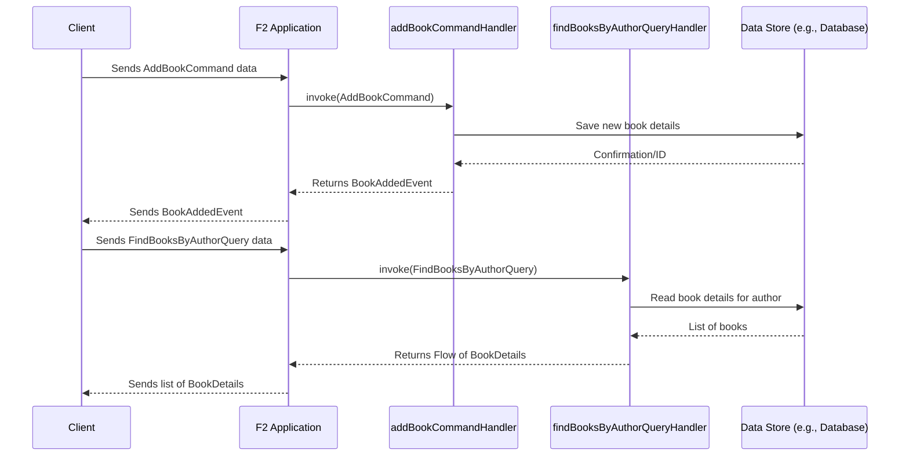

# Chapter 3: CQRS (Command Query Responsibility Segregation)

In [Chapter 2: Spring Cloud Function Integration & Function Catalog](02_spring_cloud_function_integration___function_catalog_.md), we saw how to define our F2 functions and make them discoverable and callable within a Spring Boot application. Now, let's think about how to organize these functions based on what they *do*. This leads us to an important architectural pattern: **CQRS (Command Query Responsibility Segregation)**.

## What's the Big Idea with CQRS?

Imagine you're building an application to manage a community library. There are generally two kinds of things you'd do:

1.  **Change things:**
    *   Add a new book to the catalog.
    *   Register a new library member.
    *   Update a member's address.
    *   Mark a book as borrowed.

2.  **Look at things:**
    *   Search for books by a specific author.
    *   View a member's borrowing history.
    *   See how many copies of a particular book are available.

CQRS is an architectural pattern that says these two types of operations – changing data (Commands) and reading data (Queries) – are fundamentally different and should be treated separately.

*   **Commands**: These are operations that intend to change the state of your system. They usually don't return much data, perhaps just an acknowledgment that the command was accepted or an event indicating what happened.
*   **Queries**: These are operations that retrieve data from your system. Importantly, they *do not* change any state. They are side-effect-free.

F2 is designed to facilitate this separation. It provides specific interfaces like `Command`, `Query`, and `Event` to help you clearly distinguish between these operations.

Why bother with this separation?
*   **Scalability**: You might have many more read operations (queries) than write operations (commands), or vice-versa. Separating them allows you to scale each part independently. For instance, you could have many servers handling book searches but fewer servers handling new book additions.
*   **Maintainability**: Code for writing data often has different concerns (validation, business rules, transactions) than code for reading data (data shaping, performance optimization for reads). Separating them makes each part simpler and easier to maintain.
*   **Easier to Reason About**: When you look at a `Command`, you know it's going to change something. When you see a `Query`, you know it's safe to call repeatedly without side effects.

## F2's Building Blocks for CQRS

F2 provides a few simple, yet powerful, marker interfaces in its `f2-dsl-cqrs` module to help you implement CQRS. These interfaces don't have methods themselves; they just help you categorize your data transfer objects (DTOs).

First, make sure you have the `f2-dsl-cqrs` dependency. As mentioned in the project's `README.md`:
*   Gradle:
    ```gradle
    implementation("io.komune.f2:f2-dsl-cqrs:${Versions.f2}")
    ```
*   Maven:
    ```xml
    <dependency>
      <groupId>io.komune.f2</groupId>
      <artifactId>f2-dsl-cqrs</artifactId>
      <version>${Versions.f2}</version>
    </dependency>
    ```

Here are the core interfaces:

```kotlin
// From f2-dsl-cqrs
interface Message // A base interface for all CQRS messages

interface Command : Message // Marks a DTO as a command
interface Query : Message   // Marks a DTO as a query
interface Event : Message   // Marks a DTO as an event, often a result of a command
```
*   `Message`: A general type for any data structure used in this pattern.
*   `Command`: You'll create classes implementing this to represent actions that change state.
*   `Query`: You'll create classes implementing this to represent requests for data.
*   `Event`: You'll create classes implementing this to represent something significant that has happened, often as a result of a command being processed.

### Defining Your Commands, Queries, and Events

Let's go back to our library example.

**1. A Command to Add a Book:**
We need to define a data structure that carries the information needed to add a new book.

```kotlin
import io.komune.f2.dsl.cqrs.Command

// Represents the intention to add a new book
data class AddBookCommand(
    val title: String,
    val author: String,
    val isbn: String
) : Command
```
This `AddBookCommand` clearly states what it is: a command. It bundles the data needed to perform the action.

**2. An Event for When a Book is Added:**
After a book is successfully added, we might want to signal this. An `Event` is perfect for this.

```kotlin
import io.komune.f2.dsl.cqrs.Event
import java.util.UUID // For generating a unique ID

// Represents the fact that a book was successfully added
data class BookAddedEvent(
    val bookId: String = UUID.randomUUID().toString(), // Let's assign a unique ID
    val title: String,
    val author: String,
    val isbn: String
) : Event
```
The `BookAddedEvent` contains information about the book that was added. Other parts of the system could listen for this event.

**3. A Query to Find Books by Author:**
Now, let's define a query to search for books.

```kotlin
import io.komune.f2.dsl.cqrs.Query

// Represents a request to find books by a specific author
data class FindBooksByAuthorQuery(
    val author: String
) : Query
```
The `FindBooksByAuthorQuery` carries the criteria for the search.

**4. A Data Structure for Query Results:**
When we query for books, we need a way to represent the book information we send back. This isn't an `Event`, just a data structure.

```kotlin
// Represents the details of a book returned by a query
data class BookDetails(
    val bookId: String,
    val title: String,
    val author: String,
    val isbn: String
)
// Note: This doesn't need to implement Query or Event.
// It's just the data structure for the query's result.
```

## Implementing Handlers with F2 Functions

Now that we have our `Command`, `Query`, and `Event` DTOs, how do we actually process them? This is where the [F2 Functional Primitives (F2Supplier, F2Function, F2Consumer)](01_f2_functional_primitives__f2supplier__f2function__f2consumer__.md) come into play.

*   **Command Handlers**: Typically, an `F2Function` will take a `Command` as input and might return an `Event` (or `Unit` if no specific event needs to be published immediately).
*   **Query Handlers**: An `F2Function` will take a `Query` as input and return the requested data (e.g., a `BookDetails` object or a `Flow<BookDetails>`).

Let's create the handlers for our library example. Remember from [Chapter 2](02_spring_cloud_function_integration___function_catalog_.md) how to make these discoverable Spring beans.

**Command Handler for `AddBookCommand`:**

```kotlin
import io.komune.f2.dsl.fnc.F2Function
import io.komune.f2.dsl.fnc.f2Function // Helper from f2-dsl-function
import org.springframework.context.annotation.Bean
import org.springframework.context.annotation.Configuration
import kotlinx.coroutines.flow.Flow
import kotlinx.coroutines.flow.flowOf

@Configuration
class LibraryCommandHandlers {

    @Bean
    fun addBookCommandHandler(): F2Function<AddBookCommand, BookAddedEvent> {
        return f2Function { commandFlow ->
            commandFlow.map { command ->
                // In a real app, you'd save to a database here
                println("COMMAND: Adding book: ${command.title} by ${command.author}")

                // Create and return the event
                BookAddedEvent(
                    title = command.title,
                    author = command.author,
                    isbn = command.isbn
                )
            }
        }
    }
}
```
*   This `F2Function` takes a `Flow<AddBookCommand>` (though typically a command is a single item).
*   It processes each command (here, just printing and then creating an event).
*   It returns a `Flow<BookAddedEvent>`.
*   The `@Bean` annotation makes it discoverable by Spring and F2's function catalog, likely under the name "addBookCommandHandler".

**Query Handler for `FindBooksByAuthorQuery`:**

```kotlin
import io.komune.f2.dsl.fnc.F2Function
import io.komune.f2.dsl.fnc.f2Function
import org.springframework.context.annotation.Bean
import org.springframework.context.annotation.Configuration
import kotlinx.coroutines.flow.Flow
import kotlinx.coroutines.flow.flowOf
import kotlinx.coroutines.flow.map // For transforming the flow

// Assuming BookDetails and FindBooksByAuthorQuery are defined as above

@Configuration
class LibraryQueryHandlers {

    // A pretend database of books
    private val booksDatabase = mutableListOf(
        BookDetails("1", "The Great Gatsby", "F. Scott Fitzgerald", "123"),
        BookDetails("2", "To Kill a Mockingbird", "Harper Lee", "456"),
        BookDetails("3", "Another Book by F. Scott Fitzgerald", "F. Scott Fitzgerald", "789")
    )

    @Bean
    fun findBooksByAuthorQueryHandler(): F2Function<FindBooksByAuthorQuery, Flow<BookDetails>> {
        return f2Function { queryFlow ->
            queryFlow.map { query ->
                println("QUERY: Finding books by author: ${query.author}")
                // In a real app, you'd query a database here
                val foundBooks = booksDatabase.filter { it.author == query.author }
                flowOf(*foundBooks.toTypedArray()) // Return a Flow of found books
            }
        }
    }
}
```
*   This `F2Function` takes a `Flow<FindBooksByAuthorQuery>`.
*   It processes each query (here, filtering an in-memory list).
*   It returns a `Flow<Flow<BookDetails>>`. The outer flow is due to the `f2Function` input being a flow. For a single query producing multiple results, the inner `Flow<BookDetails>` is the stream of matching books. F2 handles unwrapping this.
    *   *Correction for typical single query to multiple results*: A more common signature when a single query can result in multiple items is `F2Function<FindBooksByAuthorQuery, BookDetails>`. F2's framework can then handle collecting multiple `BookDetails` items if the underlying implementation emits a `Flow`. For simplicity here, we'll stick to the `Flow<BookDetails>` as the direct return type of the function lambda's processing of *each* query in the input flow. F2 expects the function to return a `Flow<R>`. So, if the query itself yields a stream, this becomes `Flow<Flow<R>>`. More practically, if your function `myQueryHandler(): F2Function<MyQuery, MyResultItem>` returns a flow of items, it should be declared as `f2Function { queryFlow -> queryFlow.flatMapConcat { query -> logicReturningFlowOfItems(query) } }`. For simplicity for a beginner, let's assume the function processes one query and returns one flow of results.

Let's refine the query handler return for typical use where one query object leads to a flow of results:
```kotlin
// imports and @Configuration as above...
// @Bean
fun findBooksByAuthorQueryHandlerRefined(): F2Function<FindBooksByAuthorQuery, BookDetails> {
    return f2Function { queryFlow -> // queryFlow is Flow<FindBooksByAuthorQuery>
        queryFlow.flatMapConcat { query -> // Process each query in the input flow
            println("QUERY: Finding books by author: ${query.author}")
            val foundBooks = booksDatabase.filter { it.author == query.author }
            flowOf(*foundBooks.toTypedArray()) // This is Flow<BookDetails>
        }
    }
}
// When called, Spring Cloud Function & F2 adapt this. If a single query object is sent,
// it's wrapped in a Flow, processed, and the resulting Flow<BookDetails> is returned.
```
This `F2Function<FindBooksByAuthorQuery, BookDetails>` means it transforms `FindBooksByAuthorQuery` *items* into `BookDetails` *items*. The `Flow` aspect is handled by the F2Function signature itself (`suspend (Flow<T>) -> Flow<R>`).

## Handling Many Results: Pagination

What if our `FindBooksByAuthorQuery` could return thousands of books? Sending them all at once might be inefficient or overwhelming. This is where pagination comes in. F2 provides helpers for this common pattern.

From the `f2-dsl-cqrs` module (as shown in the `README.md`):
*   `PageQueryDTO`: An interface for queries that support pagination.
*   `OffsetPaginationDTO`: A specific way to define pagination (skip `offset` items, take `limit` items).
*   `PageQueryResultDTO<OBJECT>`: An interface for results that are paginated.
*   `Page<OBJECT>`: A concrete class often used to hold a page of items and the total count.

Let's modify our query to support pagination:

**1. Update the Query DTO:**

```kotlin
import io.komune.f2.dsl.cqrs.Query
import io.komune.f2.dsl.cqrs.PageQueryDTO
import io.komune.f2.dsl.cqrs.OffsetPaginationDTO

data class FindPagedBooksByAuthorQuery(
    val author: String,
    override val pagination: OffsetPaginationDTO? // Make it nullable for optional pagination
) : PageQueryDTO // Implement the F2 interface
```

**2. Update the Query Result DTO (or use F2's generic one):**
F2 provides `PageQueryResultDTO` and `PageQueryResult`.

```kotlin
import io.komune.f2.dsl.cqrs.Event // PageQueryResultDTO often extends Event
import io.komune.f2.dsl.cqrs.PageQueryResultDTO
import io.komune.f2.dsl.cqrs.OffsetPaginationDTO
import io.komune.f2.dsl.cqrs.Page // F2's Page class

// Concrete implementation for our paged book results
data class PagedBookResults(
    override val items: List<BookDetails>,
    override val total: Int,
    override val pagination: OffsetPaginationDTO? // Echo back the pagination used
) : PageQueryResultDTO<BookDetails>
```

**3. Update the Query Handler:**

```kotlin
// In LibraryQueryHandlers class from before...
// @Bean
fun findPagedBooksByAuthorQueryHandler(): F2Function<FindPagedBooksByAuthorQuery, PagedBookResults> {
    return f2Function { queryFlow ->
        queryFlow.map { query ->
            println("QUERY: Finding paged books by author: ${query.author}, page: ${query.pagination}")
            val allBooksByAuthor = booksDatabase.filter { it.author == query.author }
            val total = allBooksByAuthor.size

            val pageItems = query.pagination?.let { page ->
                allBooksByAuthor.drop(page.offset).take(page.limit)
            } ?: allBooksByAuthor // If no pagination, return all

            PagedBookResults(
                items = pageItems,
                total = total,
                pagination = query.pagination
            )
        }
    }
}
```
*   This handler now expects a `FindPagedBooksByAuthorQuery`.
*   It uses the `pagination` info (if provided) to slice the results.
*   It returns a `PagedBookResults` object containing the current page of items, the total number of matching items, and the pagination criteria.

F2's `Page` and pagination DTOs (`OffsetPagination`, `PagePagination`) provide a standardized way to request and return paged data.

## Under the Hood: How Does This Separation Work?

CQRS is primarily a design pattern that *you* enforce by using separate models (Command DTOs, Query DTOs) and separate handlers. F2 provides the `Command`, `Query`, and `Event` marker interfaces to make this intent clear and to potentially allow for framework-level optimizations or tooling in the future based on these types.

When a request comes into your F2 application:
1.  The request is mapped to a specific F2 function (as seen in [Chapter 2](02_spring_cloud_function_integration___function_catalog_.md)).
2.  The input payload is deserialized into your `Command` or `Query` DTO.
3.  The corresponding `F2Function` (your command handler or query handler) is invoked.
    *   **Command Path**: The handler performs actions, potentially interacts with a database (write operations), and might produce an `Event`.
    *   **Query Path**: The handler retrieves data (read-only operations) and returns it.

Here's a simplified diagram showing the different paths:



The key is that the `AddBookCmdHandler` is responsible for *changes*, while the `FindBooksQueryHandler` is only responsible for *reads*. They could even use different database connections or entirely different data models optimized for their specific tasks (though that's a more advanced CQRS topic).

## Conclusion

You've now learned about **CQRS (Command Query Responsibility Segregation)**, a powerful pattern for organizing the logic in your applications.
*   **Commands** change state.
*   **Queries** read state (and don't change it).
*   F2 facilitates this by providing marker interfaces: `Command`, `Query`, and `Event`.
*   You implement the logic for these using [F2 Functional Primitives (F2Supplier, F2Function, F2Consumer)](01_f2_functional_primitives__f2supplier__f2function__f2consumer__.md).
*   F2 also provides helpers for common patterns like pagination with `PageQueryDTO` and `PageQueryResultDTO`.

This separation leads to systems that can be easier to scale, maintain, and reason about.

So far, we've defined functions and organized them using CQRS principles. But how do external clients actually send these commands and queries to our application? In the [next chapter: Protocol Adapters (HTTP & RSocket)](04_protocol_adapters__http___rsocket__.md), we'll explore how F2 exposes these functions over common network protocols like HTTP and RSocket.

---

Generated by [AI Codebase Knowledge Builder](https://github.com/The-Pocket/Tutorial-Codebase-Knowledge)