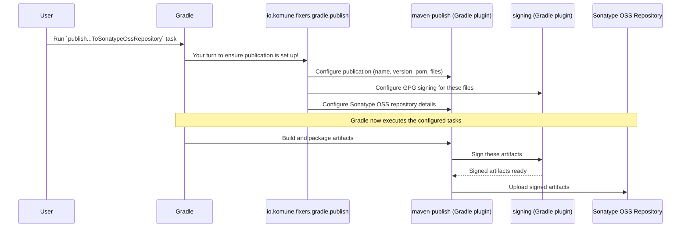

# Chapter 4: Artifact Publication System

In [Chapter 3: Code Quality and Analysis Framework](03_code_quality_and_analysis_framework_.md), we learned how `fixers-gradle` helps keep our Kotlin code neat and tidy. Now, what if you've written a fantastic piece of code—perhaps a useful library—and you want to share it with other developers or use it in other projects? This is where the **Artifact Publication System** comes in.

## What's This "Shipping Department" All About?

Imagine you've built an amazing LEGO model, and you want to send it to a friend or display it in a LEGO museum. You can't just throw the bricks in a bag! You'd carefully:
1.  Package it (maybe disassemble parts and put them in labeled bags).
2.  Include instructions (metadata about what it is).
3.  Address it correctly for the museum (the repository).
4.  Use a reliable shipping service.

The **Artifact Publication System** in `fixers-gradle` is like your project's dedicated shipping department. It helps you package your project's outputs (called "artifacts") and send them to central "warehouses" (called "artifact repositories") where others can find and use them.

**Key Terms for Beginners:**

*   **Artifact:** This is the actual "thing" your project produces that you want to share.
    *   For a Kotlin/JVM library, it's usually a `.jar` file (Java Archive) containing your compiled code, plus some metadata.
    *   For a Kotlin/JS library, it might be a package ready for the NPM (Node Package Manager) ecosystem.
*   **Artifact Repository:** This is a central server where artifacts are stored and managed. Think of it like a public library for code.
    *   **Maven Central** (often accessed via Sonatype OSS) is a very popular repository for JVM libraries.
    *   **NPM Registry** is the main repository for JavaScript and Node.js packages (including Kotlin/JS ones).
*   **Publication:** This is the process of packaging your artifact with all its necessary information (name, version, dependencies) and uploading it to an artifact repository.

`fixers-gradle` has specific plugins to handle this "shipping" process:
*   `io.komune.fixers.gradle.publish`: This plugin takes care of publishing Kotlin/JVM libraries to Maven repositories.
*   `io.komune.fixers.gradle.npm`: This plugin manages publishing Kotlin/JS packages to the NPM registry.

These plugins automate a lot of the complex setup usually required for publication.

## Use Case 1: Publishing Your Kotlin/JVM Library to Maven Central

Let's say you've created a super helpful Kotlin library (e.g., `my-cool-library`) that you want other Java or Kotlin developers to use. You'd typically publish it to Maven Central.

**Step 1: Make Sure Your Project is "Described"**

Before you can publish, your library needs an identity card. As we saw in [Chapter 2: `fixers` Central Configuration DSL](02__fixers__central_configuration_dsl_.md), you define this in the `fixers { ... }` block. This information is crucial for publication.

```kotlin
// build.gradle.kts
fixers {
    bundle {
        name = "my-cool-library"
        version = "1.0.0"
        description = "A very cool Kotlin library for doing awesome things."
        url = "https://github.com/your-username/my-cool-library"
        // You'll also need to configure licenses and developer info for real publication
        // but Fixers helps set up the structure for that.
    }
    // ... other settings like jdk ...
}
```
This `bundle` block provides the name, version, and other details that will go into your library's "shipping label" (called a POM file in the Maven world).

**Step 2: "Hire" the Maven Publishing Assistant**

Now, apply the `io.komune.fixers.gradle.publish` plugin in your `build.gradle.kts`. You'll also typically have a Kotlin JVM plugin and the `config` plugin.

```kotlin
// build.gradle.kts
plugins {
    id("io.komune.fixers.gradle.config") version "x.y.z" // Use latest version
    id("io.komune.fixers.gradle.kotlin.jvm") version "x.y.z" // For a JVM library
    id("io.komune.fixers.gradle.publish") version "x.y.z" // The publishing assistant
}
```
This tells Fixers, "Okay, I want to set this project up for Maven publication."

**Step 3: Provide Your "Shipping Account" Credentials**

To publish to a place like Sonatype OSS (which syncs to Maven Central), you need an account and a way to prove it's you. This usually involves:
*   Username and password/token for Sonatype.
*   A GPG key to digitally "sign" your artifacts, proving they haven't been tampered with.

You typically store these credentials securely in your `gradle.properties` file (in your user's `.gradle` directory or project root, but **be careful not to commit sensitive credentials to public Git repositories!**) or as environment variables. Fixers expects properties like:

```properties
# Example in gradle.properties (DO NOT commit real secrets to public git)
PKG_SONATYPE_OSS_USERNAME=your_sonatype_username
PKG_SONATYPE_OSS_TOKEN=your_sonatype_password_or_token
GPG_SIGNING_KEY=your_gpg_key_id_or_actual_key_content
GPG_SIGNING_PASSWORD=your_gpg_key_passphrase
```
Fixers will automatically try to pick up these standard properties.

**Step 4: Tell Gradle to "Ship It!"**

Once everything is configured, you can run the Gradle task to publish. For Sonatype OSS, the task is often:

```bash
./gradlew publishAllPublicationsToSonatypeOssRepository
```
(Or `gradlew publishAllPublicationsToSonatypeOssRepository` on Windows).
For testing locally first, you can often use `./gradlew publishToMavenLocal`.

**What happens?**
The `publish` plugin, along with standard Gradle plugins it configures, will:
1.  Compile your Kotlin code into a `.jar` file.
2.  Automatically create a `pom.xml` file (the "shipping label") using the info from your `fixers.bundle`.
3.  Optionally create JARs for your source code (`-sources.jar`) and documentation (`-javadoc.jar`), which is good practice.
4.  Sign all these files with your GPG key.
5.  Upload them to the Sonatype OSS repository. (From there, you usually need to log into Sonatype's website to "release" them to Maven Central).

Phew! That's a lot of steps, but `fixers-gradle` automates most of the setup for you!

## Use Case 2: Publishing Your Kotlin/JS Package to NPM

Now, let's say your Kotlin project targets JavaScript (perhaps it's a Kotlin Multiplatform project with a JS target, or a pure Kotlin/JS project). You'd want to publish it to the NPM registry.

**Step 1: Describe Your Package (Again, `fixers` Block)**

Similar to Maven, NPM packages need a `package.json` file, which is their identity card. `fixers-gradle` helps generate this. You'll use the `fixers.bundle` for general info and `fixers.npm` for NPM-specifics.

```kotlin
// build.gradle.kts
fixers {
    bundle {
        name = "my-awesome-js-util" // This becomes part of the NPM package name
        version = "0.2.0"
        description = "A handy utility for JavaScript, written in Kotlin!"
        url = "https://github.com/your-username/my-awesome-js-util"
    }
    npm {
        organization = "your-npm-username" // Or your NPM organization
        publish = true // Important: tells Fixers to set up for NPM publishing
        // 'version' can also be set here, often defaults to fixers.bundle.version
    }
    // ... other settings ...
}
```
The final NPM package name will often be `@your-npm-username/my-awesome-js-util`.

**Step 2: "Hire" the NPM Publishing Assistant**

Apply the `io.komune.fixers.gradle.npm` plugin. You'll also need a plugin that sets up your Kotlin/JS compilation (like `io.komune.fixers.gradle.kotlin.mpp` or the standard Kotlin JS plugin).

```kotlin
// build.gradle.kts
plugins {
    id("io.komune.fixers.gradle.config") version "x.y.z"
    id("io.komune.fixers.gradle.kotlin.mpp") version "x.y.z" // Example for KMP
    id("io.komune.fixers.gradle.npm") version "x.y.z"     // NPM publishing assistant
}
```

**Step 3: Log In to NPM**

To publish to NPM, you need an NPM account and to be logged in via your terminal. You typically do this once:

```bash
npm login
```
And follow the prompts. This saves your credentials locally in a `.npmrc` file.

**Step 4: Tell Gradle to "Ship It" (NPM style!)**

The Kotlin Gradle plugin usually provides a task to publish to NPM. The `fixers.npm` plugin ensures this is configured correctly using your `fixers` block settings. The task is often:

```bash
./gradlew npmPublish
```

**What happens?**
1.  Your Kotlin/JS code is compiled to JavaScript.
2.  A `package.json` file is generated using info from `fixers.bundle` and `fixers.npm`.
3.  Your JavaScript files and the `package.json` are bundled into an NPM package.
4.  This package is uploaded to the NPM registry under your organization/username.

Again, `fixers-gradle` simplifies the configuration of this process significantly!

## How Does It Work Under the Hood? (The Shipping Department's Secrets)

Let's peek into how `fixers-gradle` manages Maven publication as an example.

**A Non-Code Walkthrough (Maven Publication):**

1.  **You Apply Plugins:** You add `io.komune.fixers.gradle.publish` and `io.komune.fixers.gradle.config` to your `build.gradle.kts`.
2.  **Fixers Reads Settings:** The `publish` plugin reads your project's identity (name, version, etc.) from the `fixers.bundle` block you defined.
3.  **Standard Tools Engaged:** The `publish` plugin then automatically applies and configures two standard Gradle plugins:
    *   `maven-publish`: The official Gradle plugin for publishing to Maven repositories.
    *   `signing`: The official Gradle plugin for GPG signing artifacts.
4.  **Configuration Automation:** The `fixers-gradle` plugin tells these standard plugins:
    *   *To `maven-publish`*: "Here's the artifact name (`my-cool-library`), version (`1.0.0`), what files to include (the main JAR, sources JAR, Javadoc JAR), and how to write the `pom.xml` file."
    *   *To `signing`*: "You need to sign all the files that `maven-publish` prepares."
    *   *To `maven-publish` (again)*: "Here are the details for the Sonatype OSS repository (URL, and how to get credentials which you'll find from `gradle.properties` like `PKG_SONATYPE_OSS_USERNAME`)."
5.  **Execution:** When you run `./gradlew publishAllPublicationsToSonatypeOssRepository`:
    *   Gradle tells `maven-publish` to prepare everything.
    *   `maven-publish` asks `signing` to sign the files.
    *   `maven-publish` then uploads the signed files to Sonatype.

**Visualizing the Maven Shipping Process:**



**A Glimpse into the (Conceptual) Code:**

What `io.komune.fixers.gradle.publish` does is essentially write this kind of Gradle configuration for you:

```kotlin
// Conceptual: Simplified look inside io.komune.fixers.gradle.publish
// (You DON'T write this, Fixers plugin does it for you!)

// 1. Apply standard plugins
// project.plugins.apply("maven-publish")
// project.plugins.apply("signing")

// 2. Get bundle info from 'fixers' block
// val fixersConfig = project.extensions.getByType(FixersExtensionConfig::class.java)
// val bundleInfo = fixersConfig.bundle

// 3. Configure 'maven-publish'
// project.configure<PublishingExtension> {
//     publications {
//         create<MavenPublication>("mavenJava") { // Or a name based on target
//             from(project.components.getByName("java")) // Or "kotlin" for KMP
//             artifactId = bundleInfo.name
//             version = bundleInfo.version
//             // Automatically add pom details like description, url, license, developers
//             pom.withXml { /* ... configure pom ... */ }
//         }
//     }
//     repositories {
//         maven {
//             name = "SonatypeOss"
//             url = uri("https://s01.oss.sonatype.org/service/local/") // Or /content/repositories/snapshots/
//             // Credentials configured to be read from gradle.properties
//         }
//     }
// }

// 4. Configure 'signing'
// project.configure<SigningExtension> {
//   // Tell signing to sign all publications if GPG keys are present
//   val publications = project.extensions.getByType<PublishingExtension>().publications
//   sign(publications)
// }
```
The `fixers-gradle` plugin contains much more sophisticated logic to handle different project types (JVM, MPP) and to correctly set up all the metadata, but this gives you the basic idea. It saves you from writing and maintaining many lines of complex build script code!

The `io.komune.fixers.gradle.npm` plugin works similarly: it uses the information from `fixers.bundle` and `fixers.npm` to configure the Kotlin/JS plugin's built-in NPM publishing capabilities or an underlying NPM Gradle plugin, ensuring the `package.json` is correct and the right tasks are invoked.

## Conclusion

The **Artifact Publication System** in `fixers-gradle`, through plugins like `io.komune.fixers.gradle.publish` (for Maven) and `io.komune.fixers.gradle.npm` (for NPM), acts as your project's efficient shipping department. It helps you:

*   Easily package your Kotlin libraries and applications.
*   Configure them with the correct metadata (name, version, description, etc.) by reading from the central `fixers { ... }` block ([Chapter 2: `fixers` Central Configuration DSL](02__fixers__central_configuration_dsl_.md)).
*   Automate the setup for publishing to standard repositories like Maven Central and NPM.
*   Reduce a lot of complex boilerplate configuration in your build scripts.

By simplifying publication, `fixers-gradle` makes it easier to share your valuable Kotlin creations with the wider development community.

Now that your code is high quality, and you know how to publish it, what about making it understandable to users and other developers through documentation? In the next chapter, we'll explore the [Storybook Documentation Environment](05_storybook_documentation_environment_.md), which is especially useful for UI components.

---

Generated by [AI Codebase Knowledge Builder](https://github.com/The-Pocket/Tutorial-Codebase-Knowledge)