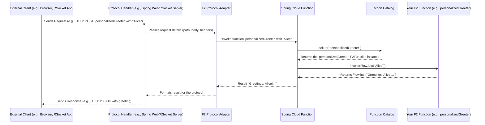

# Chapter 4: Protocol Adapters (HTTP & RSocket)

In [Chapter 3: CQRS (Command Query Responsibility Segregation)](03_cqrs__command_query_responsibility_segregation__.md), we learned how to organize our F2 functions into Commands (that change data) and Queries (that read data). We've also seen in [Chapter 2: Spring Cloud Function Integration & Function Catalog](02_spring_cloud_function_integration___function_catalog_.md) how these functions become discoverable beans within our application.

But how does the outside world – like a web browser, a mobile app, or another backend service – actually *talk* to these functions? That's where **Protocol Adapters** come in!

## Why Do We Need Protocol Adapters? The "Doorway" Analogy

Imagine your application is a house, and your F2 functions are different rooms or services inside that house (like a kitchen that prepares food, or a library that provides books). For anyone outside to use these services, they need a way to enter the house and make a request.

**Protocol Adapters** are like the different doors and windows to your application house. They allow communication using different "languages" or methods (protocols).

You've written your F2 function logic once. For example, you might have a `personalizedGreeter` function:
```kotlin
// Defined in a @Configuration class with @Bean
// fun personalizedGreeter(): F2Function<String, String> = f2Function { nameFlow ->
//     nameFlow.map { name -> "Greetings, $name! Welcome to F2." }
// }
```
This function is ready to greet someone. But how does "Alice" from the internet send her name to this function and get the greeting back? She needs a communication protocol, and your F2 application needs an adapter for that protocol.

## Meet the Protocols: HTTP and RSocket

F2 functions can be exposed over different network protocols. Think of these protocols as different ways to communicate:

### HTTP: The Reliable Old Mail

**HTTP (HyperText Transfer Protocol)** is like traditional mail. It's a request-response system:
1.  A client (like your web browser) sends a request (a letter) to a server.
2.  The server processes the request and sends a response (a reply letter) back.

HTTP is incredibly common, especially for web APIs (Application Programming Interfaces). If you've ever visited a website or used a web service, you've used HTTP. It's well-understood and widely supported.

### RSocket: The Speedy Modern Courier

**RSocket** is like a modern, high-speed courier service. It's a newer binary protocol designed for high-performance, efficient communication. It offers more advanced features than traditional HTTP, such as:
*   **Bi-directional streaming**: Both the client and server can send multiple messages back and forth over a single connection (like an ongoing conversation rather than just one letter and one reply).
*   **Low latency**: It's designed to be fast.
*   **Multiple interaction models**: Beyond simple request-response, it supports fire-and-forget (send a message without expecting a reply), request-stream (request once, get many responses), and channel (both sides stream).

RSocket is excellent for more complex interactions, real-time data, or communication between microservices where performance is key.

## F2 Adapters: One Function, Many Doors

The beauty of F2 is that it provides **adapters** that allow the *same underlying F2 function logic* to be accessed via different protocols, like HTTP or RSocket, without you needing to rewrite your function.

These adapters often come as **Spring Boot starters** (which are convenient pre-packaged sets of dependencies and configurations) and specific **message handlers**.

### How it Works: Spring Boot Starters

To enable your F2 functions to be called via a specific protocol, you typically just need to add the corresponding F2 Spring Boot starter dependency to your project.

Let's say you're using Gradle. You would add lines to your `build.gradle.kts` (or `build.gradle`) file.

**1. Adding the HTTP Adapter:**

To expose your functions over HTTP, you add the `f2-spring-boot-starter-function-http` dependency.

```gradle
// In your build.gradle.kts
dependencies {
    implementation("io.komune.f2:f2-spring-boot-starter-function-http:${Versions.f2}")
    // ... other dependencies
}
```
This starter brings in all the necessary components to listen for HTTP requests and route them to your F2 functions.

**2. Adding the RSocket Adapter:**

Similarly, to expose functions over RSocket, you add `f2-spring-boot-starter-function-rsocket`.

```gradle
// In your build.gradle.kts
dependencies {
    implementation("io.komune.f2:f2-spring-boot-starter-function-rsocket:${Versions.f2}")
    // ... other dependencies
}
```
This enables RSocket communication for your F2 functions.

You can even include both! This means the same F2 function could be callable via HTTP *and* RSocket.

## Accessing Your F2 Functions

Once you've defined an F2 function, registered it as a Spring bean (as seen in [Chapter 2](02_spring_cloud_function_integration___function_catalog_.md)), and added the appropriate protocol adapter starter, your function becomes accessible.

### Example: Calling a Function via HTTP

Let's assume you have the `personalizedGreeter` F2 function defined and registered with the bean name "personalizedGreeter". If you've included the HTTP adapter and your Spring Boot application is running (usually on port 8080 by default), you can often call it using a tool like `curl` or even your web browser.

By default, Spring Cloud Function (which F2 uses) maps functions to URL paths. So, "personalizedGreeter" might be available at `/personalizedGreeter`.

**Input (HTTP GET Request):**
You can send the input ("Alice") as a query parameter or in the request body depending on the function and HTTP method. For a simple `F2Function<String, String>` called via GET, it often expects the input as part of the path or a default parameter if not explicitly configured. However, Spring Cloud Function often expects POST for functions that take an argument.

Let's assume our `personalizedGreeter` function (being an `F2Function`) expects input. With HTTP, this is typically sent in the request body of a POST request.

```bash
# Send a POST request to the personalizedGreeter function
# with "Alice" as the plain text body.
curl -X POST \
  http://localhost:8080/personalizedGreeter \
  -H "Content-Type: text/plain" \
  -d "Alice"
```
*   `curl`: A command-line tool to make web requests.
*   `-X POST`: Specifies the HTTP POST method.
*   `http://localhost:8080/personalizedGreeter`: The URL. `localhost:8080` is where your app is running, and `/personalizedGreeter` is the path mapped to your function.
*   `-H "Content-Type: text/plain"`: Tells the server the body of our request is plain text.
*   `-d "Alice"`: The data we're sending as input to the function.

**Output (HTTP Response):**
Your F2 application, via the HTTP adapter, would process this:
1.  Receive the POST request for `/personalizedGreeter`.
2.  Extract "Alice" from the request body.
3.  Look up the "personalizedGreeter" F2 function from the [Function Catalog](02_spring_cloud_function_integration___function_catalog_.md).
4.  Execute the function with "Alice".
5.  The function returns "Greetings, Alice! Welcome to F2.".
6.  The HTTP adapter sends this back as the HTTP response body.

You'd see this on your command line:
```
Greetings, Alice! Welcome to F2.
```

### Conceptual: Calling a Function via RSocket

If you had the RSocket adapter enabled, a client application specifically built to use RSocket could connect to your F2 application (e.g., on `ws://localhost:7000/rsocket` if using RSocket over WebSockets, as configured in `sample/f2-sample-rsocket/src/main/resources/application.yml`).

The RSocket client would:
1.  Establish an RSocket connection.
2.  Make a request to the "personalizedGreeter" route/function.
3.  Send the payload "Alice".
4.  Receive the payload "Greetings, Alice! Welcome to F2." back.

The exact client code for RSocket is a bit more involved than a simple `curl` command and depends on the RSocket client library used (F2 provides a Ktor-based client, see `README.md`). The key idea is that the *same* `personalizedGreeter` F2 function logic is invoked.

## Under the Hood: How Adapters Bridge the Gap

So, what magic happens when a request arrives over HTTP or RSocket?

### General Flow

Here's a simplified view of what happens:



1.  An **External Client** sends a request using a specific protocol (HTTP or RSocket).
2.  A **Protocol Handler** in your Spring Boot application (part of Spring Web for HTTP, or Spring's RSocket support for RSocket) receives this raw network request.
3.  The **F2 Protocol Adapter** (brought in by the F2 starters) takes over.
    *   For HTTP, this involves components like `FunctionWebRequestProcessingHelper.java`.
    *   For RSocket, this involves components like `FunctionRSocketMessageHandler.java`.
    These helpers understand how to extract the target function name and input data from the protocol-specific request.
4.  The F2 Adapter then uses **Spring Cloud Function** to invoke the target function.
5.  Spring Cloud Function looks up your F2 function in the **Function Catalog**.
6.  **Your F2 Function** is executed with the input.
7.  The result is passed back up the chain, eventually being formatted by the F2 Adapter and Protocol Handler into a protocol-specific response sent to the client.

### HTTP Adapter Internals

The `f2-spring-boot-starter-function-http` starter configures Spring Cloud Function's web support. A key (though internal) class involved is `FunctionWebRequestProcessingHelper.java` (from Spring Cloud Function, potentially customized or utilized by F2 integrations).

*   **What it does (simplified):**
    *   It helps determine which function to call based on the HTTP request path (e.g., `/personalizedGreeter`).
    *   It extracts arguments for the function from the HTTP request (e.g., from the request body for a POST).
    *   It calls the F2/Spring Cloud Function machinery.
    *   It takes the result from the function and helps build the HTTP response (e.g., setting the body, status code, headers).

You don't interact with this class directly. It's part of the "plumbing" that the starter sets up for you.

```java
// Simplified concept from FunctionWebRequestProcessingHelper.java
// (Not actual code you write, but what happens inside)

// When an HTTP request for "/myFunction" with data "inputData" arrives:
// 1. Extract functionName = "myFunction" from path.
// 2. Extract payload = "inputData" from request body.
// 3. FunctionInvocationWrapper function = functionCatalog.lookup(functionName);
// 4. Object result = function.apply(payload); // Invokes your F2Function
// 5. Convert result to HTTP response.
```
This helper class plays a crucial role in bridging the generic HTTP request to a specific F2 function call.

### RSocket Adapter Internals

Similarly, the `f2-spring-boot-starter-function-rsocket` starter configures `FunctionRSocketMessageHandler.java`.

*   **What it does (simplified):**
    *   It acts as a handler for incoming RSocket requests.
    *   When an RSocket client sends a request to a specific "route" (which maps to your F2 function name, e.g., "personalizedGreeter"), this message handler picks it up.
    *   It decodes the RSocket payload (the input for your function).
    *   It looks up and invokes your F2 function via Spring Cloud Function and the Function Catalog.
    *   It takes the result from your F2 function and encodes it back into an RSocket payload to send to the client.

```java
// Simplified concept from FunctionRSocketMessageHandler.java
// (Not actual code you write, but what happens inside)

// When an RSocket request for route "myFunction" with data "inputData" arrives:
// 1. Identify target function as "myFunction" from the RSocket route.
// 2. Decode RSocket payload to get "inputData".
// 3. FunctionInvocationWrapper function = functionCatalog.lookup("myFunction");
// 4. Publisher<?> result = (Publisher<?>) function.apply(Mono.just(MessageBuilder.withPayload("inputData").build())); // Invokes your F2Function
// 5. Stream/send the RSocket response(s) from the result publisher.
```
This handler is specially designed to map RSocket's interaction models (request-response, request-stream, etc.) to the way F2 functions (which use Kotlin Flows) produce and consume data.

The main takeaway is that these adapters translate the "language" of HTTP or RSocket into a call to your standard F2 function, and then translate the function's result back into the protocol's language.

## Conclusion

In this chapter, we've explored how **Protocol Adapters** make your F2 functions accessible to the outside world.
*   F2 functions can be exposed over different network protocols like **HTTP** (the common web protocol) and **RSocket** (a modern, high-performance protocol).
*   F2 provides adapters, usually as Spring Boot starters (`f2-spring-boot-starter-function-http`, `f2-spring-boot-starter-function-rsocket`), that connect these protocols to your F2 function logic.
*   This means you can write your function once and have it callable via multiple "doorways" without rewriting the core logic.
*   Internal components like `FunctionWebRequestProcessingHelper` (for HTTP) and `FunctionRSocketMessageHandler` (for RSocket) handle the translation between protocol-specific messages and your F2 functions.

Now that your functions can be called from the outside, how is the data (inputs and outputs) actually structured and converted? That's what we'll dive into in the next chapter: [Chapter 5: Message Serialization & Conversion](05_message_serialization___conversion__.md).

---

Generated by [AI Codebase Knowledge Builder](https://github.com/The-Pocket/Tutorial-Codebase-Knowledge)