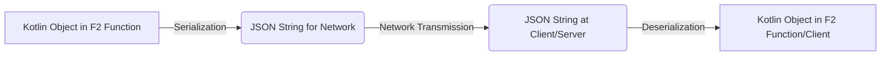
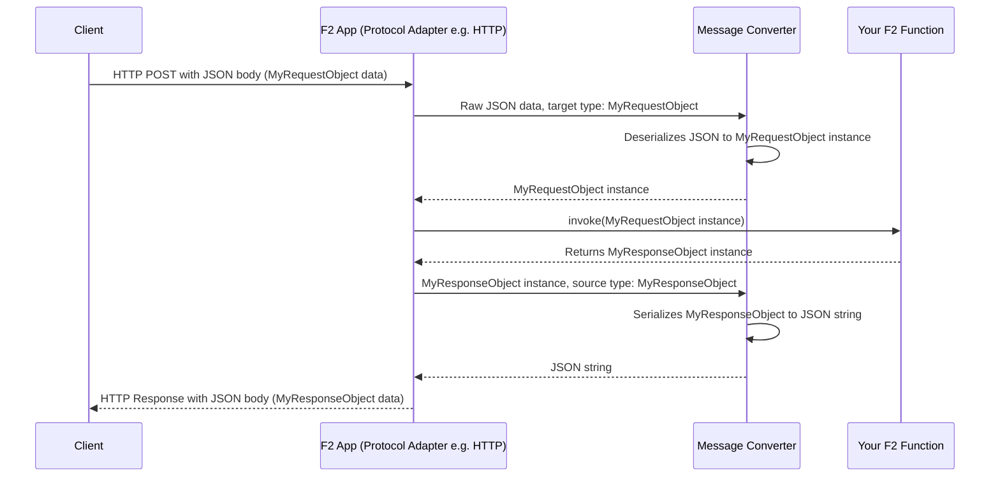

# Chapter 5: Message Serialization & Conversion

Welcome to Chapter 5! In [Chapter 4: Protocol Adapters (HTTP & RSocket)](04_protocol_adapters__http___rsocket__.md), we saw how your F2 functions can be made available to the outside world using protocols like HTTP and RSocket. Clients can send requests to your functions and get responses back.

But there's a small "translation" step we haven't fully discussed: how do the data objects your Kotlin F2 functions understand get converted into a format that can travel over the network (like text in JSON format), and how does data from the network get turned back into Kotlin objects? That's what **Message Serialization and Conversion** is all about!

## The "Language Barrier": Kotlin Objects vs. Network Data

Imagine your F2 function is like a helpful librarian who only speaks Kotlin.
*   A library patron (a client application) wants to request a book. The patron writes down the request on a piece of paper in a common language, say, English (this is like JSON over the network).
*   When the librarian receives the paper, they need to understand it. Someone needs to "translate" the English request into Kotlin concepts for the librarian.
*   After the librarian finds the book (or information about it), they describe it in Kotlin. Before giving it back to the patron, someone needs to "translate" the Kotlin description back into English on a piece of paper.

This "translation" process is what message serialization and conversion does:
*   **Serialization**: Converting your Kotlin data objects (like a `BookAddedEvent`) into a "wire format" (like a JSON string) that can be sent over the network. This is like translating Kotlin *to* English for the journey.
*   **Deserialization**: Converting data received from the network (like a JSON string representing a `AddBookCommand`) back into the Kotlin objects your F2 function expects. This is like translating English *from* the journey back to Kotlin.



Without this, your F2 function wouldn't be able to understand incoming requests or send back responses in a way that other systems can understand.

## Meet the Translators: Message Converters

In F2 (and the underlying Spring Cloud Function framework), this translation work is done by **Message Converters**. These are specialized components that know how to convert between Kotlin/Java objects and various wire formats.

The most common wire format for web APIs is **JSON (JavaScript Object Notation)**. It's human-readable and widely supported. F2 supports several popular Java/Kotlin libraries for handling JSON:

*   **Jackson**: A very powerful and popular Java library for JSON processing. It's often the default in Spring applications.
*   **Gson**: Another well-known Java library for JSON, developed by Google.
*   **Kotlinx.serialization**: A Kotlin-native library that provides first-class support for serialization in Kotlin, including multiplatform capabilities.

F2, through Spring Cloud Function, automatically uses these message converters. When an HTTP request with a JSON body arrives, a message converter steps in to deserialize it into the Kotlin object your F2 function expects as input. When your function returns a Kotlin object, a message converter serializes it into JSON for the HTTP response.

### Example: Adding a Book

Let's revisit our library example from [Chapter 3: CQRS (Command Query Responsibility Segregation)](03_cqrs__command_query_responsibility_segregation__.md).
Suppose we have a command to add a book:
```kotlin
// Our Kotlin data class for the command
data class AddBookCommand(
    val title: String,
    val author: String,
    val isbn: String
)
```

And an F2 function to handle it:
```kotlin
import io.komune.f2.dsl.fnc.F2Function
import io.komune.f2.dsl.fnc.f2Function
// Assume BookAddedEvent is also defined
// @Bean // This would be in a @Configuration class
fun addBookCommandHandler(): F2Function<AddBookCommand, BookAddedEvent> {
    return f2Function { commandFlow ->
        commandFlow.map { command ->
            // 1. 'command' is already a Kotlin AddBookCommand object here!
            //    Deserialization happened automatically.
            println("Processing: ${command.title}")
            
            // ... logic to add the book ...
            
            val event = BookAddedEvent(/*...data from command...*/)
            // 2. 'event' is a Kotlin BookAddedEvent object.
            //    Serialization will happen automatically when it's sent back.
            event
        }
    }
}
```

**What happens with serialization/deserialization?**

1.  **Incoming Request (Deserialization):**
    *   A client sends an HTTP POST request to the endpoint for `addBookCommandHandler`.
    *   The body of the HTTP request contains JSON like this:
        ```json
        {
          "title": "The Hitchhiker's Guide to F2",
          "author": "Douglas N. Adams",
          "isbn": "978-0345391803"
        }
        ```
    *   The F2/Spring Cloud Function framework receives this. A message converter (e.g., using Jackson) reads this JSON and automatically creates an instance of your `AddBookCommand` Kotlin data class.
    *   This `AddBookCommand` object is then passed to your `addBookCommandHandler` function.

2.  **Outgoing Response (Serialization):**
    *   Your `addBookCommandHandler` function processes the command and returns a `BookAddedEvent` object (another Kotlin data class).
    *   Before sending the HTTP response, a message converter takes this `BookAddedEvent` object.
    *   It converts the Kotlin object into a JSON string, for example:
        ```json
        {
          "bookId": "book-42",
          "title": "The Hitchhiker's Guide to F2",
          "status": "ADDED_SUCCESSFULLY"
        }
        ```
    *   This JSON string becomes the body of the HTTP response sent back to the client.

All this "translation" happens seamlessly behind the scenes, thanks to the message converters!

## Choosing Your JSON Translator

F2, via Spring Cloud Function, allows you to specify which JSON library you prefer. You do this using a standard Spring Boot property in your `application.properties` or `application.yml` file:

`spring.cloud.function.preferred-json-mapper`

You can set its value to:
*   `jackson` (usually the default if Jackson is on the classpath)
*   `gson`
*   `kSerialization` (for Kotlinx.serialization)

For example, to explicitly use Jackson, you'd add this to `application.properties`:
```properties
spring.cloud.function.preferred-json-mapper=jackson
```

Or, to use Kotlinx.serialization:
```properties
spring.cloud.function.preferred-json-mapper=kSerialization
```

Make sure you have the corresponding library dependency in your project (e.g., for Kotlinx.serialization, you'd need `kotlinx-serialization-json`). The F2 starters often bring in Jackson by default. Refer to the `README.md` for more details on serializers.

## Under the Hood: A Peek at the Conversion Process

Let's imagine an HTTP request comes in, destined for one of your F2 functions that takes a `MyRequestObject` and returns a `MyResponseObject`.



1.  **Client Sends Request**: The client sends data (e.g., JSON) over a protocol like HTTP.
2.  **Protocol Adapter Receives**: The [Protocol Adapter (HTTP & RSocket)](04_protocol_adapters__http___rsocket__.md) in your F2 application receives this raw request.
3.  **Deserialization**:
    *   The adapter identifies the target F2 function and the expected input type (e.g., `MyRequestObject`).
    *   It passes the raw request data (e.g., the JSON string from the HTTP body) and the target type to a **Message Converter**.
    *   The Message Converter (e.g., `JsonMessageConverter` using Jackson) "translates" the JSON string into an instance of `MyRequestObject`.
4.  **Function Invocation**: The F2 framework invokes your F2 function with the deserialized `MyRequestObject`.
5.  **Function Logic**: Your function does its work and produces a result object (e.g., `MyResponseObject`).
6.  **Serialization**:
    *   The F2 framework takes the `MyResponseObject` returned by your function.
    *   It passes this object to a **Message Converter**.
    *   The Message Converter "translates" the `MyResponseObject` into a JSON string.
7.  **Protocol Adapter Sends Response**: The adapter takes this JSON string and sends it back to the client as part of the HTTP response.

### Key Code Components Involved

You usually don't interact with these directly, but it's good to know they exist:

*   **`JsonMessageConverter.java`**: (Located in `f2-spring-boot-starter-function-http`'s dependencies, from Spring Cloud Function). This is a Spring `MessageConverter` that specifically handles JSON.
    *   Its `convertFromInternal` method (simplified) is responsible for taking a message (e.g., an HTTP request payload) and deserializing it into a target Java/Kotlin object using an underlying `JsonMapper`.
    *   Its `convertToInternal` method (simplified) is responsible for taking a Java/Kotlin object and serializing it into a JSON payload.
    ```java
    // Simplified conceptual logic within JsonMessageConverter
    // protected Object convertFromInternal(Message<?> message, Class<?> targetClass, ...) {
    //     // ...
    //     return this.jsonMapper.fromJson(message.getPayload(), convertToType); // Deserialization
    // }

    // protected Object convertToInternal(Object payload, MessageHeaders headers, ...) {
    //     return jsonMapper.toJson(payload); // Serialization
    // }
    ```
    F2 includes a version of this (`JsonMessageConverter.java` under `org.springframework.cloud.function.context.config`) that ensures proper error propagation for JSON parsing issues.

*   **`JsonMapper` interface (and its implementations like `JacksonMapper`, `GsonMapper`, `KSerializationMapper`)**:
    *   This is an abstraction used by `JsonMessageConverter`. The actual work of talking to Jackson, Gson, or Kotlinx.serialization is done by implementations of `JsonMapper`.
    *   The `ContextFunctionCatalogAutoConfiguration.java` (from `f2-spring-boot-starter-function`) is responsible for creating the correct `JsonMapper` bean based on the `spring.cloud.function.preferred-json-mapper` property and what libraries are available on your classpath.

    ```java
    // In ContextFunctionCatalogAutoConfiguration.java (simplified)
    // @Bean
    // public JsonMapper jsonMapper(ApplicationContext context) {
    //     String preferredMapper = context.getEnvironment().getProperty(JSON_MAPPER_PROPERTY);
    //     if ("kSerialization".equals(preferredMapper) && /* kSerialization is present */) {
    //         return kSerialization(context); // Returns a KSerializationMapper
    //     } else if ("gson".equals(preferredMapper) && /* Gson is present */) {
    //         return gson(context); // Returns a GsonMapper
    //     } else if ("jackson".equals(preferredMapper) && /* Jackson is present */) {
    //         return jackson(context); // Returns a JacksonMapper
    //     }
    //     // ... fallback or error ...
    // }
    ```

*   **`SmartCompositeMessageConverter.java`**: (Located in `f2-spring-boot-starter-function-http`'s dependencies, enhanced by F2). Spring Cloud Function often uses a `CompositeMessageConverter`. This is a converter that holds a list of other converters. When it needs to convert something, it tries each converter in its list until one succeeds. The F2 version (`SmartCompositeMessageConverter`) has enhancements, for instance, better error reporting if conversion fails.

The important thing is that Spring Boot and Spring Cloud Function, with F2's configurations, wire all this up for you. As a developer, you mostly just define your Kotlin data classes and your F2 functions, and the framework handles the "translation" to and from JSON (or other formats if configured).

## Conclusion

You've learned about **Message Serialization and Conversion** – the crucial process of translating Kotlin data objects to a network-friendly format like JSON (serialization) and back (deserialization).

Key takeaways:
*   F2 functions exchange data objects (Kotlin classes). For network transmission (e.g., HTTP), these need to be converted to/from a wire format like JSON.
*   **Message Converters** handle this translation automatically.
*   F2 supports popular JSON libraries: **Jackson**, **Gson**, and **Kotlinx.serialization**.
*   You can influence which library is used via the `spring.cloud.function.preferred-json-mapper` property.
*   This process allows your F2 functions to seamlessly receive data from clients and send data back, without you needing to manually parse or generate JSON in your function logic.

Now that we know how our F2 functions can be called and how data is exchanged and understood, it's important to document these "entry points" or APIs so others (or your future self!) know how to use them. In the [next chapter: API Documentation (OpenAPI via Springdoc)](06_api_documentation__openapi_via_springdoc__.md), we'll see how F2 helps you generate API documentation automatically.

---

Generated by [AI Codebase Knowledge Builder](https://github.com/The-Pocket/Tutorial-Codebase-Knowledge)