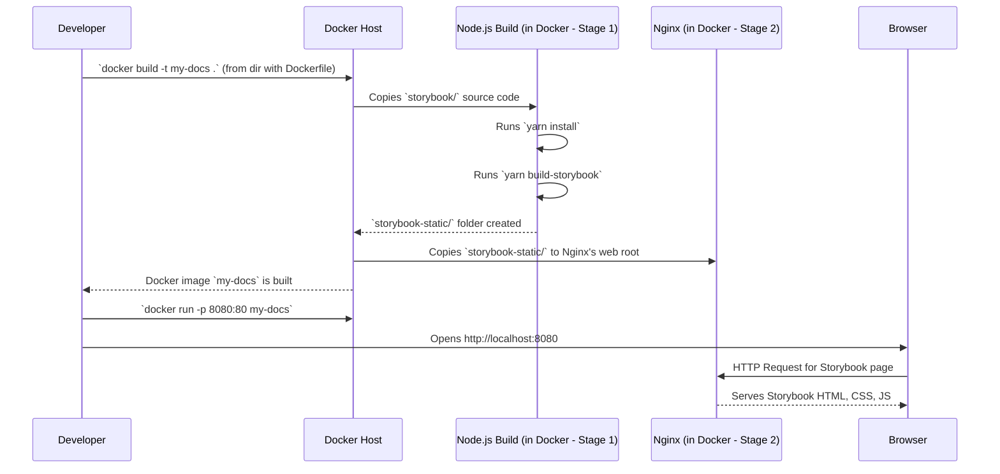

# Chapter 5: Storybook Documentation Environment

In [Chapter 4: Artifact Publication System](04_artifact_publication_system_.md), we saw how `fixers-gradle` helps you package and share your Kotlin libraries with the world. But what if your project, especially one using Kotlin/JS, includes visual UI components? How do you show other developers (or even your future self!) what these components look like and how they behave, without them needing to run the whole application?

This is where a **Storybook Documentation Environment** comes in handy!

## What's a Component Showroom?

Imagine you've designed a set of cool, reusable LEGO bricks for building user interfaces (UIs)—buttons, cards, menus, etc. You'd want a place to display each brick individually, show its different variations (like a red button, a blue button, a disabled button), and let people "play" with them.

A **Storybook Documentation Environment** is exactly that: an interactive "showroom" or "living style guide" for your UI components. It's a dedicated website where developers can:
*   See all the UI components your project offers.
*   Interact with them in isolation (e.g., click a button, type in a text field).
*   See different states and variations of each component.
*   Read documentation about how to use them.

This is incredibly useful for projects that produce UI libraries, especially with Kotlin/JS where your Kotlin code compiles to JavaScript to run in a web browser. The `fixers-gradle` project itself, or associated libraries within its ecosystem, might use such an environment to showcase UI components or examples.

## The `fixers-gradle` Storybook Setup

While `fixers-gradle` primarily provides Gradle plugins for build logic, it also has a setup for a Storybook environment. This environment is likely used to document and showcase UI components developed within the Komune-io ecosystem, possibly built using Kotlin/JS and potentially managed by `fixers-gradle` plugins in their respective projects.

This setup includes:
*   **Storybook configuration files:** These tell Storybook how to look, feel, and find your component examples.
*   **A `Dockerfile`:** This allows the Storybook website to be easily built and deployed as a web application.

Let's explore how this "showroom" is put together. You'll typically find these files within the `fixers-gradle` project structure, particularly in a `storybook/` directory and an `infra/docker/storybook/` directory for deployment.

## Peeking into the Showroom's Blueprint

The core of the Storybook setup lies in a few key configuration files, usually found within a `storybook/.storybook/` directory.

### 1. `main.js`: The Directory of Stories

This file is Storybook's main configuration. A crucial part tells Storybook where to find your "stories." A story is a small example showing a single state of a component.

```javascript
// storybook/.storybook/main.js (simplified excerpt)
module.exports = {
  stories: [
    "../stories/**/*.stories.mdx", // Find stories in .mdx files
    "../stories/**/*.stories.@(js|jsx|ts|tsx)", // Or in .js/ts(x) files
  ],
  // ... other configurations like addons ...
};
```
This tells Storybook: "Look for files ending with `.stories.mdx`, `.stories.js`, `.stories.jsx`, etc., inside a directory named `stories` (one level up from `.storybook`). These files contain the examples of our components."

### 2. `manager.js`: Customizing the Showroom's Look

This file lets you customize the overall appearance of the Storybook UI itself—the sidebar, the header, etc.

```javascript
// storybook/.storybook/manager.js (simplified excerpt)
import { addons } from '@storybook/addons';
import { create } from "@storybook/theming";
// import logo from "../assets/logo.png"; // Your project's logo

addons.setConfig({
  theme: create({
    base: 'light',
    brandTitle: 'Fixers F2', // Your project's name
    // brandImage: logo,     // Your project's logo
  }),
});
```
This code snippet sets a light theme for Storybook and defines a brand title. This makes the documentation feel more integrated with your project.

### 3. `preview.js`: Setting the Stage for Each Component

This file allows you to define global settings for how each story (component example) is rendered. For example, you might want to wrap every component in a specific theme provider.

```javascript
// storybook/.storybook/preview.js (simplified excerpt)
// Assuming ThemeContextProvider is a React component
// For simplicity, let's imagine a basic one:
const ThemeContextProvider = ({ children, theme }) => {
  // In a real app, this would apply the theme
  return <div className={`theme-${theme.name}`}>{children}</div>;
};

const defaultTheme = { name: "default", colors: { primary: "#EDBA27" } };

export const decorators = [
  (Story) => ( // "Story" is the component example itself
    <ThemeContextProvider theme={defaultTheme}>
      <Story />
    </ThemeContextProvider>
  ),
];
```
Here, every component example (`Story`) will automatically be wrapped by `ThemeContextProvider` using a `defaultTheme`. This is great for ensuring all your component previews are consistent.

### 4. `webpack.config.js`: Fine-Tuning the Build (Optional)

Storybook uses Webpack under the hood to build the UI. This file allows for advanced customizations of the Webpack configuration if needed. Often, for basic setups, it might be very minimal.

```javascript
// storybook/.storybook/webpack.config.js
module.exports = ({ config }) => {
  // You can modify the 'config' object here if needed
  return config;
};
```
For many `fixers-gradle` related scenarios, you might not need to touch this file unless you have very specific build requirements for your UI components.

## How to "Visit" or Work with this Showroom

If you're a user of `fixers-gradle` or related Komune-io libraries, this Storybook instance (if deployed) would be where you'd go to see examples of UI components.

If you're a developer *contributing* to `fixers-gradle` or its associated UI libraries, you might:
1.  **Run Storybook locally:** Navigate to the `storybook/` directory in your terminal and typically run a command like `yarn storybook` or `npm run storybook`. This would start a local development server, and you could see your changes live in the browser.
2.  **Build Storybook for deployment:** Run a command like `yarn build-storybook`. This creates a static website (usually in a `storybook-static` folder) that can then be deployed.

## Packaging the Showroom: The `Dockerfile`

The `fixers-gradle` project includes a `Dockerfile` (e.g., in `infra/docker/storybook/Dockerfile`) to package the Storybook documentation as a deployable web application. This makes it easy to host the component showroom anywhere that can run Docker containers.

Let's look at a simplified version of how it works:

**Stage 1: Building the Storybook Static Site**

```dockerfile
# Dockerfile (Stage 1: Build - simplified)
FROM node:21.7-alpine3.19 AS build
WORKDIR /app
COPY storybook ./storybook # Copy Storybook source files
WORKDIR /app/storybook

# Setup for private NPM packages (if any)
ARG NPM_AUTH_TOKEN
# ... .npmrc setup using NPM_AUTH_TOKEN ...

# Install dependencies and build Storybook
RUN yarn install --frozen-lockfile
RUN yarn build-storybook # This creates the storybook-static/ folder
```
This first part uses a Node.js environment to:
1.  Copy the Storybook source code (your stories, configurations).
2.  Set up access to any private NPM packages (like themes or UI kits from `@komune-io`).
3.  Install all necessary JavaScript dependencies using `yarn`.
4.  Run the command to build the static Storybook website (`yarn build-storybook`). The result is a folder, typically named `storybook-static`, containing all the HTML, CSS, and JavaScript files for the showroom.

**Stage 2: Serving the Static Site with a Web Server**

```dockerfile
# Dockerfile (Stage 2: Serve - simplified)
FROM nginx:1.25.4-alpine # Use Nginx, a lightweight web server

# Copy the built static site from Stage 1
COPY --from=build /app/storybook/storybook-static /var/www

# Copy Nginx configuration (tells Nginx how to serve the files)
COPY infra/docker/storybook/nginx.conf /etc/nginx/nginx.conf

EXPOSE 80 # The website will be available on port 80 inside the container
ENTRYPOINT ["nginx", "-g", "daemon off;"] # Start Nginx
```
This second part uses a lightweight web server (Nginx):
1.  It copies the `storybook-static` folder (built in Stage 1) into the web server's directory (`/var/www`).
2.  It sets up Nginx using a custom configuration file.
3.  It makes the website accessible on port 80 and starts the Nginx server.

Now, this Docker image can be run anywhere, and your Storybook component showroom will be live!

## Under the Hood: From Code to Live Showroom

Let's visualize the process of building and deploying this Storybook environment using Docker.



This diagram shows:
1.  The developer builds a Docker image. Docker uses the `Dockerfile` instructions:
    *   First, in a Node.js environment, it installs dependencies and builds the static Storybook site.
    *   Then, in an Nginx environment, it copies these static files to be served.
2.  The developer runs the built Docker image, mapping a port on their machine (e.g., 8080) to the container's port 80.
3.  When the developer opens their browser to `http://localhost:8080`, Nginx inside the Docker container serves up the Storybook pages.

This setup provides a consistent and reproducible way to build and deploy your component documentation.

## Conclusion

The **Storybook Documentation Environment**, as structured within the `fixers-gradle` project ecosystem, provides a powerful way to create an interactive showroom for UI components. This is especially valuable for Kotlin/JS projects or any project that produces visual elements.

You've learned:
*   What Storybook is and why it's useful for UI component documentation.
*   How the Storybook instance related to `fixers-gradle` is configured through files like `main.js`, `manager.js`, and `preview.js`.
*   How a `Dockerfile` is used to package this Storybook site into a deployable web application, ready to be hosted.

This allows developers to easily see, interact with, and understand the UI components offered by libraries within the `fixers-gradle` and Komune-io ecosystem.

With your code quality checked ([Chapter 3: Code Quality and Analysis Framework](03_code_quality_and_analysis_framework_.md)), your artifacts published ([Chapter 4: Artifact Publication System](04_artifact_publication_system_.md)), and your UI components beautifully documented with Storybook, the final piece is often automating the entire build, test, and deployment pipeline. In the next chapter, we'll explore [Chapter 6: Build and CI/CD Automation](06_build_and_ci_cd_automation_.md).

---

Generated by [AI Codebase Knowledge Builder](https://github.com/The-Pocket/Tutorial-Codebase-Knowledge)