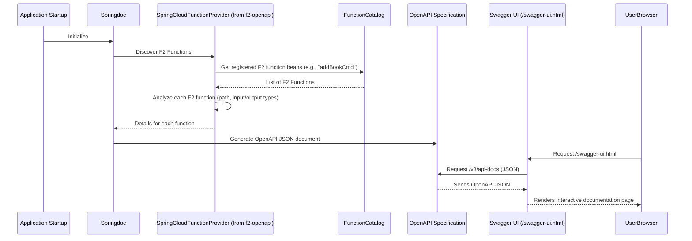

# Chapter 6: API Documentation (OpenAPI via Springdoc)

Welcome to Chapter 6! In [Chapter 5: Message Serialization & Conversion](05_message_serialization___conversion__.md), we learned how your F2 functions smoothly exchange data with the outside world, converting Kotlin objects to and from formats like JSON. Now that your functions are ready to be called and understood, how do other developers or applications discover what services your application offers and how to use them?

This is where **API Documentation** comes into play, specifically using **OpenAPI** through a tool called **Springdoc**.

## The Problem: "How Do I Use Your Service?"

Imagine you've built an amazing F2-based microservice for our library application. It has functions like:
*   `addBookCommandHandler` (from [Chapter 3: CQRS (Command Query Responsibility Segregation)](03_cqrs__command_query_responsibility_segregation__.md))
*   `personalizedGreeter` (from [Chapter 2: Spring Cloud Function Integration & Function Catalog](02_spring_cloud_function_integration___function_catalog_.md))

A new developer joins your team, or another team wants to use your library service. They'll ask questions like:
*   "What functions are available?"
*   "If I want to add a book, what information do I need to send?"
*   "What will I get back after I add a book?"
*   "What's the exact web address (URL) to call the `personalizedGreeter` function?"

Manually writing and updating a document with all this information is tedious and error-prone. What if you change how a function works? You'd have to remember to update the document. This is where automated API documentation shines!

## OpenAPI: The "User Manual" for Your API

**OpenAPI** (you might also hear its older name, **Swagger**) is like a standardized "user manual" for your API. It's a way to describe your API in a structured format (usually JSON or YAML) that both humans and computers can understand. This description includes:
*   **Endpoints**: The URLs where your functions can be reached (e.g., `/addBookCommandHandler`).
*   **Operations**: What you can do at each endpoint (e.g., send a POST request to add a book).
*   **Parameters**: What data you need to send in a request (e.g., the book's title, author, ISBN).
*   **Request/Response Formats**: What the data you send and receive looks like (e.g., JSON objects, as discussed in [Chapter 5](05_message_serialization___conversion__.md)).

Having an OpenAPI document is super useful because:
*   It's **always up-to-date** (if generated automatically).
*   It can be used to generate **interactive API documentation** where developers can try out API calls directly in their browser.
*   It can be used to generate **client SDKs** (Software Development Kits) in various programming languages, making it easier for others to integrate with your API.

## Springdoc: Your Automatic API Scribe

So, how do you get this OpenAPI document for your F2 application? Manually writing it is no fun. That's where **Springdoc** comes in.

**Springdoc** is a library that works beautifully with Spring Boot applications (which F2 applications often are). It automatically inspects your application, including your F2 functions exposed via [Protocol Adapters (HTTP & RSocket)](04_protocol_adapters__http___rsocket__.md), and generates the OpenAPI documentation for you.

Think of Springdoc as an intelligent scribe that watches how your F2 functions are set up and writes down all the details in the OpenAPI format.

## How to Use Springdoc with F2

Getting started with Springdoc in an F2 project is usually very straightforward.

### 1. Add the Dependency

First, you need to add the `f2-spring-boot-openapi` dependency to your project. This special F2 module helps Springdoc understand your F2 functions.

As mentioned in the project's `README.md`:
*   **Gradle**:
    ```gradle
    implementation("io.komune.f2:f2-spring-boot-openapi:${Versions.f2}")
    ```
*   **Maven**:
    ```xml
    <dependency>
      <groupId>io.komune.f2</groupId>
      <artifactId>f2-spring-boot-openapi</artifactId>
      <version>${Versions.f2}</version>
    </dependency>
    ```
Adding this dependency is often all you need to do to get basic API documentation!

### 2. Run Your Application

Once the dependency is added, just run your F2 Spring Boot application as usual.

### 3. Access Your API Documentation

Springdoc automatically makes the OpenAPI documentation available at a couple of default URLs:

*   **/v3/api-docs**: This URL provides the raw OpenAPI specification in JSON format.
    *   Example: If your app runs on `http://localhost:8080`, you'd go to `http://localhost:8080/v3/api-docs`.
*   **/swagger-ui.html**: This URL provides a rich, interactive HTML documentation page, commonly known as Swagger UI.
    *   Example: `http://localhost:8080/swagger-ui.html`.

Let's open `http://localhost:8080/swagger-ui.html` in your browser. You should see something like this:

**(Conceptual Image of Swagger UI)**
Imagine a webpage listing your functions:
*   `addBookCommandHandler (POST /addBookCommandHandler)`
    *   Allows you to see details about the expected request (e.g., the JSON structure for `AddBookCommand`).
    *   Allows you to see details about possible responses (e.g., the JSON structure for `BookAddedEvent`).
    *   Often has a "Try it out" button!
*   `personalizedGreeter (POST /personalizedGreeter)`
    *   Shows it expects a string and returns a string.

This interactive page is generated automatically by Springdoc by reading the `/v3/api-docs` information. Developers can explore your API, see what data to send, and even make test calls directly from this UI.

### Example: What Springdoc "Sees"

For our `addBookCommandHandler` F2Function:
```kotlin
// Defined as a Spring bean in a @Configuration class
// fun addBookCommandHandler(): F2Function<AddBookCommand, BookAddedEvent> { ... }
```
Springdoc (with the help of `f2-spring-boot-openapi` and Spring Cloud Function) understands:
*   There's a function bean named `addBookCommandHandler`.
*   It's exposed via HTTP (likely as a POST request, which is common for functions that take input and change state).
*   The path is `/addBookCommandHandler` (based on the function name).
*   The input type is `AddBookCommand` (and Springdoc will look at its fields: `title`, `author`, `isbn`).
*   The output type is `BookAddedEvent` (and Springdoc will look at its fields).

It uses all this information to build the OpenAPI specification.

### Customizing the Docs (A Tiny Peek)

Springdoc is very configurable. While much works out-of-the-box, you can customize the documentation.
For example, you can add descriptions, examples, etc., using annotations from the Swagger library (`io.swagger.v3.oas.annotations` package) directly on your `@Bean` methods that define your F2 functions.

```kotlin
import io.swagger.v3.oas.annotations.Operation
import org.springframework.context.annotation.Bean
// ... other imports ...

// @Configuration
class MyFunctionBeans {

    @Bean
    @Operation(summary = "Adds a new book to the library catalog",
               description = "Takes book details and registers a new book. Returns an event about the added book.")
    fun addBookCommandHandler(): F2Function<AddBookCommand, BookAddedEvent> {
        // ... same implementation as before ...
        return f2Function { /* ... */ }
    }
}
```
The `@Operation` annotation provides more human-readable details that will show up in Swagger UI.

You can also configure global API information (like title, version, description) using Spring Boot properties. For detailed configuration, the [Springdoc documentation](https://springdoc.org/#features) (linked in the `README.md`) is your best friend.

## Under the Hood: How Does Springdoc Generate Docs for F2?

It might seem like magic, but there's a clear process.

1.  **Dependency Power**: When you add `f2-spring-boot-openapi`, it brings in Springdoc and a special F2-specific connector: `SpringCloudFunctionProvider.java`.
2.  **Application Startup Scan**: When your Spring Boot application starts, Springdoc initializes.
3.  **Function Discovery**: The `SpringCloudFunctionProvider` (or similar Springdoc mechanisms tailored for Spring Cloud Function) interacts with the [Spring Cloud Function Integration & Function Catalog](02_spring_cloud_function_integration___function_catalog_.md). It gets a list of all your registered F2 function beans (like `addBookCommandHandler`).
4.  **Analyzing Functions**: For each F2 function, it figures out:
    *   **Path and HTTP Method**: How is it exposed via HTTP? (e.g., `POST /addBookCommandHandler`). This comes from how Spring Cloud Function exposes functions, often based on the bean name.
    *   **Input Type**: What kind of object does it take? (e.g., `AddBookCommand`). It inspects this class to find its properties.
    *   **Output Type**: What kind of object does it return? (e.g., `BookAddedEvent`). It also inspects this class.
    *   These types are understood thanks to the work done by [Message Serialization & Conversion](05_message_serialization___conversion__.md) mechanisms.
5.  **Building OpenAPI Spec**: Springdoc uses all this gathered information to construct the OpenAPI specification document (a big JSON object).
6.  **Serving the Docs**:
    *   The raw JSON specification is made available at `/v3/api-docs`.
    *   The Swagger UI web interface (served at `/swagger-ui.html`) fetches this JSON and renders the interactive documentation.

Here's a simplified sequence:



### Key Code Component: `SpringCloudFunctionProvider.java`

The `f2-spring-boot-openapi` module contains a crucial class: `org.springdoc.core.providers.SpringCloudFunctionProvider.java`. (You can find its source in the `fixers-gradle` project under `f2-spring/openapi/f2-spring-boot-openapi/`).

This class is responsible for telling Springdoc how to find and understand Spring Cloud Functions (which F2 functions are).

**Simplified Logic of `SpringCloudFunctionProvider.java`:**
*   It gets the `FunctionCatalog` (where all your F2 functions are registered).
*   It iterates through the names of the functions in the catalog.
*   For each function, it looks up details like:
    *   Is it an `F2Function`, `F2Supplier`, or `F2Consumer`? This helps determine the default HTTP method (e.g., `GET` for suppliers, `POST` for functions/consumers).
    *   What is its input type (`function.getInputType()`)?
    *   What is its output type (`function.getOutputType()`)?
*   It then uses this information to create `RouterOperation` objects, which are Springdoc's way of representing an API endpoint. These `RouterOperation` objects are then used to build the final OpenAPI specification.

```java
// Conceptual snippet from SpringCloudFunctionProvider.java
// For each function 'fnWrapper' found in FunctionCatalog:
// String functionName = fnWrapper.getFunctionName();
// Type inputType = fnWrapper.getInputType();
// Type outputType = fnWrapper.getOutputType();
// String path = "/" + functionName; // Simplified path
// RequestMethod httpMethod;
// if (fnWrapper.isSupplier()) {
//     httpMethod = GET;
// } else {
//     httpMethod = POST; // For Function or Consumer
// }
//
// // Create an Operation object for OpenAPI
// Operation oasOperation = new Operation();
// oasOperation.setOperationId(functionName + "_" + httpMethod);
//
// // Describe request body (if any) based on inputType
// if (inputType != null && httpMethod == POST) {
//     RequestBody requestBody = buildRequestBodyFromType(inputType);
//     oasOperation.setRequestBody(requestBody);
// }
//
// // Describe responses based on outputType
// ApiResponses apiResponses = buildApiResponsesFromType(outputType);
// oasOperation.setResponses(apiResponses);
//
// // Add this operation to the OpenAPI model
// openAPI.path(path, new PathItem().operation(httpMethod, oasOperation));
```
This provider ensures that your F2 functions are correctly translated into OpenAPI descriptions, making them visible and understandable.

## Conclusion

You've now seen how F2, with the help of **Springdoc** and the **`f2-spring-boot-openapi`** module, can automatically generate **API documentation** in the **OpenAPI** format.

Key takeaways:
*   API documentation is like a user manual for your service, crucial for usability.
*   OpenAPI (Swagger) is the standard for describing APIs.
*   Springdoc automatically generates this documentation by inspecting your F2 functions.
*   You simply add the `f2-spring-boot-openapi` dependency.
*   Interactive documentation is available at `/swagger-ui.html`, and the raw spec at `/v3/api-docs`.
*   This makes it much easier for others (and your future self) to discover, understand, and use your F2-based services.

F2 leverages many powerful features of Kotlin. In the [next chapter: Kotlin Language Features Integration](07_kotlin_language_features_integration__.md), we'll explore how specific Kotlin language features are used within F2 to make development more concise and expressive.

---

Generated by [AI Codebase Knowledge Builder](https://github.com/The-Pocket/Tutorial-Codebase-Knowledge)