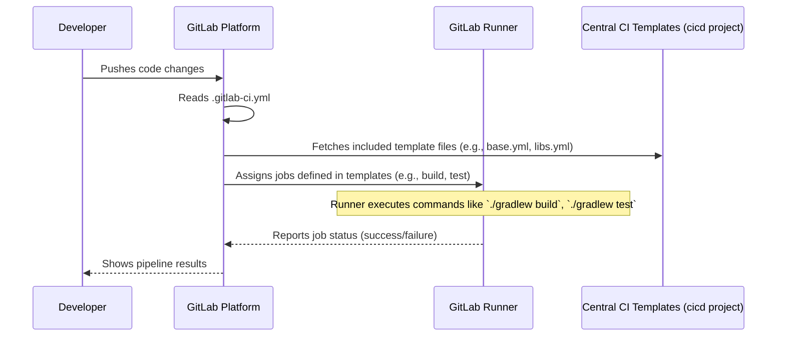

# Chapter 6: Build and CI/CD Automation

Welcome to the final chapter of our `fixers-gradle` journey! In [Chapter 5: Storybook Documentation Environment](05_storybook_documentation_environment_.md), we saw how `fixers-gradle` can help create interactive showrooms for UI components. Now, let's look behind the scenes at how the `fixers-gradle` project itself is built, tested, and released in a consistent and reliable way. This is all about **Build and CI/CD Automation**.

## Why Do We Need an Automated Factory?

Imagine a car factory. To build cars efficiently and ensure each one is high quality, factories use automated assembly lines. Robots and machines perform specific tasks over and over again, in exactly the same way. This reduces errors, speeds up production, and ensures consistency.

Developing a software project like `fixers-gradle` is similar. It involves several steps:
*   Compiling the code.
*   Running tests to check for bugs.
*   Checking code quality (like we saw in [Chapter 3: Code Quality and Analysis Framework](03_code_quality_and_analysis_framework_.md)).
*   Packaging the plugins and libraries (as discussed in [Chapter 4: Artifact Publication System](04_artifact_publication_system_.md)).
*   Sometimes, publishing new versions.

If developers had to remember and manually perform all these steps every time they made a change, it would be slow and error-prone. **Build and CI/CD Automation** is like setting up an automated factory assembly line for `fixers-gradle`. It ensures that every change goes through the same checks and procedures, making the development process faster, more reliable, and less dependent on manual steps.

This chapter focuses on two key tools that `fixers-gradle` uses for its *own* automation:
1.  **`Makefile`**: For convenient local development commands.
2.  **`.gitlab-ci.yml`**: For fully automated pipelines on GitLab (a platform for hosting and managing code, similar to GitHub).

## Local Shortcuts: The `Makefile`

When developers work on `fixers-gradle` on their own computers, they often need to perform common tasks like building the project, running tests, or checking for code style issues. A `Makefile` provides simple shortcuts for these tasks.

Think of a `Makefile` as a list of quick-dial numbers on your phone. Instead of typing a long Gradle command, you can type a short `make` command.

**How to Use It (Conceptual):**

If you were a developer working on `fixers-gradle`, you might open your terminal in the project's main directory and type:

*   To build everything:
    ```bash
    make build
    ```
    This tells the `make` tool to look in the `Makefile` for a target named `build` and run the commands associated with it.

*   To run all tests:
    ```bash
    make test
    ```

*   To check for code style issues (linting):
    ```bash
    make lint
    ```

**What's in the `Makefile`?**

The `Makefile` contains definitions for these shortcuts. Let's look at a simplified example of what a part of it might look like:

```makefile
# Makefile (simplified snippet)

# Target to build the project
build:
	./gradlew assemble # Example: runs a Gradle task to compile/assemble

# Target to run tests
test:
	./gradlew test # Example: runs a Gradle task to execute tests

# Target to lint the code
lint:
	./gradlew detekt # Example: runs Detekt for code analysis
```
*(The actual `fixers-gradle` `Makefile` is a bit more complex as it organizes tasks for different parts like libraries (`libs.mk`) and documentation (`docs.mk`), but the principle is the same: it defines shortcuts for underlying Gradle commands.)*

When you type `make build`, the `make` program finds the `build:` line and executes the command below it (e.g., `./gradlew assemble`). This is much easier to remember and type than the full Gradle command, especially if a task involves multiple steps.

## The Automated Assembly Line: `.gitlab-ci.yml` and GitLab CI/CD

While `Makefile` is great for local convenience, we need something more powerful for true automation: a system that automatically builds and tests the code every time a developer pushes changes to the central code repository on GitLab. This is called **Continuous Integration / Continuous Deployment (CI/CD)**.

For `fixers-gradle`, this automated assembly line is defined in a file named `.gitlab-ci.yml`.

**How It Works:**

1.  **Developer Pushes Code:** A developer makes changes to `fixers-gradle` and "pushes" those changes to the project's repository on GitLab.
2.  **GitLab CI Springs to Action:** GitLab notices these new changes and looks for the `.gitlab-ci.yml` file.
3.  **Pipeline Execution:** GitLab reads the instructions in `.gitlab-ci.yml` and uses "GitLab Runners" (special agents that can execute jobs) to run a series of predefined steps, called a **pipeline**. This pipeline might include:
    *   Building the code.
    *   Running tests.
    *   Checking code quality.
    *   Building documentation (like the [Storybook Documentation Environment](05_storybook_documentation_environment_.md)).
    *   If all checks pass on a main branch, it might even automatically publish a new version.

This ensures that every change is consistently verified before it becomes part of the official project.

**Reusable Factory Blueprints: CI Templates**

Writing CI/CD pipelines can be complex. To make this easier and ensure consistency across many projects, `fixers-gradle` uses **reusable CI templates**. These templates are defined in a separate, central project (referred to as `framework/fixers/cicd` in the example below).

Think of these templates as pre-designed blueprints for different parts of the assembly line (e.g., a blueprint for "testing a library," a blueprint for "building documentation"). The `.gitlab-ci.yml` file in `fixers-gradle` simply says, "Use these blueprints."

Here's how the `.gitlab-ci.yml` file in `fixers-gradle` looks:

```yaml
# .gitlab-ci.yml
include:
  - project: 'framework/fixers/cicd' # The central CI templates project
    ref: '0.3.0'                      # A specific version of the templates
    file: 'fixers/.gitlab-ci-base.yml' # Include base CI configuration

  - project: 'framework/fixers/cicd'
    ref: '0.3.0'
    file: 'fixers/.gitlab-ci-libs.yml' # Include templates for building/testing libraries
```
This file is very short! It doesn't define the actual build or test steps itself. Instead, it uses the `include` keyword to pull in standardized configurations from the `cicd` project.
*   `fixers/.gitlab-ci-base.yml` might contain common setup for all pipelines.
*   `fixers/.gitlab-ci-libs.yml` likely contains predefined jobs for building, testing, and publishing libraries, which `fixers-gradle` consists of.

This approach is powerful because:
*   **Standardization:** All projects using these templates follow the same CI/CD practices.
*   **Maintainability:** If a CI/CD process needs to be updated (e.g., a new testing tool is introduced), it can be changed in the central `cicd` project, and all projects using the templates will benefit automatically.
*   **Simplicity:** The `.gitlab-ci.yml` file for `fixers-gradle` remains very clean and easy to understand.

## Under the Hood: How the Automation Works

Let's visualize the process for the `.gitlab-ci.yml` and the CI/CD pipeline.

**A Non-Code Walkthrough of a CI/CD Pipeline:**

1.  **Change:** A developer pushes a code change to the `fixers-gradle` project on GitLab.
2.  **Trigger:** GitLab detects the push and triggers the CI/CD pipeline defined in `.gitlab-ci.yml`.
3.  **Template Inclusion:** GitLab fetches the specified files (`.gitlab-ci-base.yml`, `.gitlab-ci-libs.yml`) from the `framework/fixers/cicd` project. These files contain the actual definitions of jobs and stages (like `build`, `test`, `publish`).
4.  **Job Execution:** GitLab Runners pick up these jobs one by one (or in parallel, if configured) and execute them. For example:
    *   A `build` job might run `./gradlew build`.
    *   A `test` job might run `./gradlew test`.
    *   A `publish` job (if on a release branch and all previous steps passed) might run commands to publish artifacts, similar to what's described in the [Artifact Publication System](04_artifact_publication_system_.md).
5.  **Feedback:** The developer can see the progress and results of the pipeline (success or failure for each job) on GitLab.

**Visualizing the CI/CD Process:**


This diagram shows how a simple code push leads to a series of automated actions, orchestrated by GitLab based on the `.gitlab-ci.yml` file and the reusable templates it includes.

The `Makefile`'s operation is simpler:
1.  **Developer Command:** `make build`
2.  **`make` Tool:** Reads `Makefile`.
3.  **Target Execution:** Finds the `build:` target and runs its associated commands (e.g., `./gradlew build`).

## Conclusion

The **Build and CI/CD Automation** for the `fixers-gradle` project itself is like a well-oiled factory. It uses:
*   A **`Makefile`** for convenient local command shortcuts, making common development tasks easier.
*   A **`.gitlab-ci.yml`** file to define a fully automated CI/CD pipeline on GitLab.
*   **Reusable CI templates** from a central `cicd` project to ensure standardized, maintainable, and consistent build, test, and release processes.

This automation is crucial for the health and reliability of the `fixers-gradle` project. It allows developers to focus on writing code and new features, confident that every change will be thoroughly checked by an automated system.

Throughout these chapters, we've journeyed from understanding the core [Fixers Gradle Plugins Suite](01_fixers_gradle_plugins_suite_.md) and its central configuration, through ensuring code quality, publishing artifacts, and documenting UI components, to finally seeing how `fixers-gradle` itself is built and maintained. We hope this gives you a solid foundation for understanding and using `fixers-gradle` in your own Kotlin projects!

---

Generated by [AI Codebase Knowledge Builder](https://github.com/The-Pocket/Tutorial-Codebase-Knowledge)