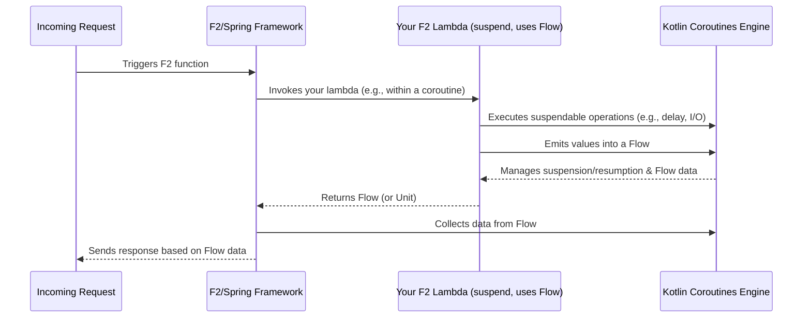

# Chapter 7: Kotlin Language Features Integration

Welcome to the final chapter in our introductory F2 journey! In [Chapter 6: API Documentation (OpenAPI via Springdoc)](06_api_documentation__openapi_via_springdoc__.md), we explored how to automatically generate helpful documentation for your F2 services. Now, let's take a moment to appreciate one of the core reasons F2 is so pleasant to work with: its deep integration with powerful **Kotlin language features**.

## Why Kotlin Matters for F2

F2 isn't just written *in* Kotlin; it's designed to embrace Kotlin's strengths. This means that as a developer using F2, you get to write code that is:
*   **Concise**: Less boilerplate, more focus on what your code actually does.
*   **Expressive**: Your code can more clearly communicate its intent.
*   **Modern**: Especially when it comes to handling tasks that need to happen at the same time (asynchronously), like waiting for a database or a network call.

Two Kotlin features are particularly central to F2's design:
1.  **Lambdas**: For writing short, clear functions.
2.  **Coroutines (`suspend` functions and `Flow`)**: For handling asynchronous operations efficiently and easily.

Let's see how F2 uses these to make your life as a developer easier!

## Lambdas: Your Concise Function Shortcuts

Imagine you need to define a simple piece of logic, like a function that takes a name and returns a greeting.

In [Chapter 1: F2 Functional Primitives (F2Supplier, F2Function, F2Consumer)](01_f2_functional_primitives__f2supplier__f2function__f2consumer__.md), we saw how to create F2 functions using helpers like `f2Function`. The code you write inside the `{ ... }` is a **lambda expression**.

**What is a Lambda?**
A lambda is like a mini, anonymous function. It's a way to write a small block of code that can be passed around and executed later, without needing to give it a formal name using the `fun` keyword.

**How F2 Uses Lambdas:**
When you define an F2 primitive, you're often providing a lambda.

```kotlin
import io.komune.f2.dsl.fnc.F2Function
import io.komune.f2.dsl.fnc.f2Function // F2 helper
import kotlinx.coroutines.flow.map

// Using a lambda to define an F2Function
val greeterFunction: F2Function<String, String> = f2Function { nameFlow ->
    nameFlow.map { name -> "Hello, $name!" }
}
```
*   The part ` { nameFlow -> nameFlow.map { name -> "Hello, $name!" } } ` is a lambda.
*   It takes an input `nameFlow`.
*   It performs an action (mapping each name in the flow to a greeting string).
*   The `f2Function` helper takes this lambda and wraps it into an object that F2 and Spring Cloud Function can understand and use.

**Why are Lambdas Great Here?**
*   **Conciseness**: Look how short and direct that is! Without lambdas, you might have to write more boilerplate code to create an object that implements the `F2Function` interface.
*   **Readability**: The logic is right there, easy to see.

F2's functional DSL (Domain Specific Language), with helpers like `f2Function`, `f2SupplierSingle`, and `f2Consumer`, is built around making it natural to use lambdas.

## Coroutines: Your Super-Efficient Asynchronous Assistants

Modern applications often need to do many things at once. For example, a web server might handle requests from many users simultaneously. Each request might involve waiting for a database, calling another service, or reading a file. If the server just waited idly for each of these slow operations to finish one by one, it would quickly become unresponsive.

This is where **Kotlin Coroutines** come in. Think of coroutines as super-efficient assistants.
*   They can start a task (like fetching data from a network).
*   If that task needs to wait, the coroutine can "pause" itself without blocking the main worker (the thread). The main worker is then free to do other things.
*   Once the waiting is over (e.g., data arrives from the network), the coroutine can "resume" right where it left off.

This makes your application highly responsive and scalable, as it can juggle many tasks efficiently.

F2 embraces coroutines through two key Kotlin concepts: `suspend` functions and `Flow`.

### 1. `suspend` Functions: Pausable Operations

A `suspend` function is a special kind of function in Kotlin that can be paused and resumed by the coroutine system.

**How F2 Uses `suspend`:**
All the [F2 Functional Primitives (F2Supplier, F2Function, F2Consumer)](01_f2_functional_primitives__f2supplier__f2function__f2consumer__.md) are defined as `suspend` functions. Let's look at the `F2Supplier` signature from the `README.md` (and Chapter 1):

```kotlin
// From f2-dsl-function (JVM)
actual fun interface F2Supplier<R> : suspend () -> Flow<R> {
	override suspend operator fun invoke(): Flow<R>
}
```
*   Notice the `suspend` keyword before `() -> Flow<R>` and before `operator fun invoke()`.
*   This means that when you implement an `F2Supplier`, your lambda can perform long-running operations (like network calls or complex calculations) inside a coroutine. If it needs to wait, it can do so without freezing your application.

**Example: A Supplier with a Delay**
```kotlin
import io.komune.f2.dsl.fnc.F2Supplier
import io.komune.f2.dsl.fnc.f2SupplierSingle
import kotlinx.coroutines.delay // A suspend function from Kotlin Coroutines

val delayedMessageSupplier: F2Supplier<String> = f2SupplierSingle {
    delay(1000) // Pause for 1 second (1000 milliseconds)
    "Message after delay!"
}
```
*   `delay(1000)` is a `suspend` function. When this line is hit, the coroutine running this supplier will pause for 1 second.
*   Importantly, the thread it was running on is *not* blocked. It can go do other work.
*   After 1 second, the coroutine resumes, and "Message after delay!" is returned.

### 2. `Flow`: Streams of Asynchronous Data

A `Flow` (from Kotlin Coroutines) is like a pipe or a stream that can deliver multiple values over time, asynchronously.
*   An `F2Supplier` produces a `Flow` of results.
*   An `F2Function` takes a `Flow` of inputs and produces a `Flow` of outputs.
*   An `F2Consumer` takes a `Flow` of inputs to process.

**How F2 Uses `Flow`:**
The use of `Flow` throughout F2 primitives means F2 is naturally built for handling streams of data, which is common in reactive programming and event-driven systems. It allows your functions to:
*   Produce multiple results from a single invocation (e.g., a supplier streaming stock price updates).
*   Process items one by one as they arrive in a stream.

**Example: A Supplier Emitting Multiple Values**
```kotlin
import io.komune.f2.dsl.fnc.F2Supplier
import io.komune.f2.dsl.fnc.f2Supplier // Note: not f2SupplierSingle
import kotlinx.coroutines.flow.Flow
import kotlinx.coroutines.flow.flow
import kotlinx.coroutines.delay

val numberStreamSupplier: F2Supplier<Int> = f2Supplier {
    flow { // 'flow' is a builder for creating a Flow
        for (i in 1..3) {
            delay(500) // Wait half a second
            emit(i)    // Send 'i' down the Flow
        }
    }
}
```
*   This supplier returns a `Flow<Int>`.
*   Inside the `flow { ... }` block, it `emit`s numbers 1, 2, and 3, with a half-second delay between each.
*   A consumer of this flow would receive these numbers one by one as they are emitted.

**Sequential Style for Asynchronous Code:**
One of the biggest wins with coroutines and `Flow` is that you can write asynchronous code that *looks* sequential and easy to follow. The `delay` and `emit` calls in the example above are executed in order, but the underlying coroutine machinery handles the asynchronous waiting and data streaming efficiently.

## How F2 Puts It All Together

F2's design choices make these Kotlin features feel like a natural fit:
1.  **DSL Helpers**: Functions like `f2Function {}`, `f2Supplier {}`, etc., from `f2-dsl-function` (see `README.md`) are designed to directly accept lambdas.
    ```kotlin
    // From README.md (f2-dsl-function)
    // fun <T, R> f2Function(fnc: suspend (t: T) -> R): F2Function<T, R>
    // fun <R> f2Supplier(fnc: suspend () -> Flow<R>): F2Supplier<R>
    ```
    These helpers wrap your `suspend` lambda (which might return a `Flow` or a single value that F2 can turn into a `Flow`) into the appropriate F2 primitive.

2.  **Core Interfaces**: The F2 primitive interfaces themselves (e.g., `F2Supplier<R>: suspend () -> Flow<R>`) explicitly use `suspend` and `Flow`. This means the entire F2 execution model is built on top of Kotlin Coroutines.

## Under the Hood: A Glimpse

You don't usually need to worry about these details, but here's a simplified idea of what happens:

*   **Lambdas**: When you write a lambda like `{ input -> input.uppercase() }`, the Kotlin compiler turns it into an instance of a functional interface (like `Function1<T, R>`). F2's helper functions (`f2Function`, etc.) take these lambda instances and adapt them into F2's specific primitive types. Spring Cloud Function has its own mechanisms like `KotlinFunctionWrapper` (found in `KotlinLambdaToFunctionAutoConfiguration.java` and mentioned in the `README.md`'s context of Kotlin Module for Jackson) to further integrate these Kotlin lambdas into its function invocation system.

*   **Coroutines (`suspend` and `Flow`)**: F2 itself doesn't "implement" coroutines. It *leverages* them. When a request comes in (e.g., via an HTTP call handled by a [Protocol Adapter (HTTP & RSocket)](04_protocol_adapters__http___rsocket__.md)) and is routed to your F2 function (via the [Spring Cloud Function Integration & Function Catalog](02_spring_cloud_function_integration___function_catalog_.md)):
    1.  The F2 framework (often with Spring) sets up the context to call your F2 function.
    2.  Since your F2 function's `invoke` method is `suspend` and likely involves `Flow`, it's executed within a coroutine managed by Kotlin's coroutine library.
    3.  If your lambda calls `delay()` or performs I/O that suspends, the coroutine pauses, freeing up the thread.
    4.  The `Flow` returned by your function is collected by the framework, and its emissions are processed (e.g., serialized and sent as an HTTP response, as covered in [Chapter 5: Message Serialization & Conversion](05_message_serialization___conversion__.md)).



The key is that F2 provides the structure (`F2Supplier`, `F2Function` interfaces and DSL helpers) that seamlessly plugs into Kotlin's powerful concurrency model.

## Benefits for You, the Developer

Leveraging these Kotlin features in F2 brings significant advantages:
*   **Less Code, More Clarity**: Lambdas make your function definitions short and to the point.
*   **Simplified Asynchronous Code**: Coroutines allow you to write complex asynchronous logic in a way that reads like simple, sequential code. No more "callback hell"!
*   **Efficiency and Scalability**: Coroutines are lightweight, allowing your application to handle many concurrent operations without needing a huge number of threads, leading to better resource utilization.
*   **A Modern Feel**: You get to use the latest and greatest features of a modern programming language.

## Conclusion

F2 is deeply rooted in the Kotlin ecosystem. By embracing **lambdas** for concise function definitions and **coroutines** (with `suspend` functions and `Flow`) for powerful and easy-to-manage asynchronous programming, F2 offers a development experience that is both efficient and enjoyable. These Kotlin features are not just add-ons; they are fundamental to how F2 primitives are designed and used, allowing you to build responsive and scalable applications with more straightforward code.

This concludes our initial tour of F2! We've covered the core functional primitives, how they integrate with Spring Cloud Function, the CQRS pattern, protocol adapters for HTTP and RSocket, message handling, API documentation, and finally, the beautiful synergy with Kotlin's language features. We hope this journey has given you a solid foundation and a taste of what's possible with F2. Happy coding!

---

Generated by [AI Codebase Knowledge Builder](https://github.com/The-Pocket/Tutorial-Codebase-Knowledge)