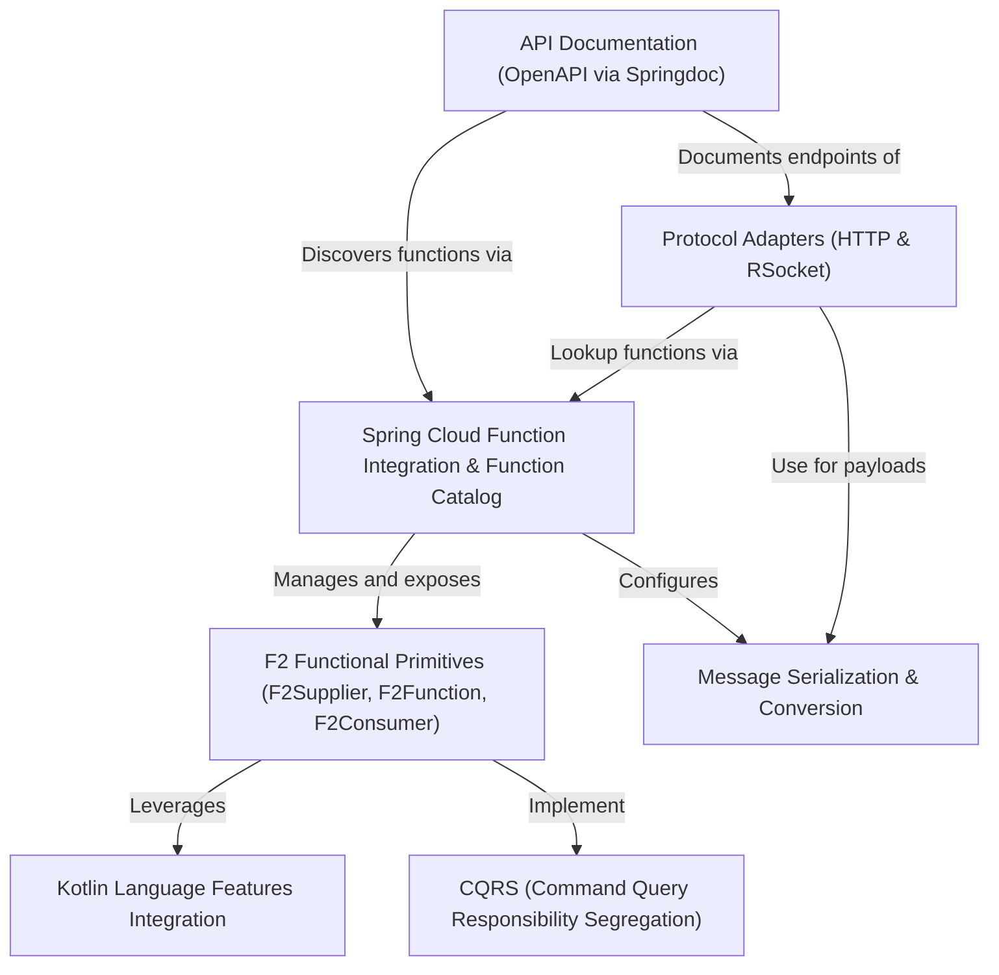

# Tutorial: fixers-gradle

F2 is a **Kotlin-based framework** simplifying the development of *CQRS (Command Query Responsibility Segregation)* applications.
It leverages **Spring Cloud Function** to manage and expose *functional primitives* (Suppliers, Functions, Consumers).
These functions can be accessed over network protocols like **HTTP** and **RSocket**, with built-in support for *message serialization* (e.g., JSON) and automatic *API documentation* via OpenAPI.

**Source Repository:** [https://github.com/komune-io/fixers-f2](https://github.com/komune-io/fixers-f2)

## Chapters

1. [F2 Functional Primitives (F2Supplier, F2Function, F2Consumer)
](01_f2_functional_primitives__f2supplier__f2function__f2consumer__.md)
2. [Spring Cloud Function Integration & Function Catalog
](02_spring_cloud_function_integration___function_catalog_.md)
3. [CQRS (Command Query Responsibility Segregation)
](03_cqrs__command_query_responsibility_segregation__.md)
4. [Protocol Adapters (HTTP & RSocket)
](04_protocol_adapters__http___rsocket__.md)
5. [Message Serialization & Conversion
](05_message_serialization___conversion_.md)
6. [API Documentation (OpenAPI via Springdoc)
](06_api_documentation__openapi_via_springdoc__.md)
7. [Kotlin Language Features Integration
](07_kotlin_language_features_integration_.md)

---

Generated by [AI Codebase Knowledge Builder](https://github.com/The-Pocket/Tutorial-Codebase-Knowledge)