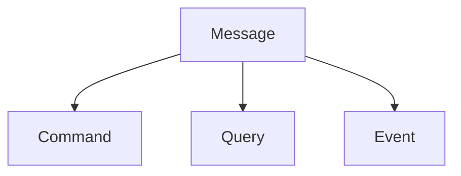
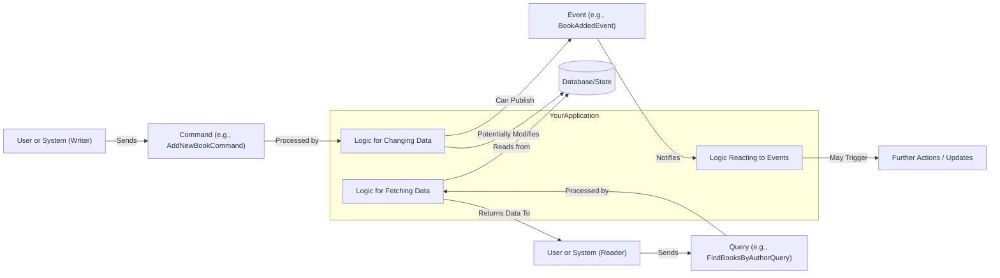

# Chapter 1: CQRS Message Types (`Command`, `Query`, `Event`)

Welcome to your first step into the F2 framework! In this chapter, we're going to explore some fundamental building blocks that F2 uses: `Command`, `Query`, and `Event` message types. Don't worry if these terms sound technical; we'll break them down with simple examples.

## The "Why": Organizing Actions in Your Application

Imagine you're building a simple online library application. Users and librarians will interact with it in different ways:

*   A librarian might want to **add a new book** to the collection. This action *changes* the library's data.
*   A user might want to **search for books by a specific author**. This action just *retrieves* information without changing anything.
*   When a new book is successfully added, other parts of your system (like a "new arrivals" feed or a recommendation engine) might need to be **notified**. This is like an announcement.

If we try to handle all these different kinds of interactions without a clear structure, our code can quickly become messy and hard to understand. How do we distinguish between an action that *changes* data, one that only *reads* data, and an *announcement*?

This is where the **Command Query Responsibility Segregation (CQRS)** pattern comes into play, and F2 is designed to help you implement it. At its heart, CQRS is about separating the "doing stuff" part of your application (Commands) from the "getting stuff" part (Queries). `Events` then tell us about "stuff that happened."

F2 provides three special interface types to help us make these distinctions clear: `Command`, `Query`, and `Event`.

## Meet the Message Types: `Command`, `Query`, `Event`

In F2, these three types are all built on a common base called `Message`. Think of `Message` as the general category, and `Command`, `Query`, and `Event` as specific kinds of messages.



Let's look at each one:

### 1. `Command`: Telling the System to Do Something

A `Command` represents an **intent to change the system's state**. It's like giving an order or instruction.
*   **Analogy:** "Hey system, please add this new book to the library!" or "Sign this user up."
*   **Purpose:** To perform an action, like creating, updating, or deleting data.
*   **Example in our library:** `AddNewBookCommand` (telling the system to add a new book).

Commands are usually named with a verb in an imperative mood (e.g., `CreateUser`, `UpdateOrderDetails`). They carry the data needed to perform the action.

### 2. `Query`: Asking the System for Information

A `Query` represents a **request to retrieve data without altering the system's state**. It's like asking a question.
*   **Analogy:** "Can you show me all books written by J.R.R. Tolkien?" or "What is the current user's profile information?"
*   **Purpose:** To read data. Queries should not change any data.
*   **Example in our library:** `FindBooksByAuthorQuery` (asking for a list of books).

Queries are typically named to reflect the data they are fetching (e.g., `GetUserById`, `ListActiveProducts`). They carry the parameters needed to find the specific data (like an author's name or a user's ID).

### 3. `Event`: Announcing Something Happened

An `Event` signifies that **something significant has occurred in the system**. It's a statement of fact about something that happened in the past.
*   **Analogy:** "Good news! The book 'The Hobbit' was successfully added to the library!" or "User JohnDoe has registered."
*   **Purpose:** To notify other parts of the system (or even external systems) that a state change has occurred. Other parts can then react to this event.
*   **Example in our library:** `BookAddedEvent` (announcing that a book has been added).

Events are usually named with a verb in the past participle (e.g., `UserCreated`, `OrderShipped`). They carry data describing what happened.

## Putting Them to Use: Library Example

Let's see how we might define these message types for our library application using Kotlin. In F2, these are typically simple data classes or interfaces.

### Defining our Library Messages

First, we need to make sure we have the `f2-dsl-cqrs` dependency, as this is where the base `Command`, `Query`, and `Event` interfaces live.

If you're using Gradle:
```gradle
implementation("io.komune.f2:f2-dsl-cqrs:${Versions.f2}") // Replace ${Versions.f2} with the actual version
```

If you're using Maven:
```xml
<dependency>
  <groupId>io.komune.f2</groupId>
  <artifactId>f2-dsl-cqrs</artifactId>
  <version>${Versions.f2}</version> <!-- Replace ${Versions.f2} with the actual version -->
</dependency>
```

Now, let's define our specific messages:

1.  **Command to add a new book:**

    ```kotlin
    import f2.dsl.cqrs.Command

    data class AddNewBookCommand(
        val title: String,
        val author: String,
        val isbn: String
    ) : Command // This is a Command!
    ```
    This `AddNewBookCommand` clearly states its intent ("add a new book") and carries the necessary data (`title`, `author`, `isbn`).

2.  **Query to find books by author:**

    ```kotlin
    import f2.dsl.cqrs.Query

    data class FindBooksByAuthorQuery(
        val authorName: String
    ) : Query // This is a Query!
    ```
    This `FindBooksByAuthorQuery` asks for information and specifies the criteria (`authorName`).

3.  **Event for when a book is added:**

    ```kotlin
    import f2.dsl.cqrs.Event

    data class BookAddedEvent(
        val bookId: String, // Let's say our system assigns an ID
        val title: String,
        val author: String,
        val isbn: String
    ) : Event // This is an Event!
    ```
    This `BookAddedEvent` announces that a book was added and provides details about the newly added book.

### How These Messages Guide Development

By defining these distinct message types:
*   It becomes very clear what operations your application supports.
*   You can separate the logic for handling commands (writes) from the logic for handling queries (reads). This often leads to simpler, more focused code.
*   Events provide a great way to decouple different parts of your system. For example, a "recommendation service" can simply listen for `BookAddedEvent`s without needing to know the details of how books are added.

In later chapters, you'll see how [F2 Functional Primitives (`F2Supplier`, `F2Function`, `F2Consumer`)](02_f2_functional_primitives___f2supplier____f2function____f2consumer___.md) are used to create handlers for these commands and queries.

## Under the Hood: What Are These Interfaces?

You might be wondering what these `Command`, `Query`, and `Event` interfaces actually *do*. Internally, they are very simple! In Kotlin, they are defined as "marker interfaces." This means they don't add any new methods or properties themselves; their main purpose is to categorize or "mark" your classes.

Here's what their definitions look like (simplified from `f2-dsl-cqrs`):

The base for all of them is `Message`:
```kotlin
// From: f2-dsl-cqrs/.../Message.kt
package f2.dsl.cqrs

interface Message
// That's it! Just a marker.
```

Then, `Command`, `Query`, and `Event` simply extend `Message`:

```kotlin
// From: f2-dsl-cqrs/.../Command.kt
package f2.dsl.cqrs

interface Command : Message // Marks a class as a Command
```

```kotlin
// From: f2-dsl-cqrs/.../Query.kt
package f2.dsl.cqrs

interface Query : Message // Marks a class as a Query
```

```kotlin
// From: f2-dsl-cqrs/.../Event.kt
package f2.dsl.cqrs

interface Event : Message // Marks a class as an Event
```

So, when you make your `AddNewBookCommand` implement `Command`, you're not getting any new functions from `Command` itself. Instead, you're telling F2 (and other developers) that this class represents an intent to change state. The F2 framework can then use this type information to route and handle messages appropriately.

## How These Message Types Fit into CQRS (Conceptual Flow)

The real power of these types comes from how they enable the CQRS pattern. Here's a simplified view of how they typically flow in an application:



*   **Commands** go to the "write side" of your application, potentially changing data and/or producing events.
*   **Queries** go to the "read side," fetching data, ideally without side effects.
*   **Events** are facts about what happened, often published by the write side and consumed by other parts of the system.

This separation helps in building systems that are easier to scale, maintain, and reason about.

## Conclusion & Next Steps

You've now learned about the three fundamental message types in F2:
*   `Command`: An instruction to do something that changes the system.
*   `Query`: A request to get information without changing anything.
*   `Event`: An announcement that something significant has happened.

These simple interfaces are key to applying the CQRS pattern with F2, helping you build clearer and more organized applications. They act as clear signposts for the intent of each piece of data flowing through your system.

Now that we understand the *types* of messages we can work with, we need a way to define the actual logic that *processes* these messages. In the next chapter, we'll dive into [F2 Functional Primitives (`F2Supplier`, `F2Function`, `F2Consumer`)](02_f2_functional_primitives___f2supplier____f2function____f2consumer___.md), which provide the tools for just that!

---

Generated by [AI Codebase Knowledge Builder](https://github.com/The-Pocket/Tutorial-Codebase-Knowledge)