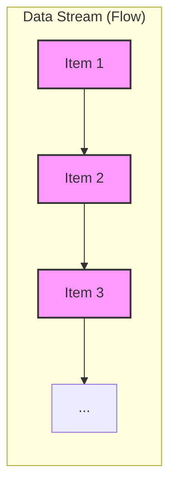
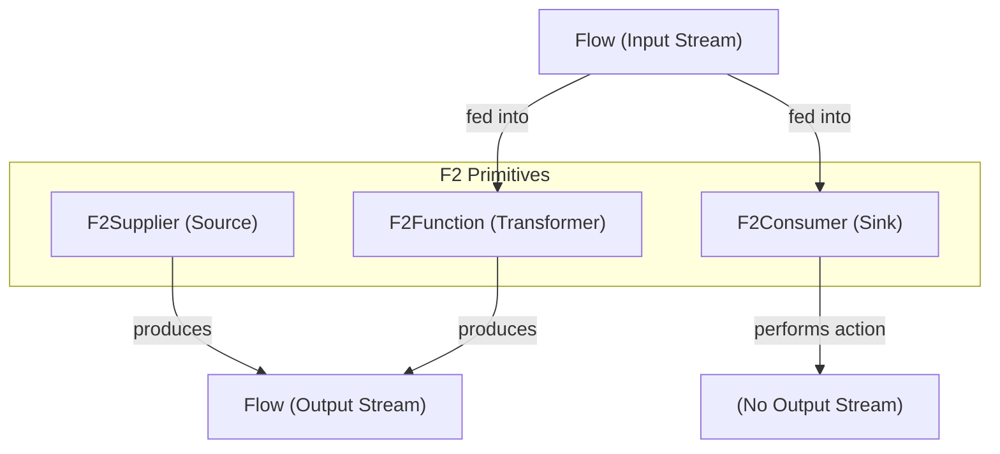
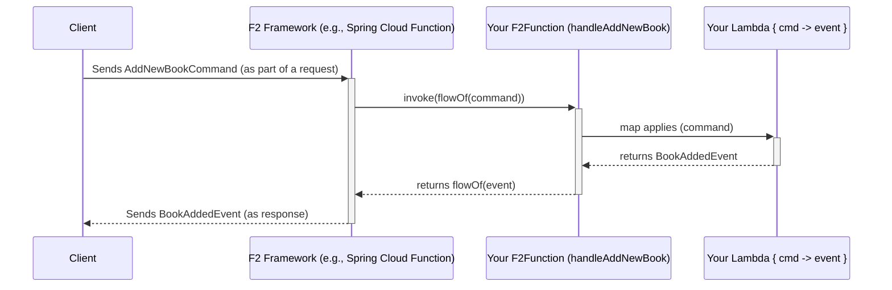

# Chapter 2: F2 Functional Primitives (`F2Supplier`, `F2Function`, `F2Consumer`)

Welcome to Chapter 2! In [Chapter 1: CQRS Message Types (`Command`, `Query`, `Event`)](01_cqrs_message_types___command____query____event___.md), we learned about the different kinds of messages (`Command`, `Query`, `Event`) we use to communicate intent and facts within an F2 application. That's like knowing what kind of letters to send. Now, we need to learn how to build the "post office" and "letter processing centers" – the actual logic that handles these messages.

This is where F2 Functional Primitives come in: `F2Supplier`, `F2Function`, and `F2Consumer`. These are the core building blocks for defining your server-side business logic in a clean, functional, and reactive way.

## The "Why": Defining What Your Application *Does*

Imagine our online library again. We've defined messages like:
*   `AddNewBookCommand`: An instruction to add a book.
*   `FindBooksByAuthorQuery`: A request for books by an author.
*   `BookAddedEvent`: An announcement that a book was added.

But how do we actually *implement* the logic for these?
*   What code runs when an `AddNewBookCommand` arrives? How does it result in a `BookAddedEvent`?
*   What code runs for a `FindBooksByAuthorQuery` to fetch the book list?
*   What if we need a piece of code that just generates data (like a list of "featured books" every hour) without any specific input?
*   What if we need a piece of code that takes data (like our `BookAddedEvent`) and just does something with it (like logging it or sending an email) without producing a new kind of data?

F2 provides three special types of functions, inspired by functional programming, to define these behaviors: `F2Supplier`, `F2Function`, and `F2Consumer`. They all work with **streams of data**.

### A Quick Word on Streams: Kotlin's `Flow`

Before we dive into the primitives, it's helpful to know that F2 uses Kotlin Coroutines' `Flow` to handle data. Think of a `Flow<T>` as a **stream** of items of type `T`. It's like a conveyor belt where items can appear one by one, over time. This is great for handling data that might not be available all at once, or for operations that produce multiple results.

*   A `Flow<String>` could be a stream of names: "Alice", then "Bob", then "Charlie".
*   A `Flow<BookAddedEvent>` could be a stream of events as books get added.

Our F2 primitives will either produce, transform, or consume these streams.



Don't worry if `Flow` is new to you; the F2 helpers often let you write simpler code that works with individual items, and F2 handles the stream part for you.

## Meet the Primitives: Supplier, Function, Consumer

Let's look at each of these building blocks.

### 1. `F2Supplier<R>`: The Data Source

*   **Analogy:** A spring bubbling up water, or a news feed that constantly provides new headlines.
*   **Purpose:** An `F2Supplier` is a source of data. It doesn't take any input parameters but produces a stream of output values (`Flow<R>`).
*   **Use Cases:**
    *   Generating a stream of random numbers.
    *   Fetching a list of items from a database on a schedule.
    *   Providing a continuous stream of sensor data.

An `F2Supplier<R>` essentially defines a function like `suspend () -> Flow<R>`. It's something that, when called, gives you a stream of `R` items.

### 2. `F2Function<T, R>`: The Transformation Machine

*   **Analogy:** A magical machine where you put ingredients (`T`) in one end, and transformed goods (`R`) come out the other.
*   **Purpose:** An `F2Function` takes a stream of input data (`Flow<T>`) and processes it into a stream of output data (`Flow<R>`). This is where most of your business logic for handling commands and queries will live.
*   **Use Cases:**
    *   Taking an `AddNewBookCommand` and producing a `BookAddedEvent`.
    *   Taking a `FindBooksByAuthorQuery` and returning a `Flow<Book>` (stream of books).
    *   Validating input data and then transforming it.

An `F2Function<T, R>` essentially defines a function like `suspend (Flow<T>) -> Flow<R>`.

### 3. `F2Consumer<T>`: The Data Sink

*   **Analogy:** A drain where water (`T`) flows in and disappears, or a printer that takes text and prints it but doesn't give back new text.
*   **Purpose:** An `F2Consumer` receives a stream of data (`Flow<T>`) and performs some action with it. It does not produce any further output data stream.
*   **Use Cases:**
    *   Logging incoming messages to the console or a file.
    *   Sending an email notification for each event in a stream.
    *   Saving data to a database without returning any specific result from the function itself.

An `F2Consumer<T>` essentially defines a function like `suspend (Flow<T>) -> Unit`. The `Unit` means it doesn't return a meaningful value.



## Putting Them to Use: Library Example Revisited

Let's see how we can use these primitives to implement the logic for our library application.
First, ensure you have the `f2-dsl-function` dependency, which provides these primitives and helpful builder functions.

If you're using Gradle:
```gradle
// build.gradle.kts
implementation("io.komune.f2:f2-dsl-function:${Versions.f2}") // Replace ${Versions.f2}
```

If you're using Maven:
```xml
<!-- pom.xml -->
<dependency>
  <groupId>io.komune.f2</groupId>
  <artifactId>f2-dsl-function</artifactId>
  <version>${Versions.f2}</version> <!-- Replace ${Versions.f2} -->
</dependency>
```

Now, let's use the messages from [Chapter 1: CQRS Message Types (`Command`, `Query`, `Event`)](01_cqrs_message_types___command____query____event___.md):
```kotlin
import f2.dsl.cqrs.Command
import f2.dsl.cqrs.Query
import f2.dsl.cqrs.Event

// Command from Chapter 1
data class AddNewBookCommand(
    val title: String,
    val author: String,
    val isbn: String
) : Command

// Event from Chapter 1
data class BookAddedEvent(
    val bookId: String,
    val title: String,
    val author: String,
    val isbn: String
) : Event

// Query from Chapter 1
data class FindBooksByAuthorQuery(
    val authorName: String
) : Query

// A simple Book DTO for query results
data class BookDetails(val id: String, val title: String, val author: String)
```

### 1. Handling `AddNewBookCommand` with `F2Function`

We need logic that takes an `AddNewBookCommand` and, if successful, produces a `BookAddedEvent`. This is a transformation, so `F2Function` is perfect.

F2 provides a helper `f2Function { ... }` that makes defining these easy. You write a small piece of code (a lambda) that processes *one* command and returns *one* event. F2 takes care of handling the stream (`Flow`) for you.

```kotlin
import f2.dsl.fnc.F2Function
import f2.dsl.fnc.f2Function
import java.util.UUID // For generating a unique ID

fun handleAddNewBook(): F2Function<AddNewBookCommand, BookAddedEvent> = f2Function { command ->
    // In a real app, you'd save to a database here.
    // For simplicity, we'll just create an event.
    println("Processing AddNewBookCommand for title: ${command.title}")
    BookAddedEvent(
        bookId = UUID.randomUUID().toString(), // Generate a new ID
        title = command.title,
        author = command.author,
        isbn = command.isbn
    )
}
```
*   We define `handleAddNewBook` which returns an `F2Function`.
*   The input type is `AddNewBookCommand`, output is `BookAddedEvent`.
*   Inside `f2Function { command -> ... }`, `command` is a single `AddNewBookCommand` object.
*   We simulate processing (like saving to a DB) and return a `BookAddedEvent`.

When this F2Function is invoked by the F2 framework with a stream of `AddNewBookCommand`s, it will process each command using our lambda and produce a stream of `BookAddedEvent`s.

### 2. Handling `FindBooksByAuthorQuery` with `F2Function`

For queries, we also use `F2Function`. It takes a query and returns data.

```kotlin
import f2.dsl.fnc.F2Function
import f2.dsl.fnc.f2Function // Helper

fun handleFindBooksByAuthor(): F2Function<FindBooksByAuthorQuery, List<BookDetails>> = f2Function { query ->
    println("Processing FindBooksByAuthorQuery for author: ${query.authorName}")
    // In a real app, you'd query a database.
    // For now, return a hardcoded list.
    if (query.authorName == "J.R.R. Tolkien") {
        listOf(
            BookDetails("book-1", "The Hobbit", "J.R.R. Tolkien"),
            BookDetails("book-2", "The Lord of the Rings", "J.R.R. Tolkien")
        )
    } else {
        emptyList()
    }
}
```
*   This `F2Function` takes a `FindBooksByAuthorQuery` and returns a `List<BookDetails>`.
*   The `f2Function { query -> ... }` lambda receives a single `FindBooksByAuthorQuery`.
*   It returns a list of `BookDetails` based on the query. F2 wraps this list into a `Flow` containing a single item (the list itself).

### 3. Generating Data with `F2Supplier`

Let's say we want a function that simply provides a new, unique ID whenever asked. This is a source of data, so `F2Supplier` is suitable. F2 provides `f2SupplierSingle` for suppliers that produce just one item per invocation.

```kotlin
import f2.dsl.fnc.F2SupplierSingle // For single item suppliers
import f2.dsl.fnc.f2SupplierSingle // Helper
import java.util.UUID

fun generateUuid(): F2SupplierSingle<String> = f2SupplierSingle {
    val newId = UUID.randomUUID().toString()
    println("Supplying new UUID: $newId")
    newId // The single String value to supply
}
```
*   `generateUuid` returns an `F2SupplierSingle<String>`.
*   The `f2SupplierSingle { ... }` lambda doesn't take any parameters.
*   It generates and returns a single `String` (the UUID).

If you need to supply a *stream* of items, you'd use `f2Supplier` and return a `Flow<R>` from your lambda. For example, to supply a stream of timestamps every second:

```kotlin
import f2.dsl.fnc.F2Supplier
import f2.dsl.fnc.f2Supplier
import kotlinx.coroutines.delay
import kotlinx.coroutines.flow.flow

fun streamTimestamps(): F2Supplier<Long> = f2Supplier {
    flow { // kotlinx.coroutines.flow.flow builder
        repeat(5) { // Emit 5 timestamps
            delay(1000) // Wait 1 second
            val currentTime = System.currentTimeMillis()
            println("Supplying timestamp: $currentTime")
            emit(currentTime) // Emit the current time into the Flow
        }
    }
}
```
*   `streamTimestamps` returns an `F2Supplier<Long>`.
*   The `f2Supplier { ... }` lambda returns a `Flow<Long>`.
*   We use the `flow { ... }` builder from Kotlin Coroutines to create a stream that emits a timestamp every second, 5 times.

### 4. Consuming Data with `F2Consumer`

Suppose we want to log every `BookAddedEvent` to the console. This is an action performed on data, without producing new data, so `F2Consumer` is the choice. The `f2Consumer { ... }` helper works similarly.

```kotlin
import f2.dsl.fnc.F2Consumer
import f2.dsl.fnc.f2Consumer // Helper

fun logBookAddedEvents(): F2Consumer<BookAddedEvent> = f2Consumer { event ->
    // Action: Print event details to the console
    println("Logging BookAddedEvent: ID=${event.bookId}, Title='${event.title}'")
    // No return value needed for a consumer
}
```
*   `logBookAddedEvents` returns an `F2Consumer<BookAddedEvent>`.
*   The `f2Consumer { event -> ... }` lambda takes a single `BookAddedEvent`.
*   It performs an action (printing) and doesn't return anything.

In [Chapter 4: Spring Boot Integration (F2 Starters & Auto-Configuration)](04_spring_boot_integration__f2_starters___auto_configuration__.md), you'll see how these defined functions are registered with Spring Boot so they can be called via HTTP or RSocket.

## Under the Hood: What Are These Primitives?

On the JVM (which is common for Spring Boot applications), these primitives are `fun interface`s. This is a Kotlin feature that allows an interface with a single abstract method to be implemented by a lambda.

Their core definitions (simplified from `f2-dsl-function`) look like this:

**`F2Supplier`**
```kotlin
// From: f2-dsl/f2-dsl-function/src/jvmMain/kotlin/f2/dsl/fnc/F2SupplierActual.jvm.kt
// (Simplified conceptual representation)
actual fun interface F2Supplier<R> : suspend () -> Flow<R> {
	override suspend operator fun invoke(): Flow<R>
}
```
It's a function type that takes no arguments and returns a `Flow<R>` (a stream of R).

**`F2Function`**
```kotlin
// From: f2-dsl/f2-dsl-function/src/jvmMain/kotlin/f2/dsl/fnc/F2FunctionActual.jvm.kt
// (Simplified conceptual representation)
actual fun interface F2Function<T, R>: suspend (Flow<T>) -> Flow<R> {
  override suspend operator fun invoke(msgs: Flow<T>): Flow<R>
}
```
It's a function type that takes a `Flow<T>` (input stream) and returns a `Flow<R>` (output stream).

**`F2Consumer`**
```kotlin
// From: f2-dsl/f2-dsl-function/src/jvmMain/kotlin/f2/dsl/fnc/F2ConsumerActual.jvm.kt
// (Simplified conceptual representation)
actual fun interface F2Consumer<T>: suspend (Flow<T>) -> Unit {
  override suspend operator fun invoke(msg: Flow<T>)
}
```
It's a function type that takes a `Flow<T>` (input stream) and returns `Unit` (nothing).

Notice the `suspend` keyword? This means these functions can perform long-running operations (like network calls or database access) without blocking the main thread, thanks to Kotlin Coroutines.

### How Helper Functions like `f2Function` Work

You might wonder: if `F2Function` expects to work with `Flow<T>` and `Flow<R>`, how come our lambda in `f2Function { command -> ... }` worked with a single `AddNewBookCommand` and returned a single `BookAddedEvent`?

The magic is in the helper function! Let's look at a simplified version of how `f2Function` (from `F2FunctionExtension.kt`) works:

```kotlin
// Simplified from f2-dsl/f2-dsl-function/src/commonMain/kotlin/f2/dsl/fnc/F2FunctionExtension.kt
fun <T, R> f2Function(userLambda: suspend (inputItem: T) -> R): F2Function<T, R> {
    return F2Function { inputStream: Flow<T> -> // Implement the F2Function interface
        inputStream.map { item: T -> // For each item in the input Flow...
            userLambda(item)        // ...call the user's lambda
        }                           // .map produces a new Flow<R>
    }
}
```
1.  `f2Function` takes your simple lambda (`userLambda`) that knows how to process one `T` into one `R`.
2.  It returns an actual `F2Function`.
3.  The `invoke` method of this returned `F2Function` receives the `inputStream: Flow<T>`.
4.  It uses `inputStream.map { ... }`. The `map` operator on a `Flow` takes each item from the `inputStream`, applies your `userLambda` to it, and collects the results into a new `outputStream: Flow<R>`.

So, these helpers provide a convenient way to define logic for individual items, while F2 handles the stream processing part. The same principle applies to `f2Consumer` and `f2SupplierSingle`.

### Conceptual Flow of an `F2Function` Call

Here's how a call to an `F2Function` (like our `handleAddNewBook`) might look at a high level when integrated into a server:


1.  A **Client** (e.g., a web browser or another service) sends a request containing an `AddNewBookCommand`.
2.  The **F2 Framework** receives this, wraps the command into a `Flow` (e.g., `flowOf(command)`), and calls your registered `F2Function` (`handleAddNewBook`).
3.  Your `F2Function` (created by the `f2Function` helper) internally uses `map` to pass the `AddNewBookCommand` from the input `Flow` to **Your Lambda**.
4.  **Your Lambda** executes your business logic (creates a `BookAddedEvent`).
5.  The `map` operator collects this `BookAddedEvent` into an output `Flow`.
6.  This output `Flow` (containing the `BookAddedEvent`) is returned to the **F2 Framework**.
7.  The **F2 Framework** sends the `BookAddedEvent` back to the **Client** as a response.

## Conclusion & Next Steps

You've now met the workhorses of F2's server-side logic:
*   `F2Supplier<R>`: For generating streams of data without input (like a spring).
*   `F2Function<T, R>`: For transforming input streams of data into output streams (like a machine). This is where you'll handle your [Commands and Queries](01_cqrs_message_types___command____query____event___.md).
*   `F2Consumer<T>`: For consuming streams of data to perform actions (like a sink).

These primitives, along with Kotlin's `Flow`, encourage a reactive, stream-based way of thinking about your application's logic, making it easier to handle asynchronous operations and build responsive systems. The helper functions (`f2Function`, `f2Supplier`, `f2Consumer`) simplify their creation, often allowing you to focus on single-item processing.

So far, we've talked about individual messages and the functions that process them. But often, when messages travel over the network (e.g., via HTTP), they need to be wrapped in a standard way, perhaps with some metadata. In the next chapter, we'll explore the [`Envelope` (Standardized Message Wrapper)](03__envelope___standardized_message_wrapper__.md), which F2 uses for this purpose.

---

Generated by [AI Codebase Knowledge Builder](https://github.com/The-Pocket/Tutorial-Codebase-Knowledge)