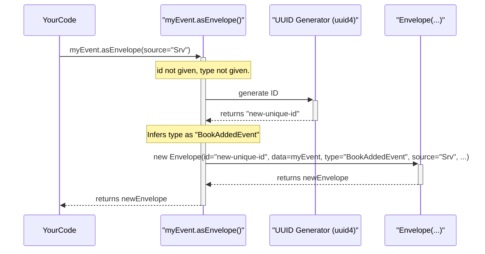
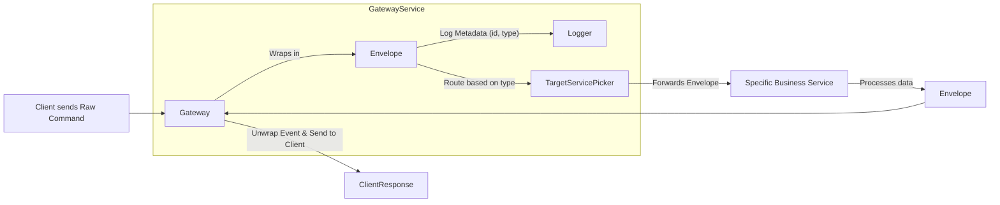

# Chapter 3: `Envelope` (Standardized Message Wrapper)

Welcome to Chapter 3! In the previous chapter, [F2 Functional Primitives (`F2Supplier`, `F2Function`, `F2Consumer`)](02_f2_functional_primitives___f2supplier____f2function____f2consumer___.md), we explored how to define the actual logic that processes our [CQRS Message Types (`Command`, `Query`, `Event`)](01_cqrs_message_types___command____query____event___.md). We learned how to create functions that act as data sources, transformers, or consumers.

Now, let's think about what happens when these messages travel. Imagine our online library application. A `BookAddedEvent` might need to be sent from the "Book Management Service" to a separate "Notification Service" or a "Recommendation Engine." How does the receiving service understand the incoming package without needing to know every tiny detail about the sender or the specific event structure just to do basic things like logging or routing? This is where a standardized wrapper becomes incredibly helpful.

## The "Why": The Need for a Standardized Message Package

Think about sending a physical letter. You don't just send the piece of paper with your message on it. You put it into an **envelope**. This envelope has important information on the outside:
*   A **recipient address** (where it's going).
*   A **sender address** (where it came from).
*   A **stamp** (proof of postage).
*   Sometimes, a **tracking number** (so you can see its journey).

This envelope allows the postal service to handle your letter efficiently. They can sort it, route it, and track it *without needing to open it and read your personal message* until it reaches the right department or person.

In software systems, especially those built with many parts (like microservices) or that rely heavily on events, messages need a similar standardized wrapper. Without it, each part of your system might send and receive messages in slightly different formats, leading to:
*   **Confusion:** How do I find the actual data? What's this extra bit of info?
*   **Tight Coupling:** Receivers need to know too much about senders.
*   **Difficulty in Tracking:** How do you follow a single user request as it triggers actions across multiple services?

F2 provides the `Envelope` to solve this. It's a standard "digital envelope" for your messages.

## Meet the `Envelope`: Your Digital Letter Carrier

The `Envelope` in F2 acts as a standardized container for messages flowing through the system. It holds the actual `data` (your `Command`, `Query`, or `Event` – the "letter") and crucial metadata.

Here are the key pieces of information an `Envelope` carries:

*   `data` (The Letter): This is your actual message object, like `BookAddedEvent` or `FindBooksByAuthorQuery`.
*   `id` (Tracking Number): A unique string to identify this specific message instance. Super useful for logging and tracing.
*   `type` (Type of Content): A string indicating what kind of data is inside, e.g., `"BookAddedEvent"`. This helps receiving systems understand what to expect.
*   `time` (Timestamp): A string representing when the event or message was created or occurred.
*   `source` (Sender's Address): A string indicating where the message originated, e.g., `"LibraryManagementService"`.
*   `datacontenttype` (Optional - Data Format): Hints at the format of the `data`, like `"application/json"`.
*   `specversion` (Optional - Specification Version): If the envelope adheres to a specific standard (like CloudEvents), this indicates the version of that standard. For now, F2 often sets this to `"1.0"`.

```mermaid
graph TD
    E[Envelope]
    E --> Id[id (String - Tracking Number)]
    E --> Type[type (String - Content Type)]
    E --> Time[time (String? - Timestamp)]
    E --> Source[source (String? - Origin)]
    E --> Data[data (T - Your Actual Message)]
    E --> DContentType[datacontenttype (String? - Data Format)]
    E --> SpecVersion[specversion (String? - CloudEvents Spec)]
```

This consistent structure allows for:
*   **Uniform Handling:** Any part of your system can look at the `Envelope`'s metadata.
*   **Smarter Routing:** Messages can be directed based on `type` or `source`.
*   **Easy Tracing:** The `id` helps follow a message's journey.

## Using the `Envelope`

Let's see how to work with `Envelope`s. The `Envelope` class and related tools are part of the `f2-dsl-cqrs` module, which you likely already have if you're using [CQRS Message Types (`Command`, `Query`, `Event`)](01_cqrs_message_types___command____query____event___.md).

### Defining a Sample Message

First, let's reuse our `BookAddedEvent` from Chapter 1:
```kotlin
import f2.dsl.cqrs.Event

// Event from Chapter 1
data class BookAddedEvent(
    val bookId: String,
    val title: String,
    val author: String,
    val isbn: String
) : Event
```

### Creating an `Envelope`

You can create an `Envelope` instance directly, but more often, you'll use a handy extension function.

**1. Manual Creation (Less Common, Good for Understanding)**

```kotlin
import f2.dsl.cqrs.envelope.Envelope
import java.time.Instant // For a timestamp

// Our event instance
val myEvent = BookAddedEvent("book-456", "F2 Envelopes Explained", "Mr. Wrapper", "112233")

// Manually creating an envelope
val manualEnvelope = Envelope(
    id = "msg-id-007",
    data = myEvent,
    type = "BookAddedEvent",
    time = Instant.now().toString(), // Current time
    source = "LearningSystem"
)

println("Manual Envelope ID: ${manualEnvelope.id}")
// Output: Manual Envelope ID: msg-id-007
println("Data inside: ${manualEnvelope.data.title}")
// Output: Data inside: F2 Envelopes Explained
```
This shows all the parts you can set.

**2. Using the `asEnvelope()` Extension Function (The Easy Way!)**

F2 provides a super convenient extension function called `asEnvelope()` that you can call on any object.

```kotlin
import f2.dsl.cqrs.envelope.asEnvelope // Import the extension

// Our event instance
val myEvent = BookAddedEvent("book-789", "Easy Enveloping", "Ms. Kotlin", "445566")

// Using the extension function
val easyEnvelope = myEvent.asEnvelope(
    source = "LibraryService",
    // id, type, and time can be auto-generated or customized!
)

println("Easy Envelope ID: ${easyEnvelope.id}") // An auto-generated UUID
// Output (example): Easy Envelope ID: a1b2c3d4-e5f6-7890-1234-567890abcdef
println("Easy Envelope Type: ${easyEnvelope.type}")
// Output: Easy Envelope Type: BookAddedEvent
println("Easy Envelope Source: ${easyEnvelope.source}")
// Output: Easy Envelope Source: LibraryService
println("Data title: ${easyEnvelope.data.title}")
// Output: Data title: Easy Enveloping
```
This is much cleaner!
*   `myEvent.asEnvelope(...)` takes your `myEvent` object and wraps it.
*   If you don't provide an `id`, it generates a unique one (UUID).
*   If you don't provide a `type`, it often infers it from the class name of your data (e.g., `BookAddedEvent`).
*   You can still override these or provide others like `source` and `time`.

### `Envelope` with F2 Functional Primitives

Remember the [F2 Functional Primitives (`F2Supplier`, `F2Function`, `F2Consumer`)](02_f2_functional_primitives___f2supplier____f2function____f2consumer___.md) from Chapter 2? They can be defined to work directly with `Envelope`s. F2 provides type aliases for this:

*   `F2FunctionEnveloped<T, R>` is a shorthand for `F2Function<Envelope<T>, Envelope<R>>`
*   `F2SupplierEnveloped<R>` is a shorthand for `F2Supplier<Envelope<R>>`
*   `F2ConsumerEnveloped<T>` is a shorthand for `F2Consumer<Envelope<T>>`

This means your functions can expect an `Envelope` as input and produce an `Envelope` as output, keeping the metadata flowing.

Here's a conceptual glimpse (we'll see more concrete examples later):
```kotlin
import f2.dsl.cqrs.Command
import f2.dsl.cqrs.Event
import f2.dsl.cqrs.envelope.Envelope
import f2.dsl.cqrs.envelope.asEnvelope
import f2.dsl.fnc.F2FunctionEnveloped // Type alias
import f2.dsl.fnc.f2Function // Helper from Chapter 2

data class ProcessOrderCommand(val orderId: String) : Command
data class OrderProcessedEvent(val orderId: String, val status: String) : Event

// This function expects an Envelope<ProcessOrderCommand>
// and returns an Envelope<OrderProcessedEvent>
fun handleOrderProcessing(): F2FunctionEnveloped<ProcessOrderCommand, OrderProcessedEvent> = f2Function { envelopedCommand ->
    val command: ProcessOrderCommand = envelopedCommand.data // Unwrap
    println("Processing order from envelope: ${command.orderId}, source: ${envelopedCommand.source}")

    // ... actual order processing logic ...
    val event = OrderProcessedEvent(command.orderId, "SUCCESS")

    // Wrap the result event, copying metadata from the incoming envelope
    event.asEnvelope(from = envelopedCommand, source = "OrderProcessor")
}
```
In this sketch, `handleOrderProcessing` receives an `Envelope`. It can access the `data` (the `ProcessOrderCommand`) and also any metadata from the `envelopedCommand` (like `id` or `source`). When it produces the `OrderProcessedEvent`, it wraps it in a new `Envelope`, potentially copying relevant metadata from the original request's envelope using `from = envelopedCommand`.

## Under the Hood: What is an `Envelope`?

Let's peek at how `Envelope` is defined.

### The `Envelope` Data Structure

At its core, `Envelope` is a Kotlin `data class`. This makes it a simple, immutable container for its properties. You can find its definition in `f2-dsl-cqrs/src/commonMain/kotlin/f2/dsl/cqrs/envelope/Envelope.kt`.

A simplified view of the `Envelope` class and its related interface `EnvelopeDTO`:
```kotlin
// Simplified from f2.dsl.cqrs.envelope.Envelope.kt

// An interface defining the structure
interface EnvelopeDTO<T> {
    val id: String
    val data: T
    val type: String
    val datacontenttype: String?
    val specversion: String?
    val source: String?
    val time: String?
}

// The actual class implementing the DTO
// @Serializable and @JsExport are for Kotlin Multiplatform features
class Envelope<T>(
    override val id: String,
    override val data: T,
    override val type: String,
    override val datacontenttype: String? = null,
    override val specversion: String? = null, // Often defaults to "1.0"
    override val source: String? = null,
    override val time: String? = null
) : EnvelopeDTO<T> {
    // Companion object can hold static-like factory methods
    companion object 
}
```
The `Envelope` also implicitly uses helper interfaces like `WithEnvelopeId` and `WithEnvelopeData` (from `WithEnvelopeId.kt` and `WithEnvelopeData.kt` respectively):

```kotlin
// From f2.dsl.cqrs.envelope.WithEnvelopeId.kt
interface WithEnvelopeId {
    val id: String
}

// From f2.dsl.cqrs.envelope.WithEnvelopeData.kt
interface WithEnvelopeData<T> {
    val data: T
}
```
These small interfaces just ensure that anything claiming to have an `id` or `data` field adheres to a common contract.

### The Magic of `asEnvelope()`

The `asEnvelope()` extension function is defined in `f2-dsl-cqrs/src/commonMain/kotlin/f2/dsl/cqrs/envelope/EnvelopeExtension.kt`. Let's look at its key aspects:

```kotlin
// Simplified concept from EnvelopeExtension.kt
// inline fun <reified T> T.asEnvelope(...): Envelope<T>
// 'T' is the type of object you call .asEnvelope() on.
// 'reified T' means Kotlin knows the actual type of T at runtime.

fun <T> T.asEnvelopeWithType( // A core part of how asEnvelope works
    type: String, // The type string for the envelope
    from: Envelope<*>? = null, // Optional: an existing envelope to copy metadata from
    source: String? = from?.source,
    id: String = from?.id ?: uuid4().toString(), // Uses 'from's id or a new UUID
    time: String? = from?.time,
    datacontenttype: String? = from?.datacontenttype,
): Envelope<T> {
    return Envelope(
        specversion = "1.0", // F2 default
        type = type,
        source = source,
        id = id,
        time = time,
        datacontenttype = datacontenttype,
        data = this // 'this' is your original object (e.g., myEvent)
    )
}
```
When you call `myEvent.asEnvelope(source = "LibraryService")`:
1.  `this` refers to `myEvent`.
2.  If you don't provide `id`, `uuid4().toString()` generates a new unique ID (e.g., `"a1b2c3d4-..."`).
3.  If you don't provide `type`, `asEnvelope()` (the `reified T` version) cleverly uses `T::class.simpleName` to get the class name (e.g., `"BookAddedEvent"`) as the default type.
4.  It then constructs and returns a new `Envelope` instance, populating `data` with `myEvent` and filling in the other metadata fields.

Here's a simplified sequence of what happens when you call `myEvent.asEnvelope()`:


## Why This Standardization Is So Useful (Revisited)

Having this `Envelope` structure consistently across your messages offers significant benefits:

*   **Centralized Logging/Tracing:** A middleware component can intercept all `Envelope`s, log their `id`, `type`, `source`, and `time`, and then pass them on. This gives you an audit trail without that component needing to understand the specific `data` of each message.
*   **Generic Message Handlers:** You could have a system that, for example, archives any `Envelope` it receives, regardless of its payload.
*   **Improved Interoperability:** When different services (potentially written by different teams or even in different languages if you serialize to JSON/Protobuf) communicate, a common envelope schema reduces integration friction.
*   **Schema Evolution:** The `data` part of your message can evolve, but as long as the `Envelope` structure remains, generic message processing tools can still function.

Imagine a gatekeeper service:

The Gateway can handle the `Envelope` metadata without needing to know the specifics of every possible `Command` or `Event` payload.

## Conclusion & Next Steps

You've now learned about the `Envelope` in F2 – a standardized wrapper that adds crucial metadata like `id`, `type`, `source`, and `time` to your messages. This simple but powerful concept helps in building robust, traceable, and maintainable distributed systems by ensuring messages are handled uniformly. The `asEnvelope()` extension function makes it easy to wrap your data.

We've covered:
*   The [types of messages](01_cqrs_message_types___command____query____event___.md) (`Command`, `Query`, `Event`).
*   The [functional primitives](02_f2_functional_primitives___f2supplier____f2function____f2consumer___.md) (`F2Supplier`, `F2Function`, `F2Consumer`) to process them.
*   The `Envelope` to standardize how these messages are packaged.

Now, how do we actually expose these F2 functions and their enveloped messages over the network so that other services or frontends can interact with them? How does F2 seamlessly integrate with popular frameworks like Spring Boot?

That's exactly what we'll explore in the next chapter: [Spring Boot Integration (F2 Starters & Auto-Configuration)](04_spring_boot_integration__f2_starters___auto_configuration__.md).

---

Generated by [AI Codebase Knowledge Builder](https://github.com/The-Pocket/Tutorial-Codebase-Knowledge)