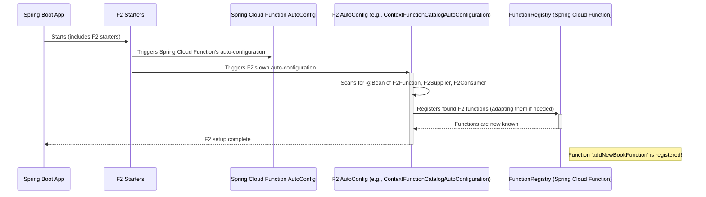
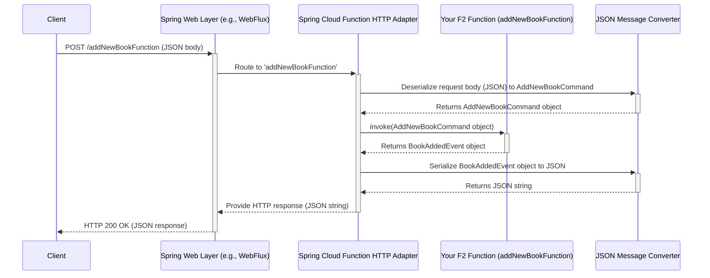

# Chapter 4: Spring Boot Integration (F2 Starters & Auto-Configuration)

Welcome to Chapter 4! In [Chapter 3: `Envelope` (Standardized Message Wrapper)](03__envelope___standardized_message_wrapper__.md), we learned how to package our messages like `Commands`, `Queries`, and `Events` into a standard `Envelope` with useful metadata. This is like putting our letters into well-addressed envelopes.

But now, how do we actually set up a "post office" that can receive these digital letters from the internet (say, via an HTTP request) and deliver them to the correct F2 function we wrote in [Chapter 2: F2 Functional Primitives (`F2Supplier`, `F2Function`, `F2Consumer`)](02_f2_functional_primitives___f2supplier____f2function____f2consumer___.md)? And how do we send a reply back? Manually setting this up can be a lot of work. This is where F2's smooth integration with Spring Boot comes to the rescue!

## The "Why": Making Your F2 Functions Web-Accessible, Easily

Imagine you've built a cool F2 function, say, `handleAddNewBook` from Chapter 2, which takes an `AddNewBookCommand` and returns a `BookAddedEvent`.
```kotlin
// From Chapter 1
data class AddNewBookCommand(val title: String, /* ... */) : Command
data class BookAddedEvent(val bookId: String, /* ... */) : Event

// From Chapter 2
fun handleAddNewBook(): F2Function<AddNewBookCommand, BookAddedEvent> = f2Function { cmd ->
    // ... logic to create BookAddedEvent ...
    BookAddedEvent(bookId = "new-book-123", title = cmd.title, /* ... */)
}
```
You want to make this function callable from a web browser or another service by sending an HTTP POST request to an endpoint like `/addNewBook`. The request body would contain the `AddNewBookCommand` (as JSON), and the response should be the `BookAddedEvent` (as JSON).

Doing this from scratch would involve:
1.  Setting up an HTTP server.
2.  Writing code to listen for requests at `/addNewBook`.
3.  Parsing the incoming JSON into an `AddNewBookCommand` object.
4.  Calling your `handleAddNewBook` function.
5.  Converting the returned `BookAddedEvent` back into JSON.
6.  Sending the JSON as an HTTP response.

That's a lot of repetitive "plumbing" code for every function! F2 and Spring Boot aim to make this almost automatic.

## Meet the F2 Starters & Auto-Configuration: Plug-and-Play Magic!

F2 provides **Spring Boot "starters"**. Think of these starters as special "plug-and-play" modules for your Spring Boot application. When you add an F2 starter to your project, it brings in necessary libraries and automatically configures your F2 functions to work seamlessly within the Spring environment. This "automatic configuration" is called **auto-configuration**.

### What is a Spring Boot Starter?
A starter is a pre-packaged set of dependencies and configurations that gets you "started" quickly with a specific feature. For example, `spring-boot-starter-web` gets you started with building web applications. F2 has its own starters for integrating F2 functions.

### What is Auto-Configuration?
Auto-configuration is Spring Boot's way of trying to guess and set up common configurations for you based on the libraries (like F2 starters) you have in your project. It reduces the amount of manual setup you need to do.

### The Key F2 Starter: `f2-spring-boot-starter-function-http`

For our use case of exposing F2 functions over HTTP, the most important starter is `f2-spring-boot-starter-function-http`. When you include this, it automatically:
1.  **Finds your F2 Functions:** It looks for any F2 functions (`F2Function`, `F2Supplier`, `F2Consumer`) that you've defined as Spring beans.
2.  **Registers them with Spring Cloud Function:** Spring Cloud Function is a framework that F2 builds upon, allowing functions to be exposed over various protocols.
3.  **Sets up HTTP Endpoints:** It automatically creates HTTP endpoints for your functions. The endpoint path often defaults to the name of your function bean.
4.  **Configures Message Converters:** It sets up tools to automatically convert data between JSON (common for web APIs) and your Kotlin objects (like `AddNewBookCommand`). F2 supports Jackson, Gson, and Kotlinx Serialization for this.
5.  **Handles Request Processing:** It takes care of the low-level details of processing incoming HTTP requests and sending back responses.

This means you can focus on writing your business logic (your F2 functions) and let the starter handle most of the web integration boilerplate!

```mermaid
graph TD
    subgraph YourSpringBootApp ["Your Spring Boot Application"]
        direction LR
        YF["Your F2Function Bean (e.g., handleAddNewBook)"]
        F2Starter["F2 Starter (e.g., f2-spring-boot-starter-function-http)"]
        SCFunc["Spring Cloud Function"]
        SpringWeb["Spring Web (for HTTP)"]
    end

    F2Starter -- "adds & configures" --> SCFunc
    SCFunc -- "integrates with" --> SpringWeb
    F2Starter -- "auto-detects & registers" --> YF -- "with" --> SCFunc
    
    Client["HTTP Client (Browser/Service)"] -- HTTP Request --> SpringWeb
    SpringWeb -- "routes to" --> SCFunc
    SCFunc -- "invokes" --> YF
    YF -- "returns result to" --> SCFunc
    SCFunc -- "sends response via" --> SpringWeb
    SpringWeb -- HTTP Response --> Client

    note over F2Starter,YF: "Magic happens here! Auto-configuration sets up the plumbing."
```

## Using F2 with Spring Boot: A Simple Example

Let's turn our `handleAddNewBook` function into a web-accessible HTTP endpoint.

**1. Add the Dependency**

First, you need to add the `f2-spring-boot-starter-function-http` starter to your project.

If you're using Gradle (in your `build.gradle.kts` or `build.gradle`):
```gradle
implementation("io.komune.f2:f2-spring-boot-starter-function-http:${Versions.f2}") 
// Make sure to use the latest F2 version for ${Versions.f2}
```
This line tells Gradle to download and include the F2 HTTP starter.

If you're using Maven (in your `pom.xml`):
```xml
<dependency>
  <groupId>io.komune.f2</groupId>
  <artifactId>f2-spring-boot-starter-function-http</artifactId>
  <version>${Versions.f2}</version> <!-- Use latest F2 version -->
</dependency>
```

**2. Define Your F2 Function as a Spring Bean**

Now, let's create a simple Spring Boot application and define our `handleAddNewBook` F2 function as a Spring `@Bean`. A bean is just an object that Spring manages.

```kotlin
import f2.dsl.cqrs.Command
import f2.dsl.cqrs.Event
import f2.dsl.fnc.F2Function
import f2.dsl.fnc.f2Function
import org.springframework.boot.autoconfigure.SpringBootApplication
import org.springframework.boot.runApplication
import org.springframework.context.annotation.Bean
import java.util.UUID

// Define your CQRS messages (from Chapter 1)
data class AddNewBookCommand(
    val title: String,
    val author: String,
    val isbn: String
) : Command

data class BookAddedEvent(
    val bookId: String,
    val title: String,
    val author: String,
    val isbn: String
) : Event

// Your Spring Boot Application
@SpringBootApplication
class MyLibraryApplication {

    // This makes our F2 function a Spring-managed bean
    // The bean name will be "addNewBookFunction" by default
    @Bean
    fun addNewBookFunction(): F2Function<AddNewBookCommand, BookAddedEvent> = f2Function { command ->
        println("HTTP Request received for AddNewBookCommand: ${command.title}")
        // Simulate creating a book and returning an event
        BookAddedEvent(
            bookId = UUID.randomUUID().toString(),
            title = command.title,
            author = command.author,
            isbn = command.isbn
        )
    }
}

fun main(args: Array<String>) {
    runApplication<MyLibraryApplication>(*args)
}
```
**Explanation:**
*   `@SpringBootApplication`: This is a standard Spring Boot annotation that enables auto-configuration and component scanning.
*   `@Bean fun addNewBookFunction(): ...`: This declares a Spring bean named `addNewBookFunction`. Spring will create and manage an instance of our F2 function.
*   The `f2Function { ... }` is the same F2 primitive we learned about in [Chapter 2](02_f2_functional_primitives___f2supplier____f2function____f2consumer___.md).

**3. Run Your Application!**

That's it! If you run this `MyLibraryApplication`, Spring Boot, with the F2 starter, will automatically:
*   Detect the `addNewBookFunction` bean.
*   Expose it as an HTTP endpoint. By default, Spring Cloud Function will try to map it to `/addNewBookFunction` (based on the bean name). You can customize this path.

**4. Calling Your HTTP Endpoint**

You can now send an HTTP POST request to `http://localhost:8080/addNewBookFunction` (assuming your app runs on port 8080).

**Request:**
*   Method: `POST`
*   URL: `http://localhost:8080/addNewBookFunction`
*   Headers: `Content-Type: application/json`
*   Body (JSON):
    ```json
    {
      "title": "The F2 Journey",
      "author": "Komune Devs",
      "isbn": "123-F2-SPRING"
    }
    ```

**Expected Response (JSON):**
*   Status: `200 OK`
*   Body:
    ```json
    {
      "bookId": "some-generated-uuid", 
      "title": "The F2 Journey",
      "author": "Komune Devs",
      "isbn": "123-F2-SPRING"
    }
    ```

Isn't that neat? You wrote your core logic as an F2 function, added a starter, and declared it as a bean. F2 and Spring Boot handled the rest of the web setup!

### Working with `Envelope`s

If your F2 function is designed to work with [Envelopes](03__envelope___standardized_message_wrapper__.md) (e.g., `F2Function<Envelope<MyCommand>, Envelope<MyEvent>>`), the F2 starters will handle the serialization and deserialization of the entire `Envelope` object too. The HTTP request body would be an `Envelope` JSON, and the response would also be an `Envelope` JSON.

## Under the Hood: How Does the Magic Happen?

Let's briefly peek behind the curtain to understand the main steps involved when your Spring Boot application starts and when an HTTP request comes in.

**1. Application Startup (Auto-Configuration)**



*   When your Spring Boot app starts, it loads all auto-configuration classes, including those from F2 starters and Spring Cloud Function.
*   `ContextFunctionCatalogAutoConfiguration.java` (from `f2-spring-boot-starter-function` which is a dependency of `f2-spring-boot-starter-function-http`) plays a key role. It scans your application for beans that are instances of F2's functional primitives like `F2Function`.
*   These F2 functions are then registered with Spring Cloud Function's `FunctionRegistry`. Since F2 functions are Kotlin-specific (`fun interface`), there's logic (related to `KotlinLambdaToFunctionAutoConfiguration.java`) that adapts them into a format Spring Cloud Function universally understands.
*   The `JsonMapperConfiguration` (also within `ContextFunctionCatalogAutoConfiguration.java`) sets up your preferred JSON serializer (Jackson, Gson, or Kotlinx Serialization) so that request/response data can be converted automatically. You can control this with the `spring.cloud.function.preferred-json-mapper` property in your `application.properties` or `application.yml` file.
    ```properties
    # In application.properties
    # spring.cloud.function.preferred-json-mapper=kSerialization 
    # (or jackson, or gson)
    ```
*   The `f2-spring-boot-starter-function-http` starter ensures that these registered functions are exposed via HTTP.

**2. Handling an Incoming HTTP Request**



*   When an HTTP request (e.g., `POST /addNewBookFunction`) arrives, Spring's web layer (like Spring WebFlux) receives it.
*   Spring Cloud Function's HTTP adapter mechanism kicks in. For F2, this is often facilitated or customized by code within the F2 HTTP starter itself (like parts of `FunctionWebRequestProcessingHelper.java` which helps map HTTP requests to function invocations).
*   The adapter uses the configured **Message Converters** (e.g., Jackson) to transform the JSON payload from the request body into the expected input type of your F2 function (e.g., `AddNewBookCommand`).
*   Your actual F2 function bean (`addNewBookFunction`) is then invoked with this deserialized input object.
*   The result from your F2 function (e.g., a `BookAddedEvent` object) is taken by the adapter.
*   The Message Converters are used again to serialize this result object back into JSON.
*   This JSON is then sent back as the HTTP response.

This automatic handling of request parsing, deserialization, function invocation, serialization, and response generation is what makes F2 starters so powerful and developer-friendly.

F2 also provides `f2-spring-boot-starter-function-rsocket` for exposing functions over the RSocket protocol, which follows similar principles of auto-configuration and integration.

## Conclusion & Next Steps

You've now seen how F2's Spring Boot starters, like `f2-spring-boot-starter-function-http`, and auto-configuration work together to magically connect your F2 functions to the web. By simply:
1.  Adding a starter dependency.
2.  Defining your F2 functions as Spring beans.

You get working HTTP endpoints with minimal boilerplate! This significantly speeds up development and lets you focus on your core application logic. The starters handle the complex plumbing of request routing, data conversion (JSON serialization/deserialization), and function invocation.

So far, we've focused on the server-side: defining messages, writing functions to process them, wrapping them in envelopes, and exposing them via Spring Boot. But how do clients (other services or frontends) call these F2 functions? In the next chapter, we'll explore [`F2Client` (Client Abstraction)](05__f2client___client_abstraction__.md), which provides a clean way to make these calls.

---

Generated by [AI Codebase Knowledge Builder](https://github.com/The-Pocket/Tutorial-Codebase-Knowledge)