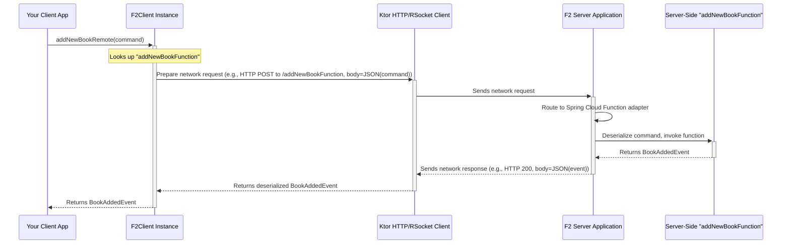

# Chapter 5: `F2Client` (Client Abstraction)

In [Chapter 4: Spring Boot Integration (F2 Starters & Auto-Configuration)](04_spring_boot_integration__f2_starters___auto_configuration__.md), we saw how easy it is to expose our server-side F2 functions as HTTP or RSocket endpoints using Spring Boot. Our "post office" is set up and ready to receive requests!

But how do other applications (clients) send "digital letters" to these endpoints? If you have a separate "Reporting Service" or a mobile app that needs to call, say, the `addNewBookFunction` we built, how does it do that without getting tangled in the raw details of HTTP requests or RSocket connections? This is where `F2Client` steps in.

## The "Why": A Universal Remote for Your F2 Functions

Imagine you have several remote-controlled F2 services: one for managing books, another for user accounts, and perhaps one for processing orders. Each might use a different communication channel (HTTP for one, RSocket for another). Trying to talk to each one directly would mean learning different "remotes" with different buttons.

`F2Client` acts like a **universal remote control**. It provides a consistent way for your client applications to "press buttons" (invoke functions) on your F2 services, regardless of whether they're speaking HTTP or RSocket under the hood.

The key problem `F2Client` solves is **abstracting away the network protocol details**. This means your client code can focus on the business logic of *what* it wants to do (e.g., "add a new book," "get user details") rather than *how* to send the data over the network.

## Meet the `F2Client`: Your Friendly F2 Service Communicator

`F2Client` is the primary interface that client applications use to interact with F2 services. It offers a standard set of methods that mirror the [F2 Functional Primitives (`F2Supplier`, `F2Function`, `F2Consumer`)](02_f2_functional_primitives___f2supplier____f2function____f2consumer___.md) we saw on the server side:

*   `supplier(routeName)`: To call an `F2Supplier` on the server.
*   `function(routeName)`: To call an `F2Function` on the server.
*   `consumer(routeName)`: To call an `F2Consumer` on the server.

This consistency makes it intuitive to use. If you know how F2 functions are defined on the server, you'll find it straightforward to call them from a client.

```mermaid
graph LR
    ClientApp["Client Application"] -- Uses --> F2C["F2Client Instance"]
    
    subgraph "Network Abstraction"
        F2C -- Chooses Protocol --> KtorHttpClient["Ktor HTTP Client"]
        F2C -- Or Chooses Protocol --> KtorRSocketClient["Ktor RSocket Client"]
    end

    KtorHttpClient -- HTTP --> F2ServiceHTTP["F2 Service (HTTP)"]
    KtorRSocketClient -- RSocket --> F2ServiceRSocket["F2 Service (RSocket)"]

    F2ServiceHTTP -- Contains --> ServerF2Func["Server-Side F2Function"]
    F2ServiceRSocket -- Contains --> ServerF2Func
    
    note over F2C: "Provides supplier(), function(), consumer()"
```
The client application only interacts with `F2Client`. `F2Client` then uses the appropriate underlying Ktor client (for HTTP or RSocket) to communicate with the server.

## Using the `F2Client`

Let's see how our "Reporting Service" (which is a client) might use `F2Client` to call the `addNewBookFunction` from our library application (the server).

**1. Add Client Dependencies**

Your client application needs the F2 client libraries. The `f2-client-ktor` artifact is a good starting point as it provides the `F2ClientBuilder` which can create clients for different protocols.

If you're using Gradle (in your client project's `build.gradle.kts`):
```gradle
// Provides F2ClientBuilder and Ktor-based clients
implementation("io.komune.f2:f2-client-ktor:${Versions.f2}")
// You also need the F2 DSL for function types (F2Function, etc.)
implementation("io.komune.f2:f2-dsl-function:${Versions.f2}")
```
*(Replace `${Versions.f2}` with the actual F2 version.)*

**2. Define Data Transfer Objects (DTOs)**

The client needs to know the "shape" of the data it's sending and receiving. These are typically simple Kotlin data classes. These DTOs should match what the server expects for the `addNewBookFunction`.

```kotlin
// In your client application (or a shared library)
data class AddNewBookCommand(
    val title: String,
    val author: String,
    val isbn: String
)

data class BookAddedEvent(
    val bookId: String,
    val title: String,
    val author: String,
    val isbn: String
)
```
*Notice: These are just data classes. On the client side, they don't strictly need to implement the `Command` or `Event` interfaces from `f2-dsl-cqrs` unless the client itself is also an F2 application.*

**3. Create an `F2Client` Instance**

You use `F2ClientBuilder` (from `f2.client.ktor.F2ClientBuilder`) to get an `F2Client` instance. You just need to provide the URL of the server.

```kotlin
import f2.client.ktor.F2ClientBuilder // Important import

// This code would be in your client application
suspend fun callLibraryService() {
    val libraryServiceUrl = "http://localhost:8080" // URL of our F2 server
    val client = F2ClientBuilder.get(libraryServiceUrl)

    // Now 'client' is ready to use!
    // ... more code here ...
}
```
*   `F2ClientBuilder.get(url)` is a `suspend` function, so you'll usually call it from within a coroutine (e.g., another `suspend` function or `runBlocking`).
*   It automatically detects from the URL (e.g., `http://` or `ws://`) whether to create an HTTP or RSocket client.

**4. Invoking an `F2Function` (like `addNewBookFunction`)**

Once you have the `client`, you can get a reference to a remote `F2Function` using `client.function()`.

```kotlin
import f2.dsl.fnc.F2Function // For the F2Function type
// ... (F2ClientBuilder and DTOs from above) ...

suspend fun callAddNewBook(client: F2Client) { // client from F2ClientBuilder.get()
    val command = AddNewBookCommand(
        title = "The F2 Client Journey",
        author = "A. Developer",
        isbn = "CLIENT-ISBN-001"
    )

    // Get a "proxy" to the remote F2Function
    // "addNewBookFunction" is the bean name on the server (Chapter 4)
    val addNewBookRemote: F2Function<AddNewBookCommand, BookAddedEvent> =
        client.function("addNewBookFunction")

    // Now, call it!
    val event: BookAddedEvent = addNewBookRemote(command) // Magic!

    println("Book added via F2Client! Event ID: ${event.bookId}, Title: ${event.title}")
}
```
*   `client.function<AddNewBookCommand, BookAddedEvent>("addNewBookFunction")` tells `F2Client`:
    *   We want to call a function named "addNewBookFunction" on the server.
    *   It expects an `AddNewBookCommand` as input.
    *   It will return a `BookAddedEvent`.
*   The magic part `addNewBookRemote(command)` looks like a direct local function call! This is thanks to Kotlin extension functions provided by `f2-dsl-function` that simplify invoking an `F2Function` with a single input to get a single output. Under the hood, it still handles `Flow`s.

If you run this client code (and your Spring Boot server from Chapter 4 is running), you'd see output like:
`Book added via F2Client! Event ID: some-uuid-from-server, Title: The F2 Client Journey`

**5. Invoking an `F2Supplier`**

Let's say your server has an `F2Supplier` bean named "uuidGenerator" that supplies a unique ID.
```kotlin
import f2.dsl.fnc.F2Supplier
import kotlinx.coroutines.flow.first // To get the first item from a Flow

// ... (client from F2ClientBuilder.get()) ...
suspend fun fetchUuid(client: F2Client) {
    val uuidFetcher: F2Supplier<String> = client.supplier("uuidGenerator")

    // An F2Supplier returns a Flow. For a single value supplier:
    val newUuid: String = uuidFetcher().first() 
    println("Fetched UUID from server: $newUuid")
}
```
*   `client.supplier<String>("uuidGenerator")` gets a proxy to the remote supplier.
*   `uuidFetcher()` invokes it, returning a `Flow<String>`. We use `.first()` to get the first (and likely only) item from the stream for a single-value supplier.

**6. Invoking an `F2Consumer`**

If the server has an `F2Consumer` bean named "logMessageConsumer" that takes a `String`.
```kotlin
import f2.dsl.fnc.F2Consumer
import kotlinx.coroutines.flow.flowOf // To create a Flow with one item

// ... (client from F2ClientBuilder.get()) ...
suspend fun sendMessageToServerLog(client: F2Client) {
    val messageLogger: F2Consumer<String> = client.consumer("logMessageConsumer")

    // An F2Consumer takes a Flow. For a single message:
    messageLogger(flowOf("Hello server, from F2Client!"))
    println("Message sent to server's log consumer.")
}
```
*   `client.consumer<String>("logMessageConsumer")` gets the consumer proxy.
*   We send a `Flow` containing our message using `flowOf("...")`. The server-side consumer will process this message.

## Under the Hood: How `F2Client` Works

So, how does `F2Client` turn `addNewBookRemote(command)` into an actual network call?

**1. High-Level Flow (Simplified Sequence)**

When you call a function like `client.function("addNewBookFunction")(command)`:



**2. Key Code Pieces**

*   **`F2Client` Interface (`f2-client/f2-client-core/src/commonMain/kotlin/f2/client/F2Client.kt`):**
    This is an `expect interface` in Kotlin Multiplatform, meaning its actual implementation is provided per platform (JVM, JS).
    ```kotlin
    // Simplified from F2Client.kt
    expect interface F2Client {
        val type: F2ClientType // HTTP or RSOCKET
        fun <RESPONSE> supplier(route: String, responseTypeInfo: TypeInfo): F2Supplier<RESPONSE>
        fun <QUERY, RESPONSE> function(
            route: String, queryTypeInfo: TypeInfo, responseTypeInfo: TypeInfo
        ): F2Function<QUERY, RESPONSE>
        // ... and consumer
    }
    ```
    The `TypeInfo` parameters are crucial for Ktor to know how to serialize (convert to JSON/other format) your command objects and deserialize the responses.

*   **Inline Extension Functions (`f2-client/f2-client-core/src/commonMain/kotlin/f2/client/F2Client.kt`):**
    These make `F2Client` easier to use by inferring `TypeInfo` using `reified` generics.
    ```kotlin
    // Simplified from F2Client.kt
    inline fun <reified QUERY, reified RESPONSE> F2Client.function(route: String): F2Function<QUERY, RESPONSE> {
        val queryTypeInfo = getTypeInfo<QUERY>() // Helper to get TypeInfo
        val responseTypeInfo = getTypeInfo<RESPONSE>()
        return function(route, queryTypeInfo, responseTypeInfo) // Calls the expect interface method
    }
    ```
    The `getTypeInfo<DATA>()` function is interesting. For HTTP, it actually returns `typeInfo<List<DATA>>()`. This is because Spring Cloud Function, when serving F2 functions over HTTP, often wraps even single results in a list. The HTTP client implementation then typically unwraps this list if a single item is expected.

*   **`F2ClientBuilder` (`f2-client/f2-client-ktor/src/commonMain/kotlin/f2/client/ktor/F2ClientBuilder.kt`):**
    This object uses the URL prefix (`http:`, `ws:`, `tcp:`) to decide which concrete client implementation to build.
    ```kotlin
    // Simplified from F2ClientBuilder.kt
    object F2ClientBuilder {
        suspend fun get(url: String): F2Client {
            return when {
                url.startsWith("http:") -> httpClientBuilderDefault().build(url) // Builds HttpF2Client
                url.startsWith("https:") -> httpClientBuilderDefault().build(url)
                url.startsWith("tcp:") -> rSocketF2ClientBuilderDefault().build(url, false) // Builds RSocketF2Client
                // ... other protocols ...
                else -> throw IllegalArgumentException("Invalid Url")
            }
        }
    }
    ```

*   **Concrete Clients (e.g., `HttpF2Client`, `RSocketF2Client`):**
    These are the actual workhorses.
    *   `HttpF2Client` (defined in `f2-client/f2-client-ktor/f2-client-ktor-http/`) uses Ktor's `HttpClient` to make HTTP requests (GET for suppliers, POST for functions/consumers). It handles serializing your command to JSON and deserializing the JSON response.
    *   `RSocketF2Client` (defined in `f2-client/f2-client-ktor/f2-client-ktor-rsocket/`) uses `RSocketClient` (from `rsocket-kotlin`) to perform RSocket interactions (request-stream for suppliers, request-response for functions, fire-and-forget for consumers).

    For instance, the `function` method in a simplified `HttpF2Client` might internally do something like:
    ```kotlin
    // Conceptual HttpF2Client's function logic
    override fun <QUERY, RESPONSE> function(...) : F2Function<QUERY, RESPONSE> {
        return F2Function { commandFlow: Flow<QUERY> -> // It gets a Flow of commands
            commandFlow.map { command: QUERY -> // For each command in the flow
                // Use Ktor HttpClient to POST the command (serialized)
                // to urlBase + route
                // And get the response (deserialized)
                httpClient.post("$urlBase/$route") {
                    contentType(ContentType.Application.Json)
                    setBody(command, queryTypeInfo) // Ktor serializes command
                }.body<RESPONSE>(responseTypeInfo) // Ktor deserializes to RESPONSE
                // (Actual handling of Flow<List<RESPONSE>> for HTTP is more involved)
            }
        }
    }
    ```
    This is highly simplified; the actual implementation handles `Flow`s more robustly and deals with the `List<RESPONSE>` expectation for HTTP.

## Benefits of the `F2Client` Abstraction

Using `F2Client` offers several advantages:
1.  **Protocol Agnostic:** Your client's core logic doesn't need to change if the server switches its F2 endpoint from HTTP to RSocket. You'd only change the URL passed to `F2ClientBuilder.get()`.
2.  **Type Safety:** Leverages Kotlin's strong type system and `reified` generics for compile-time checks and runtime type information for serialization.
3.  **Consistency:** The `supplier`, `function`, `consumer` pattern is the same on the client as it is when defining functions on the server.
4.  **Simplified Client Logic:** It hides the complexities of setting up Ktor clients, managing connections, serializing data to/from JSON (or other formats), and handling the nuances of request/response cycles for each protocol.

## Conclusion & Next Steps

You've now learned about `F2Client`, the universal remote control that lets your client applications easily and consistently interact with F2 services. It abstracts away network details, allowing you to focus on your application's logic. With `F2ClientBuilder` and the `supplier`, `function`, and `consumer` methods, calling remote F2 functions feels almost like calling local ones.

We've covered how messages are defined, processed on the server, packaged, exposed via Spring Boot, and now, how they are called by clients. But what happens when things go wrong? A network error, a problem on the server, invalid input... these can all lead to issues.

In the next chapter, we'll explore how F2 handles errors with [F2 Error Handling (`F2Exception`, `F2Error`)](06_f2_error_handling___f2exception____f2error__.md).

---

Generated by [AI Codebase Knowledge Builder](https://github.com/The-Pocket/Tutorial-Codebase-Knowledge)