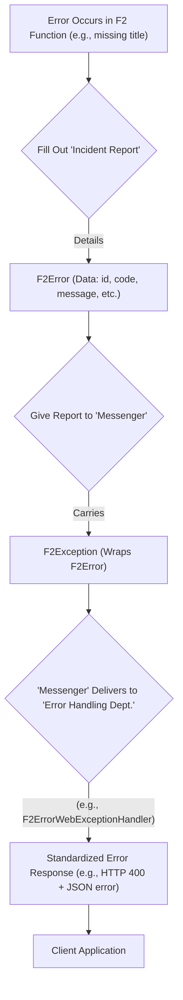

# Chapter 6: F2 Error Handling (`F2Exception`, `F2Error`)

Welcome to Chapter 6! In [Chapter 5: `F2Client` (Client Abstraction)](05__f2client___client_abstraction__.md), we saw how client applications can easily communicate with F2 services. But what happens when things don't go as planned? A user might provide invalid input, a database might be unavailable, or some unexpected issue might occur within our service. How do we handle these situations gracefully and inform the client in a clear, consistent way?

This chapter introduces F2's standardized error handling system, built around `F2Error` and `F2Exception`.

## The "Why": Consistent Communication When Things Go Wrong

Imagine you're building our online library application. A user tries to add a new book using a command, but they forget to provide the book's title.
*   How does our F2 function, which processes the `AddNewBookCommand`, signal this problem?
*   How does the system ensure that the user (or the client application making the request) gets a helpful and standardized error message, perhaps with an appropriate HTTP error code like "400 Bad Request"?
*   If we have many different functions, how do we avoid writing custom error-handling logic for each one, leading to inconsistent error responses?

F2 provides a system a bit like a hospital's standardized patient incident report.
1.  When something goes wrong (an error occurs in your F2 function), an **`F2Error` "report"** is filled out. This "report" is a data structure containing specific details about the error, like an ID, a timestamp, an error code, and a descriptive message.
2.  This `F2Error` "report" is then carried by an **`F2Exception` "messenger"**. `F2Exception` is a special kind of runtime error (an exception) that holds the `F2Error` data.
3.  This "messenger" takes the "report" to the appropriate error handling "department." For web applications, this is often an HTTP error handler like `F2ErrorWebExceptionHandler`. This "department" then uses the information in the `F2Error` report to create a standardized error response for the client.

This ensures that no matter where an error originates in your F2 application, the way it's reported and handled is consistent.



## Meet the Components: `F2Error` and `F2Exception`

Let's look at these two key pieces.

### 1. `F2Error`: The Error Data Sheet

`F2Error` is a simple data class that holds the specific details of an error. Think of it as the structured information about what went wrong.
You can find its definition in `f2-dsl/f2-dsl-cqrs/src/commonMain/kotlin/f2/dsl/cqrs/error/F2Error.kt`.

Key fields in an `F2Error`:
*   `id`: A unique identifier for this specific error instance (often auto-generated).
*   `timestamp`: When the error occurred.
*   `code`: An error code. For HTTP errors, this often corresponds to an HTTP status code (e.g., 400 for Bad Request, 500 for Internal Server Error).
*   `message`: A human-readable message describing the error.
*   `requestId`: Optionally, the ID of the request that led to this error, useful for tracing.

**Creating an `F2Error`:**
```kotlin
import f2.dsl.cqrs.error.F2Error
import kotlinx.datetime.Clock // For timestamps

val validationError = F2Error(
    message = "Book title cannot be empty.",
    code = 400, // Corresponds to HTTP 400 Bad Request
    timestamp = Clock.System.now().toString()
    // 'id' will be auto-generated if not provided
)

println("Error Message: ${validationError.message}")
// Output: Error Message: Book title cannot be empty.
println("Error Code: ${validationError.code}")
// Output: Error Code: 400
```
This `validationError` object now contains all the essential details about a specific problem.

### 2. `F2Exception`: The Error Messenger

`F2Exception` is a runtime exception (it extends `RuntimeException`). Its main job is to "carry" an `F2Error` object. When you want to signal an error in your F2 application in a way that the F2 framework can understand and handle consistently, you'll typically throw an `F2Exception`.
You can find its definition in `f2-dsl/f2-dsl-cqrs/src/commonMain/kotlin/f2/dsl/cqrs/exception/F2Exception.kt`.

**Creating and Throwing an `F2Exception`:**

You can create an `F2Exception` by giving it an `F2Error`.

```kotlin
import f2.dsl.cqrs.error.F2Error
import f2.dsl.cqrs.exception.F2Exception
import kotlinx.datetime.Clock

// Let's create an F2Error first
val bookNotFoundError = F2Error(
    message = "Book with ID '123' not found.",
    code = 404 // HTTP 404 Not Found
)

// Now, wrap it in an F2Exception
val exceptionToThrow = F2Exception(error = bookNotFoundError)

// In your code, you would then throw it:
// throw exceptionToThrow 
// (We'll comment this out for now so the example runs)

println("Exception carries message: ${exceptionToThrow.error.message}")
// Output: Exception carries message: Book with ID '123' not found.
```

F2 also provides convenient extension functions. The `asException()` extension on an `F2Error` object is a very common way to create an `F2Exception`.
This is found in `f2-dsl/f2-dsl-cqrs/src/commonMain/kotlin/f2/dsl/cqrs/error/F2ErrorExtension.kt`.

```kotlin
import f2.dsl.cqrs.error.F2Error
import f2.dsl.cqrs.error.asException // Import the extension

val anotherError = F2Error(message = "Service unavailable", code = 503)

// Use the extension function
val serviceException = anotherError.asException() 

// throw serviceException
println("Service exception code: ${serviceException.error.code}")
// Output: Service exception code: 503
```

## Using F2 Error Handling in an F2 Function

Let's revisit our library application. Suppose we have an [F2 Functional Primitive (`F2Supplier`, `F2Function`, `F2Consumer`)](02_f2_functional_primitives___f2supplier____f2function____f2consumer___.md) that handles a command to add a book.

```kotlin
import f2.dsl.cqrs.Command
import f2.dsl.cqrs.Event
import f2.dsl.fnc.F2Function
import f2.dsl.fnc.f2Function
import f2.dsl.cqrs.error.F2Error
import f2.dsl.cqrs.error.throwException // Helper to throw directly

// Command and Event DTOs
data class AddBookCommand(val title: String?, val author: String) : Command
data class BookAddedEvent(val bookId: String, val title: String) : Event

fun handleAddBookCommand(): F2Function<AddBookCommand, BookAddedEvent> = f2Function { cmd ->
    if (cmd.title.isNullOrBlank()) {
        // 1. Create the F2Error "report"
        val errorDetail = F2Error(
            message = "Book title is required and cannot be empty.",
            code = 400 // Bad Request
        )
        // 2. Throw it using the F2Exception "messenger"
        errorDetail.throwException() // This throws an F2Exception wrapping errorDetail
    }

    // If title is okay, proceed normally
    println("Book title '${cmd.title}' is valid. Processing...")
    BookAddedEvent(bookId = "book-${System.currentTimeMillis()}", title = cmd.title!!)
}
```
In this `handleAddBookCommand` function:
1.  We check if the `title` in `AddBookCommand` is missing or blank.
2.  If it is, we create an `F2Error` object with a helpful message and the HTTP status code `400`.
3.  We then use `errorDetail.throwException()`. This is a handy extension function (from `F2ErrorExtension.kt`) that creates an `F2Exception` wrapping our `errorDetail` and immediately throws it.

### What Happens When `F2Exception` is Thrown?

When this `F2Exception` is thrown within an F2 function that's part of a Spring Boot application (as set up in [Chapter 4: Spring Boot Integration (F2 Starters & Auto-Configuration)](04_spring_boot_integration__f2_starters___auto_configuration__.md)), F2's specialized error handling mechanisms kick in.

Specifically, `F2ErrorWebExceptionHandler` (from `f2-spring-boot-exception-http`) is designed to catch these `F2Exception`s.
1.  It catches the `F2Exception`.
2.  It unwraps the `F2Error` object from the exception.
3.  It uses the details from `F2Error` (like `code`, `message`, `id`, `timestamp`) to construct a standardized JSON error response.
4.  It sends this JSON response back to the client with the HTTP status code specified in `F2Error.code`.

So, if a client called the endpoint for `handleAddBookCommand` with an empty title, they wouldn't just get a generic server error. They'd receive something like:

**HTTP Response:**
*   Status: `400 Bad Request`
*   Body (JSON):
    ```json
    {
      "id": "auto-generated-uuid",
      "timestamp": "2023-10-27T10:30:00Z",
      "code": 400,
      "message": "Book title is required and cannot be empty.",
      "requestId": null 
      // (or the request ID if provided and propagated)
    }
    ```

This provides a much better experience for the client, as the error is specific and actionable.

## Under the Hood: The Journey of an Error

Let's look at the key pieces of code that make this happen.

**1. `F2Error` and `F2Exception` Definitions**

As mentioned, `F2Error` is a data class for holding error information.
From `f2-dsl/f2-dsl-cqrs/src/commonMain/kotlin/f2/dsl/cqrs/error/F2Error.kt`:
```kotlin
// Simplified
@Serializable // For JSON conversion
open class F2Error(
    override val message: String,
    override val id: String? = uuid4().toString(), // Auto UUID
    override val timestamp: String = Clock.System.now().toString(), // Auto timestamp
    override val code: Int = 500, // Default to internal server error
    override val requestId: String? = null,
) : F2ErrorDTO // F2ErrorDTO is an interface defining these fields
```
`F2Exception` is a runtime exception wrapping an `F2ErrorDTO`.
From `f2-dsl/f2-dsl-cqrs/src/commonMain/kotlin/f2/dsl/cqrs/exception/F2Exception.kt`:
```kotlin
// Simplified
open class F2Exception(
	val error: F2ErrorDTO, // Holds the F2Error data
	cause: Throwable? = null // Optional underlying Java/Kotlin exception
) : RuntimeException(error.message, cause) 
```
The `error` property is the crucial link, holding our structured `F2Error` data.

**2. The `F2ErrorWebExceptionHandler` (The "Error Handling Department")**

This class is part of the F2 Spring Boot integration (`f2-spring-boot-exception-http`). It's a specialized Spring `ErrorWebExceptionHandler`.
Simplified conceptual flow:
```mermaid
sequenceDiagram
    participant YourF2Func as "Your F2 Function"
    participant SpringWebFlux as "Spring WebFlux"
    participant F2ErrHandler as "F2ErrorWebExceptionHandler"
    participant JsonConverter as "JSON Serializer"
    participant Client

    YourF2Func -- Throws --> SpringWebFlux: F2Exception(with F2Error)
    SpringWebFlux -- Delegates to --> F2ErrHandler: F2Exception
    F2ErrHandler ->> F2ErrHandler: Extracts F2Error from F2Exception
    F2ErrHandler -- Uses F2Error data --> JsonConverter: F2Error details (code, msg, etc.)
    JsonConverter -- Returns JSON --> F2ErrHandler: Error JSON payload
    F2ErrHandler -- HTTP Status from F2Error.code --> Client: HTTP Response (JSON body)
```
Key parts from `f2-spring/exception/f2-spring-boot-exception-http/src/main/kotlin/f2/spring/exception/config/F2ErrorWebExceptionHandler.kt`:

This handler extends Spring's `DefaultErrorWebExceptionHandler` but customizes it for `F2Exception`.
```kotlin
// Conceptual simplification
class F2ErrorWebExceptionHandler(/*...dependencies...*/) {
    // ... (initialization) ...

    override fun handle(exchange: ServerWebExchange, throwable: Throwable): Mono<Void> {
        val cause = throwable.cause // Check if original exception is wrapped
        return if (cause is F2Exception) {
             super.handle(exchange, cause) // Let Spring handle F2Exception specially
        } else if (/* other specific cases like MissingKotlinParameterException */) {
            // ... convert to F2Exception and handle ...
        } else {
            super.handle(exchange, throwable) // Default handling
        }
    }

    override fun renderErrorResponse(request: ServerRequest?): Mono<ServerResponse?>? {
        // Gets error attributes, which F2ErrorAttributes populates from F2Error
        val errorAttributes = getErrorAttributes(request, /*...options...*/);
        val statusCode = errorAttributes[F2Error::code.name] as Int? ?: 500;
        
        return ServerResponse.status(statusCode) // Use code from F2Error
            .contentType(MediaType.APPLICATION_JSON)
            .body(BodyInserters.fromValue(errorAttributes)) // Send F2Error details as JSON
    }
}
```
And `F2ErrorAttributes.kt` (from the same module) ensures that when Spring asks for error attributes, the details from our `F2Exception.error` are correctly extracted and put into the map that gets serialized to JSON:
```kotlin
// Conceptual simplification from F2ErrorAttributes.kt
class F2ErrorAttributes: DefaultErrorAttributes() {
    override fun getErrorAttributes(request: ServerRequest, options: ErrorAttributeOptions): MutableMap<String, Any> {
        val attributes = super.getErrorAttributes(request, options)
        val exception = getError(request) // Get the exception
        if (exception is F2Exception) {
            // Populate attributes map with details from exception.error
            attributes[F2Error::id.name] = exception.error.id
            attributes[F2Error::code.name] = exception.error.code
            // ... and so on for message, timestamp
        }
        return attributes
    }
}
```
This setup ensures that any `F2Exception` bubbles up, is caught, and its `F2Error` payload is used to generate a rich, standardized JSON error response.

**3. Extension Functions for Convenience**
The extensions `asException()` and `throwException()` in `F2ErrorExtension.kt` simplify working with `F2Error` and `F2Exception`.
```kotlin
// From f2.dsl.cqrs.error.F2ErrorExtension.kt
fun F2ErrorDTO.asException(cause: Throwable? = null) = F2Exception(
    error = this, // 'this' is the F2ErrorDTO object
    cause
)

fun F2ErrorDTO.throwException(cause: Throwable? = null) {
    throw asException(cause) // Creates and throws in one step
}
```
These little helpers make the code in your F2 functions cleaner when you need to signal an error.

## Benefits of F2's Error Handling

This standardized approach brings several advantages:
*   **Consistency:** All errors originating from F2 functions are reported to clients in the same structured way.
*   **Clarity:** The `F2Error` object provides detailed information (ID, code, message, timestamp), making it easier for clients to understand and react to errors.
*   **Developer Experience:** Developers throwing errors can focus on providing meaningful `F2Error` data, and F2 handles the rest of the presentation.
*   **Debugging:** Consistent error IDs and timestamps in logs and responses aid in tracing and debugging issues across services.
*   **Machine-Readability:** The JSON format with a clear structure and error `code` makes it easy for client applications to programmatically handle different error types.

## Conclusion

You've now learned about F2's robust error handling system using `F2Error` to encapsulate error details and `F2Exception` to signal these errors. Coupled with Spring Boot integration like `F2ErrorWebExceptionHandler`, this provides a powerful yet simple way to ensure consistent and informative error responses in your F2 applications. Just like a well-defined incident reporting process in a hospital, this system helps manage and communicate problems effectively.

This chapter concludes our initial journey through the core concepts of the `fixers-f2` project! We've covered:
1.  [CQRS Message Types (`Command`, `Query`, `Event`)](01_cqrs_message_types___command____query____event___.md) for structuring intent.
2.  [F2 Functional Primitives (`F2Supplier`, `F2Function`, `F2Consumer`)](02_f2_functional_primitives___f2supplier____f2function____f2consumer___.md) for defining business logic.
3.  [`Envelope` (Standardized Message Wrapper)](03__envelope___standardized_message_wrapper__.md) for packaging messages with metadata.
4.  [Spring Boot Integration (F2 Starters & Auto-Configuration)](04_spring_boot_integration__f2_starters___auto_configuration__.md) for easily exposing F2 functions.
5.  [`F2Client` (Client Abstraction)](05__f2client___client_abstraction__.md) for straightforward service-to-service communication.
6.  And now, F2 Error Handling for managing issues gracefully.

With these building blocks, you're well-equipped to start building powerful, modern applications with F2!

---

Generated by [AI Codebase Knowledge Builder](https://github.com/The-Pocket/Tutorial-Codebase-Knowledge)