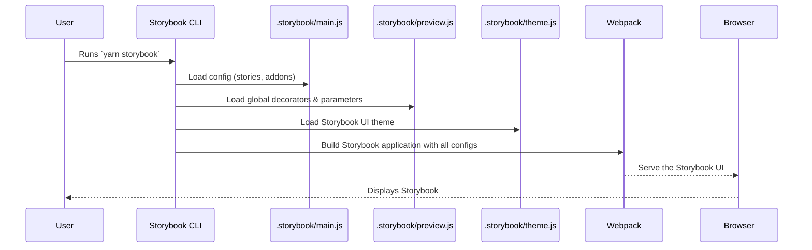

# Chapter 1: Storybook Configuration

Welcome to the `fixers-g2` project! This is the first chapter in our journey to understand its core structure. We'll start by exploring "Storybook Configuration."

Imagine you're building with LEGOs. You have all sorts of bricks: red ones, blue ones, big ones, small ones. Wouldn't it be great to have a catalog where you can see each type of LEGO brick on its own, maybe even try fitting it with a couple of other pieces, without having to build a whole castle first?

That's what Storybook does for our project's UI components! UI components are the visual "LEGO bricks" of our application – things like buttons, menus, and forms. Storybook lets us develop and showcase these components in isolation.

**The Problem:** When you're working on a specific button or a part of a form in a large application, it can be tricky to see your changes quickly. You might have to click through many screens to find it. Also, how do you make sure that button looks good with different text, or when it's disabled, or in different sizes?

**The Solution:** Storybook provides an isolated workshop for each component. The "Storybook Configuration" files are like the instruction manual and setup guide for this workshop. They tell Storybook:
*   Where to find all our component examples (called "stories").
*   How Storybook itself should look (e.g., our project's logo and colors).
*   What extra tools (addons) should be available in the workshop (like a way to change a button's text on the fly).
*   Any special settings needed to build and display these components correctly.

Let's peek into how this is set up!

## What are these Configuration Files?

Typically, Storybook's configuration lives in a folder named `.storybook` at the root of the project. Let's look at some key files you'll find there.

### 1. `main.js`: The Master Plan

This is the main configuration file for Storybook. It tells Storybook crucial things, primarily:
*   **Where are the stories?** Stories are files that demonstrate how a component looks and behaves in different states.
*   **What addons to use?** Addons extend Storybook's functionality.

Let's look at a simplified snippet from `fixers-g2`'s `.storybook/main.js`:

```javascript
// .storybook/main.js
module.exports = {
  stories: [
    "../docs/**/*.stories.mdx", // Documentation stories
    "../packages/components/src/**/*.stories.@(ts|tsx|mdx)", // Component stories
    // ... more paths telling Storybook where to find examples
  ],
  addons: [
    "@storybook/addon-links",    // For linking between stories
    "@storybook/addon-essentials", // A bundle of essential addons
    // ... other addons for docs, controls, etc.
  ],
  // ... other settings ...
};
```
*   **`stories` array:** This list of paths tells Storybook: "Hey, look in these folders for any file ending with `.stories.mdx`, `.stories.ts`, or `.stories.tsx`. These files contain the examples of our components."
*   **`addons` array:** This list tells Storybook to load helpful tools. For example, `@storybook/addon-docs` helps create beautiful documentation pages for our components, and `@storybook/addon-controls` lets us interactively change the properties of components right in the browser.

The `fixers-g2` project uses a monorepo structure (multiple packages in one repository). The `getAbsolutePath` function you see in the full file is a helper to correctly locate these addons within this structure.

### 2. `preview.js`: Setting the Stage for Your Components

While `main.js` configures Storybook itself, `preview.js` configures how your *stories* (component examples) are rendered. Think of it as setting up the stage before the actors (your components) come on.

Often, components need a specific environment to work correctly. For example:
*   They might need access to a [Theming System](03_theming_system_.md) to know what colors or fonts to use.
*   They might rely on [Global Application Providers](04_global_application_providers_.md) for things like user information or internationalization (language settings).

`preview.js` is where you provide these things.

```javascript
// .storybook/preview.js
import React from 'react';
import { ThemeContextProvider } from '@komune-io/g2-themes';
import { I18nextProvider } from 'react-i18next'; // For translations
// ... other imports

// Initialize internationalization (i18n)
const i18n = initI18next({ en: 'en-US', fr: 'fr-FR' });

// This is a "decorator"
export const withThemeProvider = (Story) => {
  return (
    <I18nextProvider i18n={i18n}> {/* Makes i18n available */}
      <ThemeContextProvider theme={{ /* ... theme details ... */ }}>
        {/* Story is the actual component example */}
        <Story />
      </ThemeContextProvider>
    </I18nextProvider>
  );
};

export const decorators = [withThemeProvider]; // Apply this decorator to all stories

export const parameters = { // Global settings for stories
  options: {
    storySort: { // How stories are ordered in the sidebar
      order: ['Overview', 'Components', 'Forms', 'Layout'],
    },
  },
  viewMode: 'docs' // Default to docs view
};
```
*   **Decorators:** The `withThemeProvider` function is a *decorator*. A decorator is a way to wrap every story with some extra context or styling. Here, it wraps every component example with `I18nextProvider` (for translations) and `ThemeContextProvider` from our [Theming System](03_theming_system_.md). This ensures all components are displayed with the correct theme and can use translations.
*   **`decorators` array:** We tell Storybook to use our `withThemeProvider` decorator for all stories.
*   **`parameters`:** This object allows you to set global options for Storybook, like the order in which stories appear in the navigation panel (`storySort`) or the default view (`viewMode: 'docs'` means we usually want to see the documentation page for a component first).

The `G2ConfigBuilder` call (seen in the full `preview.js` file) is specific to `fixers-g2`. It sets up necessary configurations for various services (like identity management or file storage) that components might indirectly interact with, ensuring they behave correctly even in Storybook's isolated environment.

### 3. `theme.js`: Styling Storybook Itself

This file lets you customize the look and feel of the Storybook user interface – not your components, but Storybook's own sidebars, toolbars, etc.

```javascript
// .storybook/theme.js
import { create } from '@storybook/theming';

export default create({
  base: 'light', // Use a light theme as a base
  brandTitle: 'Komune G2', // Your project's name
  brandUrl: 'https://docs.komune.io/g2', // Link for the title
  brandImage: 'komune.png', // Your project's logo
  // ... other color and font settings ...
});
```
This makes Storybook feel like a part of *your* project, with your branding.

### 4. `webpack.config.js`: Custom Build Magic (Advanced)

Sometimes, your project might use special ways to handle files (like SVGs) or need other advanced build configurations. Storybook uses a tool called Webpack under the hood to bundle and serve everything. The `.storybook/webpack.config.js` file allows you to customize this Webpack configuration if needed.

For example, the `fixers-g2` project uses it to ensure SVG images are handled correctly:

```javascript
// .storybook/webpack.config.js
module.exports = ({ config }) => {
  // Rule to handle SVG files
  config.module.rules.push({
    test: /\.svg$/,
    use: ["@svgr/webpack", "url-loader"],
    // ... other settings ...
  });
  return config;
};
```
For beginners, you usually won't need to touch this file much, but it's good to know it exists for more advanced customizations of the build process.

## How It All Works Together

When you run the command to start Storybook (e.g., `npm run storybook` or `yarn storybook`):

1.  **Storybook CLI Starts:** The Storybook command-line tool kicks things off.
2.  **Reads `main.js`:** It figures out where your stories are, what addons to load, and the general framework (e.g., React).
3.  **Reads `preview.js`:** It applies global decorators (like theming) and parameters (like story sorting) to all stories.
4.  **Reads `theme.js`:** It styles the Storybook UI itself with your brand colors and logo.
5.  **Custom Build (Webpack):** If `.storybook/webpack.config.js` exists, Storybook applies those custom build rules.
6.  **Build & Serve:** Storybook then builds a mini-website showcasing all your component stories and serves it in your browser.

Here's a simplified flow:



You can then browse through your "LEGO brick" catalog, interact with components, and see them in various states, all thanks to these configuration files!

## Conclusion

Storybook configuration files, primarily found in the `.storybook` directory, are essential for setting up an isolated development environment for your UI components. They define where to find component examples (`stories`), how these examples are rendered (`preview.js`), how Storybook itself looks (`theme.js`), and any custom build steps (`webpack.config.js`).

Understanding these files helps you see how the `fixers-g2` project organizes its visual components and provides a fantastic tool for developing and documenting them.

Now that you have an idea of how we view and test our UI building blocks in isolation, let's move on to understand the blocks themselves in the [UI Component System](02_ui_component_system_.md).

---

Generated by [AI Codebase Knowledge Builder](https://github.com/The-Pocket/Tutorial-Codebase-Knowledge)