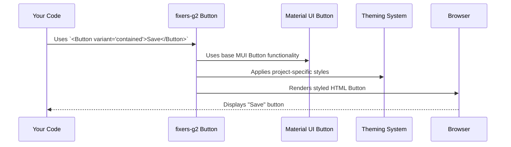

# Chapter 2: UI Component System

In [Chapter 1: Storybook Configuration](01_storybook_configuration_.md), we learned how Storybook acts like a catalog for our UI "LEGO bricks," allowing us to see and test each one in isolation. Now, let's dive deeper into what these "LEGO bricks" actually are: the UI Component System.

## What's the Big Deal with UI Components?

Imagine you're building a website. You need a button here, a text input there, maybe a popup menu, and a way to display small pieces of information like tags.

**The Problem:** If you had to design and code every single button, every single tag, from scratch every time you needed one, it would be a nightmare!
*   **Repetitive Work:** You'd be writing the same styling and behavior code over and over.
*   **Inconsistency:** Your "Submit" button on one page might look slightly different from the "Save" button on another. This makes the application feel unprofessional and confusing.
*   **Hard to Update:** If you decide to change the color of all primary buttons, you'd have to find and update every single one.

**The Solution: A UI Component System!**
The `fixers-g2` project provides a set of pre-built, reusable UI elements called **components**. Think of them as high-quality, custom-designed LEGO bricks. Each component (like a Button, a Chip, or a Menu) is:
*   **Designed for a specific purpose:** A `Button` is for actions, a `Chip` is for displaying small bits of info.
*   **Self-contained:** It bundles its own visual style (how it looks) and behavior (how it acts).
*   **Reusable:** You can use the same `Button` component in many places.
*   **Consistent:** All instances of a `Button` will look and feel the same, ensuring a unified design language across the entire application.

This system allows us to build complex user interfaces by simply picking and assembling these pre-made pieces, just like building a LEGO model!

**Our Use Case:** Let's say we want to create a simple part of a form that needs an "Update Profile" button and a small "Verified" status indicator (a chip).

## Meet the Building Blocks: Buttons and Chips

Let's look at a couple of common components from `fixers-g2` that we can use for our use case.

### 1. The `Button` Component

This is your go-to for any clickable action. `fixers-g2` provides a `Button` component that's built on top of a popular library (Material UI) but customized to fit our project's style.

To use it, you'd typically import it and then use it in your code like this:

```jsx
// Imaginary file: src/UserProfilePage.jsx
import { Button } from '@komune-io/g2-components'; // Import the Button

function UserProfilePage() {
  const handleUpdate = () => {
    console.log("Profile Updated!");
    // ... logic to update profile ...
  };

  return (
    <div>
      {/* ... other form fields ... */}
      <Button onClick={handleUpdate} variant="contained">
        Update Profile
      </Button>
    </div>
  );
}
```
**Explanation:**
*   `import { Button } from '@komune-io/g2-components';`: We're pulling the `Button` "LEGO brick" from our `fixers-g2` component library.
*   `<Button onClick={handleUpdate} variant="contained">`: We're using the `Button`.
    *   `onClick={handleUpdate}`: This tells the button what function to run when clicked.
    *   `variant="contained"`: This is a prop (a property you pass to the component) that tells the button to have a solid background color. Other variants might be `outlined` or `text`.
    *   `Update Profile`: This is the text that will appear on the button.

**Output:** This code would render a nicely styled button on the page. When clicked, it would execute the `handleUpdate` function and log "Profile Updated!" to the console. It will look consistent with other primary buttons in the application.

### 2. The `Chip` Component

Chips are great for displaying small pieces of information, status indicators, or tags.

Here's how you might use the `Chip` component from `fixers-g2`:

```jsx
// Imaginary file: src/UserProfilePage.jsx
import { Chip } from '@komune-io/g2-components'; // Import the Chip

function UserProfilePage() {
  // ... (Button code from above) ...
  const isVerified = true;

  return (
    <div>
      {/* ... Button ... */}
      {isVerified && (
        <Chip label="Verified" color="green" />
      )}
    </div>
  );
}
```
**Explanation:**
*   `import { Chip } from '@komune-io/g2-components';`: We import the `Chip` component.
*   `<Chip label="Verified" color="green" />`: We're using the `Chip`.
    *   `label="Verified"`: This sets the text displayed inside the chip.
    *   `color="green"`: This prop influences the chip's color scheme (e.g., green text and a light green background). The exact colors are usually defined in our [Theming System](03_theming_system_.md).

**Output:** If `isVerified` is true, this code would render a small, rounded "Verified" tag, styled with a green color scheme, alongside our button.

These are just two examples. `fixers-g2` offers many more components like `Menu`, `Pagination`, `UserAvatar`, etc., all designed to work together seamlessly. You can find them exported from `packages/components/src/index.ts` and see them in action in Storybook!

## Under the Hood: How Do These Components Work?

Let's take a simplified look at what happens when you use a `fixers-g2` component.

**Step-by-Step (e.g., for a Button):**

1.  **You Use It:** In your application code, you write `<Button>Click Me</Button>`.
2.  **`fixers-g2` Takes Over:** The `Button` component code (from `packages/components/src/Buttons/Button.tsx`) receives your request.
3.  **Base Component:** Often, `fixers-g2` components are smart wrappers around well-tested base components from libraries like Material UI (MUI). So, our `Button` might use MUI's `Button` internally.
4.  **Styling Applied:** Our `Button` applies specific styles (colors, fonts, padding) defined by the `fixers-g2` [Theming System](03_theming_system_.md). This ensures it matches our project's look.
5.  **Extra Features:** It might add extra behaviors, like automatically showing a loading spinner if the `onClick` handler is an asynchronous function.
6.  **Rendered to Browser:** The component generates the final HTML and CSS, which the browser then displays as the button you see on your screen.

Here's a simplified diagram:



### A Peek at Simplified Component Code

Let's look at a *very* simplified version of what a component file might contain.

**Simplified `Button.tsx`:**
```tsx
// Simplified from: packages/components/src/Buttons/Button.tsx
import React from 'react';
// Base button from Material UI
import { Button as MuiButton } from '@mui/material';

export const Button = (props) => {
  const { children, variant = 'contained', onClick, ...other } = props;

  // `fixers-g2` might add custom logic or default props here
  // For example, ensuring 'contained' is the default variant

  return (
    <MuiButton variant={variant} onClick={onClick} {...other}>
      {children}
    </MuiButton>
  );
};
```
**Explanation:**
*   It imports `MuiButton` from `@mui/material`. This is the "engine" of our button.
*   Our `Button` component takes some `props` (like `children` for the text, `variant` for style).
*   It then renders the `MuiButton`, passing along the props. The key is that `fixers-g2` can set defaults (like `variant = 'contained'`) or add its own styling layers on top of `MuiButton`, ensuring consistency. The actual `Button.tsx` file has more features like handling loading states, icons, etc.

**Simplified `Chip.tsx`:**
```tsx
// Simplified from: packages/components/src/Chip/Chip.tsx
import React from 'react';
// Base chip from Material UI
import { Chip as MuiChip } from '@mui/material';

export const Chip = (props) => {
  const { label, color = '#676879', ...other } = props;

  // Custom styling based on the 'color' prop
  const customStyles = {
    backgroundColor: color + '20', // Light background from color
    color: color,                  // Text color
    borderRadius: '16px',          // Ensure consistent border radius
    // ... other styles
  };

  return <MuiChip label={label} sx={customStyles} {...other} />;
};
```
**Explanation:**
*   Similar to the `Button`, it uses a base `MuiChip`.
*   It defines `customStyles` based on props like `color`. The `sx` prop is a common way in Material UI to apply ad-hoc styles.
*   This allows `fixers-g2` to provide a `Chip` that is easily themeable and fits the application's design language, while still leveraging the power of `MuiChip`.

### How Components Are Made Available: `index.ts`

You might wonder how `import { Button } from '@komune-io/g2-components';` works. There's usually an `index.ts` file in the components directory (`packages/components/src/index.ts`) that acts as a central export point:

```typescript
// Simplified from: packages/components/src/index.ts
export { Button } from './Buttons/Button'; // Exports our Button
export { Chip } from './Chip/Chip';       // Exports our Chip
export { Menu } from './Menu/Menu';       // Exports Menu
// ... and so on for all other components
```
This file gathers all the individual components and makes them available under a single package import, making it easy for developers to find and use them.

## Conclusion

The UI Component System in `fixers-g2` is like a well-organized toolbox filled with specialized, pre-fabricated parts. By using these components (like `Button`, `Chip`, `Menu`, etc.), you can:
*   **Build UIs faster:** No need to reinvent the wheel.
*   **Ensure consistency:** Your application will have a unified look and feel.
*   **Maintain code easily:** Update a component in one place, and the changes apply everywhere it's used.

These components are the visual heart of your application. They get their consistent appearance from a powerful system we'll explore next.

Now that you understand what these UI building blocks are, let's see how we make them all look like they belong to the same family in [Chapter 3: Theming System](03_theming_system_.md).

---

Generated by [AI Codebase Knowledge Builder](https://github.com/The-Pocket/Tutorial-Codebase-Knowledge)