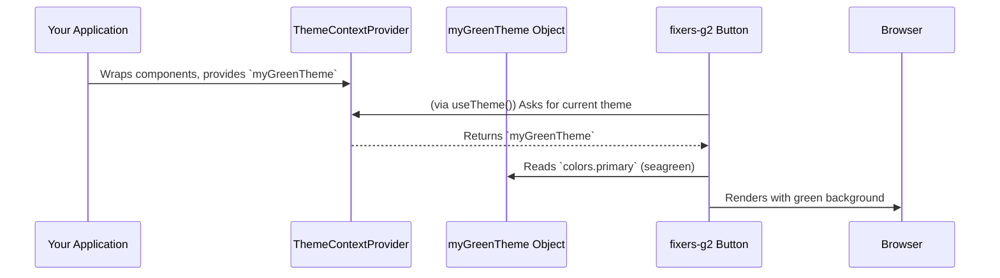

# Chapter 3: Theming System

In [Chapter 2: UI Component System](02_ui_component_system_.md), we learned about the individual "LEGO bricks" – the UI components like Buttons and Chips – that we use to build our application's interface. But how do we make sure all these bricks look like they belong together? How do we define the overall color scheme, the fonts, the spacing, and even the roundness of corners across our entire app? That's where the **Theming System** comes in!

## What's the Big Style Problem?

Imagine you're decorating a house. You buy a red sofa, a blue chair, a green rug, and yellow curtains. Each item might be nice on its own, but together, they might look like a chaotic mess! Similarly, in an application, if each button, form, and panel had its own independently defined style, the user interface would look inconsistent and unprofessional.

**The Problem:**
*   **Inconsistency:** A button on one page might have sharp corners and a dark blue color, while a button on another page has rounded corners and a light blue color.
*   **Hard to Change:** What if your client decides they want to rebrand the app from a "cool blue" look to a "warm orange" look? Or maybe you want to introduce a "dark mode." You'd have to go into every single component and manually change its colors, fonts, and spacing – a tedious and error-prone task!

**The Solution: A Centralized Theming System!**
The `fixers-g2` project uses a Theming System to solve this. Think of it as a **master style guide** for your entire application. This guide dictates:
*   **Colors:** What's the primary action color? What's the background color?
*   **Fonts:** What font family and sizes should be used for headings, paragraphs, and labels?
*   **Spacing:** How much space should be between elements?
*   **Border Styles:** How rounded should corners be? What do borders look like?

By defining these rules in one central place, all our UI components can refer to this guide, ensuring they all look and feel consistent.

**Our Use Case:** Let's say our app currently uses the default `fixers-g2` theme (which has a yellow primary color). We want to easily change the primary color of all components (like buttons, active tabs, etc.) to a nice shade of green, perhaps for a specific brand or a "nature" theme.

## The Key Ingredients: `Theme` Object and `ThemeContextProvider`

Two main pieces work together to make theming possible in `fixers-g2`:

### 1. The `Theme` Object: Your Style Blueprint

The `Theme` object is a simple JavaScript object that holds all your style definitions. It's like the written document of your master style guide.

Here's a *very simplified* peek at what parts of a `Theme` object might look like:

```javascript
// Simplified example of a Theme object structure
const myCustomTheme = {
  colors: {
    primary: '#EDBA27',    // The main action color (default is a yellow/gold)
    secondary: '#353945',  // A secondary color
    background: '#EEEEEE', // Page background color
    error: '#E44258'       // Color for error messages
  },
  borderRadius: 8,         // How round corners should be (in pixels)
  spacing: 8,              // Base unit for spacing (in pixels)
  fontSize: {
    button: '0.875rem'     // Font size for text on buttons
  }
  // ... and many other properties for fonts, shadows, etc.
};
```
*   **`colors`**: Defines the color palette for your application.
*   **`borderRadius`**: Controls the roundness of elements like buttons and cards.
*   **`spacing`**: A base unit used to calculate margins and paddings consistently.
*   **`fontSize`**: Specifies default font sizes for different text elements.

The actual `Theme` interface in `fixers-g2` (defined in `packages/themes/src/ThemeContextProvider/Theme.tsx`) is more comprehensive, covering many aspects of the UI. The project also provides a `defaultTheme` with sensible defaults to get you started.

### 2. `ThemeContextProvider`: Making Styles Available

Okay, so we have a `Theme` object (our style blueprint). How do our components know about it? This is where `ThemeContextProvider` comes in.

`ThemeContextProvider` is a special React component. Imagine it as a frame that you wrap around your entire application, or parts of it. This "frame" holds onto your `Theme` object and makes it accessible to all the components living inside it. It uses a React feature called "Context" to pass the theme down without you having to manually give it to every single component.

You might have already seen it in action in [Chapter 1: Storybook Configuration](01_storybook_configuration_.md), where it's used in `.storybook/preview.js` to provide a theme to all components displayed in Storybook:

```javascript
// Snippet from .storybook/preview.js
import { ThemeContextProvider } from '@komune-io/g2-themes';

export const withThemeProvider = (Story) => {
  return (
    // The ThemeContextProvider wraps every story
    <ThemeContextProvider theme={{ /* some theme configuration */ }}>
      <Story /> {/* The actual component example */}
    </ThemeContextProvider>
  );
};
```
*   `ThemeContextProvider` takes a `theme` prop, which is your `Theme` object.
*   Any component rendered inside (`<Story />` in this case) can now "ask" for the theme's values.

The `ThemeContextProvider` component is found in `packages/themes/src/ThemeContextProvider/ThemeContextProvider.tsx`.

## Applying a Custom Theme: Let's Go Green!

Now, let's solve our use case: changing the primary color to green.

**Step 1: Define Your Custom Green Theme**

First, we create a new `Theme` object, or just the parts we want to override from the default.

```javascript
// myGreenTheme.js
const myGreenTheme = {
  colors: {
    primary: 'seagreen',    // Our new green primary color!
    secondary: 'darkgreen', // A complementary dark green
    background: '#f0fff0'   // A very light green background
  },
  borderRadius: 4,          // Let's make corners a bit sharper
  // We can omit other properties; they'll use defaults
  // or be merged from the defaultTheme by ThemeContextProvider.
};
```
Here, we're only specifying the `colors` and `borderRadius` we want to change. `ThemeContextProvider` is smart enough to merge this with the `defaultTheme`, so you only define what's different.

**Step 2: Use `ThemeContextProvider` with Your Green Theme**

Now, we wrap the part of our application (or a specific component for testing) with `ThemeContextProvider` and pass our `myGreenTheme` to its `theme` prop.

```jsx
// Imaginary App.js or a Storybook story
import React from 'react';
import { ThemeContextProvider } from '@komune-io/g2-themes';
import { Button } from '@komune-io/g2-components'; // Our Button from Chapter 2

// Let's define our green theme directly here for simplicity
const myGreenTheme = {
  colors: { primary: 'seagreen', background: '#f0fff0' },
  borderRadius: 4
};

function AppWithGreenTheme() {
  return (
    <ThemeContextProvider theme={myGreenTheme}>
      <h1>Welcome to the Green App!</h1>
      <Button variant="contained">Submit Info</Button>
      {/* Any other g2-component here will also use the green theme */}
    </ThemeContextProvider>
  );
}
```
**Output/Effect:**
*   The `Button` component (and any other `fixers-g2` component inside this `ThemeContextProvider`) will now automatically use the `seagreen` color as its primary color (e.g., for its background if `variant="contained"`).
*   Its corners will be slightly sharper (4px radius).
*   The background of the area controlled by this provider might hint at `#f0fff0` (depending on how page background is structured).

Just like that, you've re-skinned a part of your application! To apply it globally, you'd typically wrap your main `App` component.

## Under the Hood: How Do Components Get Their Styles?

You might be wondering: "How does the `Button` know to use `seagreen`?"

1.  **Provider Provides:** The `ThemeContextProvider` makes the `myGreenTheme` object available via React Context.
2.  **Component Consumes:** Inside `fixers-g2` components (like `Button`, `Chip`, etc.), there's logic that "reads" this theme. They typically use a special function (a "hook") called `useTheme()` provided by `@komune-io/g2-themes`.
3.  **Styles Applied:** The component then uses the values from the theme (e.g., `theme.colors.primary`, `theme.borderRadius`) to set its own CSS styles.

Here’s a simplified flow:



Let's peek at a *super-simplified* example of how a component might use the theme:

```jsx
// Highly simplified example of a component using the theme
import React from 'react';
import { useTheme } from '@komune-io/g2-themes'; // Hook to access the theme

export const MyStyledBox = ({ children }) => {
  const currentTheme = useTheme(); // Get the theme object!

  const boxStyle = {
    backgroundColor: currentTheme.colors.background,
    padding: `${currentTheme.spacing * 2}px`, // e.g., 16px if spacing is 8
    border: `1px solid ${currentTheme.colors.primary}`,
    borderRadius: `${currentTheme.borderRadius}px`
  };

  return <div style={boxStyle}>{children}</div>;
};
```
*   `useTheme()`: This hook magically plucks the current `Theme` object provided by the nearest `ThemeContextProvider` up the component tree.
*   `currentTheme.colors.background`, `currentTheme.spacing`: The component then uses properties from this theme object to define its styles.

This is why `fixers-g2` components can adapt their appearance: they are built to be "theme-aware."

### Key Theme Files in `fixers-g2`:

*   **`packages/themes/src/ThemeContextProvider/Theme.tsx`**:
    *   Defines the TypeScript `interface Theme` (the blueprint for what a theme object *must* contain).
    *   Exports `defaultTheme`, which is the standard set of styles for `fixers-g2`. Your custom themes often merge with or override parts of this.
    *   Also includes `defaultMaterialUiTheme`, a function that translates the `fixers-g2` theme into a theme compatible with Material UI (the base library for many `fixers-g2` components).
*   **`packages/themes/src/ThemeContextProvider/ThemeContextProvider.tsx`**:
    *   This is where the `ThemeContextProvider` React component lives. It takes your `theme` object and makes it available.
    *   It also exports helper hooks like `useTheme()` (to read the current theme) and `useThemeContext()` (to get the theme and functions to change it, if needed).
*   **`.storybook/preview.js` (from Chapter 1)**:
    *   As we saw, this file uses `ThemeContextProvider` to wrap all stories. This ensures that when you're developing components in Storybook, they are displayed with the project's intended theme. The `theme` object passed here in `preview.js` can be customized to test different looks. For example, the provided snippet:
      ```javascript
      // .storybook/preview.js
      // ...
      <ThemeContextProvider
        theme={{
          colors: {
            secondary: '#F0EDE7', // Custom secondary color for Storybook
            background: '#FAF8F3' // Custom background for Storybook
          }
        }}
      >
      {/* ... */}
      ```
      This shows how Storybook itself can be configured with a specific theme variant for demonstration.

## Conclusion

The Theming System in `fixers-g2` is your command center for the visual identity of your application. By defining styles in a central `Theme` object and making it available through `ThemeContextProvider`, you achieve:
*   **Consistency:** All UI components adhere to the same design rules.
*   **Easy Customization:** Change colors, fonts, or spacing globally by modifying the theme in one place.
*   **Support for Multiple Themes:** You can dynamically switch the `theme` prop on `ThemeContextProvider` to offer different visual styles (like light/dark mode, or different brandings).

It's what makes your collection of [UI Component System](02_ui_component_system_.md) bricks look like a cohesive, well-designed structure.

Now that our components look good and consistent, we need to think about other global aspects that our application might need, like user information or internationalization settings. We'll explore this in [Chapter 4: Global Application Providers](04_global_application_providers_.md).

---

Generated by [AI Codebase Knowledge Builder](https://github.com/The-Pocket/Tutorial-Codebase-Knowledge)