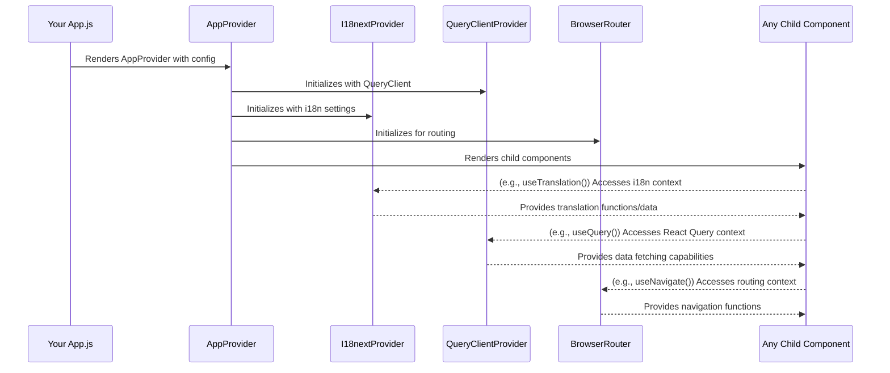

# Chapter 4: Global Application Providers

In [Chapter 3: Theming System](03_theming_system_.md), we learned how to give our application a consistent look and feel. Now, let's think about the "engine room" of our app. Modern applications need a lot of background services to function smoothly – things like managing different languages, handling user logins, fetching data from servers, and navigating between different screens. How do we make these essential services readily available everywhere in our app without a lot of complicated wiring?

That's where **Global Application Providers** come in!

## The Need for a Central Hub

Imagine building a new city. You wouldn't build a separate power plant for every house, or a separate phone network for every street, right? You'd build central infrastructure: a main power grid, a city-wide communication system, and a central security force.

**The Problem:** In a software application, if every little component had to set up its own connection for data fetching, manage its own language settings, or figure out user authentication on its own, it would be:
*   **Repetitive:** Lots of duplicated setup code.
*   **Inconsistent:** Different parts of the app might handle these services differently.
*   **Hard to Manage:** Updating a service (like changing how authentication works) would mean changing code in many places.

**The Solution: `AppProvider` and other Global Providers**
`fixers-g2` offers components like `AppProvider` that act as high-level wrappers for your application. They supply these essential global services and state. The `AppProvider` specifically bundles contexts for:
*   **Routing:** How your app navigates between different "pages" or views.
*   **Internationalization (i18n):** Displaying text in different languages.
*   **Data Fetching:** Efficiently getting and caching data from servers (using React Query).
*   **UI Primitives (Mantine):** Base UI components and styling hooks.

Other global providers, like `KeycloakProvider` for authentication, work alongside `AppProvider` to complete the "city infrastructure." This setup ensures these critical services are consistently accessible throughout your application.

**Our Use Case:** We want our application to:
1.  Display text in either English or French based on user preference or browser settings.
2.  Be able to fetch a list of "tasks" from a server and display them.
3.  Allow users to log in (though we'll touch on `KeycloakProvider` separately for this).

## Meet `AppProvider`: Your Application's Utility Belt

The `AppProvider` component from `packages/providers/src/AppProvider/AppProvider.tsx` is a key player here. You typically wrap your entire application (or a significant part of it) with `AppProvider`.

Let's see how it helps with our use case.

**Setting up `AppProvider`**

First, you'd typically set up `AppProvider` at the root of your application, for example, in your `App.js` or `index.js` file.

```jsx
// Simplified App.js
import React from 'react';
import { AppProvider } from '@komune-io/g2-providers';
import { QueryClient } from '@tanstack/react-query';
import MyAwesomeAppPages from './MyAwesomeAppPages'; // Your app's components

// 1. Create a QueryClient instance for data fetching
const queryClient = new QueryClient();

// 2. Define available languages for i18n
const appLanguages = {
  en: 'en-US', // English
  fr: 'fr-FR'  // French
};

function App() {
  return (
    <AppProvider
      queryClient={queryClient}
      languages={appLanguages}
      loadingComponent={<p>Loading essential services...</p>}
    >
      <MyAwesomeAppPages />
    </AppProvider>
  );
}

export default App;
```
**Explanation:**
*   `import { AppProvider } ...`: We import the `AppProvider`.
*   `const queryClient = new QueryClient();`: React Query (a powerful data-fetching library) needs a `QueryClient`. We create one instance and pass it to `AppProvider`.
*   `const appLanguages = { en: 'en-US', fr: 'fr-FR' };`: We tell `AppProvider` which languages our application supports. This configures the internationalization (i18n) service.
*   `<AppProvider ...>`: We wrap our main application content (`<MyAwesomeAppPages />`) with it.
    *   `queryClient={queryClient}`: Provides the data-fetching capabilities.
    *   `languages={appLanguages}`: Provides the language settings.
    *   `loadingComponent`: A simple message or spinner to show while i18n might be loading its translation files.

**Output/Effect:**
Now, any component inside `MyAwesomeAppPages` can:
*   Access translation functions to display text in the currently selected language (English or French).
*   Use React Query hooks to fetch data from a server, with caching and other features handled automatically.
*   Utilize routing capabilities (because `AppProvider` includes `BrowserRouter`).
*   Benefit from the Mantine UI provider for base styles and hooks.

### 1. Internationalization (i18n) in Action

With `AppProvider` set up, a component deep inside your app can easily use translations:

```jsx
// Example: src/components/WelcomeMessage.jsx
import React from 'react';
import { useTranslation } from 'react-i18next'; // Hook from i18n library

function WelcomeMessage() {
  const { t } = useTranslation(); // Get the translation function

  // 'welcomeHeader' is a key defined in your translation files
  return <h1>{t('welcomeHeader')}</h1>;
}
```
**Explanation:**
*   `useTranslation()`: This hook (provided because `AppProvider` set up `I18nextProvider`) gives us the `t` function.
*   `t('welcomeHeader')`: If the current language is English, this might output "Welcome!". If it's French, it might output "Bienvenue!". The actual translations are typically stored in JSON files.

### 2. Data Fetching with React Query in Action

Similarly, fetching data becomes straightforward:

```jsx
// Example: src/components/TaskList.jsx
import React from 'react';
import { useQuery } from '@tanstack/react-query'; // Hook from React Query

async function fetchTasks() {
  const response = await fetch('/api/tasks'); // Your API endpoint
  if (!response.ok) throw new Error('Network response was not ok');
  return response.json();
}

function TaskList() {
  // Use the useQuery hook to fetch tasks
  const { data: tasks, error, isLoading } = useQuery({
    queryKey: ['tasks'], // A unique key for this query
    queryFn: fetchTasks   // The function that fetches data
  });

  if (isLoading) return <p>Loading tasks...</p>;
  if (error) return <p>Error loading tasks: {error.message}</p>;

  return (
    <ul>
      {tasks.map(task => <li key={task.id}>{task.name}</li>)}
    </ul>
  );
}
```
**Explanation:**
*   `useQuery()`: This hook (available because `AppProvider` set up `QueryClientProvider`) handles the data fetching.
*   `queryKey: ['tasks']`: A unique identifier for this data. React Query uses it for caching.
*   `queryFn: fetchTasks`: The function that actually goes and gets the data.
*   `data`, `error`, `isLoading`: React Query provides these states automatically.

## Under the Hood: What Does `AppProvider` Do?

When your application starts and `AppProvider` is rendered, it essentially sets up a series of "context providers" around your child components. Think of React Context as a way to broadcast information to all components below a certain point in the component tree, without having to pass props down manually through every level.

**Step-by-Step:**
1.  **You Wrap Your App:** `<AppProvider><YourApp /></AppProvider>`
2.  **`AppProvider` Initializes:**
    *   It takes your `queryClient` and creates a `<QueryClientProvider client={queryClient}>`.
    *   It takes your `languages` (and other i18n options) and initializes an i18n instance, then wraps children with `<I18nextProvider i18n={i18nInstance}>`.
    *   It wraps children with `<BrowserRouter>` to enable client-side routing.
    *   It wraps children with `<MantineProvider>` for base UI styling.
3.  **Services Become Available:** Now, any component within `<YourApp />` can "tap into" these contexts using specific hooks:
    *   `useTranslation()` for i18n.
    *   `useQuery()`, `useMutation()` for data fetching.
    *   `useNavigate()`, `useLocation()` for routing.
    *   Mantine-specific hooks for theming and styles.

Here's a simplified diagram:



### A Peek at `AppProvider.tsx`

Let's look at a snippet from `packages/providers/src/AppProvider/AppProvider.tsx`:

```tsx
// Simplified from packages/providers/src/AppProvider/AppProvider.tsx
export const AppProvider = (props) => {
  const {
    children,
    languages, // e.g., { en: 'en-US', fr: 'fr-FR' }
    queryClient, // Your React Query client instance
    i18nOptions, // Optional extra i18n settings
    loadingComponent // Fallback for suspense
  } = props;

  // Initialize i18n instance (memoized to avoid re-creation)
  const i18n = useMemo(
    () => initI18next(languages, /* translationsOverrides */ undefined, i18nOptions),
    [languages, i18nOptions] // Dependencies
  );

  return (
    // Suspense handles asynchronous loading (e.g., for i18n resources)
    <Suspense fallback={loadingComponent ?? <LoadingProviders />}>
      <QueryClientProvider client={queryClient}>
        <I18nextProvider i18n={i18n}>
          <MantineProvider> {/* Provides base Mantine UI context */}
            <BrowserRouter>{children}</BrowserRouter> {/* Enables routing */}
          </MantineProvider>
        </I18nextProvider>
      </QueryClientProvider>
    </Suspense>
  );
};
```
*   `useMemo` and `initI18next`: The i18n instance is created using your `languages` and other options. `initI18next` (from `packages/providers/src/AppProvider/i18n.ts`) sets up i18next with language detection, backend loading for translation files, and default `G2Translations`.
*   `<QueryClientProvider client={queryClient}>`: Makes React Query available.
*   `<I18nextProvider i18n={i18n}>`: Makes the i18n instance available.
*   `<MantineProvider>`: Sets up context for the Mantine UI library.
*   `<BrowserRouter>`: Enables HTML5 history API-based routing.
*   `<Suspense>`: Allows parts of your app (like i18n loading translations) to "suspend" rendering gracefully, showing a fallback UI.

The `initI18next` function in `packages/providers/src/AppProvider/i18n.ts` is responsible for configuring `i18next` with features like:
*   Loading translation files (often JSON) from a backend or locally.
*   Detecting the user's preferred language.
*   Setting fallback languages.
*   Merging `G2Translations` (default translations for `fixers-g2` components) with your application-specific translations.

## What About Authentication and Other Global Configs?

### Authentication with `KeycloakProvider`

While `AppProvider` handles many core utilities, authentication is often managed by a dedicated provider. `fixers-g2` uses `KeycloakProvider` (from `packages/providers/src/KeycloakProvider/KeycloakProvider.tsx`) for this, which is built on `@axa-fr/react-oidc`.

You'd typically wrap your app with `KeycloakProvider` at a similar level to `AppProvider`, often just outside or inside it, depending on whether non-authenticated parts of your app need services from `AppProvider`.

```jsx
// Simplified setup with KeycloakProvider
import { KeycloakProvider } from '@komune-io/g2-providers';
// ... other imports like AppProvider, QueryClient ...

function App() {
  // Keycloak config usually comes from G2ConfigBuilder
  const keycloakConfig = {
    clientId: 'your-client-id',
    realm: 'your-realm',
    url: 'your-keycloak-url'
    // redirect_uri and silent_redirect_uri are set by default
  };

  return (
    <KeycloakProvider
      configuration={{
        client_id: keycloakConfig.clientId,
        authority: `${keycloakConfig.url}/realms/${keycloakConfig.realm}`,
        // ... other OIDC settings
      }}
    >
      <AppProvider /* ... AppProvider props ... */ >
        <MyAwesomeAppPages />
      </AppProvider>
    </KeycloakProvider>
  );
}
```
*   `KeycloakProvider` handles the OpenID Connect (OIDC) flow for logging users in and managing their sessions.
*   Inside your app, you can then use the `useAuth` hook (from `packages/providers/src/KeycloakProvider/useAuth.ts`) to get user information, roles, and access tokens. We'll explore this more in [Chapter 8: Identity Management (IM) Abstractions](08_identity_management__im__abstractions_.md).

### Global Runtime Configuration with `G2ConfigBuilder`

Sometimes, your application needs configuration values that are determined at runtime or deployment (e.g., API URLs, Keycloak server details). The `G2ConfigBuilder` (from `packages/providers/src/G2ConfigBuilder/index.ts`) helps manage this.

As seen in [Chapter 1: Storybook Configuration](01_storybook_configuration_.md), `G2ConfigBuilder` can set global JavaScript variables (e.g., on `window._env_.config`) that various services, including `KeycloakProvider`, can then read.

```javascript
// Example of setting config, typically done early in app lifecycle
import { G2ConfigBuilder } from '@komune-io/g2-providers';

G2ConfigBuilder({
  keycloak: {
    url: 'https://auth.example.com',
    realm: 'my-app-realm',
    clientId: 'my-app-client'
  },
  // ... other service configs like 'im', 'fs'
});
```
This makes it easier to configure your application for different environments (development, staging, production) without changing the core codebase.

## Conclusion

Global Application Providers like `AppProvider` are the unsung heroes that make many essential application services "just work" for your components. By wrapping your application with `AppProvider`, you get:
*   Easy internationalization (i18n).
*   Powerful and efficient data fetching with React Query.
*   Client-side routing.
*   A base UI provider (Mantine).

When combined with other global providers like `KeycloakProvider` for authentication and configuration mechanisms like `G2ConfigBuilder`, they form the foundational infrastructure of your `fixers-g2` application, ensuring critical services are consistently and conveniently accessible.

Now that we have these global services set up, how do we arrange the overall visual structure of our application pages? Let's explore that in [Chapter 5: Layout System](05_layout_system_.md).

---

Generated by [AI Codebase Knowledge Builder](https://github.com/The-Pocket/Tutorial-Codebase-Knowledge)