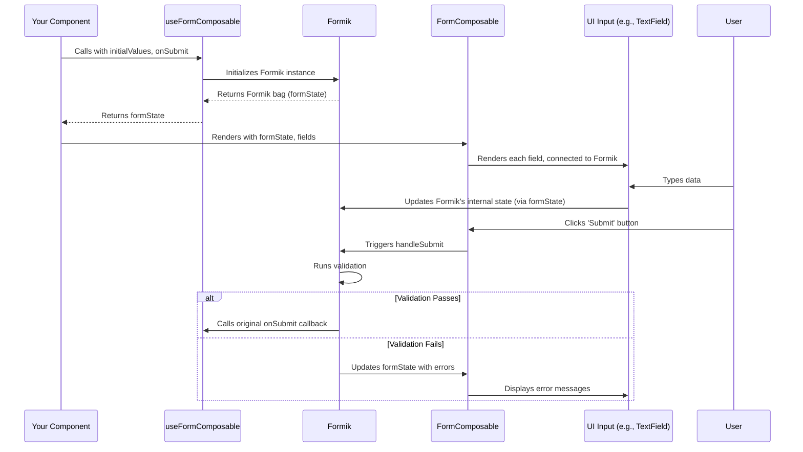

# Chapter 6: Form Abstraction

In [Chapter 5: Layout System](05_layout_system_.md), we learned how to arrange the overall visual structure of our application pages. Now, a very common task in any application is collecting information from users. Whether it's a signup form, a search bar, or a settings page, you'll need forms. Building forms from scratch can be surprisingly tricky: you need to manage what the user types, check if the input is valid (like ensuring an email address looks like an email), show error messages, and then do something with the data when the user submits it.

This is where `fixers-g2`'s **Form Abstraction** comes to the rescue!

## The Challenge of Building Forms

Imagine you need to build a simple "Contact Us" form for your website. You want fields for:
*   Name
*   Email
*   Message
*   A "Send" button

**The Problem:**
*   **Keeping Track:** How do you store what the user types into each field?
*   **Validation:** How do you check if the "Name" field isn't empty, or if the "Email" field actually contains a valid email address?
*   **Feedback:** How do you show helpful error messages if something is wrong?
*   **Submission:** What happens when the user clicks "Send"?
*   **Repetition:** If you have many forms in your app, you'll be writing similar code over and over again.

**The Solution: A Specialized Toolkit for Forms!**
`fixers-g2` provides tools to construct and manage data input forms. Think of it as a specialized toolkit with pre-designed components and blueprints for building different types of forms.
*   `FormComposable`: Offers a flexible way to define form fields and their logic, much like assembling a form from individual, smart parts.
*   `AutoForm`: Can automatically generate forms from a data structure, like using a pre-designed template.

This abstraction simplifies handling form state (what the user has entered), validation (checking the data), and submission processes, making form development much more efficient and less error-prone.

**Our Use Case:** Let's build that "Contact Us" form. We want it to have:
1.  A text field for "Name" (required).
2.  A text field for "Email" (required, must be a valid email).
3.  A larger text area for "Message" (required).
4.  A "Send" button.

## Building Forms with `FormComposable` and `useFormComposable`

The most direct way to build custom forms is by using `FormComposable` along with the `useFormComposable` hook.

*   **`useFormComposable` hook:** This is like the "brain" of your form. It manages the form's data, handles validation, and controls what happens on submission. It's built on top of a popular library called Formik.
*   **`FormComposable` component:** This is the "body" of your form. You tell it which fields to display and connect it to the "brain" (`formState` from `useFormComposable`).

### Step 1: Setting up the Form "Brain" with `useFormComposable`

First, we need to use the `useFormComposable` hook to set up the logic for our form.

```jsx
// In your ContactUsForm.jsx file
import { useFormComposable } from '@komune-io/g2-composable';
import { useCallback } from 'react';

function ContactUsForm() {
  const formState = useFormComposable({
    initialValues: { // What the form fields start with
      name: '',
      email: '',
      message: ''
    },
    onSubmit: useCallback(async (values) => { // What to do when submitted
      console.log("Form Submitted!", values);
      alert(`Thanks, ${values.name}! We received your message.`);
      // In a real app, you'd send 'values' to a server here
    }, [])
  });

  // ... more to come for displaying the form ...
  return <p>Form will be here</p>;
}
```
**Explanation:**
*   `useFormComposable(...)`: We call the hook with an options object.
    *   `initialValues`: Defines the starting data for our form fields. Here, all fields are initially empty.
    *   `onSubmit`: A function that will be called when the form is successfully submitted (after passing validation). It receives the `values` from the form.
*   `formState`: The hook returns an object (we've called it `formState`) that contains everything `FormComposable` needs to work, including the current values, error messages, and functions to handle changes and submission.

### Step 2: Defining the Form Fields and Using `FormComposable`

Now, let's define what our form fields look like and use the `FormComposable` component to display them. Each field is an object in an array.

```jsx
// Continuing in ContactUsForm.jsx
import { FormComposable, FormComposableField } from '@komune-io/g2-composable';
// ... other imports ...

// Helper for basic 'required' validation
const required = (value) => !value && "This field is required";
// Helper for basic email validation
const isEmail = (value) =>
  !/^[A-Z0-9._%+-]+@[A-Z0-9.-]+\.[A-Z]{2,4}$/i.test(value) && "Invalid email";

function ContactUsForm() {
  const formState = useFormComposable({ /* ... as above ... */ });

  const fields: FormComposableField[] = [
    { name: 'name', label: 'Your Name', type: 'textField', validator: required },
    { name: 'email', label: 'Your Email', type: 'textField', validator: (v) => required(v) || isEmail(v) },
    { name: 'message', label: 'Your Message', type: 'textField', multiline: true, validator: required }
  ];

  return (
    <FormComposable
      formState={formState}
      fields={fields}
      actions={[{ label: "Send Message", type: "submit" }]}
    />
  );
}
```
**Explanation:**
*   `fields: FormComposableField[]`: An array defining each field.
    *   `name`: The internal identifier for the field (must match a key in `initialValues`).
    *   `label`: The text displayed to the user for that field.
    *   `type: 'textField'`: Tells `FormComposable` to render a standard text input. `fixers-g2` offers various field types (see `FormElementsRenderer.ts`).
    *   `multiline: true`: For the message field, makes the `textField` act like a textarea.
    *   `validator`: A function that checks the field's value. It should return an error message string if invalid, or `undefined` (or `null` or `false`) if valid. We combine `required` and `isEmail` for the email field.
*   `<FormComposable ... />`:
    *   `formState={formState}`: Connects the UI to our form's "brain".
    *   `fields={fields}`: Tells it which fields to render.
    *   `actions={[{ label: "Send Message", type: "submit" }]}`: Defines buttons for the form. An action with `type: "submit"` will trigger the form's submission process (validation then `onSubmit`).

**Output/Effect:**
This will render a form with:
*   A text input labeled "Your Name".
*   A text input labeled "Your Email".
*   A larger text area labeled "Your Message".
*   A button labeled "Send Message".

If you try to submit with empty fields, or an invalid email, error messages will appear next to the respective fields. If everything is valid, the `onSubmit` function will run, logging to the console and showing an alert.

This `FormComposable` component uses the UI components from our [Chapter 2: UI Component System](02_ui_component_system_.md) and styles them according to the [Chapter 3: Theming System](03_theming_system_.md).

## Automatically Generating Forms with `AutoForm`

Sometimes, the structure of your form might come from an external configuration or a predefined data model. For these cases, `AutoForm` can be very handy. It takes a descriptive object (`formData`) and generates the form for you.

Imagine your form structure is defined like this:

```javascript
// formData.js - a definition for our contact form
const contactFormDefinition = {
  sectionsType: 'papered', // How sections are styled
  sections: [
    {
      id: 'contactInfo',
      label: 'Contact Details',
      fields: [
        { name: 'name', label: 'Your Name', type: 'textField', required: true },
        { name: 'email', label: 'Your Email', type: 'textField', required: true, conditions: [{ type: "validator", expression: "!/^[A-Z0-9._%+-]+@[A-Z0-9.-]+\\.[A-Z]{2,4}$/i.test(#value)", errorMessage: "Invalid Email format"}] },
        { name: 'message', label: 'Your Message', type: 'textField', multiline: true, required: true }
      ]
    }
  ]
};
```
**Explanation of `formData`:**
*   `sectionsType: 'papered'`: Makes each section appear on a card-like background (using `Section` from the [Chapter 5: Layout System](05_layout_system_.md)).
*   `sections`: An array of form sections.
    *   `id`, `label`: For the section itself.
    *   `fields`: Similar to `FormComposable`, but here `required: true` can automatically add a basic "required" validation. For more complex validation like email, `conditions` are used.
        *   `conditions`: An array of rules. Here, a `validator` condition uses an expression (SpEL-like) to check the email format. `#value` refers to the field's current value.

Then, you can use `AutoForm` with a hook like `useAutoForm`:

```jsx
// In your AutoContactForm.jsx
import { useAutoForm } from '@komune-io/g2-composable';
import { useCallback } from 'react';
// Assume contactFormDefinition is imported from formData.js

function AutoContactForm() {
  const { form } = useAutoForm({
    data: contactFormDefinition,
    initialValues: { name: '', email: '', message: '' },
    onSubmit: useCallback(async (values) => {
      console.log("AutoForm Submitted!", values);
      alert(`Thanks, ${values.name}! We got it.`);
    }, []),
    actions: (formState) => [{ label: "Send AutoForm", type: "submit", disabled: formState.isSubmitting }]
  });

  return form; // The useAutoForm hook returns the complete form element
}
```
**Explanation:**
*   `useAutoForm`: A convenience hook for `AutoForm`.
    *   `data`: Takes our `contactFormDefinition`.
    *   `initialValues`, `onSubmit`: Similar to `useFormComposable`.
    *   `actions`: A function that returns action buttons. Here, it creates a submit button.
*   `return form;`: The hook returns the fully constructed form component, ready to be rendered.

**Output/Effect:**
This will render a form very similar to the one created with `FormComposable`, but the structure and validation rules are derived from the `contactFormDefinition` object. `AutoForm` internally uses `FormComposable` to do the actual rendering. This approach is powerful when forms need to be generated dynamically.

## Under the Hood: How Does It Work?

Let's briefly look at what happens when you use `FormComposable`.

**Step-by-Step (Conceptual) with `FormComposable`:**

1.  **`useFormComposable` Called:** You call `useFormComposable` with `initialValues` and `onSubmit`.
2.  **Formik Initialized:** Internally, `useFormComposable` sets up a Formik instance. Formik is a powerful library that handles form state, validation, and submission logic. (See `useFormComposable.tsx`).
3.  **`formState` Returned:** The hook returns `formState`, which is essentially Formik's "bag" of properties and helper functions.
4.  **`FormComposable` Renders:** You pass `formState` and your `fields` definition to `<FormComposable />`.
5.  **Fields Displayed:** `FormComposable` iterates through your `fields` array. For each field, it determines the correct input component to render (e.g., a Material UI `TextField` for `type: 'textField'`) and connects it to Formik using the `formState`. (See `FormComposable.tsx` and `factories/FormElementsRenderer.ts`).
6.  **User Interaction:** When the user types into a field, Formik (managed by `formState`) updates the internal data.
7.  **Submission Triggered:** When the user clicks a submit button (`type: "submit"`), `FormComposable` tells Formik to start the submission process.
8.  **Validation:** Formik runs the validators you defined for each field.
9.  **`onSubmit` Called:** If all validations pass, Formik calls your `onSubmit` function with the final form values.

Here's a simplified sequence diagram:



### A Peek at Key Files:

*   **`packages/composable/src/FormComposable/useFormComposable.tsx`:**
    This is where the `useFormComposable` hook lives. It uses `useFormik` from the Formik library.
    ```typescript
    // Simplified from useFormComposable.tsx
    export const useFormComposable = <T extends {}>(params: FormikFormParams<T>) => {
      const { onSubmit, formikConfig, ...otherParams } = params;
      // ... other setup like validation ...

      const formik = useFormik({
        onSubmit: async (values, helpers) => { // Simplified onSubmit wrapper
          if (onSubmit) await onSubmit(values, helpers);
        },
        validate: async (values) => { /* ... validation logic ... */ },
        ...formikConfig, // Other Formik configurations
        initialValues: formikConfig?.initialValues || {}
      });

      // ... returns formik bag plus custom helpers ...
      return { ...formik, /*isLoading, readOnly, etc.*/ };
    };
    ```
    It essentially wraps Formik's core functionality, making it easier to integrate with `fixers-g2` components and adding features like loading/read-only states.

*   **`packages/composable/src/FormComposable/FormComposable.tsx`:**
    This component takes the `formState` and `fields` to render the actual form.
    ```tsx
    // Simplified from FormComposable.tsx
    export const FormComposable = <RENDERER extends ElementRenderersConfig>(
      props: FormComposableProps<RENDERER>
    ) => {
      const { formState, fields, actions, ...other } = props;

      // Filters fields based on display conditions
      const filteredFields = useMemo(() =>
        fields.filter((field) =>
          evalDisplayConditions(field.conditions, formState.values)
        ),
        [fields, formState.values]
      );

      return (
        // Provides Formik context to underlying components
        <FormikProvider value={formState as FormikContextType<any>}>
          <form onSubmit={formState.handleSubmit} {...other}>
            {/* Renders fields using a ContainerRenderer and DefaultRenderer */}
            <ContainerRenderer elements={/* field elements derived from filteredFields */} />
            {actions && <ActionsWrapper actions={actions} />}
          </form>
        </FormikProvider>
      );
    };
    ```
    It uses `FormikProvider` to make the `formState` (Formik context) available to all rendered fields. The `ContainerRenderer` with `DefaultRenderer` (from `factories/FormElementsRenderer.ts`) is responsible for choosing the right UI component for each field type.

*   **`packages/composable/src/FormComposable/type/FormComposableField.ts`:**
    Defines the structure for a field configuration object.
    ```typescript
    // Simplified from FormComposableField.ts
    export interface CommonFieldProps<Name extends string = string> {
      name: Name;
      label?: string;
      type?: string; // e.g., 'textField', 'select' (maps to a renderer)
      validator?: (value: any, allValues?: any) => PotentialError;
      conditions?: Condition[]; // For more complex conditional logic
      // ... other props like multiline, options (for select), etc.
    }
    // FormComposableField combines CommonFieldProps with specific renderer props
    ```

*   **`packages/composable/src/AutoForm/AutoForm.tsx`:**
    `AutoForm` takes a declarative `formData` object and translates it into something `FormComposable` can understand.
    ```tsx
    // Simplified from AutoForm.tsx
    export const AutoForm = (props: AutoFormProps) => {
      const { formData, getFormActions, ...autoFormStateParams } = props;
      const formState = useAutoFormState(autoFormStateParams); // Hook similar to useFormComposable

      return (
        <>
          {formData?.sections.map((section) => (
            // FormSection renders each section, potentially using FormComposable internally
            <FormSection key={section.id} section={section} formState={formState} />
          ))}
          {getFormActions && getFormActions(formState)}
        </>
      );
    };
    ```
    The `FormSection` component within `AutoForm` will typically use `FormComposable` to render the fields defined in that section.

## Conclusion

The Form Abstraction in `fixers-g2` provides a powerful and flexible way to build forms.
*   **`FormComposable`** and **`useFormComposable`** give you fine-grained control for creating custom forms, handling state, validation, and submission efficiently by leveraging the power of Formik.
*   **`AutoForm`** (often used with `useAutoForm`) allows you to generate forms dynamically from data structures, which is great for configuration-driven UIs.

By using these tools, you can significantly reduce the boilerplate and complexity typically associated with form development, leading to cleaner code and a more consistent user experience.

With forms ready to collect data, we often need to display collections of data in a structured way. Let's see how `fixers-g2` handles this in [Chapter 7: Table System](07_table_system_.md).

---

Generated by [AI Codebase Knowledge Builder](https://github.com/The-Pocket/Tutorial-Codebase-Knowledge)