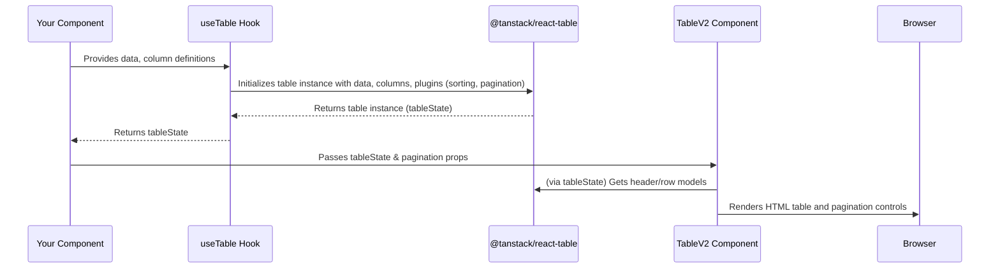

# Chapter 7: Table System

In [Chapter 6: Form Abstraction](06_form_abstraction_.md), we saw how `fixers-g2` helps us collect data from users. Once we have data, or fetch it from a server, we often need to display it in an organized way, especially if it's a collection of items like a list of users, products, or tasks. This is where the **Table System** shines!

## What's the Big Deal with Displaying Data in Tables?

Imagine you have a list of 100 users for your application. You want to show their names, emails, and perhaps their account status.

**The Problem:**
*   **Messy Lists:** Just dumping this data onto a page would be unreadable and overwhelming.
*   **No Organization:** How would you easily find a specific user? Or see all users sorted by name?
*   **Handling Lots of Data:** What if you have thousands of users? You can't show them all at once. You'd need page numbers (pagination).
*   **Consistency:** If you build tables manually each time, they might look and behave differently across your app.

**The Solution: A Robust Table System!**
The `fixers-g2` Table System provides powerful tools to display data in a structured, interactive, and consistent tabular format. Think of it like a versatile shelving unit that you can easily configure to display various items neatly. It includes:
*   `TableV2`: A component for rendering the actual table on the screen.
*   `useTable` hook: The "brain" for your table, managing its state like sorting, pagination, and row selection.
*   `ColumnFactory` utilities: Helpers to define how data should look in each column, ensuring consistency.

**Our Use Case:** We want to display a list of "Users". Each user has a name, email, and status. The table should:
1.  Show columns for "Name", "Email", and "Status".
2.  Allow sorting by "Name".
3.  If there are many users, show pagination controls (e.g., "Page 1 of 5").

Let's see how we can build this!

## The Building Blocks of Our Table

To create our user list table, we'll primarily use three pieces:

### 1. `G2ColumnDef`: Defining Your Columns

First, we need to tell the table what data to show and how each column should look. This is done by defining an array of column definition objects. Each object typically has:
*   `id` or `accessorKey`: A unique identifier for the column, often matching a property in your data.
*   `header`: The text that appears in the column header.
*   `cell` (optional): A function that customizes how the data for that cell is rendered. If not provided, it often defaults to showing the value from `accessorKey`.

### 2. `useTable` Hook: The Table's Brain

The `useTable` hook (from `packages/layout/src/TableV2/useTable.tsx`) is where the magic happens. You give it your data and your column definitions. It then gives you back a `tableState` object, which contains everything needed to manage and render the table, including functions for sorting, pagination, etc. It's built on top of the powerful `@tanstack/react-table` library.

### 3. `TableV2` Component: The Display Shelf

The `TableV2` component (from `packages/layout/src/TableV2/TableV2.tsx`) takes the `tableState` object from `useTable` and renders the actual HTML table. It handles displaying headers, rows, cells, and can also include pagination controls.

## Building Our User List Table: Step-by-Step

Let's assemble our "User List" table.

### Step 1: Prepare Your Data

First, let's assume we have an array of user objects:

```javascript
// Sample user data
const usersData = [
  { id: '1', name: 'Charlie Brown', email: 'charlie@example.com', status: 'Active' },
  { id: '2', name: 'Alice Wonderland', email: 'alice@example.com', status: 'Pending' },
  { id: '3', name: 'Bob The Builder', email: 'bob@example.com', status: 'Inactive' }
];
```
This is the raw information we want to display.

### Step 2: Define Columns with `ColumnFactory`

Defining columns can be repetitive. `fixers-g2` provides `ColumnFactory` (from `packages/layout/src/ColumnFactory/ColumnFactory.tsx`) to make this easier. It offers pre-configured "generators" for common column types.

```jsx
// In your UserTable.jsx component
import { ColumnFactory } from '@komune-io/g2-layout';
import { Chip } from '@komune-io/g2-components'; // For our status chip

// Define types for your data (optional but good practice)
// interface User { id: string; name: string; email: string; status: string; }

const userColumns = ColumnFactory({
  generateColumns: (generators) => [
    generators.text({ // For simple text columns
      header: 'Name',
      id: 'name', // Corresponds to the 'name' property in usersData
      getCellProps: (user) => ({ value: user.name, enableSort: true })
    }),
    generators.text({
      header: 'Email',
      id: 'email',
      getCellProps: (user) => ({ value: user.email })
    }),
    generators.chip({ // For a column displaying a chip
      header: 'Status',
      id: 'status',
      getCellProps: (user) => ({
        label: user.status,
        color: user.status === 'Active' ? 'success' : user.status === 'Pending' ? 'warning' : 'error'
      })
    })
  ]
});
```
**Explanation:**
*   `ColumnFactory({ generateColumns: (generators) => [ ... ] })`: We use `ColumnFactory`. It passes an object `generators` to our function.
*   `generators.text(...)`: This creates a column definition for displaying simple text.
    *   `header: 'Name'`: Sets the column title.
    *   `id: 'name'`: Links this column to the `name` property of each user object.
    *   `getCellProps: (user) => ({ value: user.name, enableSort: true })`: This function takes a user object and returns props for the cell. `value` specifies what to display. `enableSort: true` makes this column sortable.
*   `generators.chip(...)`: This creates a column that will render its content using the `Chip` component from our [UI Component System](02_ui_component_system_.md).
    *   `getCellProps: (user) => ({ label: user.status, color: ... })`: We provide the `label` for the chip and dynamically set its `color` based on the user's status.

`ColumnFactory` simplifies creating columns with consistent styling and behavior. Each generator (like `generators.text` or `generators.chip`) returns a `G2ColumnDef` object.

### Step 3: Manage Table State with `useTable`

Now, let's use the `useTable` hook with our data and column definitions.

```jsx
// Continuing in UserTable.jsx
import { useTable } from '@komune-io/g2-layout'; // Import the hook
import React from 'react'; // Needed for useState, useMemo if using them

// Assume usersData and userColumns are defined as above

function UserTable() {
  const [data, setData] = React.useState(usersData); // Manage data with state
  const [pagination, setPagination] = React.useState({ pageIndex: 0, pageSize: 10 });

  const tableState = useTable({
    data,
    columns: userColumns,
    state: { pagination }, // Connect pagination state
    onPaginationChange: setPagination, // Update state on change
    manualPagination: true, // If pagination is handled server-side or manually
    pageCount: Math.ceil(data.length / pagination.pageSize), // Total pages
    autoResetPageIndex: false // Important for manual pagination
  });

  // ... More to come for displaying TableV2 ...
  return <p>Table will be here</p>;
}
```
**Explanation:**
*   `React.useState(usersData)`: We put our `usersData` into React state so the table can react to changes if needed (e.g., if data is fetched).
*   `React.useState({ pageIndex: 0, pageSize: 10 })`: We manage pagination state (`pageIndex` is 0-based).
*   `useTable({ ... })`:
    *   `data`: Our array of user objects.
    *   `columns: userColumns`: Our defined columns from `ColumnFactory`.
    *   `state: { pagination }`: Tells `useTable` about our current pagination.
    *   `onPaginationChange: setPagination`: A function to call when the page or page size changes.
    *   `manualPagination: true`: Set this if you are controlling pagination (e.g., fetching data per page). If your `data` prop contains *all* items, you might not need this and `pageCount`.
    *   `pageCount`: Total number of pages. Crucial for `TableV2` to render pagination controls.

The `tableState` object now holds all the logic and prepared data structures for our table.

### Step 4: Display with `TableV2`

Finally, we pass the `tableState` to the `TableV2` component to render it.

```jsx
// Continuing in UserTable.jsx
import { TableV2 } from '@komune-io/g2-layout'; // Import the TableV2 component

function UserTable() {
  // ... (usersData, userColumns, and useTable setup from above) ...
  const [data, setData] = React.useState(usersData);
  const [pagination, setPagination] = React.useState({ pageIndex: 0, pageSize: 2 }); // Page size 2 for demo

  const tableState = useTable({
    data,
    columns: userColumns,
    state: { pagination },
    onPaginationChange: setPagination,
    manualPagination: true,
    pageCount: Math.ceil(data.length / pagination.pageSize),
    autoResetPageIndex: false
  });

  return (
    <TableV2
      tableState={tableState}
      isLoading={false} // Set to true if data is being fetched
      // Props for pagination display
      page={pagination.pageIndex + 1} // TableV2 expects 1-based page index
      totalPages={tableState.getPageCount()}
      onPageChange={(newPage) => tableState.setPageIndex(newPage - 1)} // Adjust back to 0-based
    />
  );
}
```
**Explanation:**
*   `<TableV2 ... />`:
    *   `tableState={tableState}`: We pass the state object from `useTable`.
    *   `isLoading={false}`: If you were fetching data, you'd set this to `true` during the fetch to show a loading indicator.
    *   `page={pagination.pageIndex + 1}`: `TableV2`'s pagination component expects a 1-based page number.
    *   `totalPages={tableState.getPageCount()}`: Total number of pages for pagination.
    *   `onPageChange={(newPage) => tableState.setPageIndex(newPage - 1)}`: When the user clicks a page number, `TableV2` calls this. We then tell `useTable` to update its `pageIndex` (which is 0-based).

**Output/Effect:**
This will render a table on your page:
*   It will have columns: "Name", "Email", and "Status".
*   The "Name" column header will be sortable (usually indicated by an icon). Clicking it will sort the data.
*   The "Status" column will show colored chips.
*   Since our `pageSize` is 2 and we have 3 users, pagination controls will appear below the table, showing "Page 1 of 2" (or similar) and allowing navigation.

You've successfully built an interactive, sortable, and paginated table!

## Under the Hood: How Does It All Connect?

Let's visualize the flow:

1.  **You Define:** You provide `data` and `column` definitions (perhaps using `ColumnFactory`).
2.  **`useTable` Processes:** The `useTable` hook takes your data and columns. Internally, it uses `@tanstack/react-table` to:
    *   Set up the core table logic.
    *   Process columns (e.g., add sorting handlers).
    *   Manage state for sorting, pagination, selection, etc.
    *   It returns a `tableState` object which is essentially the instance from `@tanstack/react-table`, exposing all its methods and data models.
3.  **`TableV2` Renders:** The `TableV2` component receives the `tableState`.
    *   It uses methods like `tableState.getHeaderGroups()` to get header information and `tableState.getRowModel().rows` to get row data.
    *   It iterates through these to render `<thead>`, `<tbody>`, `<tr>`, `<th>`, and `<td>` elements.
    *   If pagination props are provided, it renders a pagination component.

Here’s a simplified sequence diagram:



### A Peek at the Key Files:

*   **`packages/layout/src/TableV2/useTable.tsx`:**
    This file contains the `useTable` hook. It's a wrapper around `useReactTable` from `@tanstack/react-table`.
    ```tsx
    // Simplified from packages/layout/src/TableV2/useTable.tsx
    import { useReactTable, getCoreRowModel, getExpandedRowModel } from '@tanstack/react-table';

    export const useTable = (options) => {
      const { columns, data, ...otherOptions } = options;

      // It might add default features or inject special columns
      // for selection or expansion if enabled.

      return useReactTable({
        data,
        columns,
        getCoreRowModel: getCoreRowModel(), // Essential for basic table functionality
        getExpandedRowModel: getExpandedRowModel(), // For expandable rows
        // ... other configurations like sorting, pagination, selection handlers ...
        ...otherOptions
      });
    };
    ```
    The hook configures `@tanstack/react-table` with your data, columns, and any enabled features (like sorting, pagination which are plugins in `@tanstack/react-table`). `G2ColumnDef` (also defined here) extends the base `ColumnDef` from `@tanstack/react-table` to add `fixers-g2` specific properties if needed.

*   **`packages/layout/src/TableV2/TableV2.tsx`:**
    This is the main presentation component.
    ```tsx
    // Simplified from packages/layout/src/TableV2/TableV2.tsx
    import { TableBase } from './TableBase'; // Renders the actual <table> element
    import { Pagination } from '@komune-io/g2-components';

    export const TableV2 = (props) => {
      const {
        tableState, // from useTable
        isLoading,
        page, totalPages, onPageChange,
        // ... other props
      } = props;

      if (isLoading) return <p>Loading...</p>; // Or a skeleton loader

      return (
        <div>
          <TableBase tableState={tableState} /* ...other props... */ />
          {page && totalPages && totalPages > 1 && (
            <Pagination
              page={page}
              totalPage={totalPages}
              onPageChange={onPageChange}
            />
          )}
        </div>
      );
    };
    ```
    It primarily delegates the rendering of the `<table>` structure to `TableBase` and adds pagination controls if `page` and `totalPages` are provided.

*   **`packages/layout/src/ColumnFactory/ColumnFactory.tsx`:**
    This utility helps create `G2ColumnDef` objects.
    ```tsx
    // Simplified from packages/layout/src/ColumnFactory/ColumnFactory.tsx
    import { TableCellText, TableCellChip } from './'; // Import cell renderers

    // getColumnGenerator is a helper to create column defs
    const getColumnGenerator = (CellElement) => (params) => {
      const { getCellProps, ...otherColumnDef } = params;
      return {
        ...otherColumnDef,
        // 'cell' is how @tanstack/react-table renders cell content
        cell: ({ row }) => <CellElement {...getCellProps(row.original)} />
      };
    };

    export const columnsGenerators = {
      text: getColumnGenerator(TableCellText), // Uses TableCellText renderer
      chip: getColumnGenerator(TableCellChip), // Uses TableCellChip renderer
      // ... other generators like date, link, etc.
    };

    export const ColumnFactory = (params) => {
      const { generateColumns } = params;
      return generateColumns(columnsGenerators); // Calls your function with generators
    };
    ```
    `ColumnFactory` provides convenient `generators` (like `text`, `chip`). Each generator uses a specific pre-styled cell component (e.g., `TableCellText`, `TableCellChip`) to render the cell's content, ensuring visual consistency.

## Conclusion

The Table System in `fixers-g2` offers a powerful and developer-friendly way to display tabular data.
*   **`useTable`** handles the complex state management (data, sorting, pagination, selection).
*   **`TableV2`** renders the visual table and integrates with pagination.
*   **`ColumnFactory`** simplifies defining how your data appears in each column, using pre-built and consistently styled cell renderers.

Together, these tools allow you to quickly build feature-rich tables that are consistent with the rest of your `fixers-g2` application's look and feel, saving you a lot of time and effort.

Now that we can display data effectively, many applications also need to manage user identity – knowing who the user is and what they are allowed to do. Let's explore this in [Chapter 8: Identity Management (IM) Abstractions](08_identity_management__im__abstractions_.md).

---

Generated by [AI Codebase Knowledge Builder](https://github.com/The-Pocket/Tutorial-Codebase-Knowledge)