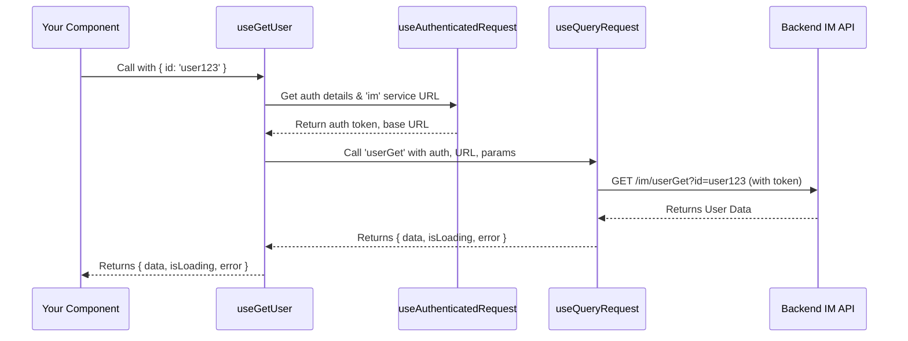
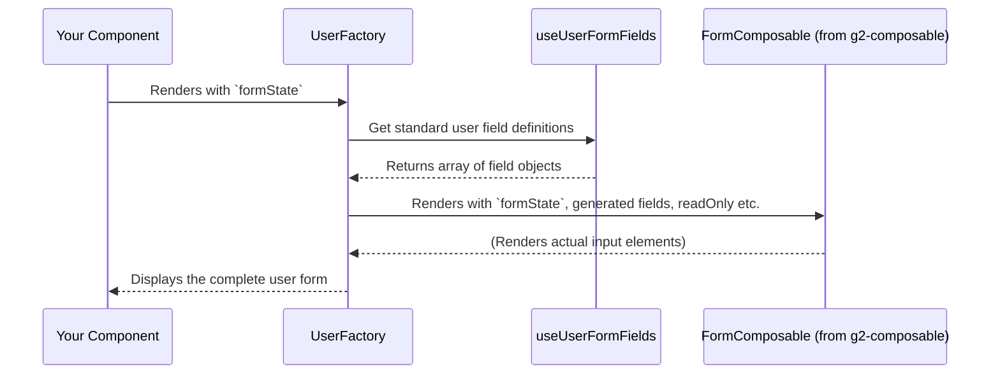

# Chapter 8: Identity Management (IM) Abstractions

In [Chapter 7: Table System](07_table_system_.md), we learned how to display collections of data, like a list of users or items, in a neat and organized table. Now, let's dive into how our application understands *who* these users are and what groups (organizations) they might belong to. This is the world of **Identity Management (IM) Abstractions**.

## Who Are You, and What's Your Guild?

Imagine you're playing an online game. When you start, you create a character: give it a name, choose its appearance, maybe assign it some skills. Later, you might join a "guild" or a "team" with other players. The game needs to keep track of all these characters and guilds.

**The Problem:** In many applications, especially business-oriented ones, we need to:
*   Know who our users are (their details, roles, permissions).
*   Group users into organizations or teams.
*   Allow administrators to create, view, update, and manage these users and organizations.
*   Do all this securely and consistently.

Building this "character creation" and "guild management" system from scratch for every application would be a lot of work!

**The Solution: Identity Management (IM) Abstractions!**
The `fixers-g2` project provides a specialized layer to handle all things related to users and organizations. This abstraction layer gives you:
*   **Data Models:** Blueprints for what a `User` or `Organization` looks like (e.g., `User` has a name, email; `Organization` has a name, address).
*   **API Hooks:** Pre-built functions to easily "talk" to your backend server to fetch, create, or update user and organization data.
*   **Factory Components:** Ready-made User Interface (UI) components, like forms, for creating and managing users and organizations. These factories often use the [Form Abstraction](06_form_abstraction_.md) we learned about earlier.

**Our Use Case:** Let's say we're building an admin panel.
1.  An administrator needs to **create a new user** in the system, providing their name, email, and assigning them to an organization.
2.  The administrator also needs to **view the details of an existing organization**.

Let's see how `fixers-g2` IM abstractions help us do this without reinventing the wheel.

## Key Ingredients of IM Abstractions

### 1. Data Models: `User` and `Organization`

These are like the character sheets in our game. They define what information we store for each user and organization.

**Simplified `User` Model (from `packages/im/src/User/Domain/index.ts`):**
```typescript
// Simplified User interface
export interface User {
  id: string;          // Unique identifier
  familyName: string;
  givenName: string;
  email: string;
  memberOf?: { id: string, name: string }; // Org they belong to
  roles?: string[];    // What they can do (e.g., 'admin', 'editor')
  // ... other fields like address, phone
}
```
This tells us a `User` object will have an `id`, `familyName`, `givenName`, `email`, and can optionally be part of an `memberOf` organization and have `roles`.

**Simplified `Organization` Model (from `packages/im/src/Organization/Domain/index.ts`):**
```typescript
// Simplified Organization interface
export interface Organization {
  id: string;          // Unique identifier
  name: string;
  siret?: string;      // A business registration number (common in France)
  website?: string;
  address?: { street: string, city: string, postalCode: string };
  // ... other fields like description, logo
}
```
An `Organization` has an `id`, `name`, and can have other details like a `website` and `address`.

These models provide a clear structure for the data we're working with.

### 2. API Hooks: Your Messengers to the Server

To get user or organization data, or to send new/updated data to our server, we use special "hooks." These hooks are functions that handle the communication with the backend API.

**For Users (from `packages/im/src/User/Api/index.ts`):**
*   `useGetUser(params)`: Fetches a specific user's details from the server.
*   `useGetUsers(params)`: Fetches a list of users.
*   `useCreateUser()`: Gives you a function to call when you want to create a new user. The hook handles sending the data to the server.
*   `useUpdateUser()`: Similar, but for updating an existing user.

**For Organizations (from `packages/im/src/Organization/Api/index.ts`):**
*   `useGetOrganization(params)`: Fetches a specific organization's details.
*   `useCreateOrganization()`: Gives you a function to create a new organization.
*   `useUpdateOrganization()`: For updating an existing organization.

These hooks use the `useAuthenticatedRequest` mechanism (often related to `KeycloakProvider` from [Chapter 4: Global Application Providers](04_global_application_providers_.md)) to ensure that requests are made securely by logged-in users. They also use `useQueryRequest` (for fetching data) or `useCommandRequest` (for creating/updating data) from `@komune-io/g2-utils` to handle the actual API calls.

### 3. Factory Components: Pre-Built UIs

Why build a user creation form from scratch every time? `fixers-g2` provides "Factory" components that give you pre-built forms and UIs.

*   **`UserFactory` (from `packages/im/src/User/Components/UserFactory/UserFactory.tsx`):**
    This component can render a complete form for creating or editing a user. You tell it what user data to start with (if any), and it displays fields for name, email, roles, etc. It uses the [Form Abstraction](06_form_abstraction_.md) system (`FormComposable`) internally.

*   **`OrganizationFactory` (from `packages/im/src/Organization/Components/OrganizationFactory/OrganizationFactory.tsx`):**
    Similar to `UserFactory`, but for organizations. It provides a form for organization details like name, address, and website.

These factories save a ton of time and ensure consistency in how users and organizations are managed across the application.

## Solving Our Use Case

Let's tackle our administrator's tasks.

### Task 1: Creating a New User

The administrator needs a form to enter the new user's details. We'll use `UserFactory` along with the `useFormComposable` hook (from [Chapter 6: Form Abstraction](06_form_abstraction_.md)) to manage the form's state, and the `useCreateUser` API hook to send the data to the server.

```jsx
// In your AdminCreateUserPage.jsx
import React, { useCallback } from 'react';
import { useFormComposable } from '@komune-io/g2-composable';
import { UserFactory, useCreateUser } from '@komune-io/g2-im'; // UserFactory and API hook
import { Button } from '@komune-io/g2-components'; // Our Button

function AdminCreateUserPage() {
  // 1. Setup the form's brain
  const formState = useFormComposable({
    initialValues: {
      givenName: '',
      familyName: '',
      email: '',
      memberOf: undefined, // Will be an organization object or ID
      roles: []
    },
    onSubmit: async (values) => {
      // This will be called by the createUser function later
      console.log("Form submitted, values:", values);
    }
  });

  // 2. Get the function to call the create user API
  const { createUser } = useCreateUser({
    onSuccess: (response) => {
      alert(`User created with ID: ${response.id}`);
      formState.resetForm(); // Clear the form
    },
    onError: (error) => alert(`Error: ${error.message}`)
  });

  // 3. Handle the actual submission
  const handleSubmit = useCallback(
    async (values) => {
      // 'values' comes from formState after validation
      await createUser(values); // Call the API hook
    },
    [createUser]
  );

  // Update formState's onSubmit to use our handleSubmit
  formState.submit = () => formState.handleSubmit(handleSubmit)

  return (
    <div>
      <h1>Create New User</h1>
      <UserFactory
        formState={formState} // Connect the factory to our form's brain
        // 'update={false}' is often default or implied for new users
        // 'organizationId' might be needed if roles are org-specific
      />
      <Button
        onClick={formState.submit} // Trigger Formik's submission
        disabled={formState.isSubmitting}
      >
        Create User
      </Button>
    </div>
  );
}
```
**Explanation:**
1.  **`useFormComposable`**: We set up the form state just like we learned in [Chapter 6: Form Abstraction](06_form_abstraction_.md). `initialValues` match parts of our simplified `User` model.
2.  **`useCreateUser()`**: This API hook gives us a `createUser` function. We configure `onSuccess` and `onError` callbacks to handle the server's response.
3.  **`handleSubmit`**: This function is what we'll actually call when the form is submitted. It takes the validated `values` from the form and passes them to our `createUser` API function. We then tell our `formState` to use this `handleSubmit` function.
4.  **`<UserFactory formState={formState} />`**: This is the magic! It renders all the necessary input fields (for given name, family name, email, roles, assigning to an organization etc.) based on the `formState`.
5.  **`<Button onClick={formState.submit} ...>`**: When clicked, this button will trigger the form submission process managed by `formState` (which uses Formik), which will validate the data and then call our `handleSubmit` function.

**Output/Effect:**
This code renders a complete user creation form. The administrator can fill it out. When they click "Create User":
*   The form data is validated.
*   If valid, the `handleSubmit` function calls `createUser(values)`.
*   `useCreateUser` sends the data to the backend API.
*   An alert shows success or error based on the API response.

### Task 2: Viewing Organization Details

The administrator needs to see the details of an existing organization. We'll use `useGetOrganization` to fetch the data and `OrganizationFactory` in "read-only" mode to display it.

```jsx
// In your ViewOrganizationPage.jsx
import React, { useEffect } from 'react';
import { useFormComposable } from '@komune-io/g2-composable';
import { OrganizationFactory, useGetOrganization } from '@komune-io/g2-im';

// Assume 'organizationIdToView' comes from URL params or props
function ViewOrganizationPage({ organizationIdToView }) {
  // 1. Fetch organization data
  const { data, isLoading } = useGetOrganization({
    query: { id: organizationIdToView },
    enabled: !!organizationIdToView // Only fetch if ID is available
  });

  // 2. Setup form state (even for read-only, Factory needs it)
  const formState = useFormComposable({
    initialValues: {} // Will be populated by fetched data
  });

  // 3. When data arrives, populate the form (for display)
  useEffect(() => {
    if (data?.item) {
      formState.setValues(data.item);
    }
  }, [data, formState.setValues]);

  if (isLoading) return <p>Loading organization details...</p>;
  if (!data?.item) return <p>Organization not found.</p>;

  return (
    <div>
      <h1>Organization Details: {data.item.name}</h1>
      <OrganizationFactory
        formState={formState}
        organization={data.item} // Pass the fetched organization
        readOnly={true}        // Display as non-editable
        isLoading={isLoading}
      />
      {/* You might add an "Edit" button here that sets readOnly to false */}
    </div>
  );
}
```
**Explanation:**
1.  **`useGetOrganization`**: We call this hook with the `id` of the organization we want to view. It returns `data` (which contains `item`: our organization) and `isLoading` state.
2.  **`useFormComposable`**: Even for displaying data, `OrganizationFactory` (which uses `FormComposable` internally) needs a `formState`. We initialize it with empty values.
3.  **`useEffect`**: When the `data.item` (our organization) is fetched, we use `formState.setValues(data.item)` to populate the form state with the organization's details. This is how `OrganizationFactory` knows what to display.
4.  **`<OrganizationFactory ... readOnly={true} />`**:
    *   We pass the `formState`.
    *   `organization={data.item}` provides the data directly for display.
    *   `readOnly={true}` tells the factory to render the fields as simple text displays, not editable inputs.

**Output/Effect:**
This code first shows a loading message. Once the organization's data is fetched:
*   It displays the organization's name as a heading.
*   The `OrganizationFactory` renders all the organization's details (name, address, website, etc.) in a read-only format.

## Under the Hood

Let's peek at how these IM abstractions work internally.

### How API Hooks Work (e.g., `useGetUser`)

When you call an API hook like `useGetUser({ query: { id: 'user123' } })`:

1.  **Hook Called:** Your component calls `useGetUser`.
2.  **Secure Request Setup:** The hook internally calls `useAuthenticatedRequest('im')`. This function (often from `packages/providers/src/KeycloakProvider/useAuth.ts` via `@komune-io/g2-providers`) ensures that the request will be made with proper authentication tokens (like a JWT from Keycloak, see [Chapter 4: Global Application Providers](04_global_application_providers_.md)). It also figures out the base URL for the 'im' (Identity Management) service.
3.  **Data Fetching Logic:** The hook then uses `useQueryRequest('userGet', requestProps, params)` (from `@komune-io/g2-utils`). This utility hook:
    *   Constructs the full API endpoint URL (e.g., `https://api.example.com/im/userGet`).
    *   Makes the actual HTTP GET request to that endpoint, including the user ID 'user123' as a parameter.
    *   Manages loading states, error states, and caching (often using React Query, also part of [Chapter 4: Global Application Providers](04_global_application_providers_.md)).
4.  **Data Returned:** `useQueryRequest` returns the fetched user data (or error/loading info) back to `useGetUser`, which then returns it to your component.



A simplified snippet from `packages/im/src/User/Api/index.ts`:
```typescript
// Simplified from packages/im/src/User/Api/index.ts
export const useGetUser = <T extends User = User>(
  params: QueryParams<{ id: string }, { item: T }> // Defines input and output types
) => {
  // Gets base URL for 'im' service and authentication details
  const requestProps = useAuthenticatedRequest('im');
  return useQueryRequest<{ id: string }, { item: T }>(
    'userGet',     // API command/query name
    requestProps,  // Auth and URL info
    params         // Parameters like { query: { id: 'user123' } }
  );
};
```

### How Factory Components Work (e.g., `UserFactory`)

When you render `<UserFactory formState={myUserFormState} />`:

1.  **Factory Renders:** `UserFactory` receives your `formState` (from `useFormComposable`).
2.  **Get Field Definitions:** It typically calls a helper hook like `useUserFormFields(props)` (from `packages/im/src/User/Components/UserFactory/useUserFormFields.ts`). This hook knows the standard fields for a `User` (like 'givenName', 'email', 'roles') and returns an array of field definitions compatible with `FormComposable` from [Chapter 6: Form Abstraction](06_form_abstraction_.md). It can also handle customizations and overrides passed via `props`.
3.  **Uses `FormComposable`:** `UserFactory` then renders `<FormComposable />`, passing it:
    *   The `formState` you provided.
    *   The array of `fields` obtained from `useUserFormFields`.
    *   Props like `readOnly` or `isLoading`.
4.  **Form Renders:** `FormComposable` takes these definitions and renders the actual HTML input elements, labels, and connects them to the `formState` (which uses Formik) for data handling and validation.



A simplified snippet from `packages/im/src/User/Components/UserFactory/UserFactory.tsx`:
```tsx
// Simplified from UserFactory.tsx
export const UserFactory = (props: UserFactoryProps) => {
  const {
    formState,
    additionalFields = [], // Allow adding custom fields
    blockedFields = [],    // Allow hiding standard fields
    readOnly = false,
    isLoading = false,
    // ... other props for useUserFormFields
    ...other
  } = props;

  // 1. Get the field definitions for a user form
  const { fieldsArray } = useUserFormFields(props);

  // 2. Potentially modify fields (add additional, remove blocked)
  const finalFields = useDeletableForm({ /* ... */ });

  // 3. Render the form using FormComposable
  return (
    <FormComposable
      {...other} // Pass down other layout props
      fields={finalFields}
      formState={formState}
      isLoading={isLoading}
      readOnly={readOnly}
    />
  );
};
```
The `useUserFormFields` hook is responsible for defining which form elements (text fields, select dropdowns for roles, etc.) appear for each user property.

## Conclusion

The Identity Management (IM) Abstractions in `fixers-g2` provide a powerful and convenient toolkit for managing users and organizations.
*   **Data Models (`User`, `Organization`)** give you clear structures.
*   **API Hooks (`useGetUser`, `useCreateOrganization`, etc.)** simplify secure communication with your backend.
*   **Factory Components (`UserFactory`, `OrganizationFactory`)** offer pre-built UIs (forms) that leverage the [Form Abstraction](06_form_abstraction_.md), saving you significant development time and ensuring consistency.

By using these abstractions, you can easily implement common "character creation" and "guild management" features in your application, allowing administrators and users to manage identities effectively.

With users and their data well-managed, the next step is often to streamline how we build and deploy our application. Let's explore this in [Chapter 9: Workflow and Build Automation](09_workflow_and_build_automation_.md).

---

Generated by [AI Codebase Knowledge Builder](https://github.com/The-Pocket/Tutorial-Codebase-Knowledge)