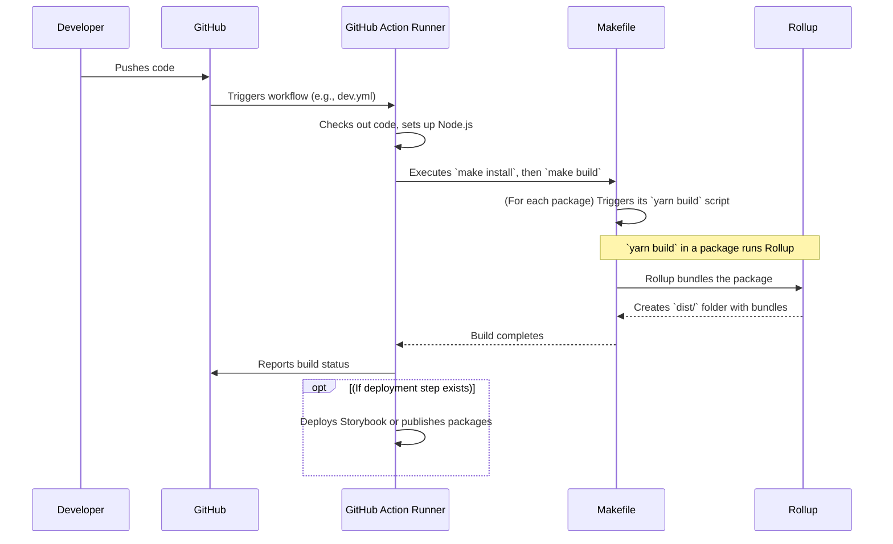

# Chapter 9: Workflow and Build Automation

Welcome to the final chapter of our `fixers-g2` tour! In [Chapter 8: Identity Management (IM) Abstractions](08_identity_management__im__abstractions_.md), we explored how the project handles users and organizations. Now, with all these fantastic features and components, how do we ensure that everything is built correctly, tested thoroughly, and deployed smoothly every time a developer makes a change? Doing this manually would be like trying to build a car by hand every single time – slow, tiring, and very easy to make mistakes!

This is where **Workflow and Build Automation** comes in. Think of it as the automated assembly line, quality assurance team, and delivery service for the `fixers-g2` project.

**The Problem:** When many developers work on a project, or even when one developer works on it over time, it's crucial to:
*   Catch errors early.
*   Ensure code quality.
*   Build all the parts of the project consistently.
*   Make it easy to release new versions or deploy updates.

**The Solution: An Automated System!**
`fixers-g2` uses a set of tools and configurations to automate these processes:
*   **GitHub Actions** (`.github/workflows`): These are like the project's automated butlers, performing tasks whenever something happens in the code repository (like a new code push).
*   **Makefiles** (`Makefile`, `docs.mk`): These are like recipe books with shortcuts for common development commands.
*   **Rollup Configurations** (`rollup.config.js`): These are the instructions for a specialized tool (Rollup) that packages our JavaScript code into neat, usable bundles.

**Our Use Case:** Imagine a developer on the `fixers-g2` team just finished adding a new feature. We want to ensure that when they share their code:
1.  It's automatically checked for common errors (linting).
2.  All the project's packages are built correctly.
3.  The documentation (like Storybook) is updated and published.
4.  If it's a release, new versions of packages are published.

Let's see how these automation tools make this happen!

## The Automation Trio: GitHub Actions, Makefiles, and Rollup

These three work together to keep the `fixers-g2` project running smoothly.

### 1. GitHub Actions: The Project's Automated Butler

Whenever a developer pushes code to the `fixers-g2` GitHub repository or creates a pull request (a request to merge their changes), GitHub Actions spring into action. These are defined in YAML files located in the `.github/workflows` directory.

**What they do (Continuous Integration & Deployment - CI/CD):**
*   **Check Code:** Run linters to check for code style issues and potential bugs.
*   **Build Everything:** Compile all the different packages within `fixers-g2`.
*   **Run Tests:** (Although the example Makefile says 'No Test', in many projects, this is where tests would run).
*   **Publish Packages:** For official releases, they can publish new versions of the `@komune-io/g2-*` packages to a package registry like npm.
*   **Deploy Documentation:** Build and deploy the Storybook documentation to a website, so everyone can see the latest components.

Let's look at a *very simplified* snippet from a workflow file, like `.github/workflows/dev.yml`:

```yaml
# .github/workflows/dev.yml (Simplified)
name: Development Workflow

on: # When does this run?
  push:
    branches: [ main ] # When code is pushed to the 'main' branch

jobs: # What tasks to perform?
  build_and_test: # Name of the job
    runs-on: ubuntu-latest # What kind of computer to use
    steps: # What are the individual steps?
      - name: Checkout code # Step 1: Get the code
        uses: actions/checkout@v4

      - name: Setup Node.js # Step 2: Prepare Node.js environment
        uses: actions/setup-node@v3
        with:
          node-version: '18'

      - name: Install dependencies & Build # Step 3: Run our make commands
        run: make install && make build # Uses Makefile!
```
**Explanation:**
*   `name: Development Workflow`: Just a name for this set of automated tasks.
*   `on: push: branches: [ main ]`: This workflow will run every time someone pushes code to the `main` branch.
*   `jobs: build_and_test:`: Defines a "job" (a set of steps) that will run.
*   `runs-on: ubuntu-latest`: Tells GitHub to use a virtual machine running Linux.
*   `steps:`: A list of actions to perform.
    *   `actions/checkout@v4`: A pre-built action to download the project's code into the virtual machine.
    *   `actions/setup-node@v3`: Another pre-built action to install Node.js, which is needed to build our JavaScript project.
    *   `run: make install && make build`: This is key! This step tells the virtual machine to run commands defined in our `Makefile` (which we'll see next).

The actual `dev.yml` in `fixers-g2` is more complex and uses reusable workflows (e.g., `uses: komune-io/fixers-gradle/...`). For instance, the `docs` job in `dev.yml` is responsible for publishing Storybook using another reusable workflow. The `release.yml` workflow handles the process of creating new version tags and branches.

### 2. Makefiles: The Developer's Shortcut Menu

Makefiles (like `Makefile` in the project root, or `docs.mk` for documentation-specific tasks) are like recipe books for the command line. They contain short, easy-to-remember commands (called "targets") that actually run longer, more complex commands.

**Why use them?**
*   **Simplicity:** Instead of typing `yarn install --frozen-lockfile --ignore-scripts`, a developer can just type `make install`.
*   **Consistency:** Everyone on the team uses the same commands, ensuring builds are done the same way.
*   **Automation Hub:** GitHub Actions often call `make` commands, centralizing the build logic.

Here's a *very simplified* piece of the main `Makefile`:

```makefile
# Makefile (Simplified)
VERSION = $(shell cat VERSION) # Reads version from a file

clean: # Target to clean up old build files
	-rm -rf node_modules packages/*/node_modules packages/*/dist

install: # Target to install all project dependencies
	@yarn install --frozen-lockfile --ignore-scripts

build-libs: install # 'build-libs' needs 'install' to run first
	@yarn workspace @komune-io/g2-utils run build # Build one package
	# ... (imagine commands to build all other g2 packages) ...

build: build-libs # The main 'build' target depends on 'build-libs'
	@echo "All G2 packages built!"
```
**Explanation:**
*   `VERSION = $(shell cat VERSION)`: This line gets the project's current version from a file named `VERSION`.
*   `clean:`: A target named `clean`. If you type `make clean`, it runs the `rm -rf ...` commands to delete old build files and `node_modules` directories.
*   `install:`: A target named `install`. Typing `make install` runs `yarn install ...` to get all necessary code libraries.
*   `build-libs: install`: This means if you run `make build-libs`, it will first make sure the `install` target has been completed. Then, it runs `yarn workspace @komune-io/g2-utils run build` (and similar commands for all other packages). The `yarn workspace ... run build` command tells Yarn (our package manager) to go into the `@komune-io/g2-utils` package and run its specific `build` script (which usually involves Rollup).
*   `build: build-libs`: The main `build` target. Running `make build` will first ensure `build-libs` is done, then it prints a success message.

The `docs.mk` file is similar but focused on tasks related to documentation, like building Storybook (`make build-storybook`) and packaging it into a Docker container (`make package-storybook`).

### 3. Rollup: The JavaScript Package Master

`fixers-g2` is a "monorepo" – a single repository containing many individual JavaScript packages (like `@komune-io/g2-components`, `@komune-io/g2-themes`, etc.). Each of these packages needs to be "built" or "bundled." This is where Rollup comes in.

Rollup is a JavaScript module bundler. It takes our source code (often many files written in TypeScript with modern JavaScript features) and intelligently combines and transforms it into one or more optimized JavaScript files that can be easily used by other projects or run in a browser.

The configuration for Rollup is typically in a `rollup.config.js` file within each package. Many `fixers-g2` packages use a shared configuration logic from `globalRollup.config.js`.

**What Rollup does:**
*   **Bundling:** Combines multiple source files into fewer output files.
*   **TypeScript Compilation:** Works with plugins (like `rollup-plugin-typescript2`) to convert TypeScript code into JavaScript.
*   **Handling Assets:** Can process other files like images, SVGs (using plugins like `@rollup/plugin-image`, `@svgr/rollup`), and CSS (using `rollup-plugin-postcss`).
*   **Multiple Formats:** Can output bundles in different JavaScript module formats (like CommonJS - `.cjs` - for Node.js, and ES Modules - `.es.js` - for modern browsers and tools).

Here's a *very simplified* look at what the `globalRollup.config.js` (which individual package Rollup configs use) might set up:

```javascript
// globalRollup.config.js (Simplified for concept)
import resolve from '@rollup/plugin-node-resolve'; // Helps find modules
import typescript from 'rollup-plugin-typescript2'; // For TypeScript
// ... other plugin imports like commonjs, image, svgr, postcss

export default (localPackageJson) => ({ // Function returns config
  // 'input' (not shown here) would be the main file of the package
  external: [ /* List of dependencies not to include in the bundle */ ],
  output: [ // How to output the bundled files
    { dir: './dist', format: 'cjs', entryFileNames: '[name].cjs' }, // CommonJS
    { dir: './dist', format: 'es', entryFileNames: '[name].es.js' }  // ES Module
  ],
  plugins: [ // Helpers for Rollup
    resolve({ browser: true }), // Finds 'import' statements
    typescript({ clean: true }), // Compiles .ts/.tsx files
    // image(), svgr(), postcss() // For images, SVGs, CSS
  ]
});
```
**Explanation:**
*   `external`: Tells Rollup which libraries (dependencies) are "external" and shouldn't be included directly in the bundle (because the project using this package will provide them).
*   `output`: Defines where the bundled files should go (`./dist` directory) and in what formats (`cjs` and `es`).
*   `plugins`: An array of helper tools for Rollup.
    *   `resolve()`: Helps Rollup understand how to find files you `import`.
    *   `typescript()`: Compiles TypeScript code to JavaScript.
    *   Other plugins handle images, SVGs, CSS, etc.

When a `make build-libs` command runs a package's `yarn build` script, that script typically invokes `rollup -c` (meaning "run Rollup with the config file"). Rollup then reads its configuration and performs the bundling.

## How It All Works Together: The Automated Flow

Let's revisit our use case: a developer pushes a new feature.

1.  **Developer Pushes Code:** The developer uses Git to push their changes to the GitHub repository.
2.  **GitHub Action Triggers:** GitHub detects the push and starts the relevant workflow defined in `.github/workflows` (e.g., `dev.yml`).
3.  **Action Runner Sets Up:** The GitHub Action runner (a virtual machine) checks out the code and sets up the environment (like installing Node.js).
4.  **Makefile Commands Executed:** The workflow runs commands like `make install` and `make build`.
    *   `make install` installs all dependencies using Yarn.
    *   `make build` (which might call `make build-libs`) iterates through each package in `fixers-g2`.
5.  **Rollup Bundles Packages:** For each package, its `yarn build` script (called by the Makefile) executes Rollup. Rollup reads its `rollup.config.js`, compiles TypeScript, processes assets, and creates bundled JavaScript files in the `dist` directory of each package.
6.  **Further Actions (Optional):**
    *   If it's a pull request, results of linting/building are reported.
    *   If it's a push to a specific branch (like `main`) or a tag for a release:
        *   Storybook documentation might be built (using `docs.mk` and then `yarn build-storybook`) and deployed (e.g., to GitHub Pages).
        *   New versions of packages might be published to npm (using `make publish`).

Here's a simplified visual of this flow:



This automated assembly line ensures that every part of `fixers-g2` is consistently processed, checked, and prepared, whether for development, testing, or release.

## Conclusion

Workflow and Build Automation is the invisible engine that keeps the `fixers-g2` project robust, reliable, and manageable. By using tools like:
*   **GitHub Actions** for continuous integration and deployment,
*   **Makefiles** for consistent and simple development commands, and
*   **Rollup** for efficient JavaScript package bundling,

the project ensures that code contributions are automatically validated, built, and (when appropriate) made available to users and other developers. This frees up developers to focus on building great features, knowing that the "assembly line" will take care of the rest.

Understanding this automation backbone gives you a deeper appreciation for the quality and maintainability of the `fixers-g2` project. This concludes our journey through the core concepts of `fixers-g2`. We hope this series of chapters has given you a solid foundation for understanding and working with this powerful toolkit! Happy coding!

---

Generated by [AI Codebase Knowledge Builder](https://github.com/The-Pocket/Tutorial-Codebase-Knowledge)