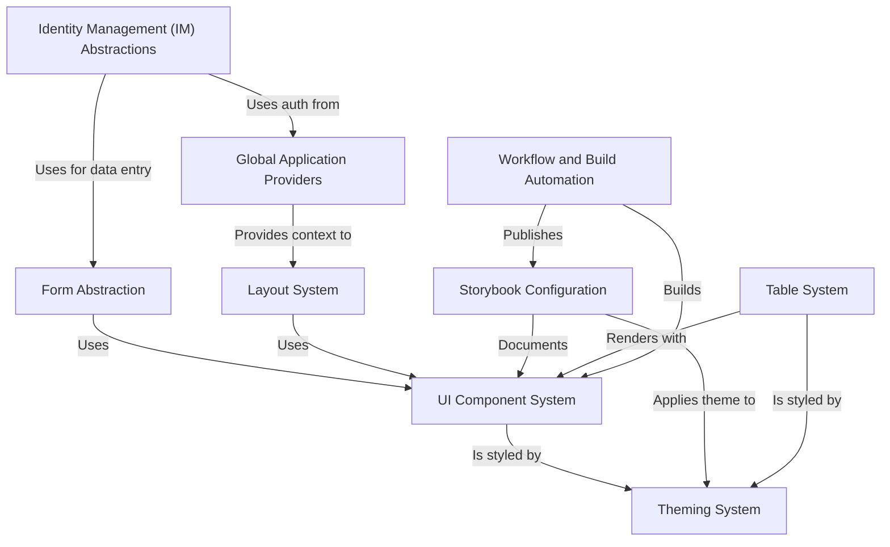

# Tutorial: fixers-g2

The `fixers-g2` project provides a **library of reusable UI components** and related systems to build web application frontends. It includes *abstractions for forms, layout, theming, tables, and identity management*. Development is supported by *Storybook for component showcasing* and *automation scripts for building and deployment*. **Global providers** offer core application-wide functionalities like internationalization and authentication.

**Source Repository:** [https://github.com/komune-io/fixers-g2](https://github.com/komune-io/fixers-g2)

## Chapters

1. [Storybook Configuration
](01_storybook_configuration_.md)
2. [UI Component System
](02_ui_component_system_.md)
3. [Theming System
](03_theming_system_.md)
4. [Global Application Providers
](04_global_application_providers_.md)
5. [Layout System
](05_layout_system_.md)
6. [Form Abstraction
](06_form_abstraction_.md)
7. [Table System
](07_table_system_.md)
8. [Identity Management (IM) Abstractions
](08_identity_management__im__abstractions_.md)
9. [Workflow and Build Automation
](09_workflow_and_build_automation_.md)

---

Generated by [AI Codebase Knowledge Builder](https://github.com/The-Pocket/Tutorial-Codebase-Knowledge)