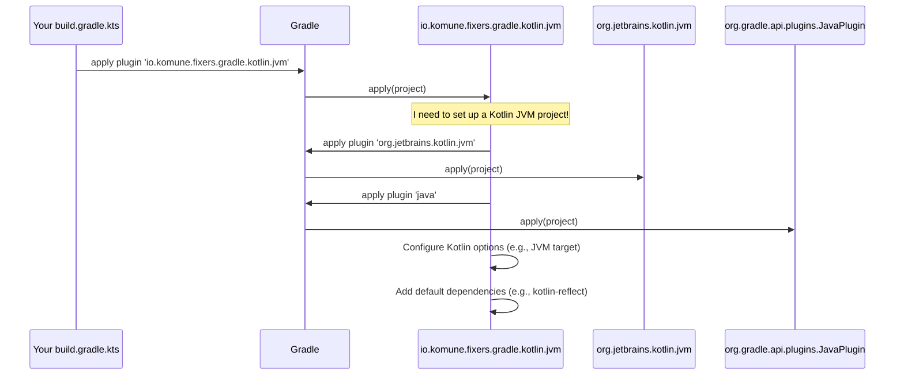

# Chapter 1: Core Gradle Plugins

Welcome to the `fixers-gradle` tutorial! If you're looking to simplify how you build and manage your Kotlin projects, you're in the right place. Let's start our journey by understanding the very heart of `fixers-gradle`: the Core Gradle Plugins.

## What's the Big Deal with Project Setup?

Imagine you're building something cool with LEGOs. Before you can even start assembling your masterpiece (your awesome Kotlin code!), you need to sort through all the different types of bricks, find the right baseplate, and maybe even lay out some instructions. This setup can be time-consuming and, frankly, a bit repetitive every time you start a new LEGO project.

Setting up a new Kotlin project is similar. You need to:
- Configure the Kotlin compiler.
- Choose a Java Development Kit (JDK) version.
- Add common libraries (dependencies).
- Set up how to build and package your application.
- And much more!

This "boilerplate" configuration, while necessary, takes time away from what you really want to do: write amazing code!

## `fixers-gradle` Core Plugins: Your Automated Toolkit

This is where `fixers-gradle` and its **Core Gradle Plugins** come to the rescue. Think of them as a set of specialized power tools, each designed for a specific task in your Kotlin project's workshop. Instead of manually configuring everything from scratch, these plugins automate much of the boilerplate build logic.

These plugins are the heart of `fixers-gradle`. They provide a suite of tools that simplify setting up and configuring various aspects of your Kotlin projects. Each plugin tackles a specific area, such as:
-   Setting up a Kotlin project for the Java Virtual Machine (JVM).
-   Configuring a Kotlin Multiplatform Project (MPP).
-   Deploying your compiled code (artifacts) to repositories.
-   Checking your code for quality (with tools like SonarQube and Detekt).
-   Publishing JavaScript packages to NPM.

By using these plugins, you get sensible defaults and streamlined configurations, letting you focus more on your application's logic and less on the build setup.

## A First Look: Setting Up a Simple Kotlin JVM Project

Let's say you want to create a basic Kotlin application that runs on the JVM. Without `fixers-gradle`, you'd manually add the Kotlin Gradle plugin, configure Java versions, add Kotlin standard libraries, and set up testing frameworks.

With `fixers-gradle`, it's much simpler!

### 1. Installation (One-Time Setup for Your Project)

First, you need to tell Gradle where to find the `fixers-gradle` plugins. You do this in your `settings.gradle.kts` file (usually at the root of your project):

```kotlin
// settings.gradle.kts
pluginManagement {
    repositories {
        gradlePluginPortal() // Standard Gradle plugin repository
        mavenCentral()     // Where fixers-gradle plugins are hosted
    }
}
```
This tells Gradle to look for plugins in the standard `gradlePluginPortal()` and also in `mavenCentral()`, which is where `fixers-gradle` plugins are published.

### 2. Applying a Core Plugin

Now, in your module's `build.gradle.kts` file (e.g., `app/build.gradle.kts`), you can apply a specific `fixers-gradle` plugin. For our Kotlin JVM project, we'll use `io.komune.fixers.gradle.kotlin.jvm`:

```kotlin
// your-module/build.gradle.kts
plugins {
    id("io.komune.fixers.gradle.kotlin.jvm") version "x.y.z" // Replace x.y.z with the latest version
}
```
And that's it for basic setup! By adding this one line, the `io.komune.fixers.gradle.kotlin.jvm` plugin automatically:
- Applies the necessary standard Kotlin and Java plugins.
- Configures a default JDK version (e.g., JDK 17).
- Sets up sensible Kotlin compiler options.
- Adds essential dependencies like the Kotlin reflection library and a testing framework (JUnit).

You've just saved yourself a bunch of configuration lines!

## A Quick Tour of Some Core Plugins

The `fixers-gradle` suite includes several specialized plugins. Here are a few key ones:

*   **`io.komune.fixers.gradle.config`**: This is a foundational plugin. It provides a way to centrally configure settings that many other `fixers-gradle` plugins will use. We'll explore this in detail in [Chapter 2: Fixers Gradle Configuration (`ConfigExtension`)](02_fixers_gradle_configuration___configextension___.md).

*   **`io.komune.fixers.gradle.kotlin.jvm`**: As we saw, this simplifies setting up Kotlin projects that run on the JVM.

*   **`io.komune.fixers.gradle.kotlin.mpp`**: If you're building a Kotlin Multiplatform Project (targeting JVM, JavaScript, native, etc.), this plugin helps configure the common structure and targets.

*   **`io.komune.fixers.gradle.publish`**: Ready to share your library with the world? This plugin makes it easier to publish your artifacts to repositories like Maven Central or GitHub Packages. This is covered in more detail in [Chapter 4: Artifact Publishing System](04_artifact_publishing_system_.md).

*   **`io.komune.fixers.gradle.check`**: This plugin helps integrate code quality tools like Detekt (for static analysis of Kotlin code) and SonarQube (for continuous inspection of code quality). We'll look at this in [Chapter 3: Static Code Analysis and Quality Checks](03_static_code_analysis_and_quality_checks_.md).

*   **`io.komune.fixers.gradle.npm`**: If your Kotlin Multiplatform project includes a JavaScript target that you want to publish as an NPM package, this plugin automates that process.

Each of these plugins acts like a specialist, taking care of its domain so you don't have to.

## Under the Hood: How Do These Plugins Work?

It might seem like magic, but it's all well-defined Gradle plugin functionality. Let's peek behind the curtain using our `io.komune.fixers.gradle.kotlin.jvm` example.

**Conceptually, here's what happens:**

1.  **You:** Add `id("io.komune.fixers.gradle.kotlin.jvm")` to your `build.gradle.kts`.
2.  **Gradle:** When processing your build script, Gradle sees this ID. It looks for the plugin (thanks to your `settings.gradle.kts` configuration).
3.  **`fixers-gradle` Plugin:** Gradle finds the `JvmPlugin.kt` file within `fixers-gradle`. It then calls the `apply` method in this plugin.
4.  **Automation:** Inside the `apply` method, the `JvmPlugin` programmatically:
    *   Applies other standard Gradle plugins (like `org.jetbrains.kotlin.jvm` and the `java` plugin).
    *   Configures Kotlin compiler options (e.g., setting the JVM target version).
    *   Adds default dependencies to your project's configuration (like `kotlin-reflect`).

Here's a simplified sequence diagram:



**A Glimpse at the Code (Simplified `JvmPlugin.kt`):**

The actual plugin code is more detailed, but here's a highly simplified version to give you an idea:

```kotlin
// Simplified from fixers-gradle's JvmPlugin.kt
package io.komune.fixers.gradle.kotlin

// ... imports ...
import org.gradle.api.Plugin
import org.gradle.api.Project
import org.gradle.kotlin.dsl.apply // to apply other plugins
import org.gradle.kotlin.dsl.dependencies // to add dependencies
import org.gradle.kotlin.dsl.kotlin // for kotlin("reflect")
import org.jetbrains.kotlin.gradle.tasks.KotlinCompile // to configure Kotlin compilation

class JvmPlugin : Plugin<Project> {
    override fun apply(target: Project) {
        // 1. Apply standard plugins
        target.apply(plugin = "java")
        target.apply(plugin = "org.jetbrains.kotlin.jvm")

        // 2. Configure Kotlin compilation (e.g., set JVM target)
        target.tasks.withType<KotlinCompile>().configureEach {
            kotlinOptions {
                jvmTarget = "17" // A sensible default
            }
        }

        // 3. Add default dependencies
        target.dependencies {
            add("implementation", target.kotlin("reflect"))
            // ... other default dependencies like coroutines, junit ...
        }
    }
}
```
This simplified snippet shows the `JvmPlugin` itself using standard Gradle APIs to:
1.  Apply the base `java` and `org.jetbrains.kotlin.jvm` plugins.
2.  Iterate over Kotlin compilation tasks (`KotlinCompile`) and set their `jvmTarget`.
3.  Add dependencies like `kotlin-reflect` to the `implementation` configuration.

The real plugin does more, like reading shared settings from the `io.komune.fixers.gradle.config` plugin, but this gives you the core idea.

## The Special Role of `io.komune.fixers.gradle.config`

You'll often see the `io.komune.fixers.gradle.config` plugin used alongside other `fixers-gradle` plugins:

```kotlin
// build.gradle.kts
plugins {
    id("io.komune.fixers.gradle.config") version "x.y.z"
    id("io.komune.fixers.gradle.kotlin.jvm") version "x.y.z"
    // ... other fixers plugins ...
}

// This 'fixers' block is made available by the 'config' plugin
fixers {
    jdk {
        version = 17 // Specify JDK version for all fixers plugins to use
    }
    bundle {
        name = "my-awesome-library"
        description = "A library that does awesome things."
        // ... other project-wide info ...
    }
}
```
The `io.komune.fixers.gradle.config` plugin introduces a `fixers { ... }` configuration block. This is where you can define project-wide settings (like the JDK version, project name, description, etc.) that other `fixers-gradle` plugins (like `io.komune.fixers.gradle.kotlin.jvm` or `io.komune.fixers.gradle.publish`) can then read and use. This promotes consistency and reduces redundant configuration.

We'll dive much deeper into this powerful configuration mechanism in the very next chapter!

## Conclusion

You've now met the Core Gradle Plugins of `fixers-gradle`! You've learned:
- They solve the problem of repetitive boilerplate configuration in Kotlin projects.
- They are like specialized power tools, each automating a specific setup task.
- How to apply them in your `build.gradle.kts` file.
- A glimpse of how they work under the hood by applying standard Gradle plugins and configurations.
- The role of `io.komune.fixers.gradle.config` as a central configuration point.

These plugins are designed to give you a head start with sensible defaults, allowing you to focus on writing your Kotlin code.

In the next chapter, we'll explore how you can customize the behavior of these plugins to perfectly fit your project's needs using the [Fixers Gradle Configuration (`ConfigExtension`)](02_fixers_gradle_configuration___configextension___.md).

---

Generated by [AI Codebase Knowledge Builder](https://github.com/The-Pocket/Tutorial-Codebase-Knowledge)