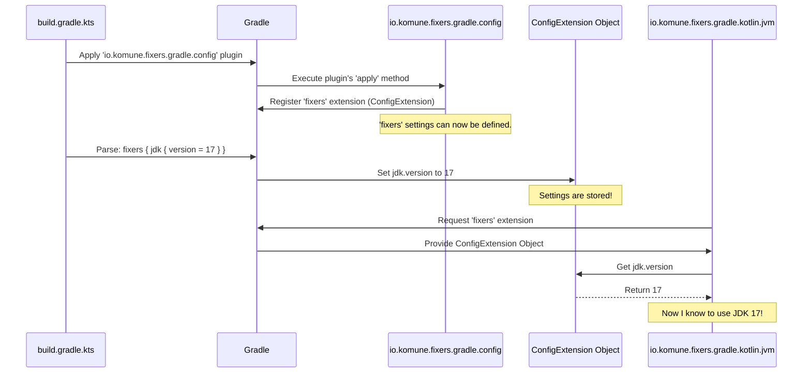

# Chapter 2: Fixers Gradle Configuration (`ConfigExtension`)

In [Chapter 1: Core Gradle Plugins](01_core_gradle_plugins_.md), we learned how `fixers-gradle` core plugins help automate the setup of your Kotlin projects, like a set of power tools for your workshop. But imagine you have a power drill – you still need to tell it what size drill bit to use or how fast to spin, right? Similarly, even with automated plugins, you'll want to customize some settings for your specific project.

This is where the **Fixers Gradle Configuration (`ConfigExtension`)** comes in! It's the central control panel for all the `fixers-gradle` plugins.

## What's the Big Deal? Meet Your Project's Settings Menu

Think about any application you use, like a photo editor or a music player. They usually have a "Settings" or "Preferences" menu where you can customize how the app looks and behaves. The `ConfigExtension` is exactly that for your `fixers-gradle` setup.

It provides a single, organized place in your `build.gradle.kts` file – the `fixers {}` block – where you can define:
-   **Project Information:** Your project's name, version, and description.
-   **JDK Version:** Which version of Java your project uses.
-   **Publishing Details:** Information needed to share your project (e.g., with SonarQube or as an NPM package).
-   And much more!

Why is this so helpful?
1.  **Consistency:** All `fixers-gradle` plugins will look at this central place for settings, ensuring everyone is on the same page.
2.  **Simplicity:** You define settings once, and they apply across various tools and processes. No more repeating yourself in different configuration files!
3.  **Easy Updates:** Need to change the JDK version for your whole project? Just one change in the `fixers {}` block.

## Your First Configuration: Setting Project Identity and Java Version

Let's say you're starting a new Kotlin project, "My Awesome App," and you want to use JDK 17. Here's how you'd tell `fixers-gradle` about it.

**1. Apply the `config` plugin:**

First, make sure you've applied the `io.komune.fixers.gradle.config` plugin in your `build.gradle.kts` file. This plugin is what makes the `fixers {}` block available.

```kotlin
// your-module/build.gradle.kts
plugins {
    id("io.komune.fixers.gradle.config") version "x.y.z" // Replace x.y.z with the latest version
    // You might also have other fixers plugins here, like:
    // id("io.komune.fixers.gradle.kotlin.jvm") version "x.y.z"
}
```
This line tells Gradle to include the configuration capabilities of `fixers-gradle`.

**2. Use the `fixers {}` block:**

Now, you can add the `fixers {}` block to the same `build.gradle.kts` file to specify your settings:

```kotlin
// your-module/build.gradle.kts (continued)

fixers {
    // Section for your project's general information
    bundle {
        name = "my-awesome-app"
        description = "This app will surely be awesome!"
        version = "0.1.0" // Your project's starting version
        url = "https://github.com/your-username/my-awesome-app" // Link to your project
    }

    // Section for Java Development Kit (JDK) settings
    jdk {
        version = 17 // We want to use JDK 17
    }
}
```

Let's break this down:
-   `fixers { ... }`: This is the main configuration block provided by `fixers-gradle`.
-   `bundle { ... }`: This nested block is for "bundle" information – details about your project as a whole.
    -   `name`: The display name of your project.
    -   `description`: A short summary of what your project does.
    -   `version`: The current version of your project.
    -   `url`: A link to your project's homepage or repository.
-   `jdk { ... }`: This block is for specifying JDK-related settings.
    -   `version`: The Java version your project targets (e.g., 11, 17, 21). `fixers-gradle` often defaults to 17 if you don't specify.

That's it! Now, other `fixers-gradle` plugins you use (like `io.komune.fixers.gradle.kotlin.jvm` for setting up Kotlin, or `io.komune.fixers.gradle.publish` for sharing your project) will automatically pick up these values. For example, the Kotlin plugin will configure the Kotlin compiler to target JDK 17.

## Key Configuration Areas at Your Fingertips

The `fixers {}` block can hold settings for many different aspects of your project. Here are a few common ones you'll encounter:

*   `bundle { ... }`: Basic project metadata like name, version, description, and URL. Essential for documentation and when you publish your project.
*   `jdk { ... }`: Specifies the Java Development Kit version to be used for compiling and running your code.
*   `sonar { ... }`: Configures details for SonarQube, a popular tool for continuous code quality inspection. We'll explore this in [Chapter 3: Static Code Analysis and Quality Checks](03_static_code_analysis_and_quality_checks_.md).
*   `npm { ... }`: If you're building a Kotlin/JS library and want to publish it as an NPM package, this section holds settings like your NPM organization and package version. This relates to the [Artifact Publishing System](04_artifact_publishing_system_.md).
*   `repositories { ... }`: Defines the Maven repositories where your project's artifacts (like JAR files) will be published. Also covered in [Chapter 4: Artifact Publishing System](04_artifact_publishing_system_.md).
*   `kt2Ts { ... }`: Settings for converting Kotlin code to TypeScript, useful in Kotlin Multiplatform projects targeting JavaScript.

Each of these (and more) can be configured within the `fixers {}` block, making it your one-stop shop for project settings.

## How Does It Work? A Peek Under the Hood

It might seem like magic that the `fixers {}` block just appears and other plugins know what to do. Let's uncover the mechanism.

**1. The "Extension" Concept in Gradle:**

When you apply the `io.komune.fixers.gradle.config` plugin, it tells Gradle, "Hey, I have a special set of configurations called `fixers`." In Gradle terms, this is called registering an **extension**. An extension is basically a way for a plugin to offer its own custom configuration block (like `fixers {}`) within your `build.gradle.kts` file.

**2. What Happens Step-by-Step:**

Here's a simplified flow of how your settings in `fixers {}` are made available:

1.  **You apply the plugin:** You add `id("io.komune.fixers.gradle.config")` to your `plugins {}` block.
2.  **Plugin registers the extension:** The `ConfigPlugin` (from `fixers-gradle`) runs. It tells Gradle to create an extension named "fixers" and associates it with a special Kotlin class called `ConfigExtension`. This class is designed to hold all your settings.
3.  **You define settings:** When Gradle reads `fixers { bundle { name = "..." } }` in your `build.gradle.kts`, it calls methods on the `ConfigExtension` object to store these values (e.g., "my-awesome-app").
4.  **Other plugins access settings:** Later, when another `fixers-gradle` plugin (like `io.komune.fixers.gradle.kotlin.jvm`) needs to know the JDK version, it asks Gradle for the "fixers" extension. Gradle gives it the same `ConfigExtension` object where your settings are stored. The plugin then reads the `jdk.version` property.

**A Visual Flow:**



**A Glimpse at the Code (Simplified):**

The `ConfigExtension` class is the heart of this. It's a Kotlin class that defines properties for all the settings you can configure.

```kotlin
// Simplified from: config/src/main/kotlin/io/komune/gradle/config/ConfigExtension.kt
package io.komune.gradle.config // (Illustrative package)

// Data classes to hold structured settings
data class Bundle(var name: String = "", var description: String? = null, var version: String? = null, var url: String? = null)
data class Jdk(var version: Int? = 17) // Default JDK version is 17

// The main extension class
// 'abstract' allows Gradle to do some internal magic
abstract class ConfigExtension(project: org.gradle.api.Project) {
    companion object {
        const val NAME: String = "fixers" // This is how we refer to it: fixers {}
    }

    // Properties for different configuration sections
    var bundle: Bundle = Bundle(name = project.name) // Default name from project
    var jdk: Jdk = Jdk() // Uses default JDK version from Jdk data class

    // Special functions Gradle uses for blocks like bundle { ... }
    fun bundle(configure: org.gradle.api.Action<Bundle>) { configure.execute(bundle) }
    fun jdk(configure: org.gradle.api.Action<Jdk>) { configure.execute(jdk) }

    // ... many other properties and methods for sonar, npm, etc.
}
```
-   `Bundle` and `Jdk` are simple Kotlin `data class`es that group related settings.
-   `ConfigExtension` has properties like `bundle` (of type `Bundle`) and `jdk` (of type `Jdk`).
-   When you write `fixers { bundle { name = "..." } }`, Gradle uses the `bundle(...)` function in `ConfigExtension` to apply your settings to the `bundle` property.

The plugin that makes this `fixers {}` block available, `ConfigPlugin`, is quite simple in its core task:

```kotlin
// Simplified from: plugin/src/main/kotlin/io/komune/fixers/gradle/config/ConfigPlugin.kt
package io.komune.fixers.gradle.config // (Illustrative package)

import org.gradle.api.Plugin
import org.gradle.api.Project
import io.komune.gradle.config.ConfigExtension // The class we just saw

class ConfigPlugin : Plugin<Project> {
    override fun apply(target: Project) {
        // This is the magic line!
        // It creates the 'fixers' extension on the current project,
        // making the fixers { ... } block usable in build.gradle.kts.
        target.extensions.create(
            ConfigExtension.NAME,      // The name "fixers"
            ConfigExtension::class.java, // The class that holds the settings
            target                     // The project this extension is for
        )
    }
}
```
When you apply `id("io.komune.fixers.gradle.config")`, the `apply` method of `ConfigPlugin` is executed. Its main job is to call `target.extensions.create(...)`. This tells Gradle: "For this project (`target`), create a new configuration extension named `fixers` (from `ConfigExtension.NAME`), and it will be managed by an instance of the `ConfigExtension` class."

Typically, the `fixers {}` configuration is set up on your root project to ensure all sub-modules use the same settings, promoting consistency across your entire project.

## Why This Centralized Approach Rocks

Using the `fixers {}` block (`ConfigExtension`) offers several advantages:
*   **DRY (Don't Repeat Yourself):** Define common settings like your project's version or target JDK once. All relevant `fixers-gradle` plugins will use these values.
*   **Single Source of Truth:** If you need to update a setting (e.g., change the SonarQube URL or upgrade the JDK), you only need to do it in one place.
*   **Clarity:** Your `build.gradle.kts` becomes cleaner because project-wide configurations are neatly grouped within the `fixers {}` block.
*   **Discoverability:** It's easier to see what aspects of your build are being managed by `fixers-gradle` and how they are configured.

## Conclusion

You've now learned about the `ConfigExtension`, the central "settings menu" for `fixers-gradle`, accessed via the `fixers {}` block in your `build.gradle.kts`. You've seen how to:
-   Apply the `io.komune.fixers.gradle.config` plugin.
-   Define project-wide settings like `bundle` (name, version) and `jdk` version.
-   Understand that this centralized configuration makes your build scripts simpler and more consistent.

This ability to easily configure `fixers-gradle` is fundamental. With this knowledge, you're ready to explore more specialized features.

In the next chapter, we'll see how `fixers-gradle` leverages this configuration to help you set up [Static Code Analysis and Quality Checks](03_static_code_analysis_and_quality_checks_.md), keeping your codebase healthy and maintainable.

---

Generated by [AI Codebase Knowledge Builder](https://github.com/The-Pocket/Tutorial-Codebase-Knowledge)