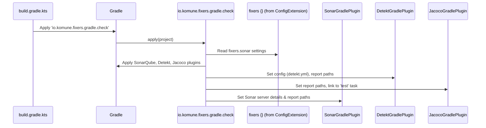
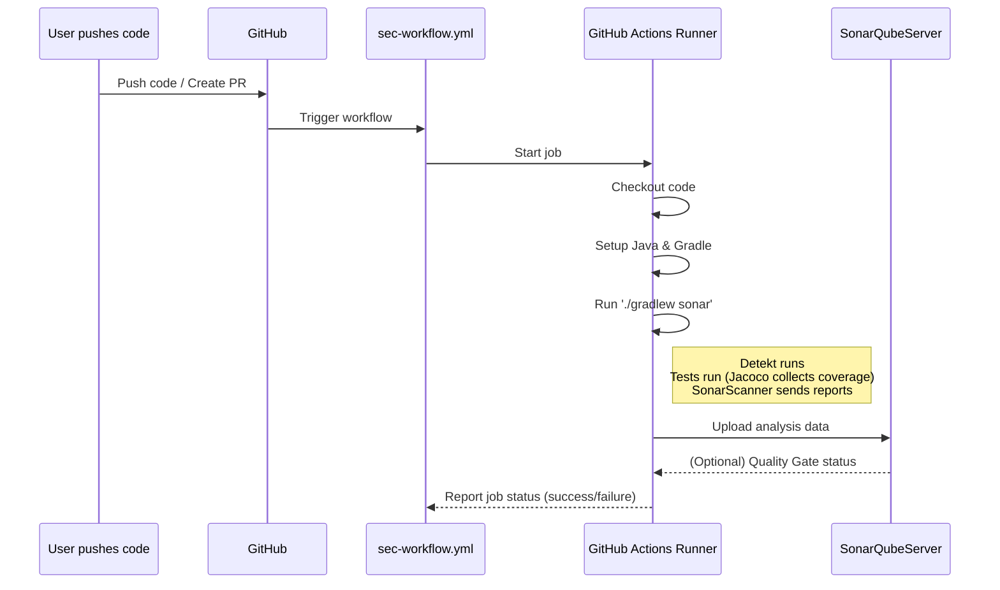

# Chapter 3: Static Code Analysis and Quality Checks

Welcome to Chapter 3! In [Chapter 2: Fixers Gradle Configuration (`ConfigExtension`)](02_fixers_gradle_configuration___configextension___.md), you learned how to use the `fixers {}` block to tell `fixers-gradle` about your project's settings. Now, let's see how `fixers-gradle` uses some of those settings to help you keep your code in top shape!

## The Challenge: Keeping Your Code Healthy

Imagine you're part of a team building a large, complex LEGO castle.
-   What if someone uses a cracked brick (a bug in the code)?
-   What if everyone builds their section differently, making the castle look messy and hard to add to (inconsistent code style)?
-   What if you're not sure if all parts of the castle are strong enough (untested code)?

As your Kotlin projects grow, especially with multiple developers, it becomes challenging to:
-   Catch small mistakes before they become big problems.
-   Maintain a consistent coding style so everyone can understand the code.
-   Ensure new changes don't break existing parts.
-   Keep an eye on potential security issues.

Manually checking all this is like trying to inspect every single LEGO brick by hand – it's time-consuming and you're likely to miss something.

## The Solution: Your Automated Code Inspectors

This is where **Static Code Analysis and Quality Checks** come in. `fixers-gradle` provides a system that acts like an automated team of expert inspectors for your code. It continuously checks for potential bugs, style issues, and even helps measure how much of your code is tested.

Think of it as an **automated code review process** that runs every time you build your project or make changes.

This system primarily uses:
1.  The **`CheckPlugin`** for Gradle: This plugin sets up tools directly in your project's build process.
2.  The **`sec-workflow.yml`** for GitHub Actions: This automates these checks whenever you push code to GitHub.

Let's meet the key tools in this inspection team:

*   **Detekt**: This is like a specialized grammar and spell checker for your Kotlin code. It analyzes your code (without running it – that's why it's "static") and points out potential bugs, style violations, and overly complex code based on a set of rules.
*   **Jacoco**: This tool measures "code coverage." When you write tests for your code, Jacoco watches which parts of your code are actually run by those tests. It's like checking which parts of your LEGO castle have been stress-tested.
*   **SonarQube**: This is like a central dashboard or a "health report" for your project. It collects reports from Detekt (about code issues) and Jacoco (about test coverage), and presents them in one place. It can track quality over time and even alert you if the quality drops below a certain standard (this is called a "Quality Gate").

The `fixers-gradle` system configures these tools and makes them work together seamlessly.

## How to Use It: Getting Your Code Inspected

Let's see how you can enable and use these quality checks in your project.

### 1. Enable the `CheckPlugin` in Gradle

The first step is to add the `io.komune.fixers.gradle.check` plugin to your module's `build.gradle.kts` file. This plugin is responsible for setting up Detekt and Jacoco.

```kotlin
// your-module/build.gradle.kts
plugins {
    id("io.komune.fixers.gradle.config") version "x.y.z" // We need this for settings
    id("io.komune.fixers.gradle.kotlin.jvm") version "x.y.z" // If it's a Kotlin JVM project
    id("io.komune.fixers.gradle.check") version "x.y.z" // Add this line!
}
```
Just by adding `io.komune.fixers.gradle.check`, Detekt and Jacoco are now part of your build, with sensible default configurations!

### 2. Configure SonarQube Details

The `CheckPlugin` also helps send information to SonarQube. To do this, SonarQube needs to know where your SonarQube server is and what your project is called on that server. You provide this information in the `fixers {}` block, which you learned about in [Chapter 2: Fixers Gradle Configuration (`ConfigExtension`)](02_fixers_gradle_configuration___configextension___.md).

This configuration is usually placed in your root project's `build.gradle.kts` file.

```kotlin
// Root build.gradle.kts
fixers {
    sonar {
        url = "https://sonarcloud.io" // Default for open source, or your own server
        organization = "your-github-or-sonar-org" // Your organization on SonarCloud
        projectKey = "your-project-unique-key"    // Unique key for this project on SonarQube
        // language = "kotlin" // Usually auto-detected or defaulted
    }
    // ... other bundle, jdk settings ...
}
```
-   `url`: The web address of your SonarQube server.
-   `organization`: If you're using SonarCloud, this is often your GitHub organization name.
-   `projectKey`: A unique identifier for your project within SonarQube.

The `CheckPlugin` will read these settings and configure the SonarQube analysis accordingly. The paths to Detekt and Jacoco reports are typically configured automatically by `fixers-gradle`.

### 3. Customizing Detekt (Optional)

Detekt uses a configuration file, usually `detekt.yml` at the root of your project, to define which rules to check and how strictly. `fixers-gradle` provides a default `detekt.yml`, but you can customize it.

Here's a tiny peek at what `detekt.yml` might contain:
```yaml
# detekt.yml (simplified example)
build:
  maxIssues: 0 # Fail the build if Detekt finds any issues

style:
  MaxLineLength:
    active: true
    maxLineLength: 120 # Lines should not be longer than 120 characters
  ForbiddenComment: # Example: Disallow "TODO:" comments
    active: true
    values: ['TODO:']
```
This file lets you fine-tune Detekt's behavior to match your team's standards. You can enable/disable rules, change thresholds, etc.

### 4. Running Checks Locally

Once set up, you can run these checks using Gradle tasks from your terminal:

*   **`./gradlew detekt`**: This runs Detekt on your Kotlin code.
    *   **Output**: If issues are found, they'll be printed to the console. Detailed HTML and XML reports are generated in `your-module/build/reports/detekt/`.
*   **`./gradlew test`**: This runs your unit tests. The `CheckPlugin` ensures Jacoco runs alongside to measure code coverage.
    *   **Output**: Test results are shown. Jacoco reports (HTML and XML) are generated in `your-module/build/reports/jacoco/test/`.
*   **`./gradlew sonar`**: This is the main task to analyze your project and send the results to SonarQube. It typically runs `detekt` and relies on `test` (for Jacoco reports) first.
    *   **Output**: The console will show progress. After it completes, you can open your SonarQube dashboard in a web browser to see the full analysis.

### 5. Automated Checks with GitHub Actions (`sec-workflow.yml`)

Running checks locally is good, but the real power comes from automation! `fixers-gradle` projects often include a GitHub Actions workflow to run these quality checks automatically every time you push code or create/update a pull request.

This is typically managed by two files in your project's `.github/workflows/` directory:
1.  `sec.yml`: A short file that triggers the main security and quality workflow.
2.  `sec-workflow.yml`: The reusable workflow that does the actual work.

Here's a simplified look at `sec.yml`:
```yaml
# .github/workflows/sec.yml
name: Security Analysis Workflow

on:
  pull_request: # Run on pull requests
  push:
    branches: [main] # Run on pushes to the main branch

jobs:
  sec:
    uses: ./.github/workflows/sec-workflow.yml # Calls the reusable workflow
    secrets:
      SONAR_TOKEN: ${{ secrets.SONAR_TOKEN }} # Securely pass the SonarQube token
```
- This file tells GitHub to run the `sec-workflow.yml` on pushes and pull requests.
- It passes a `SONAR_TOKEN` which is a secret you need to configure in your GitHub repository settings. This token allows the workflow to send data to SonarQube.

The `sec-workflow.yml` (provided by `fixers-gradle`) then takes care of setting up the environment, running the Gradle `sonar` task, and handling communication with SonarQube. You typically don't need to modify `sec-workflow.yml` itself.

## Under the Hood: How Does It All Connect?

Let's peek behind the curtain to see how `fixers-gradle` makes this magic happen.

### How the `CheckPlugin` Works

When you apply `id("io.komune.fixers.gradle.check")`, the `CheckPlugin` gets to work:

1.  **Reads Configuration**: It looks for SonarQube settings (like URL, organization, project key) in the `fixers.sonar` block from your `ConfigExtension` (as discussed in [Chapter 2](02_fixers_gradle_configuration___configextension___.md)).
2.  **Applies Core Plugins**: It automatically applies the necessary Gradle plugins:
    *   `org.sonarqube` (for SonarQube integration)
    *   `jacoco` (for code coverage)
    *   `io.gitlab.arturbosch.detekt` (for Kotlin static analysis)
3.  **Configures Detekt**:
    *   It tells Detekt to use the `detekt.yml` file from your project root.
    *   It ensures Detekt generates reports in formats SonarQube can understand (XML and SARIF).
    *   If you have multiple sub-projects, it also sets up tasks to merge Detekt reports.
4.  **Configures Jacoco**:
    *   It sets up Jacoco to generate an XML report after your tests run (the `test` task). SonarQube uses this XML report.
5.  **Configures SonarQube**:
    *   It passes your SonarQube server details (URL, org, key) to the SonarQube Gradle plugin.
    *   It tells SonarQube where to find the Detekt XML reports and the Jacoco XML coverage reports.

Here's a simplified flow:



**A Glimpse at the `CheckPlugin.kt` Code (Simplified):**

The main plugin class orchestrates the setup:
```kotlin
// Simplified from plugin/src/main/kotlin/io/komune/fixers/gradle/check/CheckPlugin.kt
class CheckPlugin : Plugin<Project> {
    override fun apply(target: Project) {
        target.afterEvaluate { // Ensure fixers {} config is available
            val fixersConfig = target.rootProject.extensions.fixers // Get global config
            configureSonarQube(target, fixersConfig)
            if (fixersConfig?.detekt?.disable != true) {
                target.configureDetekt() // Calls helper from DetektConfiguration.kt
            }
            target.subprojects { // Apply Jacoco to all subprojects with Java/Kotlin
                configureJacoco()
            }
        }
    }
}
```
This shows the plugin applying configurations after the project is evaluated, ensuring `fixers {}` settings are loaded.

Configuring SonarQube involves setting properties:
```kotlin
// Simplified: configureSonarQube within CheckPlugin.kt
private fun configureSonarQube(target: Project, fixersConfig: ConfigExtension?) {
    target.plugins.apply("org.sonarqube") // Apply the official SonarQube plugin
    target.extensions.configure(SonarExtension::class.java) {
        properties {
            property("sonar.projectKey", fixersConfig?.sonar?.projectKey ?: "")
            property("sonar.organization", fixersConfig?.sonar?.organization ?: "")
            property("sonar.host.url", fixersConfig?.sonar?.url ?: "https://sonarcloud.io")
            // Tell Sonar where to find Detekt and Jacoco reports
            property("sonar.kotlin.detekt.reportPaths", "build/reports/detekt/detekt.xml")
            property("sonar.coverage.jacoco.xmlReportPaths", "build/reports/jacoco/test/jacocoTestReport.xml")
        }
    }
}
```
This snippet demonstrates how `CheckPlugin` uses the values from `fixers.sonar` (defined in `Sonar.kt` and accessed via `ConfigExtension`) to tell the SonarQube plugin how to operate.

**A Glimpse at `DetektConfiguration.kt` (Simplified):**

The Detekt setup is often in a helper file:
```kotlin
// Simplified from plugin/src/main/kotlin/io/komune/fixers/gradle/check/DetektConfiguration.kt
fun Project.configureDetekt() {
    plugins.apply("io.gitlab.arturbosch.detekt") // Apply Detekt plugin
    extensions.configure(DetektExtension::class.java) {
        config.setFrom(rootDir.resolve("detekt.yml")) // Use common detekt.yml
        // It also figures out your source code directories
    }
    tasks.withType<Detekt>().configureEach {
        reports {
            xml.required.set(true) // SonarQube needs this
            sarif.required.set(true) // Good for GitHub code scanning & Sonar
            html.required.set(true) // For local viewing
        }
    }
}
```
This part ensures Detekt is applied, configured with your project's `detekt.yml`, and generates reports in the right formats.

### How the `sec-workflow.yml` (GitHub Actions) Works

The `sec-workflow.yml` file is a script for GitHub Actions, which is a CI/CD (Continuous Integration/Continuous Delivery) service built into GitHub.

When triggered (e.g., by a push to `main` or a pull request):
1.  **Checkout Code**: GitHub Actions checks out the latest version of your code.
2.  **Set Up Environment**: It sets up the necessary Java version and caches Gradle dependencies to speed things up.
3.  **Run Analysis**: It executes the Gradle command to perform the SonarQube analysis, which is usually `./gradlew sonar`. This command, thanks to `CheckPlugin`, will:
    *   Compile your code.
    *   Run Detekt.
    *   Run your tests and have Jacoco generate coverage reports.
    *   Collect all these reports and send them to your SonarQube server.
4.  **Quality Gate Check (Optional but Recommended)**: SonarQube can check if the analysis results meet certain quality criteria (the "Quality Gate"). The workflow can wait for this check and fail if the Quality Gate is not passed.

Here's a simplified flow of what happens in GitHub Actions:


**A Glimpse at `sec-workflow.yml` (Simplified):**

The core part for SonarQube analysis in the workflow might look like this:
```yaml
# Simplified from .github/workflows/sec-workflow.yml
# ... (workflow inputs and other jobs) ...
jobs:
  sonarcloud-analysis:
    name: SonarCloud Analysis
    runs-on: ubuntu-latest
    steps:
      - name: Checkout code
        uses: actions/checkout@v4
        with:
          fetch-depth: 0 # Fetch all history for SonarQube blame information

      - name: Set up JDK and Gradle
        uses: komune-io/fixers-gradle/.github/actions/jvm@main # A reusable action from fixers-gradle
        # ... with inputs for Java version, etc. ...

      - name: Run SonarCloud Scan
        uses: sonarsource/sonarcloud-github-action@v2
        env:
          SONAR_TOKEN: ${{ secrets.SONAR_TOKEN }}
          GITHUB_TOKEN: ${{ secrets.GITHUB_TOKEN }} # For PR decoration on GitHub
```
This snippet shows the key steps: checking out code, setting up the Java/Gradle environment (often using another reusable action from `fixers-gradle`), and then running the official SonarSource action which handles the Gradle execution and communication with SonarQube.

## Conclusion

You've now seen how `fixers-gradle` helps you maintain high code quality through its static analysis and quality check system! You've learned:
-   What static analysis (Detekt), code coverage (Jacoco), and SonarQube are.
-   How the `CheckPlugin` integrates these tools into your Gradle build.
-   How to configure SonarQube details using the `fixers {}` block.
-   How the `sec-workflow.yml` in GitHub Actions automates these checks for continuous quality monitoring.

By leveraging these tools, you're building a safety net that helps catch issues early, ensures consistency, and ultimately leads to more robust, maintainable, and secure software. It’s like having an automated assistant dedicated to keeping your codebase healthy!

In the next chapter, we'll move from checking your code to sharing it with the world. We'll explore the [Chapter 4: Artifact Publishing System](04_artifact_publishing_system_.md), which helps you package and distribute your finished libraries or applications.

---

Generated by [AI Codebase Knowledge Builder](https://github.com/The-Pocket/Tutorial-Codebase-Knowledge)