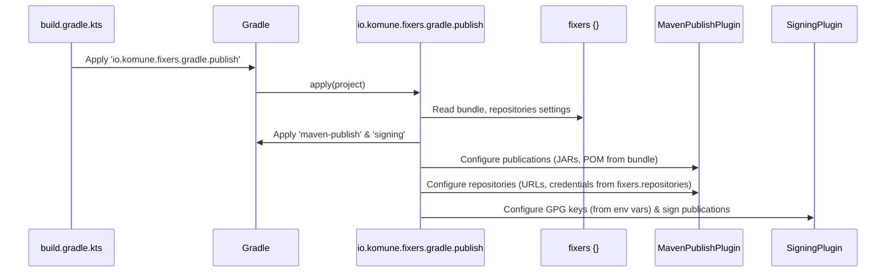
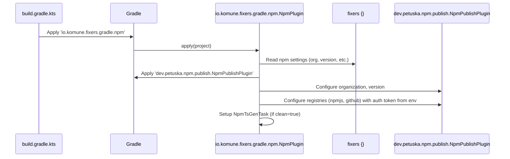

# Chapter 4: Artifact Publishing System

Welcome to Chapter 4! In [Chapter 3: Static Code Analysis and Quality Checks](03_static_code_analysis_and_quality_checks_.md), we learned how `fixers-gradle` helps you keep your code clean and healthy with automated checks. Now that your code is in great shape, it's time to learn how to share it with the world (or just your team)! This chapter dives into the **Artifact Publishing System**.

## The "Logistics Department" for Your Code

Imagine you've built an amazing new LEGO set (your software library or application). You've checked all the pieces, the instructions are clear, and it's ready. But how do you get it to other people who want to use it? You need a way to package it up, label it correctly, and send it to the right "stores" or "warehouses" where others can find it.

That's exactly what an **Artifact Publishing System** does for your software. It's like your project's logistics department. It handles:
-   **Packaging:** Taking your compiled code and related files (like documentation and source code) and bundling them into "artifacts" (e.g., JAR files for Java/Kotlin, NPM packages for JavaScript).
-   **Versioning:** Making sure each package has a unique version number so people know which one they're using and can get updates.
-   **Signing (for JVM):** Adding a digital signature (using GPG) to your Java/Kotlin libraries to prove they're genuinely from you and haven't been tampered with. This is important for security and trust.
-   **Delivering:** Sending these packaged, versioned, and signed artifacts to "repositories" – central places where other developers or projects can find and download them.

Without a good publishing system, sharing your software would be a manual, error-prone hassle. `fixers-gradle` aims to make this process smooth and automated.

## Meet the `fixers-gradle` Publishing Crew

`fixers-gradle` provides specialized tools to handle publishing for different types of Kotlin projects:

1.  **`PublishPlugin` (for Kotlin/JVM and Kotlin Multiplatform):**
    *   This plugin is your go-to for publishing libraries that run on the Java Virtual Machine (JVM) or are part of a Kotlin Multiplatform Project (MPP).
    *   It configures Gradle to publish to **Maven repositories**. These are like giant online warehouses for Java and Kotlin libraries. Popular examples include Sonatype OSS (which syncs to Maven Central, the main public repository) and GitHub Packages (for hosting packages directly within your GitHub repository).
    *   It also handles GPG signing for your artifacts.

2.  **`NpmPlugin` (for Kotlin/JS):**
    *   If you're developing a Kotlin/JS library that you want to share with the JavaScript world, this plugin is for you.
    *   It configures Gradle to publish your JavaScript output as an **NPM package** to NPM registries (like the public npmjs.com or GitHub Packages).

Let's see how to use them!

## Publishing Your Kotlin/JVM or Multiplatform Library

Let's say you've created a fantastic Kotlin utility library, `my-cool-utils`, and you want other developers to be able to use it in their projects by adding it as a dependency.

### Step 1: Apply the `PublishPlugin`

First, you need to add the `io.komune.fixers.gradle.publish` plugin to your library module's `build.gradle.kts` file:

```kotlin
// my-cool-utils/build.gradle.kts
plugins {
    id("io.komune.fixers.gradle.config") version "x.y.z"
    id("io.komune.fixers.gradle.kotlin.jvm") version "x.y.z" // Or .mpp
    id("io.komune.fixers.gradle.publish") version "x.y.z" // Add this line!
}
```
This tells `fixers-gradle` that this module is meant to be published.

### Step 2: Configure Your "Shipping Details" in `fixers {}`

Remember the `fixers {}` block from [Chapter 2: Fixers Gradle Configuration (`ConfigExtension`)](02_fixers_gradle_configuration___configextension___.md)? We'll use it to provide information for publishing. This is usually done in your root project's `build.gradle.kts`.

```kotlin
// Root build.gradle.kts
fixers {
    bundle { // Project identity, crucial for publishing
        name = "my-cool-utils"
        description = "A collection of cool utility functions."
        version = "1.0.0" // The version you're publishing
        url = "https://github.com/your-username/my-cool-utils"
        // Developer info, licenses, etc., can also go here
    }

    // Define where to send your packages
    repositories {
        // Example: Sonatype OSS (for Maven Central)
        register("sonatypeOss") { // You can name this anything
            id = "sonatype_oss" // A key used internally
            // URL, username, password will be read from Repository.kt defaults
            // or environment variables like PKG_SONATYPE_OSS_USERNAME/TOKEN
        }
        // Example: GitHub Packages
        register("github") {
            id = "github"
            // URL, username, password will be read from Repository.kt defaults
            // or environment variables PKG_GITHUB_USERNAME/TOKEN
        }
    }

    // Optionally, specify which repository to use by default via an environment variable
    // PKG_MAVEN_REPO=sonatypeOss or PKG_MAVEN_REPO=github
}
```
-   **`bundle`**: This information (name, description, version, URL) is used to create the `pom.xml` file, which is like the "shipping label" for Maven libraries. It tells other projects what your library is and how to use it.
-   **`repositories`**: Here, you define the "addresses" of the Maven repositories you want to publish to. `fixers-gradle` has built-in configurations for common ones like `sonatypeOss` and `github` (see `Repository.kt` for details). Credentials (username/password or token) are typically expected as environment variables (e.g., `PKG_SONATYPE_OSS_USERNAME`, `PKG_SONATYPE_OSS_TOKEN`, `PKG_GITHUB_USERNAME`, `PKG_GITHUB_TOKEN`) for security.
-   **GPG Signing**: For publishing to public repositories like Maven Central, you need to sign your artifacts with a GPG key. The `PublishPlugin` will look for your GPG key and password in environment variables:
    *   `GPG_SIGNING_KEY`: Your private GPG key (ASCII-armored).
    *   `GPG_SIGNING_PASSWORD`: The passphrase for your GPG key.
    You usually set these up as secrets in your CI/CD environment (like GitHub Actions).

### Step 3: Run the Publish Task!

Once configured, you can publish your library using Gradle tasks:
-   `./gradlew publishToMavenLocal`: This builds your library and installs it into your local Maven cache (`~/.m2/repository`). Great for testing locally before publishing to the world.
-   `./gradlew publish`: This builds, signs, and publishes your library to the configured remote repository (selected via `PKG_MAVEN_REPO` environment variable or defaulting, often to GitHub Packages).

**What happens?**
Gradle will compile your code, create JAR files (e.g., `my-cool-utils-1.0.0.jar`, `my-cool-utils-1.0.0-sources.jar`, `my-cool-utils-1.0.0-javadoc.jar`), generate a `pom.xml` file, sign all these files with your GPG key, and then upload them to the specified Maven repository.

## Publishing Your Kotlin/JS Package to NPM

Now, let's say you have a Kotlin/JS module, `my-js-widget`, that you want to share as an NPM package.

### Step 1: Apply the `NpmPlugin`

In your Kotlin/JS module's `build.gradle.kts`:

```kotlin
// my-js-widget/build.gradle.kts
plugins {
    id("org.jetbrains.kotlin.js") version "your-kotlin-version" // Standard Kotlin/JS plugin
    id("io.komune.fixers.gradle.config") version "x.y.z"
    id("io.komune.fixers.gradle.npm") version "x.y.z" // Add this line!
}
```

### Step 2: Configure NPM Details in `fixers {}`

Again, in your root `build.gradle.kts`, configure the `npm` section:

```kotlin
// Root build.gradle.kts
fixers {
    npm {
        publish = true // Enable NPM publishing
        organization = "your-npm-org-or-username" // e.g., @my-org
        // Version is often derived from project version and build timestamp
        // version = "1.0.0" // Or a pattern like "1.0.0-SNAPSHOT"
        clean = true // Whether to clean JS output before packing, good for consistency
    }
    // ... other bundle, jdk settings ...
}
```
-   `publish`: A flag to enable publishing.
-   `organization`: Your NPM organization or username (e.g., the `@your-org` part of `@your-org/my-js-widget`).
-   `version`: The version of your NPM package. The `NpmPlugin` has logic to combine your project's version with a build timestamp for snapshot/pre-release versions.
-   `clean`: The `NpmPlugin` includes a task `npmTsGenTask` that can help "clean" the generated JavaScript output, for instance by removing private TypeScript declarations that shouldn't be part of the public API. Setting `clean = true` enables this.

You'll also need to provide an NPM authentication token as an environment variable, typically `NPM_TOKEN` (or `NPM_PKG_GITHUB_TOKEN` if publishing to GitHub Packages NPM registry, `NPM_PKG_NPMJS_TOKEN` if publishing to npmjs.org). This is usually configured as a secret in your CI environment.

### Step 3: Run the Publish Task!

For Kotlin/JS, publishing is often tied to the specific module. If your Kotlin/JS module is named `jsApp`, the task might be:
-   `./gradlew :jsApp:publish`

This task will:
1.  Compile your Kotlin/JS code to JavaScript.
2.  Run `npmTsGenTask` if `fixers.npm.clean` is true.
3.  Package the JavaScript output, `package.json` (generated by Kotlin/JS plugin), and other necessary files into an NPM package.
4.  Publish this package to the configured NPM registries (e.g., npmjs.org and GitHub Packages, as configured in `NpmPlugin.kt`).

## Under the Hood: How `fixers-gradle` Manages Publishing

Let's take a quick peek at how these plugins work their magic.

### `PublishPlugin` (for JVM/MPP)

1.  **Reads Configuration**: When Gradle evaluates your project, the `PublishPlugin` reads the `bundle` and `repositories` sections from your `fixers {}` configuration ([Chapter 2: Fixers Gradle Configuration (`ConfigExtension`)](02_fixers_gradle_configuration___configextension___.md)).
2.  **Applies Core Gradle Plugins**: It automatically applies the standard `maven-publish` Gradle plugin (for creating Maven publications) and the `signing` Gradle plugin (for GPG signing).
3.  **Configures Publications**: It sets up "publications" (what to publish). For JVM projects, this typically includes the main JAR, sources JAR, and Javadoc JAR. For MPP, it configures publications for each target platform (JVM, JS, Native). It uses your `fixers.bundle` info for the POM file metadata.
4.  **Configures Repositories**: It tells the `maven-publish` plugin about the repositories you defined in `fixers.repositories`, including their URLs and how to get credentials (often from environment variables like `PKG_SONATYPE_OSS_USERNAME` / `TOKEN` or `PKG_GITHUB_USERNAME` / `TOKEN`).
5.  **Configures Signing**: It configures the `signing` plugin to use your GPG key (from `GPG_SIGNING_KEY` environment variable) and password (from `GPG_SIGNING_PASSWORD` environment variable) to sign all the files in your publications.

Here's a simplified conceptual flow:


**A Glimpse at `PublishPlugin.kt` (Simplified):**
```kotlin
// Simplified from plugin/src/main/kotlin/io/komune/fixers/gradle/publish/PublishPlugin.kt
class PublishPlugin : Plugin<Project> {
    override fun apply(target: Project) {
        target.plugins.apply(MavenPublishPlugin::class.java)
        target.plugins.apply(SigningPlugin::class.java)
        target.afterEvaluate { // Ensure fixers {} config is loaded
            val fixersConfig = target.rootProject.extensions.fixers
            fixersConfig?.let {
                setupPublishing(it) // Configure publications & repositories
                setupSign()         // Configure GPG signing
            }
        }
    }

    private fun Project.setupPublishing(fixersConfig: ConfigExtension) {
        val publishingExt = extensions.getByType(PublishingExtension::class.java)
        // Get repo choice from env var or default
        val repoName = getenv("PKG_MAVEN_REPO") ?: "github"
        val repositoryInfo = fixersConfig.repositories[repoName]
            ?: Repository.github(project) // Default to GitHub if not found

        publishingExt.repositories {
            maven {
                name = repositoryInfo.name
                url = repositoryInfo.getUrl() // From Repository.kt model
                credentials { /* ... set username/password ... */ }
            }
        }
        // ... logic to set up what to publish (JARs, POM) ...
        // PublishMppPlugin.setupMppPublish(this, fixersConfig.publication)
        // PublishJvmPlugin.setupJVMPublish(this, fixersConfig.publication)
    }

    private fun Project.setupSign() {
        val gpgKey = getenv("GPG_SIGNING_KEY")
        val gpgPassword = getenv("GPG_SIGNING_PASSWORD")
        if (gpgKey != null && gpgPassword != null) {
            extensions.getByType(SigningExtension::class.java).apply {
                useInMemoryPgpKeys(gpgKey, gpgPassword)
                sign(extensions.getByType(PublishingExtension::class.java).publications)
            }
        }
    }
}
```
This shows how the plugin applies other standard plugins and uses the `fixers` configuration along with environment variables to set up publishing and signing. The `Repository.kt` file (not shown here, but used by `repositoryInfo.getUrl()`) defines models for repository details like Sonatype and GitHub Packages.

### `NpmPlugin` (for Kotlin/JS)

1.  **Reads Configuration**: It reads the `fixers.npm` block from your `fixers {}` configuration.
2.  **Applies Core NPM Plugin**: It applies the `dev.petuska.npm.publish.NpmPublishPlugin`, which is a third-party Gradle plugin specialized for publishing to NPM.
3.  **Configures NPM Details**: It configures this NPM publish plugin with:
    *   Your NPM organization (`fixers.npm.organization`).
    *   The package version (derived using `fixers.npm.version` and project version).
    *   The NPM registries to publish to (defaults include `npmjs` and `github`). It expects `NPM_TOKEN` (or `NPM_PKG_GITHUB_TOKEN`, `NPM_PKG_NPMJS_TOKEN`) environment variable for authentication.
4.  **Sets up `NpmTsGenTask`**: If `fixers.npm.clean` is true, it registers and wires up the `NpmTsGenTask` to run before publishing, which can help tidy up the generated JavaScript/TypeScript.

Simplified conceptual flow:


**A Glimpse at `NpmPlugin.kt` (Simplified):**
```kotlin
// Simplified from plugin/src/main/kotlin/io/komune/fixers/gradle/npm/NpmPlugin.kt
class NpmPlugin : Plugin<Project> {
    override fun apply(target: Project) {
        target.afterEvaluate { // Ensure fixers {} config is available
            target.rootProject.extensions.fixers?.takeIf { it.npm.publish }?.let { config ->
                target.configureNpmPublishPlugin(config) // Main NPM setup
                configurePackTsCleaning(config.npm)   // Setup NpmTsGenTask
            }
        }
    }

    private fun Project.configureNpmPublishPlugin(config: ConfigExtension) {
        project.pluginManager.apply(dev.petuska.npm.publish.NpmPublishPlugin::class.java)
        project.the<NpmPublishExtension>().apply { // Configure the external plugin
            organization.set(config.npm.organization)
            version.set( determineVersionLogic(config) ) // Simplified version logic
            registries {
                register("npmjs") { /* uri, authToken from System.getenv("NPM_TOKEN") */ }
                register("github") { /* uri, authToken from System.getenv("NPM_TOKEN") */ }
            }
        }
    }
    // determineVersionLogic, configurePackTsCleaning are helper methods
}
```
This shows the `NpmPlugin` applying and configuring the `dev.petuska.npm.publish.NpmPublishPlugin` using details from your `fixers.npm` settings and environment variables for tokens.

## Automation with GitHub Actions

Manually running `./gradlew publish` is fine for occasional releases, but for true automation, publishing is typically part of your CI/CD pipeline. `fixers-gradle` projects often use GitHub Actions for this.

-   Workflows like `.github/workflows/make-jvm-workflow.yml` (for JVM/MPP) and `.github/workflows/make-nodejs-workflow.yml` (for JS/NPM, often if JS is primary build) are designed to call the appropriate Make targets (e.g., `make publish`), which in turn execute the Gradle publish tasks we've discussed.
-   These workflows securely handle secrets like `PKG_SONATYPE_OSS_TOKEN`, `PKG_GITHUB_TOKEN`, `GPG_SIGNING_KEY`, `GPG_SIGNING_PASSWORD`, and `NPM_TOKEN` which are necessary for authentication and signing.
-   Reusable actions like `.github/actions/setup-gradle-github-pkg/action.yml` and `.github/actions/setup-npm-github-pkg/action.yml` can help configure Gradle and NPM to use GitHub Packages within the CI environment, ensuring credentials are set up correctly.

This automation ensures that new versions of your libraries are published consistently and reliably whenever you merge to your main branch or tag a release.

## Conclusion

You've now toured the Artifact Publishing System within `fixers-gradle`! You've learned:
-   What artifact publishing is and why it's like your project's "logistics department."
-   How `PublishPlugin` helps you share Kotlin/JVM and Multiplatform libraries to Maven repositories (like Sonatype OSS and GitHub Packages), including GPG signing.
-   How `NpmPlugin` enables you to distribute Kotlin/JS projects as NPM packages.
-   How to configure publishing details (like repository URLs, credentials, and project metadata) using the `fixers {}` block and environment variables.
-   A glimpse into how these plugins work internally by applying and configuring standard Gradle and third-party plugins.
-   That these publishing tasks are often automated in CI/CD pipelines using GitHub Actions.

With `fixers-gradle`, the complex task of packaging, signing, and delivering your software becomes much more manageable, letting you focus on building great libraries and applications.

In the next chapter, we'll explore how `fixers-gradle` leverages Makefiles to create [Chapter 5: Make-Driven Reusable Workflows](05_make_driven_reusable_workflows_.md), further streamlining common development tasks.

---

Generated by [AI Codebase Knowledge Builder](https://github.com/The-Pocket/Tutorial-Codebase-Knowledge)